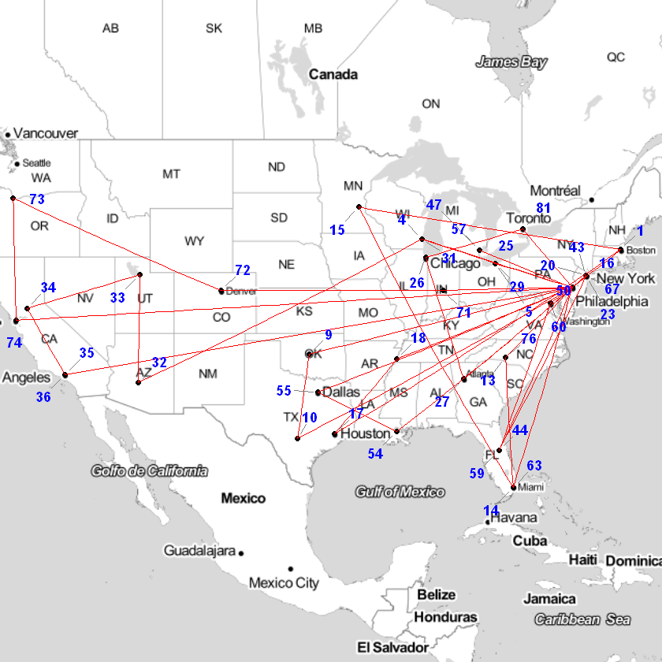
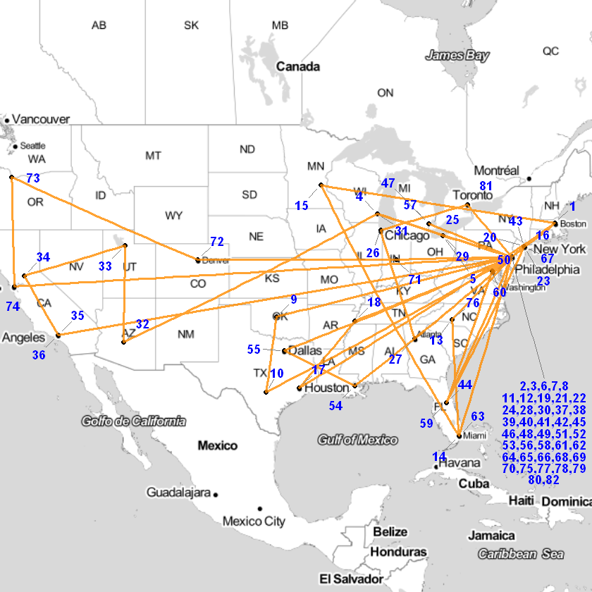
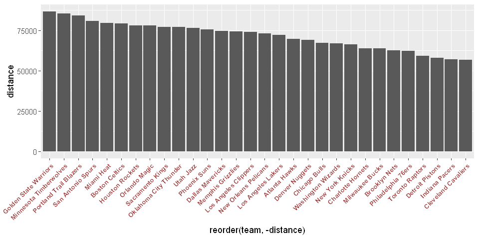
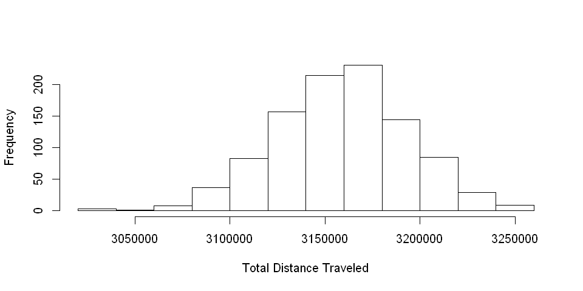

```R
library(RCurl)
library(XML)
library(ggmap)
library(dplyr)
library(lubridate)
library(ggrepel)
```

### Load Necessary Functions
* **collectNBACalendar**: Function to gather from internet the NBA calendar for a specific year.
* **earth.dist**: Given latitude and longitude for two points calculate the distance between them.
* **nbaFlightsByTeam**: Returns a data frame with flights and the distance for a specific team during the season.


```R
source('NBA season calendar Functions.R')
```

    Warning message:
    "package 'xml2' was built under R version 3.3.3"
    Attaching package: 'rvest'
    
    The following object is masked from 'package:XML':
    
        xml
    
    

# Overview

NBA have 30 teams playing 82 games each during a regular season

Can we optmize the NBA and provide a better with lower distance travel?


```R

```

# Data

### Scrapping data from Internet

Collecting the calendar from https://www.basketball-reference.com


```R
calendar<-collectNBACalendar(2016)
```


```R
head(calendar)
```


<table>
<thead><tr><th scope=col>date</th><th scope=col>time</th><th scope=col>visitor</th><th scope=col>visitor_pts</th><th scope=col>home</th><th scope=col>home_pts</th><th scope=col>season</th></tr></thead>
<tbody>
	<tr><td>Fri, Jan 1, 2016  </td><td>8:00 pm           </td><td>New York Knicks   </td><td>81                </td><td>Chicago Bulls     </td><td>108               </td><td>2016              </td></tr>
	<tr><td>Fri, Jan 1, 2016  </td><td>10:30 pm          </td><td>Philadelphia 76ers</td><td>84                </td><td>Los Angeles Lakers</td><td>93                </td><td>2016              </td></tr>
	<tr><td>Fri, Jan 1, 2016  </td><td>7:30 pm           </td><td>Dallas Mavericks  </td><td>82                </td><td>Miami Heat        </td><td>106               </td><td>2016              </td></tr>
	<tr><td>Fri, Jan 1, 2016  </td><td>7:30 pm           </td><td>Charlotte Hornets </td><td>94                </td><td>Toronto Raptors   </td><td>104               </td><td>2016              </td></tr>
	<tr><td>Fri, Jan 1, 2016  </td><td>7:00 pm           </td><td>Orlando Magic     </td><td>91                </td><td>Washington Wizards</td><td>103               </td><td>2016              </td></tr>
	<tr><td>Sat, Jan 2, 2016  </td><td>3:00 pm           </td><td>Brooklyn Nets     </td><td>100               </td><td>Boston Celtics    </td><td>97                </td><td>2016              </td></tr>
</tbody>
</table>


### Transforming Date format


```R
calendar$date2<-unlist(lapply(strsplit(gsub(",","",calendar$date)," "),function(x) paste(x[2:4],collapse = "-")))
calendar$date2<-as.Date(calendar$date2,"%b-%d-%Y")
calendar<-calendar%>%
  arrange(date2)
```


```R
calendar%>%
    filter(complete.cases(.))%>%
    group_by()%>%
    summarise(min(date2),max(date2))
```


<table>
<thead><tr><th scope=col>min(date2)</th><th scope=col>max(date2)</th></tr></thead>
<tbody>
	<tr><td>2015-10-27</td><td>2016-06-19</td></tr>
</tbody>
</table>


### Filter Regular Season Games
For this calendar there are playoffs games and we are not interested on playoffs once we are evaluating the distance traveled during the regular season.

The 2015-16 season ranged from 10-27-2015 to 04-13-2016 (https://en.wikipedia.org/wiki/2015%E2%80%9316_NBA_season)


```R
calendar<-calendar%>%
            filter(date2<='2016-04-13')
```


```R
# Quick check: Every team must have 82 games
sapply(unique(calendar$home),
       function(x) calendar%>%
  filter((home==x | visitor==x))%>%
  nrow())
```


<dl class=dl-horizontal>
	<dt>Atlanta Hawks</dt>
		<dd>82</dd>
	<dt>Chicago Bulls</dt>
		<dd>82</dd>
	<dt>Golden State Warriors</dt>
		<dd>82</dd>
	<dt>Boston Celtics</dt>
		<dd>82</dd>
	<dt>Brooklyn Nets</dt>
		<dd>82</dd>
	<dt>Detroit Pistons</dt>
		<dd>82</dd>
	<dt>Houston Rockets</dt>
		<dd>82</dd>
	<dt>Los Angeles Lakers</dt>
		<dd>82</dd>
	<dt>Memphis Grizzlies</dt>
		<dd>82</dd>
	<dt>Miami Heat</dt>
		<dd>82</dd>
	<dt>Milwaukee Bucks</dt>
		<dd>82</dd>
	<dt>Oklahoma City Thunder</dt>
		<dd>82</dd>
	<dt>Orlando Magic</dt>
		<dd>82</dd>
	<dt>Phoenix Suns</dt>
		<dd>82</dd>
	<dt>Portland Trail Blazers</dt>
		<dd>82</dd>
	<dt>Sacramento Kings</dt>
		<dd>82</dd>
	<dt>Toronto Raptors</dt>
		<dd>82</dd>
	<dt>Indiana Pacers</dt>
		<dd>82</dd>
	<dt>Los Angeles Clippers</dt>
		<dd>82</dd>
	<dt>New York Knicks</dt>
		<dd>82</dd>
	<dt>Cleveland Cavaliers</dt>
		<dd>82</dd>
	<dt>Denver Nuggets</dt>
		<dd>82</dd>
	<dt>Philadelphia 76ers</dt>
		<dd>82</dd>
	<dt>San Antonio Spurs</dt>
		<dd>82</dd>
	<dt>New Orleans Pelicans</dt>
		<dd>82</dd>
	<dt>Washington Wizards</dt>
		<dd>82</dd>
	<dt>Charlotte Hornets</dt>
		<dd>82</dd>
	<dt>Minnesota Timberwolves</dt>
		<dd>82</dd>
	<dt>Dallas Mavericks</dt>
		<dd>82</dd>
	<dt>Utah Jazz</dt>
		<dd>82</dd>
</dl>


### Define Location of Games


```R
calendar$home_location<-unlist(lapply(strsplit(calendar$home," "),function(x) paste(x[1:(length(x)-1)],collapse=" ")))
calendar$visitor_location<-unlist(lapply(strsplit(calendar$visitor," "),function(x) paste(x[1:(length(x)-1)],collapse=" ")))
```


```R
unique(calendar$home_location)
```


<ol class=list-inline>
	<li>'Atlanta'</li>
	<li>'Chicago'</li>
	<li>'Golden State'</li>
	<li>'Boston'</li>
	<li>'Brooklyn'</li>
	<li>'Detroit'</li>
	<li>'Houston'</li>
	<li>'Los Angeles'</li>
	<li>'Memphis'</li>
	<li>'Miami'</li>
	<li>'Milwaukee'</li>
	<li>'Oklahoma City'</li>
	<li>'Orlando'</li>
	<li>'Phoenix'</li>
	<li>'Portland Trail'</li>
	<li>'Sacramento'</li>
	<li>'Toronto'</li>
	<li>'Indiana'</li>
	<li>'New York'</li>
	<li>'Cleveland'</li>
	<li>'Denver'</li>
	<li>'Philadelphia'</li>
	<li>'San Antonio'</li>
	<li>'New Orleans'</li>
	<li>'Washington'</li>
	<li>'Charlotte'</li>
	<li>'Minnesota'</li>
	<li>'Dallas'</li>
	<li>'Utah'</li>
</ol>


Based on the name of the home team we can identify the game location. For example, when the home team is 'Chicago Bulls' we know the game was hosted in Chicago.

In a simple example, for a match between 'Chicago Bulls' and 'Memphis Grizzles' where the home team is 'Chicago Bulls' we assume that there was travel from Memphis to Chicago.

Even though the home_location was able to identify the location of games we still had to do some manual adjustments. For example, Golden State -> San Franciso


```R
calendar$home_location[calendar$home_location=="Portland Trail"]<-"Portland"
calendar$home_location[calendar$home_location=="Utah"]<-"Salt Lake City"
calendar$home_location[calendar$home_location=="Indiana"]<-"Indianapolis"
calendar$home_location[calendar$home_location=="Minnesota"]<-"Minneapolis"
calendar$home_location[calendar$home_location=="Golden State"]<-"San Francisco"
calendar$home_location[calendar$home_location=="Washington"]<-"Washington D.C."
```

### Latitude and Longitude for the Cities where the Teams are located


```R
cities<-unique(calendar$home_location)
pos<-geocode(cities)
citiesLocation<-data.frame(cities,pos)
```

    Information from URL : http://maps.googleapis.com/maps/api/geocode/json?address=Atlanta&sensor=false
    Information from URL : http://maps.googleapis.com/maps/api/geocode/json?address=Chicago&sensor=false
    Information from URL : http://maps.googleapis.com/maps/api/geocode/json?address=San%20Francisco&sensor=false
    Information from URL : http://maps.googleapis.com/maps/api/geocode/json?address=Boston&sensor=false
    Information from URL : http://maps.googleapis.com/maps/api/geocode/json?address=Brooklyn&sensor=false
    Information from URL : http://maps.googleapis.com/maps/api/geocode/json?address=Detroit&sensor=false
    Information from URL : http://maps.googleapis.com/maps/api/geocode/json?address=Houston&sensor=false
    Information from URL : http://maps.googleapis.com/maps/api/geocode/json?address=Los%20Angeles&sensor=false
    Information from URL : http://maps.googleapis.com/maps/api/geocode/json?address=Memphis&sensor=false
    Information from URL : http://maps.googleapis.com/maps/api/geocode/json?address=Miami&sensor=false
    .Information from URL : http://maps.googleapis.com/maps/api/geocode/json?address=Milwaukee&sensor=false
    .Information from URL : http://maps.googleapis.com/maps/api/geocode/json?address=Oklahoma%20City&sensor=false
    .Information from URL : http://maps.googleapis.com/maps/api/geocode/json?address=Orlando&sensor=false
    .Information from URL : http://maps.googleapis.com/maps/api/geocode/json?address=Phoenix&sensor=false
    .Information from URL : http://maps.googleapis.com/maps/api/geocode/json?address=Portland&sensor=false
    .Information from URL : http://maps.googleapis.com/maps/api/geocode/json?address=Sacramento&sensor=false
    Information from URL : http://maps.googleapis.com/maps/api/geocode/json?address=Toronto&sensor=false
    Information from URL : http://maps.googleapis.com/maps/api/geocode/json?address=Indianapolis&sensor=false
    Information from URL : http://maps.googleapis.com/maps/api/geocode/json?address=New%20York&sensor=false
    Information from URL : http://maps.googleapis.com/maps/api/geocode/json?address=Cleveland&sensor=false
    Information from URL : http://maps.googleapis.com/maps/api/geocode/json?address=Denver&sensor=false
    .Information from URL : http://maps.googleapis.com/maps/api/geocode/json?address=Philadelphia&sensor=false
    .Information from URL : http://maps.googleapis.com/maps/api/geocode/json?address=San%20Antonio&sensor=false
    .Information from URL : http://maps.googleapis.com/maps/api/geocode/json?address=New%20Orleans&sensor=false
    .Information from URL : http://maps.googleapis.com/maps/api/geocode/json?address=Washington%20D.C.&sensor=false
    .Information from URL : http://maps.googleapis.com/maps/api/geocode/json?address=Charlotte&sensor=false
    .Information from URL : http://maps.googleapis.com/maps/api/geocode/json?address=Minneapolis&sensor=false
    .Information from URL : http://maps.googleapis.com/maps/api/geocode/json?address=Dallas&sensor=false
    Information from URL : http://maps.googleapis.com/maps/api/geocode/json?address=Salt%20Lake%20City&sensor=false
    


```R
head(citiesLocation)
```


<table>
<thead><tr><th scope=col>cities</th><th scope=col>lon</th><th scope=col>lat</th></tr></thead>
<tbody>
	<tr><td>Atlanta      </td><td> -84.38798   </td><td>33.74900     </td></tr>
	<tr><td>Chicago      </td><td> -87.62980   </td><td>41.87811     </td></tr>
	<tr><td>San Francisco</td><td>-122.41942   </td><td>37.77493     </td></tr>
	<tr><td>Boston       </td><td> -71.05888   </td><td>42.36008     </td></tr>
	<tr><td>Brooklyn     </td><td> -73.94416   </td><td>40.67818     </td></tr>
	<tr><td>Detroit      </td><td> -83.04575   </td><td>42.33143     </td></tr>
</tbody>
</table>


### Calculate the Distance between Teams based on Latitude and Longitude

Create 'distance' data frame that contains every  possible combination between two teams.


```R
distance<-expand.grid(unique(calendar$home_location),unique(calendar$home_location))
names(distance)<-c("team1","team2")

distance<-merge(x=distance,
                y=citiesLocation,
                by.x="team1",
                by.y="cities",
                all.x=TRUE)
names(distance)[3:4]<-c("lon1","lat1")

distance<-merge(x=distance,
                y=citiesLocation,
                by.x="team2",
                by.y="cities",
                all.x=TRUE)
names(distance)[5:6]<-c("lon2","lat2")
```


```R
head(distance)
```


<table>
<thead><tr><th scope=col>team2</th><th scope=col>team1</th><th scope=col>lon1</th><th scope=col>lat1</th><th scope=col>lon2</th><th scope=col>lat2</th></tr></thead>
<tbody>
	<tr><td>Atlanta    </td><td>Atlanta    </td><td> -84.38798 </td><td>33.74900   </td><td>-84.38798  </td><td>33.749     </td></tr>
	<tr><td>Atlanta    </td><td>New York   </td><td> -74.00594 </td><td>40.71278   </td><td>-84.38798  </td><td>33.749     </td></tr>
	<tr><td>Atlanta    </td><td>Phoenix    </td><td>-112.07404 </td><td>33.44838   </td><td>-84.38798  </td><td>33.749     </td></tr>
	<tr><td>Atlanta    </td><td>Denver     </td><td>-104.99025 </td><td>39.73924   </td><td>-84.38798  </td><td>33.749     </td></tr>
	<tr><td>Atlanta    </td><td>San Antonio</td><td> -98.49363 </td><td>29.42412   </td><td>-84.38798  </td><td>33.749     </td></tr>
	<tr><td>Atlanta    </td><td>Milwaukee  </td><td> -87.90647 </td><td>43.03890   </td><td>-84.38798  </td><td>33.749     </td></tr>
</tbody>
</table>


Calculate distance between two cities


```R
distance$distanceKM<-apply(distance[,names(distance)%in%c('lon1','lat1','lon2','lat2')],1,function(x) earth.dist(x[1],x[2],x[3],x[4],R=6378.145))
```


```R
head(distance)
```


<table>
<thead><tr><th scope=col>team2</th><th scope=col>team1</th><th scope=col>lon1</th><th scope=col>lat1</th><th scope=col>lon2</th><th scope=col>lat2</th><th scope=col>distanceKM</th></tr></thead>
<tbody>
	<tr><td>Atlanta    </td><td>Atlanta    </td><td> -84.38798 </td><td>33.74900   </td><td>-84.38798  </td><td>33.749     </td><td>   0.000   </td></tr>
	<tr><td>Atlanta    </td><td>New York   </td><td> -74.00594 </td><td>40.71278   </td><td>-84.38798  </td><td>33.749     </td><td>1201.665   </td></tr>
	<tr><td>Atlanta    </td><td>Phoenix    </td><td>-112.07404 </td><td>33.44838   </td><td>-84.38798  </td><td>33.749     </td><td>2559.549   </td></tr>
	<tr><td>Atlanta    </td><td>Denver     </td><td>-104.99025 </td><td>39.73924   </td><td>-84.38798  </td><td>33.749     </td><td>1949.539   </td></tr>
	<tr><td>Atlanta    </td><td>San Antonio</td><td> -98.49363 </td><td>29.42412   </td><td>-84.38798  </td><td>33.749     </td><td>1420.095   </td></tr>
	<tr><td>Atlanta    </td><td>Milwaukee  </td><td> -87.90647 </td><td>43.03890   </td><td>-84.38798  </td><td>33.749     </td><td>1078.468   </td></tr>
</tbody>
</table>


### Function to calculate Distance traveled by a Team during the season

The nbaFlightsByTeam function returns a data frame with flights and the distance for a specific team during the season.


```R
PHI_flights<-nbaFlightsByTeam(calendar,"Philadelphia 76ers",date=TRUE)
```


```R
head(PHI_flights)
```


<table>
<thead><tr><th scope=col>flight_from</th><th scope=col>flight_to</th><th scope=col>distance</th></tr></thead>
<tbody>
	<tr><td>Philadelphia</td><td>Boston      </td><td> 436.1181   </td></tr>
	<tr><td>Boston      </td><td>Philadelphia</td><td> 436.1181   </td></tr>
	<tr><td>Philadelphia</td><td>Philadelphia</td><td>   0.0000   </td></tr>
	<tr><td>Philadelphia</td><td>Milwaukee   </td><td>1115.2003   </td></tr>
	<tr><td>Milwaukee   </td><td>Cleveland   </td><td> 539.5069   </td></tr>
	<tr><td>Cleveland   </td><td>Philadelphia</td><td> 576.9254   </td></tr>
</tbody>
</table>


```R
phiFligths<-nbaFlightsByTeam(calendar,"Philadelphia 76ers",date=FALSE)%>%
  mutate(order=1:82)%>%
  merge(y=citiesLocation,
        by.x=c("flight_to"),
        by.y=c("cities"),
        all.x=TRUE)%>%
  rename(lon_to=lon,lat_to=lat)%>%
  merge(y=citiesLocation,
        by.x=c("flight_from"),
        by.y=c("cities"),
        all.x=TRUE)%>%
  rename(lon_from=lon,lat_from=lat)%>%
  arrange(order)

qmap("united states", zoom = 4,maptype = "toner-lite", source = "stamen") +
  geom_point(data=phiFligths,aes(x = lon_to, y = lat_to))+
  geom_path(aes(x = lon_to, y = lat_to), size = .1, data = phiFligths, colour="red", lineend = "round")+
  geom_text_repel(data = phiFligths%>%filter(flight_to!="Philadelphia") ,aes(x = lon_to, y = lat_to, label = order),
                  fontface = 'bold', color = 'blue',
                  box.padding = unit(0.35, "lines"),
                  point.padding = unit(0.5, "lines"),
                  segment.color = 'grey50')
```

    Map from URL : http://maps.googleapis.com/maps/api/staticmap?center=united+states&zoom=4&size=640x640&scale=2&maptype=terrain&sensor=false
    Information from URL : http://maps.googleapis.com/maps/api/geocode/json?address=united%20states&sensor=false
    Warning message:
    "`panel.margin` is deprecated. Please use `panel.spacing` property instead"





```R
qmap("united states", zoom = 4,maptype = "toner-lite", source = "stamen") +
  geom_point(data=phiFligths,aes(x = lon_to, y = lat_to))+
  geom_path(aes(x = lon_to, y = lat_to), size = 1, data = phiFligths, size=0.1, alpha = 0.8, color = "dark orange", lineend = "round")+
  geom_text_repel(data = phiFligths%>%filter(flight_to!="Philadelphia") ,aes(x = lon_to, y = lat_to, label = order),
                  fontface = 'bold', color = 'blue',
                  box.padding = unit(0.35, "lines"),
                  point.padding = unit(0.5, "lines"),
                  segment.color = 'grey50')+
  annotate("text",x=-72.07,y=30,label=paste(phiFligths[phiFligths$flight_to=="Philadelphia","order"][1:5],collapse=","),color="blue",fontface='bold')+
  annotate("text",x=-72.07,y=29,label=paste(phiFligths[phiFligths$flight_to=="Philadelphia","order"][6:10],collapse=","),color="blue",fontface='bold')+
  annotate("text",x=-72.07,y=28,label=paste(phiFligths[phiFligths$flight_to=="Philadelphia","order"][11:15],collapse=","),color="blue",fontface='bold')+
  annotate("text",x=-72.07,y=27,label=paste(phiFligths[phiFligths$flight_to=="Philadelphia","order"][16:20],collapse=","),color="blue",fontface='bold')+
  annotate("text",x=-72.07,y=26,label=paste(phiFligths[phiFligths$flight_to=="Philadelphia","order"][21:25],collapse=","),color="blue",fontface='bold')+
  annotate("text",x=-72.07,y=25,label=paste(phiFligths[phiFligths$flight_to=="Philadelphia","order"][26:30],collapse=","),color="blue",fontface='bold')+
  annotate("text",x=-72.07,y=24,label=paste(phiFligths[phiFligths$flight_to=="Philadelphia","order"][31:35],collapse=","),color="blue",fontface='bold')+
  annotate("text",x=-72.07,y=23,label=paste(phiFligths[phiFligths$flight_to=="Philadelphia","order"][36:40],collapse=","),color="blue",fontface='bold')+
  annotate("text",x=-72.07,y=22,label=paste(phiFligths[phiFligths$flight_to=="Philadelphia","order"][41:42],collapse=","),color="blue",fontface='bold')+
  geom_segment(x = -72.07, y = 30.5, xend = citiesLocation$lon[citiesLocation$cities=="Philadelphia"], yend = citiesLocation$lat[citiesLocation$cities=="Philadelphia"], colour = "grey50")

```

    Map from URL : http://maps.googleapis.com/maps/api/staticmap?center=united+states&zoom=4&size=640x640&scale=2&maptype=terrain&sensor=false
    Information from URL : http://maps.googleapis.com/maps/api/geocode/json?address=united%20states&sensor=false
    Warning message:
    "`panel.margin` is deprecated. Please use `panel.spacing` property instead"Warning message:
    "The plyr::rename operation has created duplicates for the following name(s): (`size`)"





To get the total kilometers traveled by the Philadelphia 76ers during the 2015-16 regular season we just have to sum the variable distance.


```R
sum(PHI_flights$distance)
```


62334.6068351165


Total distance traveled by team during 2015-16 season


```R
teams<-unique(calendar$home)
total_distance_by_team<-sapply(teams,function(x) sum(nbaFlightsByTeam(calendar,x)$distance))
```


```R
total_distance_by_team<-as.data.frame(total_distance_by_team[order(total_distance_by_team,decreasing=TRUE)])
total_distance_by_team$team<-rownames(total_distance_by_team)
rownames(total_distance_by_team)<-NULL
colnames(total_distance_by_team)<-c('distance','team')
total_distance_by_team<-total_distance_by_team[c(2,1)]
```


```R
options(repr.plot.width=8, repr.plot.height=4)
ggplot(total_distance_by_team,aes(x=reorder(team,-distance),distance))+
geom_bar(stat = "identity")+
 theme(axis.text.x = element_text(face="bold", color="#993333", 
                           size=8, angle=45, hjust=1))
```





```R
sum(total_distance_by_team$distance)
```


2149348.0629891


### Map


```R

```

### Optmize

Create an new possible calendar:
* Shuffle the calandar


```R
c1 <- calendar[sample(nrow(calendar),replace=FALSE),]
```

The first 10 games for Philadelphia 76ers using this new calendar would be:


```R
c1%>%
select(home,visitor)%>%
filter(home=="Philadelphia 76ers" | visitor=="Philadelphia 76ers")%>%
head()
```


<table>
<thead><tr><th scope=col>home</th><th scope=col>visitor</th></tr></thead>
<tbody>
	<tr><td>New York Knicks       </td><td>Philadelphia 76ers    </td></tr>
	<tr><td>Philadelphia 76ers    </td><td>Orlando Magic         </td></tr>
	<tr><td>Los Angeles Lakers    </td><td>Philadelphia 76ers    </td></tr>
	<tr><td>Golden State Warriors </td><td>Philadelphia 76ers    </td></tr>
	<tr><td>Philadelphia 76ers    </td><td>Minnesota Timberwolves</td></tr>
	<tr><td>Philadelphia 76ers    </td><td>Toronto Raptors       </td></tr>
</tbody>
</table>


The first game would be in Brooklyn then the next 4 games would be at home and the sixth game would be in Boston.

Very different from the real calendar. The distance traveled increased.


```R
cat("Original Calendar:\t",
    sum(nbaFlightsByTeam(calendar,"Philadelphia 76ers",date=FALSE)$distance),
    "\nCandidate Calendar:\t",sum(nbaFlightsByTeam(c1,"Philadelphia 76ers",date=FALSE)$distance))
```

    Original Calendar:	 62334.61 
    Candidate Calendar:	 88506.35

Total distance traveled also increased.


```R
cat("Original Calendar:\t",
    sum(sapply(teams,function(x) sum(nbaFlightsByTeam(calendar,x,date=FALSE)$distance))),
        "\nCandidate Calendar:\t",
        sum(sapply(teams,function(x) sum(nbaFlightsByTeam(c1,x,date=FALSE)$distance))))
```

    Original Calendar:	 2149348 
    Candidate Calendar:	 3136225

### Would be able to create a new calendar with low distance traveled.

As I wrote in the begining of the post I believe it is hard to improve the original NBA calendar, but still we can try to create a new calendar with a resonable solution.


```R
result<-rep(NA,1000)
for(i in 1:length(result)){
    c_<-calendar[sample(nrow(calendar),replace=FALSE),]
    result[i]<-sum(sapply(teams,function(x) sum(nbaFlightsByTeam(c_,x,date=FALSE)$distance)))
}
```


```R

hist(result,main="",xlab="Total Distance Traveled")
```





As you can see, find the calendar with a low distance traveled is not an easy task. We randomly generated 1,000 calendar and the minimum result was not even close to the original calendar


```R
min(result)
```


3023598.84063154


```R

```
