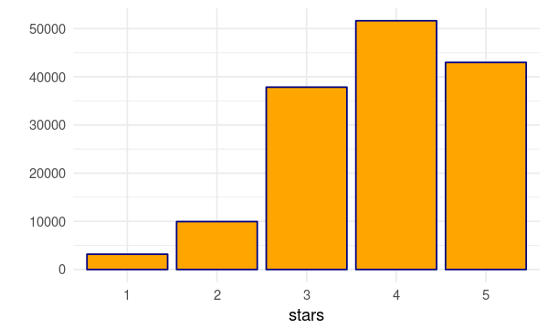
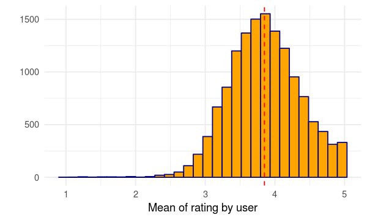
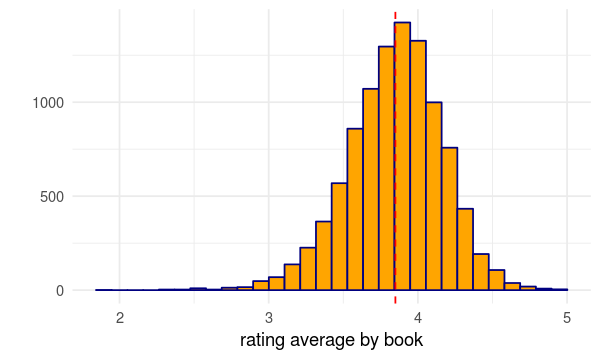
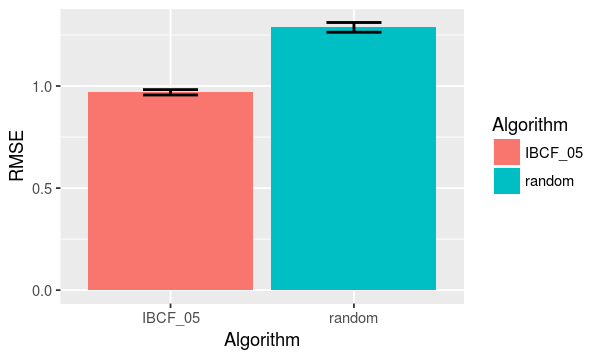

# Good Reads: Item-Based Collaborative Filtering


## Overview

We cannot escape! If you use online services or buy anything from a e-commerce company, recommendation is part of your online routine. Online services are suggesting you products and services that you might like. It is everywhere. Netflix recommends shows/movies based on what you watched and recent demand. Amazon displays on your website products that might be interested based on previous purchases, clicks, and user similarity. Youtube, recommend videos based on what you and others have watched. We could keep giving examples here for a long time, and the idea is always the same: suggest something that you probably will enjoy.

Books are not different!! The website [goodreads.com](http://www.goodreads.com) could be defined as a social network dedicated for people interested on books. The idea is that you can interact with other readers, authors, and of course books. Between many utilities the readers social network provides a members review database to give you more information for the books you are looking for. It works excatly as any other review system. You rate the book you read (between 1 and 5 stars) and write down your opinion about the book, explaining what you like or don't in that specific. I know, nothing new here. The [goodreads.com](http://www.goodreads.com) also have its recommender system for books. It will look for the books you read and the rate you gave to suggest you new books.

In this notebook, I apply a very well known called **Item-Based Collaborative Filtering** (IBCF) to estimate the rate of books based on other similar books. The idea is simple, if I like a book (i.e., I rated it 5 stars) it is likely that I will also enjoy a very similar book to that one.

This technique is not new but let's see how it works when predicting books rating!!!

## Loading and Cleaning data


```R
# Display plot options
options(repr.plot.width=5, repr.plot.height=3)

# load necessary libraries
library(dplyr)
library(ggplot2)
library(tidyr)
```

The data is available at [Kaggle](https://www.kaggle.com/zygmunt/goodbooks-10k/data). In this page there is also a very good kernel about **User-Based Collaborative Filtering** (UBCF) applied to the same dataset. The objective is also to improve the recommendations system, but **IBCF** approach looks for similar users instead of books.


```R
ratings<-read.csv("~/project/pre_git/goodreads/data/ratings.csv")
books<-read.csv("~/project/pre_git/goodreads/data/books.csv")
```

For this application we are going to use 2 datasets.

* **ratings**: Contains information about ratings. It is a simple dataset with only 3 variables: **book_id**, **user_id**, and **rating**. It is pretty straightforward. It represents the rate given for a book from a user.
* **books**: This is a more complex dataset. It contains different information for books such as **title**, **author name**, **year of publication**, **number of reviews**, and etc. 


```R
head(books)
```


<table>
<thead><tr><th scope=col>id</th><th scope=col>book_id</th><th scope=col>best_book_id</th><th scope=col>work_id</th><th scope=col>books_count</th><th scope=col>isbn</th><th scope=col>isbn13</th><th scope=col>authors</th><th scope=col>original_publication_year</th><th scope=col>original_title</th><th scope=col>⋯</th><th scope=col>ratings_count</th><th scope=col>work_ratings_count</th><th scope=col>work_text_reviews_count</th><th scope=col>ratings_1</th><th scope=col>ratings_2</th><th scope=col>ratings_3</th><th scope=col>ratings_4</th><th scope=col>ratings_5</th><th scope=col>image_url</th><th scope=col>small_image_url</th></tr></thead>
<tbody>
	<tr><td>1                                                          </td><td> 2767052                                                   </td><td> 2767052                                                   </td><td> 2792775                                                   </td><td> 272                                                       </td><td>439023483                                                  </td><td>9.780439e+12                                               </td><td>Suzanne Collins                                            </td><td>2008                                                       </td><td>The Hunger Games                                           </td><td>⋯                                                          </td><td>4780653                                                    </td><td>4942365                                                    </td><td>155254                                                     </td><td> 66715                                                     </td><td>127936                                                     </td><td>560092                                                     </td><td>1481305                                                    </td><td>2706317                                                    </td><td>https://images.gr-assets.com/books/1447303603m/2767052.jpg </td><td>https://images.gr-assets.com/books/1447303603s/2767052.jpg </td></tr>
	<tr><td>2                                                          </td><td>       3                                                   </td><td>       3                                                   </td><td> 4640799                                                   </td><td> 491                                                       </td><td>439554934                                                  </td><td>9.780440e+12                                               </td><td>J.K. Rowling, Mary GrandPré                                </td><td>1997                                                       </td><td>Harry Potter and the Philosopher's Stone                   </td><td>⋯                                                          </td><td>4602479                                                    </td><td>4800065                                                    </td><td> 75867                                                     </td><td> 75504                                                     </td><td>101676                                                     </td><td>455024                                                     </td><td>1156318                                                    </td><td>3011543                                                    </td><td>https://images.gr-assets.com/books/1474154022m/3.jpg       </td><td>https://images.gr-assets.com/books/1474154022s/3.jpg       </td></tr>
	<tr><td>3                                                          </td><td>   41865                                                   </td><td>   41865                                                   </td><td> 3212258                                                   </td><td> 226                                                       </td><td>316015849                                                  </td><td>9.780316e+12                                               </td><td>Stephenie Meyer                                            </td><td>2005                                                       </td><td>Twilight                                                   </td><td>⋯                                                          </td><td>3866839                                                    </td><td>3916824                                                    </td><td> 95009                                                     </td><td>456191                                                     </td><td>436802                                                     </td><td>793319                                                     </td><td> 875073                                                    </td><td>1355439                                                    </td><td>https://images.gr-assets.com/books/1361039443m/41865.jpg   </td><td>https://images.gr-assets.com/books/1361039443s/41865.jpg   </td></tr>
	<tr><td>4                                                          </td><td>    2657                                                   </td><td>    2657                                                   </td><td> 3275794                                                   </td><td> 487                                                       </td><td>61120081                                                   </td><td>9.780061e+12                                               </td><td>Harper Lee                                                 </td><td>1960                                                       </td><td>To Kill a Mockingbird                                      </td><td>⋯                                                          </td><td>3198671                                                    </td><td>3340896                                                    </td><td> 72586                                                     </td><td> 60427                                                     </td><td>117415                                                     </td><td>446835                                                     </td><td>1001952                                                    </td><td>1714267                                                    </td><td>https://images.gr-assets.com/books/1361975680m/2657.jpg    </td><td>https://images.gr-assets.com/books/1361975680s/2657.jpg    </td></tr>
	<tr><td>5                                                          </td><td>    4671                                                   </td><td>    4671                                                   </td><td>  245494                                                   </td><td>1356                                                       </td><td>743273567                                                  </td><td>9.780743e+12                                               </td><td>F. Scott Fitzgerald                                        </td><td>1925                                                       </td><td>The Great Gatsby                                           </td><td>⋯                                                          </td><td>2683664                                                    </td><td>2773745                                                    </td><td> 51992                                                     </td><td> 86236                                                     </td><td>197621                                                     </td><td>606158                                                     </td><td> 936012                                                    </td><td> 947718                                                    </td><td>https://images.gr-assets.com/books/1490528560m/4671.jpg    </td><td>https://images.gr-assets.com/books/1490528560s/4671.jpg    </td></tr>
	<tr><td>6                                                          </td><td>11870085                                                   </td><td>11870085                                                   </td><td>16827462                                                   </td><td> 226                                                       </td><td>525478817                                                  </td><td>9.780525e+12                                               </td><td>John Green                                                 </td><td>2012                                                       </td><td>The Fault in Our Stars                                     </td><td>⋯                                                          </td><td>2346404                                                    </td><td>2478609                                                    </td><td>140739                                                     </td><td> 47994                                                     </td><td> 92723                                                     </td><td>327550                                                     </td><td> 698471                                                    </td><td>1311871                                                    </td><td>https://images.gr-assets.com/books/1360206420m/11870085.jpg</td><td>https://images.gr-assets.com/books/1360206420s/11870085.jpg</td></tr>
</tbody>
</table>


```R
head(ratings)
```


<table>
<thead><tr><th scope=col>book_id</th><th scope=col>user_id</th><th scope=col>rating</th></tr></thead>
<tbody>
	<tr><td>1   </td><td> 314</td><td>5   </td></tr>
	<tr><td>1   </td><td> 439</td><td>3   </td></tr>
	<tr><td>1   </td><td> 588</td><td>5   </td></tr>
	<tr><td>1   </td><td>1169</td><td>4   </td></tr>
	<tr><td>1   </td><td>1185</td><td>4   </td></tr>
	<tr><td>1   </td><td>2077</td><td>4   </td></tr>
</tbody>
</table>


Let's start to clean our **ratings** dataset. It is possible for a user have more than one rating for the same book. We could assume that the user change its mind and reevalute the book. It definitely can happen, but for simplicity we remove these cases and assume that every combination of book and user has only one rating. In this case, we have to eliminate the cases where users gave more than on rating for the same book


```R
ratings<-ratings %>% group_by(user_id, book_id) %>% mutate(total=n())
cat('Number of duplicate ratings: ', format(nrow(ratings[ratings$total > 1,]),big.mark=",",scientific=FALSE))
```

    Number of duplicate ratings:  4,487


```R
duplicated_ratings<-ratings%>%
    group_by(book_id,user_id)%>%
    summarise(total=n())%>%
    filter(total>1)%>%
    arrange(desc(total))

head(duplicated_ratings)
```


<table>
<thead><tr><th scope=col>book_id</th><th scope=col>user_id</th><th scope=col>total</th></tr></thead>
<tbody>
	<tr><td>8946 </td><td> 3204</td><td>5    </td></tr>
	<tr><td>2515 </td><td> 4359</td><td>4    </td></tr>
	<tr><td>3996 </td><td>38259</td><td>4    </td></tr>
	<tr><td>6472 </td><td>  691</td><td>4    </td></tr>
	<tr><td>7420 </td><td>34548</td><td>4    </td></tr>
	<tr><td>8946 </td><td>   42</td><td>4    </td></tr>
</tbody>
</table>


As you can see above, user **3204** rated book **8946** five times. We eliminate these cases.


```R
ratings <- ratings[ratings$total == 1,]
```

Only books with 100 reviews and user with more than 20 reviews.  I did this to reduce dimensonality and reduce time consume to estimate the model.


```R
ratings<-ratings%>%group_by(user_id)%>%mutate(total=n())%>%filter(total>20)
ratings<-ratings%>%group_by(book_id)%>%mutate(total=n())%>%filter(total==100)
cat('Number of ratings: ',format(nrow(ratings),big.mark=",",scientific=FALSE))
```

    Number of ratings:  145,600


```R
cat('Number of Books: ',format(length(unique(ratings$book_id)),big.mark=",",scientific=FALSE),'\n',
    'Number of Users: ',format(length(unique(ratings$user_id)),big.mark=",",scientific=FALSE))
```

    Number of Books:  1,456 
     Number of Users:  6,735

## Understand more about our data: Descriptive analysis

### What's the most reviewed book?


```R
books[books$ratings_count==max(books$ratings_count),]
```


<table>
<thead><tr><th scope=col>id</th><th scope=col>book_id</th><th scope=col>best_book_id</th><th scope=col>work_id</th><th scope=col>books_count</th><th scope=col>isbn</th><th scope=col>isbn13</th><th scope=col>authors</th><th scope=col>original_publication_year</th><th scope=col>original_title</th><th scope=col>⋯</th><th scope=col>ratings_count</th><th scope=col>work_ratings_count</th><th scope=col>work_text_reviews_count</th><th scope=col>ratings_1</th><th scope=col>ratings_2</th><th scope=col>ratings_3</th><th scope=col>ratings_4</th><th scope=col>ratings_5</th><th scope=col>image_url</th><th scope=col>small_image_url</th></tr></thead>
<tbody>
	<tr><td>1                                                         </td><td>2767052                                                   </td><td>2767052                                                   </td><td>2792775                                                   </td><td>272                                                       </td><td>439023483                                                 </td><td>9.780439e+12                                              </td><td>Suzanne Collins                                           </td><td>2008                                                      </td><td>The Hunger Games                                          </td><td>⋯                                                         </td><td>4780653                                                   </td><td>4942365                                                   </td><td>155254                                                    </td><td>66715                                                     </td><td>127936                                                    </td><td>560092                                                    </td><td>1481305                                                   </td><td>2706317                                                   </td><td>https://images.gr-assets.com/books/1447303603m/2767052.jpg</td><td>https://images.gr-assets.com/books/1447303603s/2767052.jpg</td></tr>
</tbody>
</table>


Hunger Games - Suzanne Collins

### Which books has the highest average rating?


```R
books[books$average_rating==max(books$average_rating),]
```


<table>
<thead><tr><th></th><th scope=col>id</th><th scope=col>book_id</th><th scope=col>best_book_id</th><th scope=col>work_id</th><th scope=col>books_count</th><th scope=col>isbn</th><th scope=col>isbn13</th><th scope=col>authors</th><th scope=col>original_publication_year</th><th scope=col>original_title</th><th scope=col>⋯</th><th scope=col>ratings_count</th><th scope=col>work_ratings_count</th><th scope=col>work_text_reviews_count</th><th scope=col>ratings_1</th><th scope=col>ratings_2</th><th scope=col>ratings_3</th><th scope=col>ratings_4</th><th scope=col>ratings_5</th><th scope=col>image_url</th><th scope=col>small_image_url</th></tr></thead>
<tbody>
	<tr><th scope=row>3628</th><td>3628                                                    </td><td>24812                                                   </td><td>24812                                                   </td><td>25599                                                   </td><td>14                                                      </td><td>740748475                                               </td><td>9.780741e+12                                            </td><td>Bill Watterson                                          </td><td>2005                                                    </td><td>The Complete Calvin and Hobbes                          </td><td>⋯                                                       </td><td>28900                                                   </td><td>29968                                                   </td><td>861                                                     </td><td>120                                                     </td><td>154                                                     </td><td>693                                                     </td><td>3117                                                    </td><td>25884                                                   </td><td>https://images.gr-assets.com/books/1473064526m/24812.jpg</td><td>https://images.gr-assets.com/books/1473064526s/24812.jpg</td></tr>
</tbody>
</table>


### How is the rating distribution?


```R
ratings%>%
ggplot(aes(factor(rating)))+
geom_bar(fill="orange",col="navy")+xlab("stars")+ylab("")+theme_minimal()
```





It seems that most of ratings are between 4-5 stars. Rarely a reader rate it as 1-2 star.

### Number of ratings by user


```R
ratings%>%group_by(user_id)%>%summarise(total=n())%>%
ggplot(aes(total))+
geom_histogram(bins=25,fill="orange",col="navy")+theme_minimal()+xlab("Ratings by user")+ylab("")
```


### Rating average by user


```R
ratings%>%group_by(user_id)%>%summarise(rating=mean(rating))%>%
ggplot(aes(rating))+
geom_histogram(bins=30,fill="orange",col="navy")+theme_minimal()+xlab("Mean of rating by user")+ylab("")+
geom_vline(xintercept = mean(ratings$rating),col="red",lty=2)
```





### Rating average by book


```R
ratings%>%group_by(book_id)%>%summarise(rating=mean(rating))%>%
ggplot(aes(rating))+
geom_histogram(bins=30,fill="orange",col="navy")+theme_minimal()+xlab("rating average by book")+ylab("")+
geom_vline(xintercept = mean(ratings$rating),col="red",lty=2)
```





### Item-Based Collaborative Filter

The idea here is to suggest books that are similar to books that were high rated.


```R
dimension_names <- list(user_id = sort(unique(ratings$user_id)),book_id = sort(unique(ratings$book_id)))
```


```R
#Create Matrix from Ratings dataset: rows -> user ; columns->books
rating_matrix<-spread(ratings%>%select(book_id,user_id,rating),book_id,rating)
rating_matrix<-rating_matrix[,!(names(rating_matrix)%in%"user_id")] #remove 'user_id' column
```


```R
rating_matrix<-as.matrix(rating_matrix)
```


```R
dimnames(rating_matrix)<-dimension_names
```


```R
dim(rating_matrix)
```


<ol class=list-inline>
	<li>6735</li>
	<li>1456</li>
</ol>


```R
# Transpose rating_matrix: rows->Books; columns->Users
rating_matrix<-t(rating_matrix)
```


```R
head(rating_matrix)
```


<table>
<thead><tr><th></th><th scope=col>7</th><th scope=col>35</th><th scope=col>41</th><th scope=col>75</th><th scope=col>89</th><th scope=col>143</th><th scope=col>145</th><th scope=col>146</th><th scope=col>153</th><th scope=col>158</th><th scope=col>⋯</th><th scope=col>53293</th><th scope=col>53318</th><th scope=col>53332</th><th scope=col>53337</th><th scope=col>53352</th><th scope=col>53364</th><th scope=col>53366</th><th scope=col>53373</th><th scope=col>53381</th><th scope=col>53403</th></tr></thead>
<tbody>
	<tr><th scope=row>1</th><td>NA</td><td>NA</td><td>NA</td><td>NA</td><td>NA</td><td>NA</td><td>NA</td><td>NA</td><td>NA</td><td>NA</td><td>⋯ </td><td>NA</td><td>NA</td><td>NA</td><td>NA</td><td>NA</td><td>NA</td><td>NA</td><td>NA</td><td>NA</td><td>NA</td></tr>
	<tr><th scope=row>2</th><td>NA</td><td>NA</td><td>NA</td><td>NA</td><td>NA</td><td>NA</td><td>NA</td><td>NA</td><td>NA</td><td>NA</td><td>⋯ </td><td>NA</td><td>NA</td><td>NA</td><td>NA</td><td>NA</td><td>NA</td><td>NA</td><td>NA</td><td>NA</td><td>NA</td></tr>
	<tr><th scope=row>3</th><td>NA</td><td>NA</td><td>NA</td><td>NA</td><td>NA</td><td>NA</td><td>NA</td><td>NA</td><td>NA</td><td>NA</td><td>⋯ </td><td>NA</td><td>NA</td><td>NA</td><td>NA</td><td>NA</td><td>NA</td><td>NA</td><td>NA</td><td>NA</td><td>NA</td></tr>
	<tr><th scope=row>4</th><td>NA</td><td>NA</td><td>NA</td><td>NA</td><td>NA</td><td>NA</td><td>NA</td><td>NA</td><td>NA</td><td>NA</td><td>⋯ </td><td>NA</td><td>NA</td><td>NA</td><td>NA</td><td>NA</td><td>NA</td><td>NA</td><td>NA</td><td>NA</td><td>NA</td></tr>
	<tr><th scope=row>5</th><td>NA</td><td>NA</td><td>NA</td><td>NA</td><td>NA</td><td>NA</td><td>NA</td><td>NA</td><td>NA</td><td>NA</td><td>⋯ </td><td>NA</td><td>NA</td><td>NA</td><td>NA</td><td>NA</td><td>NA</td><td>NA</td><td>NA</td><td>NA</td><td>NA</td></tr>
	<tr><th scope=row>6</th><td>NA</td><td>NA</td><td>NA</td><td>NA</td><td>NA</td><td>NA</td><td>NA</td><td>NA</td><td>NA</td><td>NA</td><td>⋯ </td><td>NA</td><td>NA</td><td>NA</td><td>NA</td><td>NA</td><td>NA</td><td>NA</td><td>NA</td><td>NA</td><td>NA</td></tr>
</tbody>
</table>


Find books that were read for more than 10 different users


```R
set.seed(12345)
book_sample<-sample(unique(ratings$book_id),1)
```


```R
book_sample
```


7208


```R
rated_user <- which(!is.na((as.data.frame(rating_matrix[as.numeric(row.names(rating_matrix))==book_sample, ]))))
```

The book was read for the following users:


```R
colnames(rating_matrix)[rated_user]
```


<ol class=list-inline>
	<li>'46'</li>
	<li>'540'</li>
	<li>'624'</li>
	<li>'1309'</li>
	<li>'1932'</li>
	<li>'3392'</li>
	<li>'4184'</li>
	<li>'4306'</li>
	<li>'4597'</li>
	<li>'4797'</li>
	<li>'5333'</li>
	<li>'6333'</li>
	<li>'6597'</li>
	<li>'7178'</li>
	<li>'7189'</li>
	<li>'7244'</li>
	<li>'8005'</li>
	<li>'8243'</li>
	<li>'8901'</li>
	<li>'8946'</li>
	<li>'9449'</li>
	<li>'9746'</li>
	<li>'10309'</li>
	<li>'10642'</li>
	<li>'10679'</li>
	<li>'11189'</li>
	<li>'12477'</li>
	<li>'13091'</li>
	<li>'13394'</li>
	<li>'13459'</li>
	<li>'13678'</li>
	<li>'15245'</li>
	<li>'15296'</li>
	<li>'16550'</li>
	<li>'17205'</li>
	<li>'17630'</li>
	<li>'20730'</li>
	<li>'20900'</li>
	<li>'21463'</li>
	<li>'22273'</li>
	<li>'22717'</li>
	<li>'22840'</li>
	<li>'23134'</li>
	<li>'24547'</li>
	<li>'25213'</li>
	<li>'25920'</li>
	<li>'27399'</li>
	<li>'28943'</li>
	<li>'29881'</li>
	<li>'30818'</li>
	<li>'31253'</li>
	<li>'31371'</li>
	<li>'32588'</li>
	<li>'33290'</li>
	<li>'33421'</li>
	<li>'34578'</li>
	<li>'34584'</li>
	<li>'34695'</li>
	<li>'34978'</li>
	<li>'36296'</li>
	<li>'37158'</li>
	<li>'40414'</li>
	<li>'44188'</li>
	<li>'45068'</li>
	<li>'45116'</li>
	<li>'45933'</li>
	<li>'46825'</li>
	<li>'48730'</li>
	<li>'49125'</li>
	<li>'50457'</li>
	<li>'51607'</li>
	<li>'52095'</li>
	<li>'52142'</li>
	<li>'52909'</li>
	<li>'53107'</li>
	<li>'53131'</li>
</ol>


```R
ratings%>%filter(book_id==7208,user_id==46)
```


<table>
<thead><tr><th scope=col>book_id</th><th scope=col>user_id</th><th scope=col>rating</th><th scope=col>total</th></tr></thead>
<tbody>
	<tr><td>7208</td><td>46  </td><td>5   </td><td>37  </td></tr>
</tbody>
</table>


### Similarity

How to identify if 2 books are similar? There are a lot of different ways to do this, here we are going to use the cosine similarity.

It calculates the cosine of the angle between two vectors. If the angle is *0* degrees meaning that both vectors are on the same direction the cosine is *1*. If the angle is *180* degrees it means that these vectors are in opposite directions and the cosine is *-1*.


What are the vectors here? A vector is the rates for a book given by all users. Some users did not read the book in this case the rate is *0*.

For example:

| Movie         | User 1| User 2| User 3| User 4| User 5|
| ------------- |:-----:|:-----:|:-----:|:-----:|:-----:|
| A             | 2     |3    |.|.|.|
| B             | 5     |    .|3|5|5|
| C             | 4     |    5|4|3|.|

The vector for the movie A is:

| User 1| User 2| User 3| User 4| User 5|
|:-----:|:-----:|:-----:|:-----:|:-----:|
| 2     |3    |0|0|0|


```R
book_1<-9033
book_2<-4141
```


```R
rating_1<-rating_matrix[row.names(rating_matrix)==book_1,]
rating_2<-rating_matrix[row.names(rating_matrix)==book_2,]
```


```R
aux<-rating_1*rating_2
sum(aux,na.rm=TRUE)/(sqrt(sum(rating_1*rating_1,na.rm = TRUE))*sqrt(sum(rating_2*rating_2,na.rm = TRUE)))
```


0.0526734230322382


### recommenderLab library

There is **recommenderlab** library that provides the algorithm to create models


```R
library("recommenderlab")
```

    Loading required package: Matrix
    
    Attaching package: ‘Matrix’
    
    The following object is masked from ‘package:tidyr’:
    
        expand
    
    Loading required package: arules
    
    Attaching package: ‘arules’
    
    The following object is masked from ‘package:dplyr’:
    
        recode
    
    The following objects are masked from ‘package:base’:
    
        abbreviate, write
    
    Loading required package: proxy
    
    Attaching package: ‘proxy’
    
    The following object is masked from ‘package:Matrix’:
    
        as.matrix
    
    The following objects are masked from ‘package:stats’:
    
        as.dist, dist
    
    The following object is masked from ‘package:base’:
    
        as.matrix
    
    Loading required package: registry


```R
rating_matrix[is.na(rating_matrix)]<-0
```


```R
sparse_rating_matrix<-as(rating_matrix,"sparseMatrix")
```


```R
str(sparse_rating_matrix)
```

    Formal class 'dgCMatrix' [package "Matrix"] with 6 slots
      ..@ i       : int [1:145600] 1015 1035 1077 1185 1206 1298 1303 1319 1398 1402 ...
      ..@ p       : int [1:6736] 0 10 93 102 118 121 140 148 149 159 ...
      ..@ Dim     : int [1:2] 1456 6735
      ..@ Dimnames:List of 2
      .. ..$ book_id: chr [1:1456] "1" "2" "3" "4" ...
      .. ..$ user_id: chr [1:6735] "7" "35" "41" "75" ...
      ..@ x       : num [1:145600] 5 4 3 4 3 3 1 3 4 5 ...
      ..@ factors : list()


```R
real_ratings <- new("realRatingMatrix", data = sparse_rating_matrix)
```

### Model


```R
str(real_ratings)
```

    Formal class 'realRatingMatrix' [package "recommenderlab"] with 2 slots
      ..@ data     :Formal class 'dgCMatrix' [package "Matrix"] with 6 slots
      .. .. ..@ i       : int [1:139362122] 0 1 2 3 4 5 6 7 8 9 ...
      .. .. ..@ p       : int [1:13940] 0 9998 19996 29994 39992 49990 59988 69986 79984 89982 ...
      .. .. ..@ Dim     : int [1:2] 9998 13939
      .. .. ..@ Dimnames:List of 2
      .. .. .. ..$ book_id: chr [1:9998] "1" "2" "3" "4" ...
      .. .. .. ..$ user_id: chr [1:13939] "7" "19" "23" "27" ...
      .. .. ..@ x       : num [1:139362122] NA NA NA NA NA NA NA NA NA NA ...
      .. .. ..@ factors : list()
      ..@ normalize: NULL


```R
head(real_ratings@data)
```

       [[ suppressing 6735 column names ‘7’, ‘35’, ‘41’ ... ]]


    6 x 6735 sparse Matrix of class "dgCMatrix"
                                                                                   
    1 . . . . . . . . . . . . . . . . . . . . . . . . . 5 . . . . . . . . . . . . .
    2 . . . . . . . . . . . . . . . . . . . . . . . . . . . . . . . . . . . . . . .
    3 . . . . . . . . . . . . . . . . . . . . . . . . . 3 . . . . . . . . . . . . .
    4 . . . . . . . . . . . . . . . . . . . . . . . . . . . . . . . . . . . . . . .
    5 . . . . . . . . . . . . . . . . . . . . . . . . . 4 . . . . . . . . . . . . .
    6 . . . . . . . . . . 5 . . . . . . . . . . . . . . 5 . . . . . . . . . . . . .
                                                                                   
    1 . . . . . . . . 3 . . . . . . . . . . . . . . 5 . . . . . . . . . . . . . . .
    2 . . . . . . . . . . . . . . . . . . . . . . . . . . . . . . . . . . . . . . .
    3 . . . . . . . . . . . . . . . . . . . . . . . 1 . . . . . . . . . . . . . . .
    4 . . . . . . . . 5 . . . . . . . . . . . . . . . . . . . . . . . . . . . . . .
    5 . . . . . . . . . . . . . . . . . . . . . . . . . . . . . . . . . . . . . . .
    6 . . . . . . . . . . . . . . . . . . . . . . . . . . . . . . . . . . . 5 . . .
                                                                                   
    1 . . . . . . . . . . . . . . . . . . . . . . . . . . . . . . . . . . . . . . .
    2 . . . . . . . . . . . . . . . . . . . . . . . . . . . . . . . . . . . . . . .
    3 . . . . . . . . . . . . . . . . . . . . . . . . . . . . . . . . . . . . . . .
    4 . . . . . . . . . . . . . . . . . . . . . . . . . . . . . . . . . . . . . . .
    5 . . . . . . . . . . . . . . . . . . . . . . . . . . . . . . . . . . . . . . .
    6 . . . . . . . . . . . . . . . . . . . . . . . . . . . . . . . . . . . . . . .
                                                                                   
    1 . . . . . . . . . . . . . . 4 . . 4 . . . . . . . . . . . . . . . . . . . . .
    2 . . . . . . . . . . . . . . 3 . . . . . . . . . . . . . . . . . . . . . . . .
    3 . . . . . . . . . . . . . . . . . . . . . . . . . . . . . . . . . . . . . . .
    4 . . . . . . . . . . . . . . 5 . . . . . . . . . . . . . . . . . . . . . . . .
    5 . . . . . . . . . . . . . . 5 . . . . . . . . . . . . . . . . . . . . . . . .
    6 . . . . . . . . . . . . . . . . . . . . . . . . . . . . . . . . . . . . . . .
                                                                                   
    1 . . . . . . . . . . . . . . . . . . . . . . . . . . . . . . . . . . . . . . .
    2 . . . . . . . . . . . . . . . . . . . . . . . . . . . . . . . . . . . . . . .
    3 . . . . . . . . . . . . . . . . . . . . . . . . . . . . . . . . . . . . . . .
    4 . . . . . . . . . . . . . . . . . . . . . . . . . . . . . . . . . . . . . . .
    5 . . . . . . . . . . . . . . . . . . . . . . . . . . . . . . . . . . . . . . .
    6 . . . . . . . . . . . . . . . . . . . . . . . . . . . . . . . . . . . . . . .
                                                                                   
    1 . . . . . . . . . . . . . . . . . . . . . . . . . . . . . . . . . . . . . . .
    2 . . . . . . . . . . . . . . . . . . . . . . . . . . . . . . . . . . . . . . .
    3 . . . . . . . . . . . . . . . . . . . . . . . . . . . . . . . . . . . . . . .
    4 . . . . . . . . . . . . . . . . . . . . . . . . . . . . . . . . . . . . . . .
    5 . . . . . . . . . . . . . . . . . . . . . . . . . . . . . . . . . . . . . . .
    6 . . . . . . . . . . . . . . . . . . . . . . . . . . . . . . . . . . . . . . .
                                                                                   
    1 . . . . . . . . . . . . . . . . . . . . . . . . . . . . . . . . . . . . . . .
    2 . . . . . . . . . . . . . . . . . . . . . . . . . . . . . . . . . . . . . . .
    3 . . . . . . . . . . . . . . . . . . . . . . . . . . . . . . . . . . . . . . .
    4 . . . . . . . . . . . . . . . . . . . . . . . . . . . . . . . . . . . . . . .
    5 . . . . . . . . . . . . . . . . . . . . . . . . . . . . . . . . . . . . . . .
    6 . . . . . . . . . . . . . . . . . . . . . . . . . . . . . . . . . . . . . . .
                                                                                   
    1 . . . . . . . . . . . . . . . . . . . 4 . . . . . . . . . . . . . . . . . . .
    2 . . . . . . . . . . . . . . . . . . . . . . . . . . . . . . . . . . . . . . .
    3 . . . . . . . . . . . . . . . . . . . 2 . . . . . . . . . . . . . . . . . . .
    4 . . . . . . . . . . . . . . . . . . . . . . . . . . . . . . . . . . . . . . .
    5 5 . . . . . . . . . . . . . . . . . . . . . . . . . . . . . . . . . . . . . .
    6 . . . . . . . . . . . . . . . . . . . 2 . . . . . . . . . . 5 . . . . . . . .
                                                                                   
    1 . . . . . . . . . . . . . . . . . . . . . . . . . . . . . . . . . . . . . . .
    2 . . . . . . . . . . . . . . . . . . . . . . . . . . . . . . . . . . . . . . .
    3 . . . . . . . . . . . . . . . . . . . . . . . . . . . . . . . . . . . . . . .
    4 . . . . . . . . . . . . . . . 5 . . . . . . . . . . . . . . . . . . . . . . .
    5 . . . . . . . . . . . . . . . 5 . . . . . . . . . . . . . . . . . . . . . . .
    6 . . . . . . . . . . . . . . . . . . . . . . . . . . . . . . . . . . . . . . .
                                                                                   
    1 . . . 4 . . . . . . . . . . . . . . . . . . . . . . . . . . . . . . . . . . .
    2 . . . . . . . . . . . . . . . . . . . . . . . . . . . . . . . . . . . . . . .
    3 . . . 3 . . . . . . . . . . . . . . . . . . . . . . . . . . . . . . . . . . .
    4 . . . 5 . . . . . . . . . . . . . . . . . . . . . . . . . . . . . . . . . . .
    5 . . . 3 . . . . . . . . . . . . . . . . . . . . . . . . . . . . . . . . . . .
    6 . . . . . . . . . . . . . . . . . . . . . . . . . . . . . . . . . . . . . . .
                                                                                   
    1 . . . . . . . . . . . . . . . . . . . . . . . 5 . . . . . . . . . . . . . . .
    2 . . . . . . . . . . . . . . . . . . . . . . . . . . . . . . . . . . . . . . .
    3 . . . . . . . . . . . . . . . . . . . . . . . 3 . . . . . . . . . . . . . . .
    4 . . . . . . . . . . . . . . . . . . . . . . . . . . . . . . . . . . . . . . .
    5 . . . . . . . . . . . . . . . . . . . . . . . 5 . . . . . . . . . . . . . . .
    6 . . . . . . . . . . . . . . . . . . . . . . . . . . . . . . . . . . . . . . .
                                                                                   
    1 . . . . . . . . . . . . . . . . . . . . . . . . . . . . . . . . . . . . . . .
    2 . . . . . . . . 4 . . . . . . . . . . . . . . . . . . . . . . . . . . . . . .
    3 . . . . . . . . . . . . . . . . . . . . . . . . . . . . . . . . . . . . . . .
    4 . . . . . . . . . . . . . . . . . . . . . . . . . . . . . . . . . . . . . . .
    5 . . . . . . . . 1 . . . . . . . . . . . . . . . . . . . . . . . . . . . . . .
    6 . . . . . . . . . . . . . . . . . . . . . . . . . . . . . . . . . . . . . . .
                                                                                   
    1 . . . . . . . . . . . . . . . . . . . . . . . . . . . . . . . . . . . . . . .
    2 . . . . . . . . . . . . . . . . . . . . . . . . . . . . . . . . . . . . . . .
    3 . . . . . . . . . . . . . . . . . . . . . . . . . . . . . . . . . . . . . . .
    4 . . . . . . . . . . . . . . . . . . . . . . . . . . . . . . . . . . . . . . .
    5 . . . . . . . . . . . . . . . . . . . . . . . . . . . . . . . . . . . . . . .
    6 . . . . . . . . . . . . . . . . . . . . . . . . . . . . . . . . . . . . . . .
                                                                                   
    1 . . . . . . . . . . . . . . . . . . . 4 . . . . . . . . . . . . . . . . . . .
    2 . . . . . . . . . . . . . . . . . . . . . . . . . . . . . . . . . . . . . . .
    3 . . . . . . . . . . . . . . . . . . . 4 . . . . . . . . . . . . . . . . . . .
    4 . . . . . . . . . . . . . . . . . . . . . . . . . . 5 . . . . . . . . . . . .
    5 . . . . . . . . . . . . . . . . . . . 4 . . . . . . 5 . . . . . . . . . . . .
    6 . . . . . . . . . . . . . . . . . . . 5 . . . . . . . . . . . . . . . . . . .
                                                                                   
    1 . . . . . . . . . . . . . . . . . . 5 . . . . . . . . . . . . . . . . . . . .
    2 . . . . . . . . . . . . . . . . . . 5 . . . . . . . . . . . . . . . . . . . .
    3 . . . . . . . . . . . . . . . . . . . . . . . . . . . . . . . . . . . . . . .
    4 . . . . . . . . . . . . . . . . . . 4 . . . . . . . . . . . . . . . . . . . .
    5 . . . . . . . . . . . . . . . . . . 2 . . . . . . . . . . . . . . . . . . . .
    6 . . . . . . . . . . . . . . . . . . . . . . . . . . . . . . . . . . . . . . .
                                                                                   
    1 . . . . . . . . . . . . . . . . . . . . . . . . . . . . . . . . . . . . . . .
    2 . . . . . . . . . . . . . . . . . . . . . . . . . . . . . . . . . . . . . . .
    3 . . . . . . . . . . . . . . . . . . . . . . . . . . . . . . . . . . . . . . .
    4 . . . . . . . . . . . . . . . . . . . . . . . . . . . . . . . . . . . . . . .
    5 . . . . . . . . . . . . . . . . . . . . . . . . . . . . . . . . . . . . . . .
    6 . . . . . . . . . . . . . . . . . . . . . . . . . . . . . . . . . . . . . . .
                                                                                   
    1 . . . . . . . . . . . . . . . . . . . . . . . . . . . . . . . . . . . . . . .
    2 . . . . . . . . . . . . . . . . . . . . . . . . . . . . . . . . . . . . . . .
    3 . . . . . . . . . . . . . . . . . . . . . . . . . . . . . . . . . . 1 . . . .
    4 . . . . . . . . . . . . . . . . . . . . . . . . . . . . . . . . . . . . . . .
    5 . . . . . . . . . . . . . . . . . . . . . . . . . . . . . . . . . . . . . . .
    6 . . . . . . . . . . . . . . . . . . . . . . . . . . . . . . . . . . . . . . .
                                                                                   
    1 . . . . . . . . . . . . . . . . . . . . . . . . . . . . . . . . . . . . . . .
    2 . . . . . . . . . . . . . . . . . . . . . . . . . . . . . . . . . . . . . . .
    3 . . . . . . . . . . . . . . . . . . . . . . . . . . . . . . . . . . . . . . .
    4 . . 1 . . . . . . . . . . . . . . . . . . . . . . . . . . . . . . . . . . . .
    5 . . . . . . . . . . . . . . . . . . . . . . . . . . . . . . . . . . . . . . .
    6 . . . . . . . . . . . . . . . . . . . . . . . . . . . . . . . . . . . . . . .
                                                                                   
    1 . . . . . . . . . . . . . . . . . . . . . . . . . . . . . . . . . . . . . . .
    2 . . . . . . . . . . . . . . . . . . . . . . . . . . . . . 4 . . . . . . . . .
    3 . . . . . . . . . . . . . . . . . . . . . . . . . . . . . 4 . . . . . . . . .
    4 . . . . . . . . . . . . . . . . . . . . . . . . . . . . . 5 . . . . . . . . .
    5 . . . . . . . . . . . . . . . . . . . . . . . . . . . . . 3 . . . . . . . . .
    6 . . . . . . . . . . . . . . . . . . . . . . . . . . . . . . . . . . . . . . .
                                                                                   
    1 . . . . . . . . . . . . . . . . . . . . . 5 . . . . . . . . . . . . 3 . . . .
    2 . . . . . . . . . . . . . . . . . . . . . . . . . . . . . . 5 . . . 4 . . . .
    3 . . . . . . . . . 5 . . . . . . . . . . . . . . . . . . . . . . . . 2 . . . .
    4 . . . . . . . . . . . . . . . . . . . . . . . . . . . . . . 5 . . . . . . . .
    5 . . . . . . . . . . . . . . . . . . . . . . . . . . . . . . . . . . 5 . . . .
    6 . . . . . . . . . . . . . . . . . . . . . 5 . . . . . . . . . . . . . . . . .
                                                                                   
    1 . . . . . . . . . . . . . . . . . . . . . . . . . . . . . . . . . . . . . . .
    2 . . . . . . . . . . . . . . . . . . . . . . . . . . . . . . . . . . . . . . .
    3 . . . . . . . . . . . . . . . . . . . . . . . . . . . . . . . . . . . . . . .
    4 . . . . . . . . . . . . . . . . . . . . . . . . . . . . . . . . . . . . . . .
    5 . . . . . . . . . . . . . . . . . . . . . . . . . . . . . . . . . . . . . . .
    6 . . . . . . . . . . . . . . . . . . . . . . . . . . . . . . . . . . . . . . .
                                                                                   
    1 . . . . . . . . . . . . . . . . . 5 . . . . . . . . . . . . . . . . . . . . .
    2 . . . . . . . . . . . . . . . . . 4 . . . . . . . . . . . . . . . . . . . . .
    3 . . . . . . . . . . . . . . . . . 4 . . . . . . . . . . . . . . . . . . . . .
    4 . . . . . . . . . . . . . . . . . . . . . . . . . . . . . . . . . . . . . . .
    5 . . . . . . . . . . . . . . . . . . . . . . . . . . . . . . . . . . . . . . .
    6 . . . . . . . . . . . . . . . . . . . . . . . . . . . . . . . . . . . . . . .
                                                                                   
    1 . . . . . . . . . . . . . . . . . . . . . . . . . . . . . . . . . . . . . . .
    2 . . . . . . . . . . 1 . . . . . . . . . . . . . . . . . . . . . . . . . . . .
    3 . . . . . . . . . . 5 . . . . . . . . . . . . . . . . . . . . . . . . . . . .
    4 . . . . . . . . . . . . . . . . . . . . . . . . . . . . . . . . . . . . . . .
    5 . . . . . . . . . . . . . . . . . . . . . . . . . . . . . . . . . . . . . . .
    6 . . 5 . . . . . . . . . . . . . . . . . . . . . . . . . . . . . . . . . . . .
                                                                                   
    1 . . . . . . . . . . . . . . . . . . . . . . . . . . . . . . . . . . . . . . .
    2 . . . . . . . . . . . . . . . . . . 3 . . . . . . . . . . . . . . . . . . . .
    3 . . . . . . . . . . . . . . . . . . . . . . . . . . . . . . . . . . . . . . .
    4 . . . . . . . . . . . . . . . . . . 5 . . . . . . . . . . . . . . . . . . . .
    5 . . . . . . . . . . . . . . . . . . 5 . . . . . . . . . . . . . . . . . . . .
    6 . . . . . . . . . . . . . . . . . . . . . . . . . . . . . . . . . . . . . . .
                                                                                   
    1 . . . . . . . . . . . . . . . 5 . . . . . . . . . . . . . . . . . . . . . . .
    2 . . . . . . . . . . . . . . . 5 . . . . . . . . . . . . . . . . . . . . . . .
    3 . . . . . . . . . . . . . . . 5 . 3 . . . . . . . . . . . . . . . . . . . . .
    4 . . . . . . . . . . . . . . . 4 . . . . . . . . . . . . . . . . . . . . . . .
    5 . . . . . . . . . . . . . . . 3 . . . . . . . . . . . . . . . . . . . . . . .
    6 . . . . . . . . . . . . . . . . . . . . . . . . . . . . . . . . . . . . . . .
                                                                                   
    1 . . . . . . . . . . . . . . . . . . . . . . . . . . . . . . . . . . . . . . .
    2 . . . . . . . . . . . . . . . . . . . . . . . . . . . . . . . . . . . . . . .
    3 . . . . . . . . . . . . . . . . . . . . . . . . . . . . . . . . . . . . . 4 .
    4 . . . . . . . . . . . . . . . . . . . . . . . . . . . . . . . . . . . . . . .
    5 . . . . . . . . . . . . . . . . . . . . . . . . . . . . . . . . . . . . . 5 .
    6 . . . . . . . . . . . . . . . . . . . . . . . . . . . . . . . . . . . . . . .
                                                                                   
    1 . . . . . . . . . . . . . . . . . . . . . . . . . . . . . . . . . . . . . . .
    2 . . . . . . . . . . . . . . . . . . . . . . . . . . . . . . . . . . . . . . .
    3 . . . . . . . . . . . . . . . . . . . . . . . . . . . . . . . . . . . . . . .
    4 . . . . . . . . . . . . . . . . . . . . . . . . . . . . . . . . . . . . . . .
    5 . . . . . . . . . . . . . . . . . . . . . . . . . . . . . . . . . . . . . . .
    6 . . . . . . . . . . . . . . . . . . . . . . . . . . . . . . . . . . . . . . .
                                                                                   
    1 . . . . . . . . . . . . . . . . . . . . . . . . . . . . . . . . . . . . . . .
    2 . . . . . . . . . . . . . . . . . . . . . . . . . . . . . . . . . . . . . . .
    3 . . . . . . . . . . . . . . . . . . . . . . . . . . . . . . . . . . . . . . .
    4 . . . . . . . . . . . . . . . . . . . . . . . . . . . . . . . . . . . . . . .
    5 . . . . . . . . . . . . . . . . . . . . . . . . . . . . . . . . . . . . . . .
    6 . . . . . . . . . . . . . . . . . . . . . . . . . . . . . . . . . . . . . . .
                                                                                   
    1 3 . . . . . . . . . . . . . . . . . . . . . . . . . . . . . . . . . . . . . .
    2 . . . . . . . . . . . . . . . . . . . . . . . . . . . . . . . . . . . . . . .
    3 . . . . . . . . . . . . . . . . . . . . . . . . . . . . . . . . . . . . . . .
    4 . . . . . . . . . . . . . . . . . . . . . . . . . . . . . . . . . . . . . . .
    5 . . . . . . . . . . . . . . . . . . . . . . . . . . . . . . . . . . . . . . .
    6 . . . . . . . . . . . . . . . . . . . . . . . . . . . . . . . . . . . . . . .
                                                                                   
    1 . . . . . . . . . . . . . . . . . . . . . . . . . . . . . . . . . . . . . . .
    2 . . . . . . . . . . . . . . . . . . . . . . . . . . . . . . . . . . . . . . .
    3 . . . . . . . . . . . . . . . . . . . . . . . . . . . . . . . . . . . . . . .
    4 . . . . . . . . . . . . . . . . . . . . . . . . . . . . . . . . . . . . . . .
    5 . . . . . . . . . . . . . . . . . . . . . . . . . . . . . . . . . . . . . . .
    6 . . . . . . . . . . . . . . . . . . . . . . . . . . . . . . . . . . . . . . .
                                                                                   
    1 . . . . . . . . . . . . . . . . . . . . . . . . . . . . . . . . . . . . . . .
    2 . . . . . . . . . . . . . . . . . . . 2 . . . . . . . . . . . . . . . . . . .
    3 . . . . . . . . . . . . . . . . . . . . . . . . . . . . . . . . . . . . . . .
    4 . . . . . . . . . . . . . . . . . . . 5 5 . . . . . . . . . . . . . . . . . .
    5 . . . . . . . . . . . . . . . . . . . 4 . . . . . . . . . . . . . . . . . . .
    6 . . . . . . . . . . . . . . . . . . . . . . . . . . . . . . . . . . . . . . .
                                                                                   
    1 . . . . . . . . . . . . . . . . . . . . . . . . . . . . . . . . . . . . . . .
    2 . . . . . . . . . . . . . . . . . . . . . . . . . . . . . . . . . . . . . . .
    3 . . . . . . . . . . . . . . . . . . . . . . . . . . . . . . . . . . . . . . .
    4 . . . . . . . . . . . . . . . . . . . . . . . . . . . . . . . . . . . . . . .
    5 . . . . . . . . . . . . . . . . . . 3 . . . . . . . . . . . . . . . . . . . .
    6 . . . . . . . . . . . . . . . . . . . . . . . . . . . . . . 4 . . . . . . . .
                                                                                   
    1 . . . . . . . . . . . . . . . . . . . . . . . . . . . . . . . . . . . . . . .
    2 . . . . . . . . . . . . . . . . . . . . . . . . . . . . . . . . . . . . . . .
    3 . . . . . . . . . . . . . . . . . . . . . . . . . . . . . . . . . . . . . . .
    4 . . . . . . . . . . . . . . . . . . . . . . . . . . . . . . . . . . . . . . .
    5 . . . . . . . . . . . . . . . . . . . . . . . . . . . . . . . . . . . . . . .
    6 . . . . . . . . . . . . . . . . . . . . . . . . . . . . . 4 . . . . . . . . .
                                                                                   
    1 . . . . . . . . . . . . . . . . . . . . . . . . . . . . . . . . . . . . . . .
    2 . . . . . . . . . . . . . . . . . . . . . . . . . . . . . . . . . . . . . . .
    3 . . . . . . . . . . . . . . . . . . . . . . . . . . . . . . . . . . . . . . .
    4 . . . . . . . . . . . . . . . . . . . . . . . . . . . . . . . . . . . . . . .
    5 . . . . . . . . . . . . . . . . . . . . . . . . . . . . . . . . . . . . . . .
    6 . . . . . . . . . . . . . . . . . . . . . . . . . . . . . . . . . . . . . . .
                                                                                   
    1 . . . . . . . . . . . . . . . . . . . . . . . . . . . . . . . . . . . . . . .
    2 . . . . . . . . . . . . . . . . . . . . . . . . . . . . . . . . . . . . . . .
    3 . . . . . . . . . . . . . . . . . . . . . . . . . . . . . . . . . . . . . . .
    4 . . . . . . . . . . . . . . . . . . . . . . . . . . . . . . . . . . . . . . .
    5 . . . . . . . . . . . . . . . . . . . . . . . . . . . . . . . . . . . . . . .
    6 . . . . . . . . . . . . . . . . . . . . . . . . . . . . . . . . . . . . . . .
                                                                                   
    1 . . . . . . . . . . . . . . . . . . . . . . . 1 . . . . . . . . . . . . . . .
    2 . . . . . . . . . . . . . . . . . . . . . . . . . . . . . . . . . . . . . . .
    3 . . . . . . . . . . . . . . . . . . . . . . . 1 . . . . . . . . . . . . . . .
    4 . . . . . . . . . . . . . . . . . . . . . . . 4 . . . . . . . . . . . . . . .
    5 . . . . . . . . . . . . . . . . . . . . . . . 3 . . . . . . . . . . . . . . .
    6 . . . . . . . . . . . . . . . 3 . . . . . . . 2 . . . . . . . . . . . . . . .
                                                                                   
    1 . . . . . . . . . . . . . . . . . . . . . . . . . . . . . . . . . . . . . . .
    2 . . . . . . . . . . . . . . . . . . . . . . . . . . . . . . . . . . . . . . .
    3 . . . . . . . . . . . . . . . . . . . . . . . . . . . . . . . . . . . . . . .
    4 . . . . . . . . . . . . . . . . . . . . . . . . . . . . . . . . . . . . . . .
    5 . . . . . . . . . . . . . . . . . . . . . . . . . . . . . . . . . . . . . . .
    6 . . . . . . . . . . . . . . . . . . . . . . . . . . . . . . . . . . . . . . .
                                                                                   
    1 . . . . . . . . . . . . . . . . . . . . . . . . . . . . . . . . . . . . . . .
    2 . . . . . . . . . . . . . . . . . . . 4 . . . . . . . . . . . . . . . . . . .
    3 . . . . . . . . . . . . . . . . . . . 2 . . . . . . . 3 . . . . . . . . . . .
    4 . . . . . . . . . . . . . . . . . . . . . . . . . . . . . . . . . . . . . . .
    5 . . . . . . . . . . . . . . . . . . . . . . . . . . . . . . . . . . . . . . .
    6 . . . . . . . . . . . . . . . . . . 5 . . . . . . . . . . . . . . . . . . . .
                                                                                   
    1 . . . . . . . . . . . . . . . . . . . . . . . . . . . . . . . . . . . . . . .
    2 . . . . . . . . . . . . . . . . . . . . . . . . . . . . . . . . . . . . . . .
    3 . . . . . . . . . . . . . . . . . . . . . . . . . . . . . . . . . . . . . . .
    4 . . . . . . . . . . . . . . . . . . . . . . . . . . . . . . . . . . . . . . .
    5 . . . . . . . . . . . . . . . . . . . . . . . . . . . . . . . . . . . . . . .
    6 . . . . . . . . . . . . . . . . . . . . . . . . . . . . . . . . . . . . . . .
                                                                                   
    1 . . . . . . . . . . . . . . 4 . . 5 . . . . . . . . . . . . . 4 . . . . . . .
    2 . . . . . . . . . 5 . . . . 3 . . . . . . . . . . . . . . . . . . . . . 5 . .
    3 . . . . . . . . . . . . . . 3 . . . . . . . . . . . . . . . . 1 5 . . . . . .
    4 . . . . . . . . . . . . . . 4 . . . . . . . . . . . . . . . . . . . . . . . .
    5 . . . . . . . . . 5 . . . . . . . . . . . . . . . . . . . . . 4 . . . . . . .
    6 . . . . . . . . . . . . . . . . . . . . . . . . . . . . . . . . . . . . . . .
                                                                                   
    1 . . . . . . . 4 . . . . . . . . . . . . . . . . . . . . . . . . . . . . . . .
    2 . . . . . . . . . . . . . . . . . . . . . . . . . . . . . . 2 . . . . . . . .
    3 . . . . . . . . . . . . . . . . . . . . . . . . . . . . . . 1 . . . . . . . .
    4 . . . . . . . . . . . . . . . . . . . . . . . . . . . . . . . . . . . . . . .
    5 . . . . . . . . . . . . . . . . 4 . . . . . . . . . . . . . . . . . . . . . .
    6 . . . . . . . . . . . . . . . . . . . . . . . . . . . . . . . . . . . . . . .
                                                                                   
    1 . . . . . 5 . . . . . . . . . . . . . . . . . . . . . . . . . . . . . . . . .
    2 . . . . . 5 . . . . . . . . . . . . . . . . . . . . . . 3 . . . . . . . . . .
    3 . . . . . 1 . . . . . . . . . . . . . . . . . . . . . . 1 . . . . . . . . . .
    4 . . . . . . . . . . . . . . . . . . . . . . . . . . . . . . . . . . . . . . .
    5 . . . . . . . . . . . . . . . . . . . . . . . . . . . . . . . . . . . . . . .
    6 . . . . . . . . . . . . . . . . . . . . . . . . 5 . . . . . . . . . . . . . .
                                                                                   
    1 . . . . . . . . . . . . . . . . 5 . . . . . . . . . . . . . . . . . . . . . .
    2 . . . . . . . . . . . . . . . . 5 . . . . . . . . . . . . . . . . . . . . . .
    3 . . . . . . . . . . . . . . . . 1 . . . . . . . . . . . . . . . . . . . . . .
    4 . . . . . . . . . . . . . . . . . . . . . . . . . . . . . . . . . . . . . . .
    5 . . . . . . . . . . . . . . . . 3 . . . . . . . . . . . . . . . . . . . . . .
    6 . . . . . . . . . . . . . . . . . . . . . . . . . . . . . . . . . . . . . . .
                                                                                   
    1 . . . . . . . . . . . . . . . . . . . . . . . . . . . . . . . . . . . . . . .
    2 . . . . . . . . . . . . . . . . . . . . . . . . . . . . . . . . . . . . 4 . .
    3 . . . . . . . . . . . . . . . . . . . . . . . . . . . . . . . . . . . . 2 . .
    4 . . . . . . . . . . . . . . . . . . . . . . . . . . . . . . . . . . . . 3 . .
    5 . . . . . . . . . . . . . . . . . . . . . . . . . . . . . . . . . . . . . . .
    6 . . . . . . . . . . . . . . . . . . . . . . . . . . . . . . . . . . . . . . .
                                                                                   
    1 . . . . . . . . . . . . . . . . . . . . . . . . . . . . . . . . . . . . . . .
    2 . . . . . . . . . . . . . . . 5 . . . . . . . . . . . . . . . . . . . . . . .
    3 . . . . . . . . . . . . . . . 3 . . . . . . . . . . . . . . . . . . . . . . .
    4 . . . . . . . . . . . . . . . . . . . . . . . . . . . . . . . . . . . . . . .
    5 . . . . . . . . . . . . . . . . . . . . . . . . . . . . . . . . . . . . . . .
    6 . . . . . . . . . . . . . . . . . . . . . . . . . . . . . . . . . . . . . . .
                                                                                   
    1 . . . . . . . . . . . . . . . . . . . . . . . . . . . . . . . . . . . . . . .
    2 . . . . . . . . . . . . . . . . . . . . 4 3 . . . . . . . . . . . . . . . . .
    3 . . . . . 4 . . . . . . . . . . . . . . . . . . . . . . . . . . . . . . . . .
    4 . . . . . . . . . . . . . . . . . . . . 5 5 . . . . . . . . . . . . . . . . .
    5 . . . . . . . . . . . . . . . . . . . . 5 4 . . . . . . . . . . . . . . . . .
    6 . . . . . 4 . . . . . . . . . . . . . . 3 . . . . . . . . . . . . . . . . . .
                                                                                   
    1 . . . . 4 . . . . . . . . 4 . . . . . . . . . . . . . . . . . . . . . . . . .
    2 . . . . . 5 . . . . . . . 5 . . . 5 . . . . . . . . . . . . . . . . . . . . .
    3 . . . . 1 . . . . . . . . 4 . . . . . . . . . . . . . . . . . . . . . . . . .
    4 . . . . . 3 . . . . . . . . . . . 5 . . . . . . . . . . . . . . . . . . . . .
    5 . . . . . 3 . . . . . . . 5 . . . 4 . . . . . . . . . . . . . . . . . . . . .
    6 . . . . . . . . . . . . . 5 . . . . . . . . . . . . . . . . . . . . . . . . .
                                                                                   
    1 . . . . . . . . . . . . . . . . . . . . . . . . . . . . . . . . . . . . . . .
    2 . . . . . . . . . . . . . . . . . . . . . . . . . . . . . . . . . . . . . . .
    3 . . . . . . . . . . . . . . . . . . . . . . . . . . . . . . . . . . . . . . .
    4 . . . . . . . . . . . . . . . . . . . . . . . . . . . . . . . . . . . . . . .
    5 . . . . . . . . . . . . . . . . . . . . . . . . . . . . . . . . . . . . . . .
    6 . . . . . . . . . . . . . . . . . . . . . . . . . . . . . . . . . . . . . . .
                                                                                   
    1 . . . . . . . . . . . . . . . . . . . . . . . . . . . 5 . . . . . . . . . . .
    2 . . . . . . . . . . . . . . . . . . . . . . . . . . . . . . . . . . . . . . .
    3 . . . . . . . . . . . . . . . . . . . . . . . . . . . 2 . . . . . . . . . . .
    4 . . . . . . . . . 5 . . . . . . . . . . . . . . . . . . . . . . . . . . . . .
    5 . . . . . . . . . 4 . . . . . . . . . . . . . . . . . . . 5 . . . . . . . . .
    6 . . . . . . . . . . . . . . . . . . . . . . . . . . . . . 4 . . . . . . . . .
                                                                                   
    1 . . . . . . . . . . . . . . . . . . . . . . . . . . . . . . . . . . . . . . .
    2 . . . . . . . . . . . . . . . . . . . . . . . . . . . . . . . . . . . . . . .
    3 . . . . . . . . . . . . . . . . . . . . . . . . . . . . . . . . . . . . . . .
    4 . . . . . . . . . . . . . . . . . . . . . . . . . . . . . . . . . . . . . . .
    5 . . . . . . . . . . . . . . . . . . . . . . . . . . . . . . . . . . . . . . .
    6 . . . . . . . . . . . . . . . . . . . . . . . . . . . . . . . . . . . . . . .
                                                                                   
    1 . . . . . . . . . . . . . . . . . . . . . . . . . . . . . . . . . . . . . . .
    2 . . . . . . 4 . . . . . . . . . 5 . . . . . . . . . . . . . . . . . . . . . .
    3 . . . . . . . . . . . . . . . . 4 . . . . . . . . . . . . . . . . . . . . . .
    4 . . . . . . 5 . . . . . . . . . 5 . . . . . . . . . . . . . . . . . . . 4 . .
    5 . . . . . . 4 . . . . . . . . . 5 . . . . . . . . . . . . . . . . . . . 4 . .
    6 . . . . . . . . . . . . . . . . . . . . . . . . . . . . . . . . . . . . . . .
                                                                                   
    1 . . . . . . . . . . . . . . . . . . . . . . . . . . . . . . . . . . . . . . .
    2 . . . . . . . . . . . . . . . . . . . . . . . . . . . . . . . . . . . . . . .
    3 . . . . . . . . . . . . . . . . . . . . . . . . . . . . . . . . . . . . . . .
    4 . . . . . . . . . . . . . . . . . . . . . . . . . . . . . . . . . . . . . . .
    5 . . . . . . . . . . . . . . . . . . . . . . . . . . . . . . . . . . . . . . .
    6 . . . . . . . . . . . . . . . . . . . . . . . . . . . . . . . . . . . . . . .
                                                                                   
    1 . . . . . . 5 . . . . . . . . . . . . . . . . . . . . . . . . . . . . . . . .
    2 . . . . . . 5 . . . . . . . . . . . . . . . . . . . . . . . . . . . . . . . .
    3 . . . . 5 . 5 . . . . . . . . . . . . . . . . . . . . . . . . . . . . . . . .
    4 . . . . . . . . . . . . . . . . . . . . . . . . . . . . . . . . . . . . . . .
    5 . . . . . . . . . . . . . . . . . . . . . . . . . . . . . . . . . . . . . . .
    6 . . . . . . 5 . . . . . . . . . . . . . . . . . . . . . . . . . . . . . . . .
                                                                                   
    1 5 . . . . . . . . . . . . . . . . . . . . . . . . . . . . . . . . . . . . . .
    2 . . . . . . . . . . . . . . . . . . . . . . . . . . . . . . . . . . . . . . .
    3 . . . . . . . . . . . . . . . . . . . . . . . . . . . . . . . . . . . . . . .
    4 . . . . . . . . . . . . . . . . . . . . . . . . . . . . . . . . . . . . . . .
    5 . . . . . . . . . . . . . . . . . . . . . . . . . . . . . . . . . . . . . . .
    6 . . . . . . . . . . . . . . . . . . . . . . . . . . . . . . . . . . . . . . .
                                                                                   
    1 . . . . . . . . . . . . . . . . . . . . . . . . . . . . . . . . . . . . . . .
    2 . 1 . . . . . . . . . . . . . . . . . . . . . . . . . . . . . . . . . . . . .
    3 . 1 . . . . . . . . . . . . . . . . . . . . . . . . . . . . . . . . . . . . .
    4 4 4 . . . . . . . . . . . . . . . . . . . . . . . . . . . . . . . . . . . . .
    5 4 2 . . . . . . . . . . . . . . . . . . . . . . . . . . . . . . . . . . . . .
    6 . . . . . . . . . . . . . . . . . . . . . . . . . . . . . . . . . . . . . . .
                                                                                   
    1 . . . . . . . . . . . . . . . . . . . . . . . . . . . . . . . . . . . . . . .
    2 . . . . . . . . . . . . . . . . . . . . . . . . . . . . . . . . . . . . . . .
    3 . . . . . . . . . . . . . . . . . . . . . . . . . . . . . . . . . . . . . . .
    4 . . . . . . . . . . . . . . . . . . . . . . . . . . 4 . 3 . . . . . . . . . .
    5 . . . . . . . . . . . . . . . . . . . . . . . . . . . . . . . . . . . . . . .
    6 . . . . . . . . . . . . . . . . . . . . . . . . . . . . . 4 . . . . . . . . 4
                                                                                   
    1 . . . . . . . . . . . . . . . . . . . . . . . . . . . . . . . . . . . . . . .
    2 . . . . . . . . . . . . 3 . . . . . . . . . . . . . . . . . . . . . . . . . 5
    3 . . . . . . . . . . . . . . . . . . . . . . . . . . . . . . . . . . . . . . 5
    4 . . . . . . . . . . . . . . . . . . . . . . . . . . . . . . . . . . . . . . 5
    5 . . . . . . . . . . . . . . . . . . . . . . . . . . . . . . . . . . . . . . 2
    6 . . . . . . . . . . . . . . . . . . . . . . . . . . . . . . . . . . . . . . .
                                                                                   
    1 . . . . . . . . . . . . . . . . . . . . . . . . . . . . . . . . . . . . . . .
    2 . . . . . . . . . . . . 4 . . . . . . . . . . . . . . . . . . . . . . . . . .
    3 . . . . . . . . . . . . . . . . . . . . . . . . . . . . . . . . . . . . . . .
    4 . . . . . . . . . . . . 5 . . . . . . . . . . . . . . . . . . . . . . . . . .
    5 . . . . . . . . . . . . 4 . . . . . . . . . . . . . . . . . . . . . . . . . .
    6 . . . . . . . . . . . . . . . . . . . . . . . . . . . . . . . . . . . . . . .
                                                                                   
    1 . . . . . . . . . . . . . . . . . . . . . . . . . . . . . . . . . . . . . . .
    2 . . . . . . . . . . . . . . . . . . . . . . . . . . . . . . . . . . . . . . .
    3 . . . . . . . . . . . . . . . . . . . . . . . . . . . . . . . . . . . . . . .
    4 . . . . . . . . . . . . . . . . . . . . . . . . . . . . . . . . . . . . . . .
    5 . . . . . . . . . . . . . . . . . . . . . . . . . . . . . . . . . . . . . . .
    6 . . . . . . . . . . . . . . . . . . . . . . . . . . . . . . . . . . . . . . .
                                                                                   
    1 . . . . . . . . . . . . . . . . . . . . . . . . . . . . . . . . . . . . . . .
    2 . . . . . . . . . . . . . . . . . . . . . . . . . . . . . . . . . . . . . . .
    3 . . . . . . . . . . . . . . . . . . . . . . . . . . . . . . . . . . . . . . .
    4 . . . . . . . . . . . . . . . . . . . . . . . . . . . . . . . . . . . . . . .
    5 . . . . . . . . . . . . . . . . . . . . . . . . . . . . . . . . . . . . . . .
    6 . . . . . . . . . . . . . . . . . . . . . . . . . . . . . . . . . . . . . . .
                                                                                   
    1 . . . . . . . . . . . . . . . . . 5 . . . . . . . . . . . . . . . . . . . . .
    2 . . . . . . . . . . . . . . . . . . . . . . . . . . . . . . . . . . 4 . . . .
    3 . . . . . . . . . . . . . . . . . . . . . . . . . . . . . . . . . . 1 . . . .
    4 . . . . . . . . . . . . . . . . . . . . . . . . . . . . . . . . . . 3 . . . .
    5 . . . . . . . . . . . . . . . . . . . . . . . . . . . 2 . . . . . . . . . . .
    6 . . 4 . . . . . . . . . . . . . . . . . . . . . . . . . . . . . . . . . . . .
                                                                                   
    1 . . . . . . . . . . . . . . . . . . . . . . . . . . . . . . . . . . . . . . .
    2 . . . . . . . . . . . . . . . . . . . . . . . . . . . . . . . . . . . . . . .
    3 . . . . . . . . . . . . . . . . . . . . . . . . . . . . . . . . . . . . . . .
    4 . . . . . . . . . . . . . . . . . . . . . . . . . . . . . . . . . . . . . . .
    5 . . . . . . . . . . . . . . . . . . . . . . . . . . . . . . . . . . . . . . .
    6 . . . . . . . . . . . . . . . . . . . . . . . . . . . . . . . . . . . . . . .
                                                                                   
    1 . . . . . . . . . . . . . . . . . . . . . . . . . . . . . . . . . . . . . . .
    2 . . . . . . . . . . . . . . . . . . . . . . . . . . . . . . . . . . . . . . .
    3 . . . . . . . . . . . . . . . . . . . . . . . . . . . . . . . . . . . . . . .
    4 . . . . . . . . . . . . . . . . . . . . . . . . . . . . . . . . . . . . . . .
    5 . . . . . . . . . . . . . . . . . . . . . . . . . . . . . . . . . . . . . . .
    6 . . . . . . . . . . . . . . . . . . . . . . . . . . . . . . . . . . . . . . .
                                                                                   
    1 . . . . . . . . . . . . . . . . . . 4 . . . . . . . . . . . . . . . . . . . .
    2 . . . . . . . . . . . . . . . . . . . . . . . . . . . . . . . . . . . . . . .
    3 . . . . . . . . . . . . . . . . . . 1 . . . . . . . . . . . . . . . . . . 1 .
    4 . . . . . . . . . . . . . . . . . . . . . . . . . . . . . . . . . . . . . . .
    5 . . . . . . . . . . . . . . . . . . . . . . . . . . . . . . . . . . . . . . .
    6 . . . . . . . . . . . . . . . . . . . . . . . . . . . . . . . . . . . . . 5 .
                                                                                   
    1 . . . . . . . . . . . . . . . . . . . . . . . . . . . . . . . . . . . . . . .
    2 . . . . . . . . . . . . . . . . . . . . . . . . . . . . . . . . . . . . . . .
    3 . . . . . . . . . . . . . . . . . . . . . . . . . . . . . . . . . . . . . . .
    4 . . . . . . . . . . . . . . . . . . . . . . . . . . . . . . . . . . . . . . .
    5 . . . . . . . . . . . . . . . . . . . . . . . . . . . . . . . . . . . . . . .
    6 . . . . . . . . . . . . . . . . . . . . . . . . . . . . . . . . . . . . . . .
                                                                                   
    1 . . . . . . . . . . . . . . . . . 5 . . . . . . . . . . . . . . . . . . . . .
    2 . . . . . . . . . . . . . . . . . 2 . . . . . . . . . . . . . . . . . . . . .
    3 . . . . . . . . . . . . . . . . . 4 . . . . . . . . . . . . . . . . . . . . .
    4 . . . . . . . . . . . . . . . . . . . . . . . . . . . . . . . . . . . . . . .
    5 . . . . . . . . . . . . . . . . . . . . . . . . . . . . . . . . . . . . . . .
    6 . . . . . . . . . . . . . . . . . 5 . . . . . . . . . . . . . . . . . . . . .
                                                                                   
    1 . . . . . . . . . . . . . . . . . . . . . . . . . . . . . . . . . . . . . . .
    2 . . . . . . . . . . . . . . . . . . . . . . . . . . . . . . . . . . . . . . .
    3 . . . . . . . . . . . . . . . . . . . . . . . . . . . . . . . . . . . . . . .
    4 . . . . . . . . . . . . . . . . . . . . . . 5 . . . . . . . . . . . . . . . .
    5 . . . . . . . . . . . . . . . . . . . . . . 5 . . . . . . . . . . . . . . . .
    6 . . . . . . . . . . . . . . . . . . . . . . . . . . . . . . . . 5 . . . . . .
                                                                                   
    1 . . . . . . . . . 5 . . . . . . . . . . . . . . . . . . . . . . . . . . . . .
    2 . . . . . . . . . 5 . . . . . . . . . . . . . . . . . . . . 4 . . . . . . . .
    3 . . . . . . . . . 4 . . . . . . . . . . . . . . . . . . . . . . . . . . . . .
    4 . . . . . . . . . . . . . . . . . . . . . . . . . . . . . . . . . . . . . . .
    5 . . . . . . . . . . . . . . . . . . . . . . . . . . . . . . . . . . . . . . .
    6 . . . . . 4 . . . . . . . . . . . . . . . . . . . . . . . . . . . . . . . . .
                                                                                   
    1 . . . 5 . . . . . . . . . . . . . . . . . . . . . . . . . . . . . . . . . . .
    2 1 . . 5 . . . . . . . . . . . . . . . . . . . . . . . . . . . . . . . . . . .
    3 . . . 4 . . . . . . . . . . . . . . . . . . . . . . . . . . . . . . . . . . .
    4 5 . . 5 . . . . . . . . . . . . . . . . . . . . . . . . . . . . . . . . . . .
    5 2 . . 5 . . . . . . . . . . . . . . . . . . . . . . . . . . . . . . . . . . .
    6 . . . . . . . . . . . . . . . . . . . . . . . . . . . . . . . . . . . . . . .
                                                                                   
    1 . . . . . . . . . . . . . . . 5 . . 5 . . . . . . . . . . . . . . . . . . . .
    2 . . . . . . . . . . . . . . . 5 . . . . . . . . . . . . . . . . . . . . . . .
    3 . . . . . . . . . . . . . . . . . . 3 . . . . . . . . . . . . . . . . . . . .
    4 . . . . . . . . . . . . . . . 5 . . 5 . . . . . . . . . . . . . . . . . . . .
    5 . . . . . . . . . . . . . . . . . . 5 . . . . . . . . . . . . . . . . . . . .
    6 . . . . . . . . . . . . . . . 4 . . 1 . . . . . . . . . . . . . . . . . . . .
                                                                                   
    1 . . . . . . . . . . . . . . . . . . 5 . . . . . 4 . . . . . . . . . . . . . .
    2 . . . . . . . . . . . . . . . . . . 5 . . . . . 4 . . . . . . . . . . . . . .
    3 . . . . . . . . . . . . . . . . . . 5 . . . . . . . . . . . . . . . . . . . .
    4 . . . . . . . . . . . . . . . . . . 5 . . . . . . . . . . . . . . . . . . . .
    5 . . . . . . . . . . . . . . . . . . 2 . . . . . . . . . . . . . . . . . . . .
    6 1 . . . . 5 . . . . . . . . . . . . . 5 . . . . 5 . . . . . . . . . . . . . .
                                                                                   
    1 . . . . . . . . . . . . . . . . . . . . . . . . . . . . . . . . . . . . . . .
    2 . . . . . . . . . . . . . . . . . . . . . . . . . . . . . . . . . . . . . . .
    3 . . . . . . . . . . . . . . . . . . . . . . . . . . . . . . . . . . . . . . .
    4 . . . . . . . . . . . . . . . . . . . . . . . . . . . . . . . . . . . . . . .
    5 . . . . . . . . . . . . . . . . . . . . . . . . . . . . . . . . . . . . . . .
    6 . . . . . . . 4 . . . . . . . . . . . . . . . . . . . . . . . . . . . . . 4 .
                                                                                   
    1 . . . . . . . . . . . . . . . . . . . . . . . . . . . . . . . . . . . . . . .
    2 . . . . . . . . . . . . . . . . . . . . . . . . . . . . . . . . . . . . . . .
    3 . . . . . . . . . . . . . . . . . . . . . . . . . . . . . . . . . . . . . . .
    4 . . . . . . . . . . . . . . . . . . . . . . . . . . . . . . . . . . . . . . .
    5 . . . . . . . . . . . . . . . . . . . . . . . . . . . . . . . . . . . . . . .
    6 . . . . . . . . . . . . . . . . 5 . . . . . . . . . . . . . . . . . . . . . .
                                                                                   
    1 . . . . . . . . . . . . . . . . . . . . . . . . . . . . . . . . . . . . . . .
    2 . . . . . . . . . . . . . . . . . . . . . . . . . . . . . . . . . . . . . . .
    3 . . . . . . . . . . . . . . . . . . . . . . . . . . . . . . . . . . . . . . .
    4 . . . . . . . . . . . . . . . . . . . . . . . . . . . . . . . . . . . . . . .
    5 . . . . . . . . . . . . . . . . . . . . . . . . . . . . . . . . . . . . . . .
    6 . . . . . . . . . . . . . . . . . . . . . . . . . . . . . . . . . . . . . . .
                                                                                   
    1 . . . . . . . . . . . . . . . . . . . . . . . . . . . . . . . . . . . . . . .
    2 . . . . . . . . . 4 . . . . . . . . . . . . . . . . . . . . . . . . . 5 . 4 .
    3 . . . . . . . . . . . . . . . . . . . . . . . . . . . . . . . . . . . 4 . . .
    4 . . . . . . . . . 5 . . . . . . . . . . . . . . . . . . . . . . . . . 5 . 4 .
    5 . . . . . . . . . 4 . . . . . . . . . . . . . . . . . . . . . . . . . 5 . 4 .
    6 . . . . . . . . . . . . . . . . . . . . . . . . . . . . . . . . . . . . . . .
                                                                                   
    1 . . . . . . . . . . . . . . . . . . . . . . . . . . . . . . . . . . . . . . .
    2 . . . . . . . . . . . . . . . . . . . . . . . . 5 . . . . . . . . . . . . . .
    3 . . . . . . . . . . . . . . . . . . . . . . . . 4 . . . . . . . . . 2 . . . .
    4 . . . . . . . . . . . . . . . . . . . . . . . . . . . . . . . . . . . . . . .
    5 . . . . . . . . . . . . . . . . . . . . . . . . . . . . . . . . . . . . . . .
    6 . . . . . . . . . . . . . . . . . . . . . . . . . . . . . . . . . . . . . . .
                                                                                   
    1 . . . . . . . . . . . . . 3 . . . . . . . . . . . . . . . . . . . . . . . . .
    2 . . . . . . . . . . . . . . . . . . . . . . . . . . . . . . . . . . . . . . .
    3 . . . . . . . . . . . . . 3 . . . . . . . . . . . . . . . . . . . . . . . . .
    4 . . . . . . . . . . . . . . . . . . . . . . . . . . . . . . . . . . . . . . .
    5 . . . . . . . . . . . . . . . . . . . . . . . . . . . . . . . . . . . . . . .
    6 . . . . . . . . . . . . . 4 . . . . . . . . . . . . . . . . . . . . . . . . .
                                                                                   
    1 . . . . . . . . . . . . . . . . . . . . . . . . . . 3 . . . . . . . . . . . .
    2 . . . . . . . . . . . . . . . . . . . . . . . . . . . . . . . . . . . . . . .
    3 . . . . . . . . . . . . . . . . . . . . . . . . . . . . . . . . . . . . . . .
    4 . . . . . . . . . . . . . . . 2 . . . . . . . . . . 4 . . . . . . . . . . . .
    5 . . . . . . . . . . . . . . . 5 . . . . . . . . . . 4 . . . . . . . . . . . .
    6 . . . . . . . . . . . . . . . . . . . . . . . . . . . . . . . . . . . . . . .
                                                                                   
    1 . . . . . . . . . . . . . . . . . . . . . . . . . . . . . . . . . . 5 . . . .
    2 . . . . . . . . . . . . . . . . . . . . . . . . . . . . . . . . . . . . . . .
    3 . . . . . . . . . . . . . . . . . . . . . . . . . . . . . . 4 . . . 4 . . . .
    4 . . . . . . . . . . . . . . . . . . . . . . . . . . . . . . . . . . . . . . .
    5 . . . . . . . . . . . . . . . . . . . . . . . . . . . . . . . . . . . . . . .
    6 . . . . . . . . . . . . . . . . . . . . . . . . . . . . . . 4 . . . . . . . .
                                                                                   
    1 . . . . . . . . . . . . . . . . . . . . . . . . . . . . . . . . . . . . . . .
    2 . . . . . . . . . . . . . . . . . . . . . . . . . . . . . . . . . . . . . . .
    3 . . . . . . . . . . . . . . . . . . . . . . . . . . . . . . . . . . . . . . .
    4 . . . . . . . . . . . . . . . . . . . . . . . . . . . . . . . . . . . . . . .
    5 . . . . . . . . . . . . . . . . . . . . . . . . . . . . . . . . . . . . . . .
    6 . . . . . . . . . . . . . . . . . . . . . . . . . . . . . . . . . . . . . . .
                                                                                   
    1 . . . . . . . . . . . . . . . 5 . . . . . . . . . . . . . . . . . . . . . . .
    2 . . . . . . . . . . . . . 4 . 4 . . . . . . . . . . . . . . . . . . . . . . .
    3 . . . . . . . . . . . . . . . 3 . . . . . . . . . . . . . . . . . . . . . . .
    4 . . . . . . . . . . . . . 4 . 3 . . . . . . . . . . . . . . . . . . . . . . .
    5 . . . . . . . . . . . . . 4 . 4 . . . . . . . . . . . . . . . . . . . . . . .
    6 . . . . . . . . . . . . . . . 4 . . . . . . . . . . . . . . . . . . . . . . .
                                                                                   
    1 . . . . . . . . 4 . . . . . . . . . . . . . . . . . . . . . . . . . . . . . .
    2 . . . . . . . . 5 . . . . . . . . . . . . . . . . . . . . . . . . 5 . . . . .
    3 . . . . . . . . 3 . . . . . . . . . . . . . . . . . . . . . . . . . . . . . .
    4 . . . . . . . . 5 . . . . . . . . . . . . . . . . . . . . . . . . 3 . . . . .
    5 . . . . . . . . 5 . . . . . . . . . . . . . . . . . . . . . . . . 4 . . . . .
    6 . . . . . . . . . . . . . . . . . . . . . . . . . . . . . . . . . . . . . . .
                                                                                   
    1 5 . . . . . . . . . . . . . . . . . . . . . . . . . . . . . . . . . . . . . .
    2 . . . 5 . . . . . . . . . . . . . . . . . . . . . . . . . . . . . . . . . . .
    3 . . . 1 . . . . . . . . . . . . . . . . . . . . . . . . . . . . . . . . . . .
    4 . . . 5 . . . . . . . . . . . . . . . . . . . . . . . . . . . . . . . . . . .
    5 . . . 4 . . . . . . . . . . . . . . . . . . . . . . . . . . . . . . . . . . .
    6 . . . . . . . . . . . . . . . . . . . . . . . . . . . . . . . . . . . . . . .
                                                                                   
    1 . . . . . . . . . . . . . . . . . . . . . . . . . . . . . . . . . . . . . . .
    2 . . . . . . . . . . . . . . . . . . . . . . . . . . . . . . . . . . . . . . .
    3 . . . . . . . . . . . . . . . . . . . . . . . . . . . . . . . . . . . . . . .
    4 . . . . . . . . . . . . . . . . . . . . . . . . . . . . . . . . . . . . . . .
    5 . . . . . . . . . . . . . . . . . . . . . . . . . . . . . . . . . . . . . . .
    6 . . . . . . . . . . . . . . . . . . . . . . . . . . . . . . . . . . . . . . .
                                                                                   
    1 . . . . . . . . . . . . . . . . . . . . . . . . . . . . . . . . . . . . . . .
    2 . . . . . . . . . . . . . . . . . . . . . . . . . . . . . . . . . . . . . . .
    3 . . . . . . . . . . . . . . . . . . . . . . . . . . . . . . . . . . . . . . .
    4 . . . . . . . . . . . . . . . . . . . . . . . . . . . . . . . . . . . . . . .
    5 . . . . . . . . . . . . . . . . . . . . . . . . . . . . . . . . . . . . . . .
    6 . . . 4 . . . . . . . . . . . . . . . . . . . . . . . . . . . . . . . . . . 3
                                                                                   
    1 . . . . . . . . 4 . . . . . . . . . . . . . . . . . . . . . . . . . . . . . .
    2 . . . . . . . . 4 . . . . . . . . . . . . . . . . . . . . . . . . . . . . . .
    3 . . . . . . . . 3 . . . . . . . . . . . . . . . . . . . . . . . . . . . . . .
    4 . . . . . . . . . . . . . . . . . . . . . . . . . . . . . . . . . . . . . . .
    5 . . . . . . . . 5 . . . . . . . . . . . . . . . . . . . . . . . . . . . . . .
    6 . . . . . . . . . . . . . . . . . . . . . . . . . . . . . . . . . . . . . . .
                                                                                   
    1 . . . . . . . . . . . . . . . . . . . . . . . . . . . . . . . . . . . . . . .
    2 . . . . . . . . . . . . . . . . . . . . . . . . . . . . . . . . . . . . . . .
    3 . . . . . . . . . . . . . . . . . . . . . . . . . . . . . . . . . . . . . . .
    4 . . . . . . . . . . . . . . . . . . . . . . . . . . . . . . . . . . . . . . .
    5 . . . . . . . . . . . . . . . . . . . . . . . . . . . . . . . . . . . . . . .
    6 . . . . . . . . . . . . . . . . . . . . . . . . . . . . . . . . . . . . . . .
                                                                                   
    1 . . . . . . . . . . . . . . . . . . . . . . . . . . . . . . . . . . . . . . .
    2 . . . . . . . . . . . . . . . . . . . . . . . . . . . . . . . . . . . . . . .
    3 . . . . . . . . . . . . . . . . . . . . . . . . . . . . . . . . . . . . . . .
    4 . . . . . . . . . . . . . . . . . . . . . . . . . . . . . . . . . . . . . . .
    5 . . . . . . . . . . . . . . . . . . . . . . . . . . . . . . . . . . . . . . .
    6 . . . . . . . . . . . . . . . . . . . . . . . . . . . . . . . . . . . . . . .
                                                                                   
    1 . . . . . . . . 4 . . . . . . 4 . . . . . . . . . . . . . . . . . . . . . . .
    2 . . . . . . . . 5 . . . . . . 5 . . . . . . . . . . . . . . . . . . . . . . .
    3 . . . . . . . . 1 . . . . . . 3 . . . . . . . . . . . . . . . . . . . . . . .
    4 . . . . . . . . 5 . . . . . . . . . . . . . . . . . . . . . . . . . . . . . .
    5 . . . . . . . . 5 . . . . . . . . . . . . . . . . . . . . . . . . . . . . . .
    6 . . . . . . . . . . . . . . . . . . . . . . . . . . . . . . . . . . . . . . .
                                                                                   
    1 . . . . . . . . . . . . . . . . . . . . . . . . . . . . . . . . . . . . . . .
    2 . . . . . . . . . . . . . . . . . . . . . . . . . . . . . . . . . . . . . . .
    3 . . . . . . . . . . . . . . . . . . . . . . . . . . . . . . . . . . . . . . .
    4 . . . . . . . . . . . . . . . . . . . . . . . . . . . . . . . . . . . . . . .
    5 . . . . . . . . . . . . . . . . . . . . . . . . . . . . . . . . . . . . . . .
    6 . . . . . . . . . . . . . . . . . . . . . . . . . . . . . . . . . . . . . . .
                                                                                   
    1 . . . . . . . . . . . . . . . . . . . . . . . . . . 5 . . . . . 4 . . . . . .
    2 . . . . . . . . . . . . . . . . . . . . . . . . . . . . . . . . . . . . . . .
    3 . . . . . . . . . . . . . . . . . . . . . . . . . . 3 . . . . . 3 . . . . . .
    4 . . . . . . . . . . . . . . . . . . . . . . . . . . 5 . . . . . . . . . . . .
    5 . . . . . . . . . . . . . . . . . . . . . . . . . . . . . . . . . . . . . . .
    6 . . . . . . . . . . . . . . . . . . . . . . . . . . 5 . . . . . . . . . . . .
                                                                                   
    1 . . . 5 . . . . . . . . . . . . . . . . . . . . . . . . . . . . . 4 . 5 . . .
    2 . . . 5 . . . . . . . . . . . . . . . . . . . . . . . . . . . . . 4 . . . . .
    3 . . . . . . . . . . . . . . . . . . . . . . . . . . . . . . . . . . . . . . .
    4 . . . . . . . . . . . . . . . . . . . . . . . . . . . . . . . . . . . . . . .
    5 . . . 3 . . . . . . . . . . . . . . . . . . . . . . . . . . . . . . . . . . .
    6 . . . . . . . . . . . . . . . . . . . . . . . . . . . . . . . . . . . . . . .
                                                                                   
    1 . . . . . . . . . . . . . . . . . . . . . . . . . . . . . . . . . . . 4 5 . .
    2 . . . . . . . . . . . . . . . . . . . . . . . . . . . . . . . . . . . 4 5 . .
    3 . . . . . . . . . . . . . . . . . . . . . . . . . . . . . . . . . . . . 3 . .
    4 . . . . . . . . . . . . . . . . . . . . . . . . . . . . . . . . . . . 5 5 . .
    5 . . . . . . . . . . . . . . . . . . . . . . . . . . . . . . . . . . . 4 5 . .
    6 . . . . . . . . . . . . . . . . . . . . . 3 . . . . . . . . . . . . . . . . .
                                                                                   
    1 . . 4 . . . . . . . . . . . . . . . . . . . . . . . . . . . . . . . . . . . .
    2 . . . . . . . . . . . . . . . . . . . . . . . . . . . . . . . . . . . . . . .
    3 . . 1 . . . . . . . . . . . . . . . . . . . . . . . . . . . . . . . . . . . .
    4 . . . . . . . . . . . . . . . . . . . . . . . . . . . . . . . . . . . . . . .
    5 . . . . . . . . . . . . . . . . . . . . . . . . . . . . . . . . . . . . . . .
    6 . . . . . . . . . . . . . . . . . . . . . . . . . . . . . . . . . . . . . . .
                                                                                   
    1 . . . . . . . . . . . . . . . . . . . . . . . . . . . . . . . . . . . . . . .
    2 . . . . . . . . . . . . . . . . . . . . . . . . . . . . . . . . . . . . . . .
    3 . . . . . . . . . . . . . . . . . . . . . . . . . . . . . . . . . . . . . . .
    4 . . . . . . . . . . . . . . . . . . . . . . . . . . . . . . . . . . . . . . .
    5 . . . . . . . . . . . . . . . . . . . . . . . . . . . . . . . . . . . . . . .
    6 . . . . . . . . . . . . . . . . . . . . . . . . . . . . . . . . . . . . . . .
                                                                                   
    1 . . . . . . . . . . . . . . . . . . . . . . . . . . . . . . . . . . . . . . .
    2 . . . . . . . . . . . . . . . . . . . . . . . . . . . . . . . . . . . . . . .
    3 . . . . . . . . . . . . . . . . . . . . . . . . . . . . . . . . . . . . . . .
    4 . . . . . . . . . . . . 3 . . . . . . . . . . . . . . . . . . . . . . . . . .
    5 . . . . . . . . . . . . 3 . . . . . . . . . . . . . . . . . . . . . . . . . .
    6 . . . . . . . . . . . . . . . . . . . . . . . . . . . . . . . . . . . . . . .
                                                                                   
    1 . . . . . . . . . . . . . 4 . . . . . . . . . . . . . . . . . . . . . . . . .
    2 . . . . . . . . . . . . . 4 . . . . . . . . . . . . . . . . . . . . . . . . .
    3 . . . . . . . . . . . . . . . . . . . . . . . . . . . . . . . . . . . . . . .
    4 . . . . . . . . . . . . . . . . . . . . . . . . . . . . . . . . . . . . . . .
    5 . . . . . . . . . . . . . . . . . . . . . . . . . . . . . . . . . . . . . . .
    6 . . . . . . . . . . . . . . 3 . . . . . . . . . . . 5 . . . . . . . . . . . .
                                                                                   
    1 . . . . . . . . . . . . . . . . . . . . . . . . . . . . . . . . . . . . . . .
    2 . . . . . . . . . . . . . . . . . . . . . . . . . . . . . . . . . . . . . . .
    3 . . . . . . . . . . 2 . . . . . . . . . . . . . . . . . . . . . . . . . . . .
    4 . . . . . . . . . . . . . . . . . . . . . . . . . . . . . . . . . . . . . . .
    5 . . . . . . . . . . . . . . . . . . . . . . . . . . . . . . . . . . . . . . .
    6 . . . . . . . . . . 4 . . . . . . . . . . . . . . . . . . . . . . . . . . . .
                                                                                   
    1 . . . . . . . 4 . . . . . . . . 4 . . . . . . . . . . . . . . . . . . . . . .
    2 . . . . . . . 4 . . . . . . . . . . . . . . . . . . . . . . . . . . . . . . .
    3 . . . . . . . 4 . . . . . . . . . . . . . . . . . . . . . . . . . . . . . . .
    4 . 3 . . . . . 4 . . . . . . . . 5 . . . . . . . . . . . . . . . . . . . . . .
    5 . . . . . . . 5 . . . . . . . . 5 . . . . . . . . . . . . . . . . . . . . . .
    6 . . . . . . . . . . . . . . . . . . . . . . . . . . . . . . . . . . . . . . .
                                                                                   
    1 . . . . . . . . . . . . . . . . . . . . . . . . . . . . . . . . . . . . . . .
    2 . . . . . . . . . . . . . . . . . . . . . . . . . . . . . . . . . . . . . . .
    3 . . . . . . . . . . . . . . . . . . . . . . . . . . . . . . . . . . . . . . .
    4 . . . . . . . . . . . . . . . . . . . . . . . . . . . . . . . . . . . . . . .
    5 . . . . . . . . . . . . . . . . . . . . . . . . . . . . . . . . . . . . . . .
    6 . . . . . . . . . . . . 4 . . . . . . . . . . . . . . . . . . . . . . . . . .
                                                                                   
    1 . . . . . . . . . . . . . . . . . . . . . . . . . . . . . . . . . . . . . . .
    2 . . . . . . . . . . . . . . . . . . . . . . . . . . . . . . . . . . . . . . .
    3 . . . . . . . . . . . . . . . . . . . . . . . . . . . . . . . . . . . . . . .
    4 . . . . . . . . . . . . . . . . . . . . . . . . . . . . . . . . . . . . . . .
    5 . . . . . . . . . . . . . . . . . . . . . . . . . . . . . . . . . . . . . . .
    6 . . . . . . . . . . . . . . . . . . . . . . . . . . . . . . . . . . . . . . .
                                                                                   
    1 . . . . . . . . . . . . . . . . . . . . . . . . . . . . . . . . . . . . . . .
    2 . . . . . . . . . . . . . . 5 . . . . . . . . . . . . . . . . . . . . . . . .
    3 . . . . . . . . . . . . . . . . . . . . . . . . . . . . . . . . . . . . . . .
    4 . . . . . . . . . . . . . . 5 . . . . . . . . . . . . . . . . . . . . . . . .
    5 . . . . . . . . . . . . . . 5 . . . . . . . . . . . . . . . . . . . . . . . .
    6 . . . . . . . . . . . . . . . . . . . . . . . . . . . . . . . . . . . . . . .
                                                                                   
    1 . . . . . . . . . . . . . . . . . . . . . . . . . . . . . . . . . . . . . . .
    2 . . . . . . . . . . . . . . . . . . . . . . . . . . . . . . . . . . . . . . .
    3 . . . . . . . . . . . . . . . . . . . . . . . . . . . . . . . . . . . . . . .
    4 . . . . . . . . . . . . . . . . . . . . . . . . . 5 . . . . . . . . . . . . 4
    5 . . . . . . . . . . . . . . . . . . . . . . . . . 4 . . . . . . . . . . . . .
    6 . . . . . . . . . . . . . . . . . . . . . . . . . . . . . . . . . . . . . . .
                                                                                   
    1 . . . . . . . . . . . . . . . . . . . . . . . . . . . . . . 4 . . . . . . . .
    2 . . . . . . . . . . . . . . . . . . . . . . . . . . . . . . . . . . . . . . .
    3 . . . . . . . . . . . . . . . . . . . . . . . . . . . . . . . . . . . . . . .
    4 . . . . . . . . . . . . . . . . . . . . . . . . . . . . . . . . . . . . . . .
    5 . . . . . . . . . . . . . . . . . . . . . . . . . . . . . . 4 . . . . . . . .
    6 . . . . . . . . . . . . . . . . . . . . . . . . . . . . . . 3 . . . . . . . .
                                                                                   
    1 . . . . . . . . . . . . . . . . . . . . . . . . . . . . . . . . . . . . . . .
    2 . . . . . . . . . . . . . . . . . . . . . . . . . . . . . . . . . . . . . . .
    3 . . . . . . . . . . . . . . . . . . . . . . . . . . . . . . . . . . . . . . .
    4 . . . . . . . . . . . . . . . . . . . . . . . . . . . . . . . . . . . . . . .
    5 . . . . . . . . . . . . . . . . . . . . . . . . . . . . . . . . . . . . . . .
    6 . . . . . . . . . . . . . . . . . . . . . . . . . . . . . . . . . . . . . . .
                                                                                   
    1 . . . . . . . . . . . . . . . . . . . . . . . . . . . . . . . . 5 . . . . . .
    2 . . . . . . . . . . . . . . . . . . . . . . . . . . . . . . . . 4 . . . . . .
    3 . . . . . . . . . . . . . . . . . . . . . . . . . . . . . . . . 3 . . . . . .
    4 . . . . . . . . . . . . . . . . . . . . . . . . . . . . . . . . 5 . . . . . .
    5 . . . . . . . . . . . . . . . . . . . . . . . . . . . . . . . . 2 . . . . . .
    6 . . . . . . . . . . . . . . . . . . . . . . . . . . . . . . . . . . . . . . .
                                                                                   
    1 . . . . . . . . . . . . . . . . . . . . . . . . . . . . . . . . . . . . . . .
    2 . . . . . . . . . . . . . . . . . . . . . . . . . . . . . . . . . . . . . . .
    3 . . . . . . . . . . . . . . . . . . . . . . . . . . . . . . . . . . . . . . .
    4 . . . . . . . . . . . . . . . . . . . . . . . . . . . . . . . . . . . . . . .
    5 . . . . . . . . . . . . . . . . . . . . . . . . . . . . . . . . . . . . . . .
    6 4 . . . . . . . . . . . . . . . . . . . . . . . . . . . . . . 4 . . . . . . .
                                                                                   
    1 . . . . . . . . . . 3 . . . . . . . . . . . . . . . . . . . . . . . . . . . .
    2 . . . . . . . . . . . . . . . . . . . . . . . . . . . . . . . . . . . . . . .
    3 . . . . . . . . . . . . . . . . . . . . . . . . . . . . . . . . . . . . . . .
    4 . . . . . . . . . . 3 . . . . . . . . . . . . . . . . . . . . . . . . . . . .
    5 . . . . . . . . . . . . . . . . . . . . . . . . . . . . . . . . . . . . . . .
    6 . . . . . . . . . . . . . . . . . . . . . . . . . . . . . . . . . . . . . . .
                                                                                   
    1 . . . . . . . . . . . . . . . . . . . . . . . . . . . . . . . . . . . . . . .
    2 . . . . . . . . . . . . . . . . . . . . . . . . . . . . . . . . . . . . . . .
    3 . . . . . . . . . . . . . . . . . . . . . . . . . . . . . . . . . . . . . . .
    4 . . . . . . . . . . . . . . . . . . . . . . . . . . . . . . . . . . . . . . .
    5 . . . . . . . . . . . . . . . . . . . . . . . . . . . . . . . . . . . . . . .
    6 . . . . . . . . . . . . . . . . . . . . . . . . . . . . . . . . . 5 . . . . .
                                                                                   
    1 . . . . . . . . 5 . . . . . . . . . . . . . . . . . . . . . . . . . . . . . .
    2 . . . . . . . . . . . . . . . . . . . . . . . . . . . . . . . . . . . . . . .
    3 . . . . . . . . 1 . . . . . . . . . . . . . . . . . . . . . . . . . . . . . .
    4 . . . . . . . . 5 . . . . . . . . . . . . . . . . . . . . . . . . . . . . . .
    5 . . . . . . . . 5 . . . . . . . . . . . . . . . 2 . . . . . . . . . . . . . .
    6 . . 3 . . . . . . . . . . . . . . . . . . . . . . . . . . . . . . . . . . . .
                                                                                   
    1 . . . . . . . . . . . . . . . . . . . . . . . . . . . . . . . . . . . . . . .
    2 . . . . . . . . . . . . . . . . . . . . . . . . . . . . . . . . 5 . . . . . .
    3 . . . . . . . . . . . . . . . . . . . . . . . . . . . . . . . . . . . . . . .
    4 . . . . . . . . . . . . . . . . . . . . . . . . . . . . 4 . . . 5 . . . . . .
    5 . . . . . . . . . . . . . . . . . . . . . . . . . . . . . . . . . . . . . . .
    6 . . . . . . . . . . . . . . . . . . . . . . . . . . . . . . . . . . . . . . .
                                                                                   
    1 . . . . . . . . . . . . . . . . . . . . . . . . . . . . . 5 . . . . . . . . .
    2 . . . . . . . . . . . . . . . . . . . . . . . . . . . . . 4 . . . . . . . . .
    3 . . . . . . . . . . . . . . . . . . . . . . . . . . . . . 4 . . . . . . . . .
    4 . . . . . . . . . . . . . . . . . . . . . . . . . . . . . 5 . . . . . . . . .
    5 . . . . . . . . . . . . . . . . . . . . . . . . . . . . . 3 . . . . . . . . .
    6 . . . . . . . . . . . . . . . . . . . . . . . 5 . . . . . . . . . . . . . . .
                                                                                   
    1 . . . . . . . . . . . . . . . . . . . . . . . . . . 4 . . . . . . . . . . . .
    2 . . . . . . . . . . . . . . . . . . 5 . . . . . . . . . . . . . . . . . . . .
    3 . . . . . . . . . . . . . . . . . . . . . . . . . . . . . . . . . . . . . . .
    4 . . . . . . . . . . . . . . . . . . 5 . . . . . . . . . . . . . . . . . . . .
    5 . . . . . . . . . . . . . . . . . . 4 . . . . . . . . . . . . . . . . . . . .
    6 . . . . . . . . . . . 5 . . . . . . . . . . . . . . 4 . . . . . . . . . . . .
                                                                                   
    1 . . . . . . . . . . . . . . . . . . . . . . . . . . . . . . . . . . . . . . .
    2 . . . . . . . . . . . . . . . . . . . . . . . . . . . . . . . . . . . . . . .
    3 . . . . . . . . . . . . . . . . . . . . . . . . . . . . . . . . . . . . . . .
    4 . . . . . . . . . . . . . . . . . . . . . . . . . . . . . . . . . . . . . . .
    5 . . . . . . . . . . . . . . . . . . . . . . . . . . . . . . . . . . . . . . .
    6 . . . . . . . . . . . . . . . . . . . 4 . . . . . . . . . . . . . . . . . . .
                                                                                   
    1 . . . . . . . . . . . . . . . . . . . . . . . . . . . . . . . . . . . . . . .
    2 . . . . . . . . . . . . . . . . . . . . . . . . . . . . . . . . . . . . . . .
    3 . . . . . . . . . . . . . . . . . . . . . . . . . . . . . . . . . . . . . . .
    4 . . . . . . . . . . . . . . . . . . . . . . . . . . . . . . . . . . . . . . .
    5 . . . . . . . . . . . . . . . . . . . . . . . . . . . . . . . . . . . . . . .
    6 . . . . . . . . . . . . . . . . . . . . . . . . . . . . . . 4 . . . . . . . .
                                                                                   
    1 . . . . . . . . . . . . . . . . . . . . . . . . . . . . . . . . . 4 . . . . .
    2 . . . . . . . . . . . . . . . . . . . . . . . . . . . . . . . . . 4 . . . . .
    3 . . . . . . . . . . . . . . . . . . . . . . . . . . . . . . . . . . . . . . .
    4 . . . . . . . . . . . . . . . . . . . . . . . . . . . . . . . . . . . . . . .
    5 . . . . . . . . . . . . . . . . . . . . . . . . . . . . . . . . . . . . . . .
    6 . . . . . . . . . . . . . . . . . . . . . . . . . . . . . . . . . . . . . . .
                                                                                   
    1 . . . . . . . . . . . . . . . . . . . . . . . 5 . . . . . . . . . . . . . . .
    2 . . . . . . . . . . . . . . . . . . . . . . . 5 . . . . . . . . . . . . . . .
    3 . . . . . . . . . . . . . . . . . . . . . . . 1 . . . . . . . . . . . . . . .
    4 . . . . . . . . . . . . . . . . . . . . . . . 5 . . . 4 . . . . . . . . . . .
    5 . . . . . . . . . . . . . . . . . . . . . . . . . . . 3 . . . . . . . . . . .
    6 . . . . . . . . . . . . . . . . . . . . . . . . . . . . . . . . . . 4 . . . .
                                                                                   
    1 . . . . . . . . . . . . . . . . . . . 4 . . . . . 5 . . . . . . . . . . . 5 .
    2 . . . . . . . . . . . . . . . . . . . 4 . . . . . 4 . . . . . . . . . . . 5 .
    3 . . . . . . . . . . . . . . . . . . . 5 . . . . . 4 . . . . . . . . . . . . .
    4 . . . . . . . . . . . . . . . . . . . 5 . . . . . . . . . . . . . . . . 4 5 .
    5 . . . . . . . . . . . . . . . . . . . . . . . . . 3 . . . . . . . . . . . 4 .
    6 . . . . . . . . . . . . . . . . . . . . . . . . . 5 . . . . . . . . . . . . .
                                                                                   
    1 . . . . . . . . . . . . . . . . . . . . . . . 5 . . . . . . . . . . . . . . .
    2 . . . . . . . . . . . . . . . . . . . . . . 5 . . . . . . . . . . . . . . . .
    3 . . . . . . . . . . . . . . . . . . . . . . 5 . . . . . . . . . . . . . . . .
    4 . . . . . . . . . . . . . . . . . . . . . . 5 5 . . . . . . . . . . . . . . .
    5 . . . . . . . . . . . . . . . . . . . . . . . 5 . . . . . . . . . . . . . . .
    6 . . . . . . . . . . . . . . . . . . . . . . . 4 . . . . . . . . . . . . . . .
                                                                                   
    1 . . 4 . . . . . . . . . . . . . . . . . . . . . . . . . . . . . . . . . . . .
    2 . . 5 . . . . . . . . . . . . . . . . . . . . . . . . . . . . . . . . . . . .
    3 . . 1 . . . . . . . . . . . . . . . . . . . . . . . . . . . . . . . . . . . .
    4 . . 5 . . . . . . . . . . . . . . . . . . . . . . . . . . . . . . . . . . . .
    5 . . 4 . . . . . . . . . . . . . . . . . . . . . . . . . . . . . . . . . . . .
    6 . . . . . . . . . . 5 . . . 5 . 4 . . . . . . . . . . . . . . . . . . . . . .
                                                                                   
    1 . . . . . . . . . . . . . . . . . . . . . . . . 4 . . 5 . . . . . . . . . . .
    2 . . . . . . . . . . . . . . . . . . . . . . . . 4 . . 5 . . . . . . . . . . .
    3 . . . . . . . . . . . . . . . . . . . . . . . . . . . 3 . . . . . . . . . . .
    4 . . . . . . . . . . . . . . . . . . . . . . . . 5 . . 4 . . . . . . . . . . .
    5 . . . . . . . . . . . . . . . . . . . . . . . . 5 . . 4 . . . . . . . . . . .
    6 . . . . . . . . . . . . . . . . . . . . . . . . . . . . . . . . . . . . . . .
                                                                                   
    1 . . 5 . . . 3 . . . . . . . . . . . . . . . . . . . . . . . . . . . . . . . .
    2 . . 5 . . . . . . . . . . . . . . . . . . . . . . . . . . . . . . . . . . . .
    3 . . . . . . . . . . . . . . . . . . . . . . . . . . . . . . . . . . . . . . .
    4 . . 5 . . . . . . . . . . . . . . . . . . . . . . . . . . . . . . . . . . . .
    5 . . 4 . . . . . . . . . . . . . . . . . . . . . . . . . . . . . . . . . . . .
    6 . . 2 . . . . . . . . . . . . . . . . . . . . . . . . . . . . . . . . . . . .
                                                                                   
    1 . . . . . . . . . . . . . . . . . . . . . . . . . . . . . . . . . . . . . . .
    2 . . . . . . . . . . . . . . . . . . . . . . . . . . . . . . . . . . . . . . .
    3 . . . . . . . . . . . . . . . . . . . . . . . . . . . . . . . . . . . . . . .
    4 . . . . . . . . . . . . . . . . . . . . . . . . . . . . . . . . . . . . . . .
    5 . . . . . . . . . . . . . . . . . . . . . . . . . . . . . . . . . . . . . . .
    6 . . . . . . . . . . . . . . . . . . . . . . . . . . . . . . 4 . . . . . . . .
                                                                                   
    1 . . . . . . . . . . . . . . . . . . . . . . . . . . . . . . . . . . . . . . .
    2 . . . . . . . . . . . . . . . . . . . . . . . . . . . . . . . . . . . . . . .
    3 . . . . . . . . . . . . . . . . . . . . . . . . . . . . . . . . . . . . . . .
    4 . . . . . . . . . . . . . . . . 4 . . . . . . . . . . . . . . . . . . . . . .
    5 . . . . . . . . . . . . . . . . 3 . . . . . . . . . . . . . . . . . . . . . .
    6 . . . . . . . . . . . . . . . . . . . . . . . . . . . . . . . . . . . . . . .
                                                                                   
    1 . . . . . . . . . . . . . . . . . . . . . . . . . . . . . . . . . . . . . . .
    2 . . . . . . . . . . . . . . . . . . . . . . . . . . . . . . . . . . . . . . .
    3 . . . . . . . . . . . . . . . . . . . . . . . . . . . . . . . . . . . . . . .
    4 . . . . . . . . . . . . . . . . . . . . . . . . . . . . . . . . . . . . . . .
    5 . . . . . . . . . . . . . . . . . . . . . . . . . . . . . . . . . . . . . . .
    6 . . . . . . . . . . . . . . . . . . . . . . . . . . . . . . . . . . . . . . .
                                                                                   
    1 . . . . . . . . . . . . . . . . . . . . . . . . . . . . . . . . . . . . . . .
    2 . . . . . . . . . . . . . . . . . . . . . . . . . . . . . . . . . . . . . . .
    3 . . . . . . . . . . . . . . . . . . . . . . . . . . . . . . . . . . . . . . .
    4 . . . . . . . . . . . . . . . . . . . . . . . . . . . . . . . . . . . . . . .
    5 . . . . . . . . . . . . . . . . . . . . . . . . . . . . . . . . . . . . . . .
    6 . . 2 . . . . . . . . . . . . . . . . . . . . . . . . . . . . . . . . . . . .
                                                                                   
    1 . . . . . . . . . . . . . . . . . . . . . . . . . . . . . . . . . . . . . . .
    2 . . . . . . . . . . . . . . . . . . . . . . . . . . . . . . . . . . . . . . .
    3 . . . . . . . . . . . . . . . . . . . . . . . . . . . . . . . . . . . . . . .
    4 . . . . . . . . . . . . . . . . . . . . . . . . . . . . . . . . . . . . . . .
    5 . . . . . . . . . . . . . . . . . . . . . . . . . . . . . . . . . . . . . . .
    6 . . . . . . . . . . . . . . . . . . . . . . . . . . . . . . . . . . . . . . .
                                                                                   
    1 . . . . . . . . . . . . . . . . . . . . . . . . . . . . . . . . . . . . . . .
    2 . . . . . . . . . . . . . . . . . . . . . . . . . . . . . . . . . . . 5 . . .
    3 . . . . . . . . . . . . . . . . . . . . . . . . . . . . . . . . . . . 4 . . .
    4 . . . . . . . . . . . . . . . . . . . . . . . . . . . . . . . . . . . 5 . . .
    5 . . . . . . . . . . . . . . . . . . . . . . . . . . . . . . . . . . . 3 . . .
    6 . . . . . . . . . . . . . . . . . . 2 . . . . . . . . . . . . . . . . . . . .
                                                                                   
    1 . . . . . . . . . . . . . . . . . . . . . . . . . . . . . . . . . . . . . . .
    2 . . . . . . . . . . . . . . . . . . . . . . . . . . . . . . . . . . . . . . .
    3 . . . . . . 2 . . . . . . . . . . . . . . . . . . . . . . . . . . . . . . . .
    4 . . . . . . . . . . . . . . . . . . . . . . . . . . . . . . . . . . . . . . .
    5 . . . . . . . . . . . . . . . . . . . . . . . . . . . . . . . . . . . . . . .
    6 . . . . . . . . . . . . . . . . . . . . . . . . . . . . . . . . . . . . . . .
                                                                                   
    1 . . . . . . . . . . . . . . . . . . . . . . . . . . . . . . . . . . . . . . .
    2 . . . . . . . . . . . . . . . . . . . . . . . . . . . . . . . . . . . . . . .
    3 . . . . . . . . . . . . . . . . . . . . . . . . . . . . . . . . . . . . . . .
    4 . . . . . . . . . . . . . . . . . . . . . . . . . . . . . . . . . . . . . . .
    5 . . . . . . . . . . . . . . . . . . . . . . . . . . . . . . . . . . . . . . .
    6 . . . . . . . . 3 . . . . . . . . . . . . . . . . . . . . . . . . . . . . . .
                                                                                   
    1 . . . . . . . . . . . . . . . . . . . . . . . . . . . 5 . . . . . . . . . . .
    2 . . . . . . . . . . . . . . . . . . . . . . . . . . . . . . . . . . . . . . .
    3 . . . . . . . . . . . . . . . . . . . . . . . . . . . 1 . . . . . . . . . . .
    4 . . . . . . . . . . . . . . . . . . . . . . . . . . . 3 . . . . . . . . . . .
    5 . . . . . . . . . . . . . . . . . . . . . . . . . . . 2 . . . . . . . . . . .
    6 . . 4 3 . . . . . . . . . . . . . . . . . . . . . . . . . . . . . . . . . . .
                                                                                   
    1 . . . . . . . . . . . . . . . . . . . . . . . . . . . . . . . . . . . . . . .
    2 . . . . . . . . . . . . . . . . . . . . . . . . . . . . . . . . . . . . . . .
    3 . . . . . . . . . . . . . . . . . . . . . . . . . . . . . . . . . . . . . . .
    4 . . . . . . . . . . . . . . . . . . . . . . . . . . . . . . . . . . . . . . .
    5 . . . . . . . . . . . . . . . . . . . . . . . . . . . . . . . . . . . . . . .
    6 . . . . . . . . . . . . . . . . . . . . . . . . . . . . . . . . . . . . . . .
                                                                                   
    1 . . . . . . . . . . . . . . 5 . . . . . . . . . . . . . . . . . . . . . . . .
    2 . . . . . . . . . . . . . . 4 . . . . . . . . . . . . . . . . . . . . . . . .
    3 . . . . . . . . . . . . . . 4 . . 3 . . . . . . . . . . . . . . . . . . . . .
    4 . . . . . . . . . . . . . . 4 . . . . . . . . . . . . . . . . . . . . . . . .
    5 . . . . . . . . . . . . . . . . . . . . . . . . . . . . . . . . . . . . . . .
    6 . . . . . . . . . . . . . . . . . . . . . . . . . . . . . . . . . . . . . . .
                                                                                   
    1 . . . . 4 5 . . . . . . . . . . . . . . . . . . . . . . . . . . . . . . . . .
    2 . . . . . 5 . . . . . . . . . . . . . . . . . . . . . . . . . . . . . . . . .
    3 . . . . 5 3 . . . . . . . . . . . . . . . . . . . . . . . . . . . . . . . . .
    4 . . . . . . . . . . . . . . . . . . . . . . . . . . . . . . . . . . . . . . .
    5 . . . . . . . . . . . . . . . . . . . . . . . . . . . . . . . . . . . . . . .
    6 . . . . . . . . . . . . . . . . . . . . . . . . . . . . . . . . . . . . . . .
                                                                                   
    1 . . . 4 . . . . . . . . . . . . . . . . . . . . . . . . . . . . . . . . . . .
    2 . . . . . . . . . . . . . . . . . . . . . . . . . . . . . . . . . . . . . . .
    3 . . . 3 . . . . . . . . . . . . . . . . . . . . . . . . . . . . . . . . . . .
    4 . . . . . . . . . . . . . . . . . . . . . . . . . . . . . . . . . . . . . . .
    5 . . . . . . . . . . . . . . . . . . . . . . . . . . . . . . . . . . . . . . .
    6 . . . . . . . . . . . . . . . . . . . . . . . . . 3 . . . . . . . . . . . . .
                                                                                   
    1 . . . . . . . . . . . . . . . . . . . . . . . . . . . . . . . . . . . . . . .
    2 . . . . . . . . . . . . . . . . . . . . . . . . . . . . . . . . . . . . . . .
    3 . . . . . . . . . . . . . . . . . . . . . . . . . . . . . . . . . . . . . . .
    4 . . . . . . . . . . . . . . . . . . . . . . . . . . . . . . . . . . . . . . .
    5 . 2 . . . . . . . . . . . . . . . . . . . . . . . . . . . . . . . . . . . . .
    6 . . . . . . . . . 5 . . . . . . . . . . . . . . . . . . . . . . . . . . . . .
                                                                                   
    1 . . . . . . . . . . . . . . . . . . . . . . . . . . . . . . . . . 3 . . . . .
    2 . . . . . . . . . . . . . . . . . . . . . . . . . . . . . . . . . . . . . . .
    3 . . . . . . . . . . . . . . . . . . . . . . . . . . . . . . . . . . . . . . .
    4 . . . . . . . . . . . . . . . . . . . . . . . . . . . . . . . . . 5 . . . . .
    5 . . . . . . . . . . . . . . . . . . . . . . . . . . . . . . . . . 2 . . . . .
    6 . . . . . . . . . . . . . . . . . . . . . . . . . . . . . . . . . . . . . . .
                                                                                   
    1 . . . . . . . . . . . . . . . . . . . . . . . . . . . . . . . . . . . . . . .
    2 . . . . . . . . . . . . . . . . . . . . . . . . . . . . . . . . . . . . . . .
    3 . . . . . . . . . . . . . . . . . . . . . . . . . . . . . . . . . . . . . . .
    4 . . . . . . . . . . . . . . . . . . . . . . . . . . . . . . . . . . . . . . .
    5 . . . . . . . . . . . . . . . . . . . . . . . . . . . . . . . . . . . . . . .
    6 . . . . . . . . . . . . . . . . . . . . . . . . . . . . . . 4 . . . . . . . .
                                                                                   
    1 . . . . . . . . . . . . . . . . . . . . . . . . . . . . . . . . . . . . . . .
    2 . . . . . . . . . . . . . . . . . . . . . . . . . . . . . . . . . . . . . . .
    3 . . . . . . . . . . . . . . . . . . . . . . . . . . . . . . . . . . . . . . .
    4 . . . . . . . . . . . . . . . . . . . . . . . . . . . . . . . . . . . . . . .
    5 . . . . . . . . . . . . . . . . . . . . . . . . . . . . . . . . . . . . . . .
    6 . . . . . . . . . . . . . . . . . . . . . . . . . . . . . . . . . . . . 3 . .
                                                                                   
    1 . . . . . . . . . . . . . . . . . . . . . . . . . . . . . . . . . . . . . . .
    2 . . . . . . . . . . . . . . . . . . . . . . . . . . . . . . . . . . . . . . .
    3 . . . . . . . . . . . . . . . . . . . . . . . . . . . . . . . . . . . . . . .
    4 . . . . . . . . . . . . . . . . . . . . . . . . . . . . . . . . . . . . . . .
    5 . . . . . . . . . . . . . . . . . . . . . . . . . . . . . . . . . . . . . . .
    6 . . . . . . . 5 . . . . . . . . . . . . . . . . . . . . . . . . . . . . 3 . .
                                                                                   
    1 . . . . . . . . . . . . . . . . . . . . . . . . . . . . . . . . . . . . . . .
    2 . . . . . . . . . . . . . . . . . . . . . . . . . . . . . . . . . . . . . . .
    3 . . . . . . . . . . . . . . . . . . . . . . . . . . . . . . . . . . . . . . .
    4 . . . . . . . . . . . . . . . . . . . . . . . . . . . . . . . . . . . . . . .
    5 . . . . . . . . . . . . . . . . . . . . . . . . . . . . . . . . . . . . . . .
    6 . . . . . . . . . . . . . . . . . . . . . . . . . . . . . . . . . . . . . . .
                                                                                   
    1 . . . . . . . . . . . . . . . . . . . . . . . . . . . . . . . . . 3 . . . . .
    2 . . . . . . . . . . . . . . . . . . . . . . . . . . . . . . . . . . . . . . .
    3 . . . . . . . . . . . . . . . . . . . . . . . . . . . . . . . . . . . . . . .
    4 . . . . . . . . . . . . . . . . . . . . . . . . . . . . . . . . . . . . . . .
    5 . . . . . . . . . . . . . . . . . . . . . . . . . . . . . . . . . 3 . . . . .
    6 . . . . . . . . . . . . . . . . . . . . . . . . . . . . . . . . . . . . . . .
                                                                                   
    1 . . . . . . . . . . . . . . . . . . . . . . . . . . . . . . . . . . . . . . .
    2 . . . . . . . . . . . . . . . . . . . . . . . . . . . . . . . . . . . . . . .
    3 . . . . . . . . . . . . . . . . . . . . . . . . . . . . . . . . . . . . . . .
    4 . . . . . . . . . . . . . . . . . . . . . . . . . . . . . . . . . . . . . . .
    5 . . . . . . . . . . . . . . . . . . . . . . . . . . . . . . . . . . . . . . .
    6 . . . . . . . . . . . . . . . . . . . 3 . . . . . . . . . . . . . . . . . . .
                                                                                   
    1 . . . . . . . . . . . . . . . . . . . . . . . . . . . . . . . . . . . . . . .
    2 . . . . . . . . . . . . . . . . . . . . . . . . . . . . . . . . . . . . . . .
    3 . . . . . . . . . . . . . . . . . . . . . . . . . . . . . . . . . . . . . . .
    4 . . . . . . . . . . . . . . . . . . . . . . . . . . . . . . . . . . . . . . .
    5 . . . . . . . . . . . . . . . . . . . . . . . . . . . . . . . . . . . . . . .
    6 . . . . . . . . . . . . . . . . . . . . . . . . . . . . . . . . . . . . . . .
                                                                                   
    1 . . . . . . . . . . . . . . . . . . . . . . . . . . . . . . . . . . . . . . .
    2 . . . . . . . . . . . . . . . . . . . . . . . . . . . . . . . . . . . . . . .
    3 . . . . . . . . . . . . . . . . . . . . . . . . . . . . . . . . . . . . . . .
    4 . . . . . . . . . . . . . . . . . . . . . . . . . . . . . . . . . . . . . . .
    5 . . . . . . . . . . . . . . . . . . . . . . . . . . . . . . . . . . . . . . .
    6 . . . . . . . . . . . . . . . . . . . . . . . . . . . . . . . . . . . . . . .
                                                                                   
    1 . . . . . . . . . . . . . . . . . 5 . . . . . . . . . . . . . . . . . . . . .
    2 . . . . . . . . . . . . . . . . . 5 . . . . . . . . 4 . . . . . . . . . . . .
    3 . . . . . . . . . . . . . . . . . 5 . . . . . . . . . . . . . . . . . . . . .
    4 . . . . . . . . . . . . . . . . . 5 . . . . . . . . . . . . . . . . . . . . .
    5 . . . . . . . . . . . . . . . . . 3 . . . . . . . . . . . . . . . . . . . . .
    6 . . . . . . . . . . . . . . . . . . . . . . . . . . . . . . . . . . . . . . .
                                                                                   
    1 . . . . . . . . . . . . . . . . . . . . . . . . . . . . . . . . . . . . . . .
    2 . . . . . . . . . . . . . . . 4 . . . . . . . . . . . . . . . . . . . . . . .
    3 . . . . . . . . . . . . . . . . . . . . . . . . . . . . . . . . . . . . . . .
    4 . . . . . . . . . . . . . . . . . . . . . . . . . . . . . . . . . . . . . . .
    5 . . . . . . . . . . . . . . . . . . . . . . . . . . . . . . . . . . . . . . .
    6 . . . . . . . . . . . . . . . . . . . . . . . . . . . . . . . . . . . . . . .
                                                                                   
    1 . . . . . . . . . . . . . . . . . . . . . . . . . . . . . . . . . . . . . . .
    2 . . . . . . . . . . . . . . . . . . . . . . . . . . . . . . . . . . . . . . .
    3 . . . . . . . . . . . . . . . . . . . . . . . . . . . . . . . . . . . . . . .
    4 . . . . . . . . . . . . . . . . . . . . . . . . . . . . . . . . . . . . . . .
    5 . . . . . . . . . . . . . . . . . . . . . . . . . . . . . . . . . . . . . . .
    6 . . . . . . . . . . . . . . . . . . . . . . . . . . . . . . . . . . . . . . .
                                                                                   
    1 . . . . . . . . . . . . . . . . . . . . . . . . . . . . . . . . . . . . . . .
    2 . . . . . . . . . . . . . . . . . . . . . . . . . . . . . . . . . . . . . . .
    3 . . . . . . . . . . . . . 4 . . . . . . . . . . . . . . . . . . . . . . . . .
    4 . . . . . . . . . . . . . . . . . . . . . . . . . . . . . . . . . . . . . . .
    5 . . . . . . . . . . . . . . . . . . . . . . . . . . . . . . . . . . . . . . .
    6 . . . . . . . . . . . . . . . . . . . . . . . . . . . . . . . . . . . . . . .
                                                                                   
    1 . . . . . . . . . . . . . . . 4 . . . . . . . . . . . . . . . . . . . . . 2 .
    2 . . . . . . . . . . . . . . . . . . . . . . . . . . . . . . . . . . . . . . .
    3 . . . . . . . . . . . . . . . 2 . . . . . . . . . . . . . . . . . . . . . . .
    4 . . . . . . . . . . . . . . . 5 . . . . . . . . . . . . . . . . . . . . . 3 .
    5 . . . . . . . . . . . . . . . . . . . . . . . . . . . . . . . . . . . . . 2 .
    6 . . . . . . . . . . . . . . . 4 . . . . . . . . . . . . . . . . . . . . . . .
                                                                                   
    1 . . . . . . . . . . . . . . . . 5 . . . . . . . . . . . . . . . . . . . . . .
    2 . . . . . . . . . . . . . . . . . . . . . . . . . . . . . . . . . . . . . . .
    3 . . . . . . . . . . . . . . . . . . . . . . . . . . . . . . . . . . . . . . .
    4 . . . . . . . . . . . . . . . . 5 . . . . . . . . . . . . . . . . . . . . . .
    5 . . . . . . . . . . . . . . . . 5 . . . . . . . . . . . . . . . . . . . . . .
    6 . . . . . . . . . . . . . . . . . . . . . . . . . . . . . . . . . . . . . . .
                                                                                   
    1 . . . . . . . . . . . . . . . . . . . . . . . . . . . . . . . . . . . . . . .
    2 . . . . . . . . . . . . . . . . . . . . . . . . . . . . . . . . . . . . . . .
    3 . . . . . . . . . . . . . . . . . . . . . . . . . . . . . . . . . . . . . . .
    4 . . . . . . . . . . . . . . . . . . . . . . . . . . . . . . . . . . . . . . .
    5 . . . . . . . . . . . . . . . . . . . . . . . . . . . . . . . . . . . . . . .
    6 . . . . . . . . . . . . . . . . . . . . . . . . . . . . . . . . . . . . . . .
                                                                                   
    1 . . . . . . . . . 4 . . . . . . . . . . . . . . . . . . . . . . . . 5 . . . .
    2 . . . . . . . . . 4 . . . . . . . . . . . . . . . . . . . . . . . . 5 . . . .
    3 . . . . . . . . . . . . . . . . . . . . . . . . . . . . . . . . . . . . . . .
    4 . . . . . . . . . 5 . . . . . . . . . . . . . . . . . . . . . . . . . . . . .
    5 . . . . . . . . . 4 . . . . . . . . . . . . . . . . . . . . . . . . 5 . . . .
    6 . . . . . . . . . . . . . . . . . . . . . . . . . . . . . . . . . . 4 . . . .
                                                                                   
    1 . . . . . . . . . . . . . . . . . . . . . . . . . . . . . . . . . . . . . . .
    2 . . . . . . . . . . . . . . . . . . . . . . . . . . . . . . . . . . . . . . .
    3 . . . . . . . . . . . . . . . . . . . . . . . . . . . . . . . . . . . . . . .
    4 . . . . . . . . . . . . . . . . . . . . . . . . . . . . . . . . . . . . . . .
    5 . 5 . . . . . . . . . . . . . . . . . . . . . . . . . . . . . . . . . . . . .
    6 . . . . . . . . . . . . . . . . . . . . . . . . . . . . . . . . . . . . . . .
                                                                                   
    1 . . . . . . . . . . . . . . . . . . . . . . . . . . . . . . . . . . . . . . .
    2 . . . . . . . . . . . . . . . . . . . . . . . . . . . . . . . . . . . . . . .
    3 . . . . . . . . . . . . . . . . . . . . . . . . . . . . . . . . . . . . . . .
    4 . . . . . . . . . . . . . . . . . . . . . . . . . . . . . . . . . . . . . . .
    5 . . . . . . . . . . . . . . . . . 4 . . . . . . . . . . . . . . . . . . . . .
    6 . . . . . . . . . . . . . . . . . . . . . . . . . . . . . . . . . . . . . . .
                                                                                   
    1 . . . . . . . . . . . . . . . . . . . . . . . . . . . . . . . . . . . . . . .
    2 . . . . . . . . 5 . . . . . . . . . . . . . . . . . . . . . . . . . . . . . .
    3 . . . . . . . . . . . . . . . . . . . . . . . . . . . . . . . . . . . . . . .
    4 . . . . . . . . . . . . . . . 5 . . . . . . . . . . . . . . . . . . . . . . .
    5 . . . . . . . . 5 . . . . . . 5 . . . . . . . . . . . . . . . . . . . . . . .
    6 . . . . . . . . . . . . . . . . . . . . . . . . . . . . . . . . . . . . . . .
                                                                                   
    1 . . . . . . . . . . . . . . . . . . . . . 4 . . . . . . . . . . . . . . . . .
    2 . . . . . . . . . . . . . . . . . . . . . 3 . . . . . . . . . . . . . . . . .
    3 . . . . . . . . . . . . . . . . . . . . . 2 . . . . . . . . . . . . . . . . .
    4 . . . . . . . . . . . . . . . . . . . . . . . . . . . . . . . . . . . . . . .
    5 . . . . . . . . . . . . . . . . . . . . . . . . . . . . . . . . . . . . . . .
    6 . . . . . . . . . . . . . . . . . . . . . . . . . . . . . . . . . . . . . . .
                                                                                   
    1 . . . . . . . . . . . . . . . . . . . . . . . . . . . . . . . . . . . . 4 . .
    2 . . . . . . . . . . . . . . . . . . . . . . . . . . . . . . . . . . . . 3 2 .
    3 . . . . . . . . . . . . . . . . . . . . . . . . . . . . . . . . . . . . . . .
    4 . . . . . . . . . . . . . . . . . . . . . . . . . . . 4 . . . . . . . . . . .
    5 . . . . . . . . . . . . . . . . . . . . . . . . . . . . . . . . . . . . . . .
    6 . . . . . . . . . . . . . . . . . . . . . . . . . . . . . . . . . . . . . . .
                                                                                   
    1 . . . . . . . . . . . . . . . . . . . . . . . . . . . 5 . . . 5 . . . . . . .
    2 . . . . . . . . . . . . . . . . . . . . . . . . . . . . . . . 5 . . . . . . .
    3 . . . . . . . . . . . . . . . . . . . . . . . . . . . 5 . . . . . . . . . . .
    4 . . . . . . . . . . . . . . . . . . . . . . . 5 . . . . . . . 5 . . . . . . .
    5 . . . . . . . . . . . . . . . . . . . . . . . . . . . . . . . 3 . . . . . . .
    6 5 . . . . . . . . . . . . . . . . . . . . . . . . . . 5 . . . . . . . . . . .
                                                                                   
    1 . . . . . . . . . . . . . . . . . . . . . . . . . . . . . . . . . . . . . . .
    2 . . . . . . . . . . . . . . . . . . . . . . . . . . . . . . . . . . . . . . .
    3 . . . . . . . . . . . . . . . . . . . . . . . . . . . . . . . . . . . . . . .
    4 . . . . . . . . . . . . . . . . . . . . . . . . . . . . . . . . . . . . . . .
    5 . . . . . . . . . . . . . . . . . . . . . . . . . . . . . . . . . . . . . . .
    6 . . . . . . . . . . . . . . . . . . . . . . . . . . . . . . . . . . . . . . .
                                                                                   
    1 . . . . . . . . . . . . . . . . . . . . . 3 . . . . . . . . . . . . . . . . .
    2 . . . . . . . . . . . . . . . . . . . . . 5 . . . . . . . . . . . 5 . . . . .
    3 . . . . . . . . . . . . . . . . . . . . . 3 . . . . . . . . . . . . . . . . .
    4 . . . . . . . . . . . . . . . . . . . . . 3 . . . . . . . . . . . 5 . . . . .
    5 . . . . . . . . . . . . . . . . . . . . . . . . . . . . . . . . . 3 . . . . .
    6 . . . . . . . . . . . . . . . . . . . . . . . . . . . . . . . . . . . . . . .
                                                                                   
    1 . . . . . . . . . . . . . . . . . . . . . . . . . . . . . . . . . . . . . . .
    2 . . . . . . 1 . . . . . . . . . . . . . . . . . . . . . . . . . . . . . . . .
    3 . . . . . . 1 . . . . . . . . . . . . . . . . . . . . . . . . . . . . . . . .
    4 . . . . . . 5 . . . . . . . . . . . . . . . . . . . . . . . . . . . . . . . .
    5 . . . . . . 5 . . . . . . . . . . . . . . . . . . . . . . . . . . . . . . . .
    6 . . . . . . 5 . . . . . . . . . . . . . . . . . . . . . . . . . . . . . . . .
                                                                                   
    1 . . . . . . . . . . . . . . . . . . . . . . . . . . . . . . . 4 . . . . . . .
    2 . . . . . . . . . . . . . . . . . . . . . . . . . . . . . . . 5 . . . . . . .
    3 . . . . . . . . . . . . . . . . . . . . . . . . . . . 5 5 5 5 1 . . . . . . .
    4 . . . . . . . . . . . . . . . . . . . . . . . . . . . . . . . 5 . . . . . . .
    5 . . . . . . . . . . . . . . . . . . . . . . . . . . . . . . . 2 . . . . . . .
    6 . . . . . . 5 . . . . . . . . . . . . . . . . . . . . . . . . . . . . . . . .
                                                                                   
    1 . . . . . . . . . . . . . . . . . . . . . . . . . . . . . . . . . . . . . . .
    2 . . . . . . . . . . . . . . . . . . . . . . . . . . . . . . . . . . . . . . .
    3 . . . . . . . . . . . . . . . . . . . . . . . . . . . . . . . . . . . . . . .
    4 . . . . . . . . . . . . . . . . . . . . . . . . . . . . . . . . . . . . . . .
    5 . . . . . . . . . . . . . . . . . . . . . . . . . . . . . . . . . . . . . . .
    6 5 . . . . . . . . . . . . . . . . . . . . . . . . . . . . . . . . . . . . . .
                                                                                   
    1 . . . . . . . . . . . . . . . . . . . . . . . . . . . . . . . . . . . . . . 5
    2 . . . . . . . . . . . . . . . . . . . . . . . . . . . . . . . . . 5 . . . . 5
    3 . . . . . . . . . . . . . . . . . . . . . . . . . . . . . . . . . 5 . 5 5 . 5
    4 . . . . . . . . . . . . . . . . . . . . . . . . . . . . . . . . . . . . 5 . .
    5 . . . . . . . . . . . . . . . . . . . . . . . . . . . . . . . . . . . . . . 5
    6 . . 5 . . . . . . . . . . . . . . . . . . . . . . . . . . . . . . 5 . 5 5 . 5
                                                                                   
    1 . . . . . . . . . . . . . . . . . . . . . . . . . . . . . 3 . . . . . . . . .
    2 . . . 5 . . . . . . . . . . . . . . . . . . . . . . . . . . . . . . . . . . .
    3 . . . 5 . . . . . . . . . . . . . . . . . . . . . . . . . . . . . . . . . . .
    4 . . . . . . . . . . . . . . . . . . . . . . . . . . . . . . . . . . . . . . .
    5 . . . . . . . . . . . . . . . . . . . . . . . . . . . . . . . . . . . . . . .
    6 . . . 5 . . . . . . . . . . . . . . . . . . . . . . . . . . . . . . . . . . .
                                                                                   
    1 . . . . . . . . . . . . . . . . . . . . . . . . . . . . . . . . . . . . . . .
    2 . . . . . . . . . . . . . . . . . . . . . . . . . . . . . . . . . . . . . . .
    3 . . . . . . . . . . . . . . . . . . . . . . . . . . . . . . . . . . . . . . .
    4 . . . . . . . . . . . . . . . . . . . . . . . . . . . . . . . . . . . . . . .
    5 . . . . . . . . . . . . . . . . . . . . . . . . . . . . . . . . . . . . . . .
    6 . . . . . . . . . . . . . . . . . . 3 . . . . . . . . . . . . . . . . . . . .
                                                                                   
    1 . . . . . . . . . . . . . . . . . . . . . . . 4 . . . . . . . . . . . . . . .
    2 . . . . . . . . . . . . . . . . . . . . . . . 5 . . . . . . . . . . . . . . .
    3 . . . . . . . . . . . . . . . . . . . . . . . 3 . . . . . . . . . . . . . . .
    4 . . . . . . . . . . . . . . . . . . . . . . . . . . . . . . . . . . . . . . .
    5 . . . . . . . . . . . . . . . . . . . . . . . 4 . . . . . . . . . . . . . . .
    6 . . . . . . . . . . . . . 5 . . . . . . . . . 5 . . . . . . . . . . . . . . .
                                                                                   
    1 . . . . . 3 . . . 1 . . . . . . . . . . . . . . . . . . . . . . . . . . . . .
    2 . . . . . 4 . . . . . . . . . . . . . . . . . . . . . . . . . . . . . . . . .
    3 . . . . . 2 . . . . . . . . . . . . . . . . . . . . . . . . . . . . . . . . .
    4 . . . . . 5 . . . . . . . . . . . . . . . . . . . . . . . . . . . . . . . . .
    5 . . . . . . . . . . . . . . . . . . . . . . . . . . . . . . . . . . . . . . .
    6 . . . . . . . . . 2 . . . . . . . . . . . . . . . . . . . . . . . . . . . . 4
                                                                                   
    1 . . . . . . . . . 5 . . . . . . . . . . . . . . . . . . . . . 2 . . . . . . .
    2 . . . . . . . . . 4 . . . . . . . . . . . . . . . . . . . . . 3 . . . . . . .
    3 . . . . . . . . . . . . . . . . . . . . . . . . . . . . . . . 1 . . . . . . .
    4 . . . . . . . . . 4 . . . . . . . . . . . . . . . . . . . . . 3 . . . . . . .
    5 . . . . . . . . . 4 . . . . . . . . . . . . . . . . . . . . . 4 . . . . . . .
    6 . . . . . . . . . . . . . . . . . . . . . . . . . . . . . . . 2 . . . . . . .
                                                                                   
    1 . . . . . . . . . . . . . . . . . . . . . . . . . . . . . . . . . . . . . . .
    2 . . . . . . . . . . . . . . . . . . . . . . . . . . . . . . . . . . . . . . .
    3 . . . . . . . . . . . . . . . . . . . . . . . . . . . . . . . . . . . . . . .
    4 . . . . . . . . . . . . . . . . . . . . . . . . . . . . . . . . . . . . . . .
    5 . . . . . . . . . . . . . . . . . . . . . . . . . . . . . . . . . . . . . . .
    6 . . . . . . . . . . . . . . . . . . . . . . . 5 . . . . . . . . 5 . . . . . .
                                                                                   
    1 . . . . . . . . . . . . . . . . . . . . . . . . . . . . . . . . . . . . . . .
    2 . . . . . . . . . . . . . . . . . . . . . . . . . . . . . . . . . . . . . . .
    3 . . . . . . . . . . . . . . . . . . . . . . . . . . . . . . . . . . . . . . .
    4 . . . . . . . . . . . . . . . . . . . . . . . . . . . . . . . . . . . . . . .
    5 . . . . . . . . . . . . . . . . . . . . . . . . . . . . . . . . . . . . . . .
    6 . . 2 . . . . . . . . . . . . . . . . . . . . . . . . . . . . . . . . . . . .
                                                           
    1 . . . . . . . . . . . . 4 . . . . . . . . . . . . . .
    2 . . . . . . . . . . . . . . . . 5 . . . . . . . . . .
    3 . . . . . . . . . . . . . . . . 5 . . . . . . . . . .
    4 . . . . . . . . . . . . 5 . . . 5 . . . . . . . . . .
    5 . . . . . . . . . . . . . . . . 5 . . . . . . . . . .
    6 5 . . . . . . . . . . . . . . . 5 . . . . . . . . . .


```R
#model <- Recommender(real_ratings, method = "IBCF", param = list(method = "pearson", nn = 4))
model <- Recommender(real_ratings, method = "IBCF")
```


```R
model
```


    Recommender of type ‘IBCF’ for ‘realRatingMatrix’ 
    learned using 1456 users.


```R
model@model
```

       [[ suppressing 32 column names ‘7’, ‘35’, ‘41’ ... ]]
       [[ suppressing 32 column names ‘7’, ‘35’, ‘41’ ... ]]
       [[ suppressing 32 column names ‘7’, ‘35’, ‘41’ ... ]]


    $description
    [1] "IBCF: Reduced similarity matrix"
    
    $sim
    6735 x 6735 sparse Matrix of class "dgCMatrix"
                                                                                
    7     . . . . . . . . . . . . . . . . . . . . . . . . . . . . . . . . ......
    35    . . . . . 1 . . . . . . . . . . . . . . . . . . . . . . . . . . ......
    41    . . . . . . . . . . . . . . . . . . . . . . . . . . . . . . . . ......
    75    . . . . . . . . . . . . . . . . . . . . . . . . . 1 . . . . . . ......
    89    . . . . . . . . . . . . . . . . . . . . . . . . . . . . . . . . ......
    143   . 1 . . . . . . . . . . . . . . . . . . . . . . . . . . . . . . ......
    145   . . . . . . . . . . . . . . . . . . . . . . . . . . . . . . . . ......
    146   . . . . . . . . . . . . . . . . . . . . . . . . . . . . . . . . ......
    153   . . . . . . . . . . . . . . . . . . . . . . . . . . . . . . . . ......
    158   . . . . . . . . . . . . . . . . . . . . . . . . . . . . . . . . ......
    173   . . . . . . . . . . . . . . . . . . . . . . . . . . . . . . . . ......
    178   . . . . . . . . . . . . . . . . . . . . . . . . . . . . . . . . ......
    202   . . . . . . . . . . . . . . . . . . . . . . . . . . . . . . . . ......
    207   . . . . . . . . . . . . . . . . . . . . . . . . . . . . . . . . ......
    209   . . . . . . . . . . . . . . . . . . . . . . . . . . . . . . . . ......
    215   . . . . . . . . . . . . . . . . . . . . . . . . . . . . . . . . ......
    230   . . . . . . . . . . . . . . . . . . . . . . . . . . . . . . . . ......
    244   . . . . . . . . . . . . . . . . . . . . . . . . . . . . . . . . ......
    247   . . . . . . . . . . . . . . . . . . . . . . . . . . . . . . . . ......
    248   . . . . . . . . . . . . . . . . . . . . . . . . . . . . . . . . ......
    256   . . . . . . . . . . . . . . . . . . . . . . . . . . . . . . . . ......
    274   . . . . . . . . . . . . . . . . . . . . . . . . . . . . . . . . ......
    282   . . . . . . . . . . . . . . . . . . . . . . . . . . . . . . . . ......
    284   . . . . . . . . . . . . . . . . . . . . . . . . . . . . . . . . ......
    307   . . . . . . . . . . . . . . . . . . . . . . . . . . . . . . . . ......
    314   . . . 1 . . . . . . . . . . . . . . . . . . . . . . . . . . . 1 ......
    319   . . . . . . . . . . . . . . . . . . . . . . . . . . . . . . . . ......
    321   . . . . . . . . . . . . . . . . . . . . . . . . . . . . . . . . ......
    324   . . . . . . . . . . . . . . . . . . . . . . . . . . . . . . . . ......
    338   . . . . . . . . . . . . . . . . . . . . . . . . . . . . . . . . ......
    341   . . . . . . . . . . . . . . . . . . . . . . . . . . . . . . . . ......
    343   . . . . . . . . . . . . . . . . . . . . . . . . . 1 . . . . . . ......
    345   . . . . . . . . . . . . . . . . . . . . . . . . . . . . . . . . ......
    349   . . . . . . . . . . . . . . . . . . . . . . . . . . . . . . . . ......
    362   . . . . . . . . . . . . . . . . . . . . . . . . . . . . . . . . ......
    363   . . . . . . . . . . . . . . . . . . . . . . . . . . . . . . . . ......
    366   . . . . . . . . . . . . . . . . . . . . . . . . . . . . . . . . ......
    368   . . . 1 . . . . . . . . . . . . . . . . . . . . . . . . . . . . ......
    376   . . . . . . . . . . . . . . . . . . . . . . . . . . . . . . . . ......
    377   . . . . . . . . . . . . . . . . . . . . . . . . . . . . . . . . ......
    381   . . . . . . . . . . . . . . . . . . . . . . . . . . . . . . . . ......
    387   . . . . . . . . . . . . . . . . . . . . . . . . . . . . . . . . ......
    407   . . . . . . . . . . . . . . . . . . . . . . . . . . . . . . . . ......
    416   . . . . . . . . . . . . . . . . . . . . . . . . . . . . . . . . ......
    424   . . . . . . . . . . . . . . . . . . . . . . . . . . . . . . . . ......
    425   . . . . . . . . . . . . . . . . . . . . . . . . . . . . . . . . ......
    430   . . . . . . . . . . . . . . . . . . . . . . . . . . . . . . . . ......
    439   . . . . . . . . . . . . . . . . . . . . . . . . . . . . . . . . ......
    446   . . . . . . . . . . . . . . . . . . . . . . . . . . . . . . . . ......
    447   . . . . . . . . . . . . . . . . . . . . . . . . . . . . . . . . ......
    461   . . . . . . . . . . . . . . . . . . . . . . . . . . . . . . . . ......
    476   . . . . . . . . . . . . . . . . . . . . . . . . . . . . . . . . ......
    491   . . . . . . . . . . . . . . . . . . . . . . . . . . . . . . . . ......
    513   . . . . . . . . . . . . . . . . . . . . . . . . . . . . . . . . ......
    519   . . . . . . . . . . . . . . . . . . . . . . . . . . . . . . . . ......
    537   . . . . . . . . . . . . . . . . . . . . . . . . . . . . . . . . ......
    557   . . . . . . . . . . . . . . . . . . . . . . . . . . . . . . . . ......
    559   . . . . . . . . . . . . . . . . . . . . . . . . . . . . . . . . ......
    567   . . . . . . . . . . . . . . . . . . . . . . . . . . . . . . . . ......
    575   . . . . . . . . . . . . . . . . . . . . . . . . . . . . . . . . ......
    577   . . . . . . . . . . . . . . . . . . . . . . . . . . . . . . . . ......
    578   . . . . . . . . . . . . . . . . . . . . . . . . . . . . . . . . ......
    588   . . . . . . . . . . . . . . . . . . . . . . . . . . . . . . . . ......
    589   . . . . . . . . . . . . . . . . . . . . . . . . . . . . . . . . ......
    591   . . . . . . . . . . . . . . . . . . . . . . . . . . . . . . . . ......
    606   . . . . . . . . . . . . . . . . . . . . . . . . . . . . . . . . ......
    624   . . . . . . . . . . . . . . . . . . . . . . . . . . . . . . . . ......
    630   . . . . . . . . . . . . . . . . . . . . . . . . . . . . . . . . ......
    657   . . . . . . . . . . . . . . . . . . . . . . . . . . . . . . . . ......
    659   . . . . . . . . . . . . . . . . . . . . . . . . . . . . . . . . ......
    663   . . . . . . . . . . . . . . . . . . . . . . . . . . . . . . . . ......
    672   . . . . . . . . . . . . . . . . . . . . . . . . . . . . . . . . ......
    683   . . . . . . . . . . . . . . . . . . . . . . . . . . . . . . . . ......
    697   . . . . . . . . . . . . . . . . . . . . . . . . . . . . . . . . ......
    725   . . . . . . . . . . . . . . . . . . . . . . . . . . . . . . . . ......
    726   . . . . . . . . . . . . . . . . . . . . . . . . . . . . . . . . ......
    728   . . . . . . . . . . . . . . . . . . . . . . . . . . . . . . . . ......
    736   . . . . . . . . . . . . . . . . . . . . . . . . . . . . . . . . ......
    745   . . . . . . . . . . . . . . . . . . . . . . . . . . . . . . . . ......
    762   . . . . . . . . . . . 1 . . . 1 . . . . . . . . . . . . . . . . ......
    766   . . . . . . . . . . . . . . . . . . . . . . . . . . . . . . . . ......
    799   . . . . . . . . . . . . . . . . . . . . . . . . . . . . . . . . ......
    816   . . . . . . . . . . . . . . . . . . . . . . . . . . . . . . . . ......
    841   . . . . . . . . . . . . . . . . . . . . . . . . . . . . . . . . ......
    849   . . . . . . . . . . . . . . . . . . . . . . . . . . . . . . . . ......
    856   . . . . . . . . . . . . . . . . . . . . . . . . . . . . . . . . ......
    858   . . . . . . . . . . . . . . . . . . . . . . . . . . . . . . . . ......
    859   . . . . . . . . . . . . . . . . . . . . . . . . . . . . . . . . ......
    880   . . . . . . . . . . . . . . . . . . . . . . . . . . . . . . . . ......
    883   . . . . . . . . . . . . . . . . . . . . . . . . . . . . . . . . ......
    895   . . . . . . . . . . . . . . . . . . . . . . . . . . . . . . . . ......
    901   . . . . . . . . . . . . . . . . . . . . . . . . . . . . . . . . ......
    904   . . . . . . . . . . . . . . . . . . . . . . . . . . . . . . . . ......
    907   . . . . . . . . . . . . . . . . . . . . . . . . . . . . . . . . ......
    919   . . . . . . . . . . . . . . . . . . . . . . . . . . . . . . . . ......
    922   . . . . . . . . . . . . . . . . . . . . . . . . . . . . . . . . ......
    923   . . . . . . . . . . . . . . . . . . . . . . . . . . . . . . . . ......
    925   . . . . . . . . . . . . . . . . . . . . . . . . . . . . . . . . ......
    929   . . . . . . . . . . . . . . . . . . . . . . . . . . . . . . . . ......
    931   . . . . . . . . . . . . . . . . . . . . . . . . . . . . . . . . ......
    946   . . . . . . . . . . . . . . . . . . . . . . . . . . . . . . . . ......
    951   . . . . . . . . . . . . . . . . . . . . . . . . . . . . . . . . ......
    961   . . . . . . . . . . . . . . . . . . . . . . . . . . . . . . . . ......
    962   . . . . . . . . . . . . . . . . . . . . . . . . . . . . . . . . ......
    963   . . . . . . . . . . . . . . . . . . . . . . . . . . . . . . . . ......
    986   . . . . . . . . . . . . . . . . . . . . . . . . . . . . . . . . ......
    996   . . . . . . . . . . . . . . . . . . . . . . . . . . . . . . . . ......
    997   . . . . . . . . . . . . . . . . . . . . . . . . . . . . . . . . ......
    1014  . . . . . . . . . . . . . . . . . . . . . . . . . . . . . . . . ......
    1017  . . . . . . . . . . . . . . . . . . . . . . . . . . . . . . . . ......
    1019  . . . . . . . . . . . . . . . . . . . . . . . . . . . . . . . . ......
    1022  . . . . . . . . . . . . . . . . . . . . . . . . . . . . . . . . ......
    1027  . . . . . . . . . . . . . . . . . . . . . . . . . . . . . . . . ......
    1031  . . . . . . . . . . . . . . . . . . . . . . . . . . . . . . . . ......
    1037  . . . . . . . . . . . . . . . . . . . . . . . . . . . . . . . . ......
    1038  . . . . . . . . . . . . . . . . . . . . . . . . . . . . . . . . ......
    1041  . . . . . . . . . . . . . . . . . . . . . . . . . . . . . . . . ......
    1052  . . . . . . . . . . . . . . . . . . . . . . . . . . . . . . . . ......
    1061  . . . . . . . . . . . . . . . . . . . . . . . . . . . . . . . . ......
    1064  . . . . . . . . . . . . . . . . . . . . . . . . . . . . . . . . ......
    1072  . . . . . . . . . . . . . . . . . . . . . . . . . . . . . . . . ......
    1078  . . . . . . . . . . . . . . . . . . . . . . . . . . . . . . . . ......
    1081  . . . . . . . . . . . . . . . . . . . . . . . . . . . . . . . . ......
    1088  . . . . . . . . . . . . . . . . . . . . . . . . . . . . . . . . ......
    1090  . . . . . . . . . . . . . . . . . . . . . . . . . . . . . . . . ......
    1107  . . . . . . . . . . . . . . . . . . . . . . . . . . . . . . . . ......
    1115  . . . . . . . . . . . . . . . . . . . . . . . . . . . . . . . . ......
    1119  . . . . . . . . . . . . . . . . . . . . . . . . . . . . . . . . ......
    1121  . . . . . . . . . . . . . . . . . . . . . . . . . . . . . . . . ......
    1127  . . . . . . . . . . . . . . . . . . . . . . . . . . . . . . . . ......
    1136  . . . . . . . . . . . . . . . . . . . . . . . . . . . . . . . . ......
    1169  . . . . . . . . . . . . . . . . . . . . . . . . . . . . . . . . ......
    1173  . . . . . . . . . . . . . . . . . . . . . . . . . . . . . . . . ......
    1175  . . . . . . . . . . . . . . . . . . . . . . . . . . . . . . . . ......
    1185  . . . . . . . . . . . . . . . . . . . . . . . . . . . . . . . . ......
    1186  . . . . . . . . . . . . . . . . . . . . . . . . . . . . . . . . ......
    1187  . . . . . . . . . . . . . . . . . . . . . . . . . . . . . . . . ......
    1206  . . . . . . . . . . . . . . . . . . . . . . . . . . . . . . . . ......
    1212  . . . . . . . . . . . . . . . . . . . . . . . . . . . . . . . . ......
    1214  . . . . . . . . . . . . . . . . . . . . . . . . . . . . . . . . ......
    1216  . . . . . . . . . . . . . . . . . . . . . . . . . . . . . . . . ......
    1221  . . . . . . . . . . . . . . . . . . . . . . . . . . . . . . . . ......
    1225  . . . . . . . . . . . . . . . . . . . . . . . . . . . . . . . . ......
    1245  . . . . . . . . . . . . . . . . . . . . . . . . . . . . . . . . ......
    1255  . . . . . . . . . . . . . . . . . . . . . . . . . . . . . . . . ......
    1256  . . . . . . . . . . . . . . . . . . . . . . . . . . . . . . . . ......
    1260  . . . . . . . . . . . . . . . . . . . . . . . . . . . . . . . . ......
    1266  . . . . . . . . . . . . . . . . . . . . . . . . . . . . . . . . ......
    1276  . . . . . . . . . . . . . . . . . . . . . . . . . . . . . . . . ......
    1280  . . . . . . . . . . . . . . . . . . . . . . . . . . . . . . . . ......
    1283  . . . . . . . . . . . . . . . . . . . . . . . . . . . . . . . . ......
    1286  . . . . . . . . . . . . . . . . . . . . . . . . . . . . . . . . ......
    1294  . . . . . . . . . . . . . . . . . . . . . . . . . . . . . . . . ......
    1296  . . . . . . . . . . . . . . . . . . . . . . . . . . . . . . . . ......
    1299  . . . . . . . . . . . . . . . . . . . . . . . . . . . . . . . . ......
    1307  . . . . . . . . . . . . . . . . . . . . . . . . . . . . . . . . ......
    1311  . . . . . . . . . . . . . . . . . . . . . . . . . . . . . . . . ......
    1321  . . . . . . . . . . . . . . . . . . . . . . . . . . . . . . . . ......
    1323  . . . . . . . . . . . . . . . . . . . . . . 1 . . . . . . . . . ......
    1325  . . . . . . . . . . . . . . . . . . . . . . . . . . . . . . . . ......
    1326  . . . . . . . . . . . . . . . . . . . . . . . . . . . . . . . . ......
    1327  . . . . . . . . . . . . . . . . . . . . . . . . . . . . . . . . ......
    1339  . . . . . . . . . . . . . . . . . . . . . . . . . . . . . . . . ......
    1342  . . . . . . . . . . . . . . . . . . . . . . . . . . . . . . . . ......
    1350  . . . . . . . . . . . . . . . . . . . . . . . . . . . . . . . . ......
    1352  . . . . . . . . . . . . . . . . . . . . . . . . . . . 1 . . . . ......
    1353  . . . . . . . . . . . . . . . . . . . . . . . . . . . . . . . . ......
    1354  . . . . . . . . . . . . . . . . . . . . . . . . . . . . . . . . ......
    1355  . . . . . . . . . . . . . . . . . . . . . . . . . . . . . . . . ......
    1369  . . . . . . . . . . . . . . . . . . . . . . . . . . . . . . . . ......
    1370  . . . . . . . . . . . . . . . . . . . . . . . . . . . . . . . . ......
    1374  . . . . . . . . . . . . . . . . . . . . . . . . . . . . . . . . ......
    1377  . . . . . . . . . . . . . . . . . . . . . . . . . . . . . . . . ......
    1381  . . . . . . . . . . . . . . . . . . . . . . . . . . . . . . . . ......
    1386  . . . . . . . . . . . . . . . . . . . . . . . . . . . . . . . . ......
    1388  . . . . . . . . . . . . . . . . . . . . . . . . . . . . . . . . ......
    1391  . . . . . . . . . . . . . . . . . . . . . . . . . . . . . . . . ......
    1392  . . . . . . . . . . . . . . . . . . . . . . . . . . . . . . . . ......
    1393  . . . . . . . . . . . . . . . . . . . . . . . . . . . . . . . 1 ......
    1403  . . . . . . . . . . . . . . . . . . . . . . . . . . . . . . . . ......
    1407  . . . . . . . . . . . . . . . . . . . . . . . . . . . . . . . . ......
    1408  . . . . . . . . . . . . . . . . . . . . . . . . . . . . . . . . ......
    1428  . . . . . . . . . . . . . . . . . . . . . . . . . . . . . . . . ......
    1429  . . . . . . . . . . . . . . . . . . . . . . . . . . . . . . . . ......
    1431  . . . . . . . . . . . . . . . . . . . . . . . . . . . . . . . . ......
    1435  . . . . . . . . . . . . . . . . . . . . . . . . . . . . . . . . ......
    1440  . . . . . . . . . . . . . . . . . . . . . . . . . . . . . . . . ......
    1448  . . . . . . . . . . . . . . . . . . . . . . . . . . . . . . . . ......
    1449  . . . . . . . . . . . . . . . . . . . . . . . . . . . . . . . . ......
    1456  . . . . . . . . . . . . . . . . . . . . . . . . . . . . . . . . ......
    1464  . . . . . . . . . . . . . . . . . . . . . . . . . . . . . . . . ......
    1465  . . . . . . . . . . . . . . . . . . . . . . . . . . . . . . . . ......
    1474  . . . . . . . . . . . . . . . . . . . . . . . . . . . . . . . . ......
    1477  . . . . . . . . . . . . . . . . . . . . . . . . . . . . . . . . ......
    1484  . . . . . . . . . . . . . . . . . . . . . . . . . . . . . . . . ......
    1487  . . . . . . . . . . . . . . . . . . . . . . . . . . . . . . . . ......
    1502  . . . . . . . . . . . . . . . . . . . . . . . . . . . . . . . . ......
    1504  . . . . . . . . . . . . . . . . . . . . . . . . . . . . . . . . ......
    1518  . . . . . . . . . . . . . . . . . . . . . . . . . . . . . . . . ......
    1521  . . . . . . . . . . . . . . . . . . . . . . . . . . . . . . . . ......
    1527  . . . . . . . . . . . . . . . . . . . . . . . . . . . . . . . . ......
    1533  . . . . . . . . . . . . . . . . . . . . . . . . . . . . . . . . ......
    1539  . . . . . . . . . . . . . . . . . . . . . . . . . . . . . . . . ......
    1542  . . . . . . . . . . . . . . . . . . . . . . . . . . . . . . . . ......
    1560  . . . . . . . . . . . . . . . . . . . . . . . . . . . . . . . . ......
    1565  . . . . . . . . . . . . . . . . . . . . . . . . . . . . . . . . ......
    1566  . . . . . . . . . . . . . . . . . . . . . . . . . . . . . . . . ......
    1570  . . . . . . . . . . . . . . . . . . . . . . . . . . . . . . . . ......
    1571  . . . . . . . . . . . . . . . . . . . . . . . . . . . . . . . . ......
    1573  . . . . . . . . . . . . . . . . . . . . . . . . . . . . . . . . ......
    1576  . . . . . . . . . . . . . . . . . . . . . . . . . . . . . . . . ......
    1585  . . . . . . . . . . . . . . . . . . . . . . . . . . . . . . . . ......
    1600  . . . . . . . . . . . . . . . . . . . . . . . . . . . . . . . . ......
    1624  . . . . . . . . . . . . . . . . . . . . . . . . . . . . . . . . ......
    1631  . . . . . . . . . . . . . . . . . . . . . . . . . . . . . . . . ......
    1634  . . . . . . . . . . . . . . . . . . . . . . . . . . . . . . . . ......
    1645  . . . . . . . . . . . . . . . . . . . . . . . . . . . . . . . . ......
    1656  . . . . . . . . . . . . . . . . . . . . . . . . . . . . . . . . ......
    1657  . . . . . . . . . . . . . . . . . . . . . . . . . . . . . . . . ......
    1660  . . . . . . . . . . . . . . . . . . . . . . . . . . . . . . . . ......
    1663  . . . . . . . . . . . . . . . . . . . . . . . . . . . . . . . . ......
    1665  . . . . . . . . . . . . . . . . . . . . . . . . . . . . . . . . ......
    1669  . . . . . . . . . . . . . . . . . . . . . . . . . . . . . . . . ......
    1671  . . . . . . . . . . . . . . . . . . . . . . . . . . . . . . . . ......
    1673  . . . . . . . . . . . . . . . . . . . . . . . . . . . . . . . . ......
    1677  . . . . . . . . . . . . . . . . . . . . . . . . . . . . . . . . ......
    1682  . . . . . . . . . . . . . . . . . . . . . . . . . . . . . . . . ......
    1702  . . . . . . . . . . . . . . . . . . . . . . . . . . . . . . . . ......
    1710  . . . . . . . . . . . . . . . . . . . . . . . . . . . . . . . . ......
    1711  . . . . . . . . . . . . . . . . . . . . . . . . . . . . . . . . ......
    1713  . . . . . . . . . . . . . . . . . . . . . . . . . . . . . . . . ......
    1719  . . . . . . . . . . . . . . . . . . . . . . . . . . . . . . . . ......
    1722  . . . . . . . . . . . . . . . . . . . . . . . . . . . . . . . . ......
    1729  . . . . . . . . . . . . . . . . . . . . . . . . . . . . . . . . ......
    1734  . . . . . . . . . . . . . . . . . . . . . . . . . . . . . . . . ......
    1737  . . . . . . . . . . . . . . . . . . . . . . . . . . . . . . . . ......
    1739  . . . . . . . . . . . . . . . . . . . . . . . . . . . . . . . . ......
    1753  . . . . . . . . . . . . . . . . . . . . . . . . . . . . . . . . ......
    1756  . . . . . . . . . . . . . . . . . . . . . . . . . . . . . . . . ......
    1758  . . . . . . . . . . . . . . . . . . . . . . . . . . . . . . . . ......
    1759  . . . . . . . . . . . . . . . . . . . . . . . . . . . . . . . . ......
    1761  . . . . . . . . . . . . . . . . . . . . . . . . . . . . . . . . ......
    1762  . . . . . . . . . . . . . . . . . . . . . . . . . . . . . . . . ......
    1766  . . . . . . . . . . . . . . . . . . . . . . . . . . . . . . . . ......
    1772  . . . . . . . . . . . . . . . . . . . . . . . . . . . . . . . . ......
    1789  . . . . . . . . . . . . . . . . . . . . . . . . . . . . . . . . ......
    1794  . . . . . . . . . . . . . . . . . . . . . . . . . . . . . . . . ......
    1799  . . . . . . . . . . . . . . . . . . . . . . . . . . . 1 . . . . ......
    1800  . . . . . . . . . . . . . . . . . . . . . . . . . . . . . . . . ......
    1806  . . . . . . . . . . . . . . . . . . . . . . . . . . . . . . . . ......
    1809  . . . . . . . . . . . . . . . . . . . . . . . . . . . . . . . . ......
    1813  . . . . . . . . . . . . . . . . . . . . . . . . . . . . . . . . ......
    1824  . . . . . . . . . . . . . . . . . . . . . . . . . . . . . . . . ......
    1831  . . . . . . . . . . . . . . . . . . . . . . . . . . . . . . . . ......
    1837  . . . . . . . . . . . 1 . . . . . . . . . . . . . . . . . . . . ......
    1844  . . . . . . . . . . . . . . . . . . . . . . . . . . . . . . . . ......
    1845  . . . . . . . . . . . . . . . . . . . . . . . . . . . . . . . . ......
    1853  . . . . . . . . . . . . . . . . . . . . . . . . . . . . . . . . ......
    1859  . . . . . . . . . . . . . . . . . . . . . . . . . . . . . . . . ......
    1862  . . . . . . . . . . . . . . . . . . . . . . . . . . . . . . . . ......
    1866  . . . . . . . . . . . . . . . . . . . . . . . . . . . . . . . . ......
    1875  . . . . . . . . . . . . . . . . . . . . . . . . . . . . . . . . ......
    1883  . . . . . . . . . . . . . . . . . . . . . . . . . . . . . . . . ......
    1885  . . . . . . . . . . . . . . . . . . . . . . . . . . . . . . . . ......
    1887  . . . . . . . . . . . . . . . . . . . . . . . . . . . . . . . . ......
    1895  . . . . . . . . . . . . . . . . . . . . . . . . . . . . . . . . ......
    1908  . . . . . . . . . . . . . . . . . . . . . . . . . . . . . . . . ......
    1914  . . . . . . . . . . . . . . . . . . . . . . . . . . . . . . . . ......
    1916  . . . . . . . . . . . . . . . . . . . . . . . . . . . . . . . . ......
    1920  . . . . . . . . . . . . . . . . . . . . . . . . . . . . . . . . ......
    1925  . . . . . . . . . . . . . . . . . . . . . . . . . . . . . . . . ......
    1927  . . . . . . . . . . . . . . . . . . . . . . . . . . . . . . . . ......
    1947  . . . . . . . . . . . . . . . . . . . . . . . . . . . . . . . . ......
    1952  . . . . . . . . . . . . . . . . . . . . . . . . . . . . . . . . ......
    1968  . . . . . . . . . . . . . . . . . . . . . . . . . . . . . . . . ......
    1976  . . . . . . . . . . . . . . . . . . . . . . . . . . . . . . . . ......
    1983  . . . . . . . . . . . 1 . . . . . . . . . . . . . . . . . . . . ......
    1989  . . . . . . . . . . . . . . . . . . . . . . . . . . . . . . . . ......
    1991  . . . . . . . . . . . . . . . . . . . . . . . . . . . . . . . . ......
    2000  . . . . . . . . . . . . . . . . . . . . . . . . . . . . . . . . ......
    2003  . . . . . . . . . . . . . . . . . . . . . . . . . . . . . . . . ......
    2011  . . . . . . . . . . . . . . . . . . . . . . . . . . . . . . . . ......
    2031  . . . . . . . . . . . . . . . . . . . . . . . . . . . . . . . . ......
    2035  . . . . . . . . . . . . . . . . . . . . . . . . . . . . . . . . ......
    2036  . . . . . . . . . . . . . . . . . . . . . . . . . . . . . . . . ......
    2041  . . . . . 1 . . . . . . . . . . . . . . . . . . . . . . . . . . ......
    2042  . . . . . . . . . . . . . . . . . . . . . . . . . . . . . . . . ......
    2047  . . . . . . . . . . . . . . . . . . . . . . . . . . . . . . . . ......
    2056  . . . . . . . . . . . . . . . . . . . . . . . . . . . . . . . . ......
    2062  . . . . . . . . . . . . . . . . . . . . . . . . . . . . . . . . ......
    2063  . . . . . . . . . . . . . . . . . . . . . . . . . . . . . . . . ......
    2066  . . . . . . . . . . . . . . . . . . . . . . . . . . . . . . . . ......
    2077  . . . . . . . . . . . . . . . . . . . . . . . . . . . . . . . . ......
    2090  . . . . . . . . . . . . . . . . . . . . . . . . . . . . . . . . ......
    2095  . . . . . . . . . . . . . . . . . . . . . . . . . . . . . . . . ......
    2103  . . . . . . . . . . . . . . . . . . . . . . . . . . . . . . . . ......
    2109  . . . . . . . . . . . . . . . . . . . . . . . . . . . . . . . . ......
    2112  . . . . . . . . . . . . . . . . . . . . . . . . . . . . . . . . ......
    2117  . . . . . . . . . . . . . . . . . . . . . . . . . . . . . . . . ......
    2125  . . . . . . . . . . . . . . . . . . . . . . . . . . 1 . . . . . ......
    2152  . . . . . . . . . . . . . . . . . . . . . . . . . . . . . . . . ......
    2165  . . . . . . . . . . . . . . . . . . . . . . . . . . . . . . . . ......
    2166  . . . . . . . . . . . . . . . . . . . . . . . . . . . . . . . . ......
    2171  . . . . . . . . . . . . . . . . . . . . . . . . . . . . . . . . ......
    2173  . . . . . . . . . . . . . . . . . . . . . . . . . . . . . . . . ......
    2182  . . . . . . . . . . . . . . . . . . . . . . . . . . . . . . . . ......
    2185  . . . . . . . . . . . . . . . . . . . . . . . . . . . . . . . . ......
    2197  . . . . . . . . . . . . . . . . . . . . . . . . . . . . . . . . ......
    2217  . . . . . . . . . . . . . . . . . . . . . . . . . . . . . . . . ......
    2218  . . . . . . . . . . . . . . . . . . . . . . . . . . . . . . . . ......
    2220  . . . . . . . . . . . . . . . . . . . . . . . . . . . . . . . . ......
    2222  . . . . . . . . . . . . . . . . . . . . . . . . . . . . . . . . ......
    2225  . . . . . . . . . . . . . . . . . . . . . . . . . . . . . . . . ......
    2239  . . . . . . . . . . . . . . . . . . . . . . . . . . . . . . . . ......
    2251  . . . . . . . . . . . . . . . . . . . . . . . . . . . . . . . . ......
    2255  . . . . . . . . . . . . . . . . . . . . . . . . . . . . . . . . ......
    2271  . . . . . . . . . . . . . . . . . . . . . . . . . . . . . . . . ......
    2276  . . . . . . . . . . . . . . . . . . . . . . . . . . . . . . . . ......
    2283  . . . . . . . . . . . . . . . . . . . . . . . . . . . . . . . . ......
    2287  . . . . . . . . . . . . . . . . . . . . . . . . . . . . . . . . ......
    2288  . . . . . . . . . . . . . . . . . . . . . . . . . . . . . . . . ......
    2289  . . . . . . . . . . . . . . . . . . . . . . . . . . . . . . . . ......
    2304  . . . . . . . . . . . . . . . . . . . . . . . . . . . . . . . . ......
    2306  . . . . . . . . . . . . . . . . . . . . . . . . . . . . . . . . ......
    2309  . . . . . . . . . . . . . . . . . . . . . . . . . . . . . . . . ......
    2314  . . . . . . . . . . . . . . . . . . . . . . . . . . . . . . . . ......
    2320  . . . . . . . . . . . . . . . . . . . . . . . . . . . . . . . . ......
    2324  . . . . . . . . . . . . . . . . . . . . . . . . . . . . . . . . ......
    2329  . . . . . . . . . . . . . . . . . . . . . . . . . . . . . . . . ......
    2331  . . . . . . . . . . . . . . . . . . . . . . . . . . . . . . . . ......
    2336  . . . . . . . . . . . . . . . . . . . . . . . . . . . . . . . . ......
    2342  . . . . . . . . . . . . . . . . . . . . . . . . . . . . . . . . ......
    2343  . . . . . . . . . . . . . . . . . . . . . . . . . . . . . . . . ......
    2345  . . . . . . . . . . . . . . . . . . . . . . . . . . . . . . . . ......
    2347  . . . . . . . . . . . . . . . . . . . . . . . . . . . . . . . . ......
    2348  . . . . . . . . . . . . . . . . . . . . . . . . . . . . . . . . ......
    2352  . . . . . . . . . . . . . . . . . . . . . . . . . . . . . . . . ......
    2362  . . . . . . . . . . . . . . . . . . . . . . . . . . . . . . . . ......
    2366  . . . . . . . . . . . . . . . . . . . . . . . . . . . . . . . . ......
    2384  . . . . . . . . . . . . . . . . . . . . . . . . . . . . . . . . ......
    2396  . . . . . . . . . . . . . . . . . . . . . . . . . . . . . . . . ......
    2403  . . . . . . . . . . . . . . . . . . . . . . . . . . . . . . . . ......
    2421  . 1 . . . . . . . . . . . . . . . . . . . . . . . . . . . . . . ......
    2428  . . . . . . . . . . . . . . . . . . . . . . . . . . . . . . . . ......
    2432  . . . . . . . . . . . . . . . . . . . . . . . . . . . . . . . . ......
    2433  . . . . . . . . . . . . . . . . . . . . . . . . . . . . . . . . ......
    2434  . . . . . . . . . . . . . . . . . . . . . . . . . . . . . . . . ......
    2446  . . . . . . . . . . . . . . . . . . . . . . . . . . . . . . . . ......
    2451  . . . . . . . . . . . . . . . . . . . . . . . . . . . . . . . . ......
    2467  . . . . . . . . . . . . . . . . . . . . . . . . . . . . . . . . ......
    2469  . . . . . . . . . . . . . . . . . . . . . . . . . . . . . . . . ......
    2470  . . . . . . . . . . . . . . . . . . . . . . . . . . . . . . . . ......
    2477  . . . . . . . . . . . . . . . . . . . . . . . . . . . . . . . . ......
    2483  . . . . . . . . . . . . . . . . . . . . . . . . . . . . . . . . ......
    2487  . . . . . . . . . . . . . . . . . . . . . . . . . . . . . . . . ......
    2493  . . . . . . . . . . . . . . . . . . . . . . . . . . . . . . . . ......
    2501  . . . . . . . . . . 1 . . . . . . . . . . . . . . . . . . . . . ......
    2508  . . . . . . . . . . . . . . . . . . . . . . . . . . . . . . . . ......
    2520  . . . . . . . . . . . . . . . . . . . . . . . . . . . . . . . . ......
    2543  . . . . . . . . . . . . . . . . . . . . . . . . . . . . . . . . ......
    2544  . . . . . . . . . . . . . . . . . . . . . . . . . . . . . . . . ......
    2549  . . . . . . . . . . . . . . . . . . . . . . . . . . . . . . . . ......
    2552  . . . . . . . . . . . . . . . . . . . . . . . . . . . . . . . . ......
    2553  . . . . . . . . . . . . . . . . . . . . . . . . . . . . . . . . ......
    2559  . . . . . . . . . . . . . . . . . . . . . . . . . . . . . . . . ......
    2561  . . . . . . . . . . . . . . . . . . . . . . . . . . . . . . . . ......
    2563  . . . . . . . . . . . . . . . . . . . . . . . . . . . . . . . . ......
    2568  . . . . . . . . . . . . . . . . . . . . . . . . . . . . . . . . ......
    2572  . . . . . . . . . . . . . . . . . . . . . . . . . . . . . . . . ......
    2575  . . . . . . . . . . . . . . . . . . . . . . . . . . . . . . . . ......
    2590  . . . . . . . . . . . . . . . . . . . . . . . . . . . . . . . . ......
    2602  . . . . . . . . . . . . . . . . . . . . . . . . . . . . . . . . ......
    2606  . . . . . . . . . . . . . . . . . . . . . . . . . . . . . . . . ......
    2619  . . . . . . . . . . . . . . . . . . . . . . . . . . . . . . . . ......
    2629  . . . . . . . . . . . . . . . . . . . . . . . . . . . . . . . . ......
    2638  . . . . . . . . . . . . . . . . . . . . . . . . . . . . . . . . ......
    2641  . . . . . . . . . . . . . . . . . . . . . . . . . . . . . . . . ......
    2647  . . . . . . . . . . . . . . . . . . . . . . . . . . . . . . . . ......
    2648  . . . . . . . . . . . . . . . . . . . . . . . . . . . . . . . . ......
    2649  . . . . . . . . . . . . . . . . . . . . . . . . . . . . . . . . ......
    2653  . . . . . . . . . . . . . . . . . . . . . . . . . . . . . . . . ......
    2657  . . . . . . . . . . . . . . . . . . . . . . . . . . . . . . . . ......
    2660  . . . . . . . . . . . . . . . . . . . . . . . . . . . . . . . . ......
    2663  . . . . . . . . . . . . . . . . . . . . . . . . . . . . . . . . ......
    2665  . . . . . . . . . . . . . . . . . . . . . . . . . . . . . . . . ......
    2672  . . . . . . . . . . . . . . . . . . . . . . . . . . . . . . . . ......
    2683  . . . . . . . . . . . . . . . . . . . . 1 . . . . . . . . . . . ......
    2687  . . . . . . . . . . . . . . . . . . . . . . . . . . . . . . . . ......
    2694  . . . . . . . . . . . . . . . . . . . . . . . . . . . . . . . . ......
    2702  . . . . . . . . . . . . . . . . . . . . . . . . . . . . . . . . ......
    2721  . . . . . . . . . . . . . . . . . . . . . . . . . . . . . . . . ......
    2722  . . . . . . . . . . . . . . . . . . . . . . . . . . . . . . . . ......
    2731  . . . . . . . . . . . . . . . . . . . . . . . . . . . . . . . . ......
    2733  . . . . . . . . . . . . . . . . . . . . . . . . . . . . . . . . ......
    2754  . . . . . . . . . . . . . . . . . . . . . . . . . . . . . . . . ......
    2769  . . . . . . . . . . . . . . . . . . . . . . . . . . . . . . . . ......
    2777  . . . . . . . . . . . . . . . . . . . . . . . . . . . . . . . . ......
    2779  . . . . . . . . . . . . . . . . . . . . . . . . . . . . . . . . ......
    2801  . . . . . . . . . . . . . . . . . . . . . . . . . . . . . . . . ......
    2811  . . . . . . . . . . . . . . . . . . . . . . . . . . . . . . . . ......
    2815  . . . . . . . . . . . . . . . . . . . . . . . . . . . . . . . . ......
    2821  . . . . . . . . . . . . . . . . . . . . . . . . . . . . . . . . ......
    2834  . . . . . . . . . . . . . . . . . . . . . . . . . . . . . . . . ......
    2837  . . . . . . . . . . . . . . . . . . . . . . . . . . . . . . . . ......
    2838  . . . . . . . . . . . . . . . . . . . . . . . . . . . . . . . . ......
    2848  . . . . . . . . . . . . . . . . . . . . . . . . . . . . . . . . ......
    2854  . . . . . . . . . . . . . . . . . . . . . . . . . . . . . . . . ......
    2858  . . . . . . . . . . . . . . . . . . . . . . . . . . . . . . . . ......
    2874  . . . . . . . . . . . . . . . . . . . . . . . . . . . . . . . . ......
    2876  . . . . . . . . . . . . . . . . . . . . . . . . . . . . . . . . ......
    2885  . . . . . . . . . . . . . . . . . . . . . . . . . . . . . . . . ......
    2888  . . . . . . . . . . . . . . . . . . . . . . . . . . . . . . . . ......
    2889  . . . . . . . . . . . . . . . . . . . . . . . . . . . . . . . . ......
    2900  . . . . . . . . . . . . . . . . . . . . . . . . . . . . . . . . ......
    2906  . . . . . . . . . . . . . . . . . . . . . . . . . . . . . . . . ......
    2910  . . . . . . . . . . . . . . . . . . . . . . . . . . . . . . . . ......
    2912  . . . . . . . . . . . . . . . . . . . . . . . . . . . . . . . . ......
    2918  . . . . . . . . . . . . . . . . . . . . . . . . . . . . . . . . ......
    2919  . . . . . . . . . . . . . . . . . . . . . . . . . . . . . . . . ......
    2940  . . . . . . . . . . . . . . . . . . . . . . . . . . . . . . . . ......
    2948  . . . . . . . . . . . . . . . . . . . . . . . . . . . . . . . . ......
    2958  . . . . . . . . . . . . . . . . . . . . . . . . . . . . . . . . ......
    2959  . . . . . . . . . . . . . . . . . . . . . . . . . . . . . . . . ......
    2968  . . . . . . . . . . . . . . . . . . . . . . . . . . . . . . . . ......
    2978  . . . . . . . . . . . . . . . . . . . . . . . . . . . . . . . . ......
    2981  . . . . . . . . . . . . . . . . . . . . . . . . . . . . . . . . ......
    2983  . . . . . . . . . . . . . . . . . . . . . . . . . . . . . . . . ......
    2988  . . . . . . . . . . . . . . . . . . . . . . . . . . . . . . . . ......
    2989  . . . . . . . . . . . . . . . . . . . . . . . . . . . . . . . . ......
    2994  . . . . . . . . . . . . . . . . . . . . . . . . . . . . . . . . ......
    2996  . . . . . . . . . . . . . . . . . . . . . . . . . . . . . . . . ......
    2998  . . . . . . . . . . . . . . . . . . . . . . . . . . . . . . . . ......
    2999  . . . . . . . . . . . . . . . . . . . . . . . . . . . . . . . . ......
    3003  . . . . . . . . . . . . . . . . . . . . . . . . . . . . . . . . ......
    3005  . . . . . . . . . . . . . . . . . . . . . . . . . . . . . . . . ......
    3009  . . . . . . . . . . . . . . . . . . . . . . . . . . . . . . . . ......
    3021  . . . . . . . . . . . . . . . . . . . . . . . . . . . . . . . . ......
    3022  . . . . . . . . . . . . . . . . . . . . . . . . . . . . . . . . ......
    3028  . . . . . . . . . . . . . . . . . . . . . . . . . . . . . . . . ......
    3040  . . . . . . . . . . . . . . . . . . . . . . . . . . . . . . . . ......
    3050  . . . . . . . . . . . . . . . . . . . . . . . . . . . . . . . . ......
    3051  . . . . . . . . . . . . . . . . . . . . . . . . . . . . . . . . ......
    3077  . . . . . . . . . . . . . . . . . . . . . . . . . . . . . . . . ......
    3080  . . . . . . . . . . . . . . . . . . . . . . . . . . . . . . . . ......
    3087  . . . . . . 1 . . . . . . . . . . . . . . . . . . . . . . . . . ......
    3090  . . . . . . . . . . . . . . . . . . . . . . . . . . . . . . . . ......
    3094  . . . . . . . . . . . . . . . . . . . . . . . . . . . . . . . . ......
    3096  . . . . . . . . . . . . . . . . . . . . . . . . . . . . . . . . ......
    3104  . . . . . . . . . . . . . . . . . . . . . . . . . . . . . . . . ......
    3112  . . . . . . . . . . . . . . . . . . . . . . . . . . . . . . . . ......
    3114  . . . . . . . . . . . . . . . . . . . . . . . . . . . . . . . . ......
    3122  . . . . . . . . . . . . . . . . . . . . . . . . . . . . . . . . ......
    3156  . . . . . . . . . . . . . . . . . . . . . . . . . . . . . . . . ......
    3160  . . . . . . . . . . . . . . . . . . . . . . . . . . . . . . . . ......
    3161  . . . . . . . . . . . . . . . . . . . . . . . . . . . . . . . . ......
    3164  . . . . . . . . . . . . . . . . . . . . . . . . . . . . . . . . ......
    3174  . . . . . . . . . . . . . . . . . . . . . . . . . . . . . . . . ......
    3189  . . . . . . . . . . . . . . . . . . . . . . . . . . . . . . . . ......
    3197  . . . . . . . . . . . . . . . . . . . . . . . . . . . . . . . . ......
    3212  . . . . . . . . . . . . . . . . . . . . . . . . . . . . . . . . ......
    3215  . . . . . . . . . . . . . . . . . . . . . . . . . . . . . . . . ......
    3222  . . . . . . . . . . . . . . . . . . . . . . . . . 1 . . . . . . ......
    3236  . . . . . . . . . . . . . . . . . . . . . . . . . . . . . . . . ......
    3241  . . . . . . . . . . . . . . . . . . . . . . . . . . . . . . . . ......
    3243  . . . . . . . . . . . . . . . . . . . . . . . . . . . . . . . . ......
    3246  . . . . . . . . . . . . . . . . . . . . . . . . . . . . . . . . ......
    3255  . . . . . . . . . . . . . . . . . . . . . . . . . . . . . . . . ......
    3256  . . . . . . . . . . . . . . . . . . . . . . . . . . . . . . . . ......
    3261  . . . . . . . . . . . . . . . . . . . . . . . . . . . . . . . . ......
    3262  . . . . . . . . . . . . . . . . . . . . . . . . . . . . . . . . ......
    3263  . . . . . . . . . . . . . . . . . . . . . . . . . . . . . . . . ......
    3265  . . . . . . . . . . . . . . . . . . . . . . . . . . . . . . . . ......
    3278  . . . . . . . . . . . . . . . . . . . . . . . . . . . . . . . . ......
    3280  . . . . . . . . . . . . . . . . . . . . . . . . . . . . . . . . ......
    3284  . . . . . . . . . . . . . . . . . . . . . . . . . . . . . . . . ......
    3298  . . . . . . . . . . . . . . . . . . . . . . . . . . . . . . . . ......
    3314  . . . . . . . . . . . . . . . . . . . . . . . . . . . . . . . . ......
    3315  . . . . . . . . . . . . . . . . . . . . . . . . . . . . . . . . ......
    3336  . . . . . . . . . . . . . . . . . . . . . . . . . . . . . . . . ......
    3342  . . . . . . . . . . . . . . . . . . . . . . . . . . . . . . . . ......
    3348  . . . . . . . . . . . . . . . . . . . . . . . . . . . . . . . . ......
    3352  . . . . . . . . . . . . . . . . . . . . . . . . . . . . . . . . ......
    3362  . . . . . . . . . . . . . . . . . . . . . . . . . . . . . . . . ......
    3379  . . . . . . . . . . . . . . . . . . . . . . . . . . . . . . . . ......
    3382  . . . . . . . . . . . . . . . . . . . . . . . . . . . . . . . . ......
    3389  . . . . . . . . . . . . . . . . . . . . . . . . . . . . . . . . ......
    3399  . . . . . . . . . . . . . . . . . . . . . . . . . . . . . . . . ......
    3408  . . . . . . . . . . . . . . . . . . . . . . . . . . . . . . . . ......
    3413  . . . . . . . . . . . . . . . . . . . . . . . . . . . . . . . . ......
    3417  . . . . . . . . . . . . . . . . . . . . . . . . . . . . . . . . ......
    3420  . . . . . . . . . . . . . . . . . . . . . . . . . . . . . . . . ......
    3423  . . . . . . . . . . . . . . . . . . . . . . . . . . . . . . . . ......
    3426  . . . . . . . . . . . . . . . . . . . . . . . . . . . . . . . . ......
    3429  . . . . . . . . . . . . . . . . . . . . . . . . . . . . . . . . ......
    3432  . . . . . . . . . . . . . . . . . . . . . . . . . . . . . . . . ......
    3441  . . . . . . . . . . . . . . . . . . . . . . . . . . . . . . . . ......
    3445  . . . . . . . . . . . . . . . . . . . . . . . . . . . . . . . . ......
    3465  . . . . . . . . . . . . . . . . . . . . . . . . . . . . . . . . ......
    3467  . . . . . . . . . . . . . . . . . . . . . . . . . . . . . . . . ......
    3468  . . . . . . . . . . . . . . . . . . . . . . . . . . . . . . . . ......
    3472  . . . . . . . . . . . . . . . . . . . . . . . . . . . . . . . . ......
    3482  . . . . . . . . . . . . . . . . . . . . . . . . . . . . . . . . ......
    3502  . . . . . . . . . . . . . . . . . . . . . . . . . . . . . . . . ......
    3507  . . . . . . . . . . . . . . . . . . . . . . . . . . . . . . . . ......
    3508  . . . . . . . . . . . . . . . . . . . . . . . . . . . . . . . . ......
    3519  . . . . . . . . . . . . . . . . . . . . . . . . . . . . . . . . ......
    3534  . . . . . . . . . . . . . . . . . . . . . . . . . . . . . . . . ......
    3537  . . . . . . . . . . . . . . . . . . . . . . . . . . . . . . . . ......
    3562  . . . . . . . . . . . . . . . . . . . . . . . . . . . . . . . . ......
    3565  . . . . . . . . . . . . . . . . . . . . . . . . . . . . . . . . ......
    3566  . . . . . . . . . . . . . . . . . . . . . . . . . . . . . . . . ......
    3569  . . . . . . . . . . . . . . . . . . . . . . . . . . . . . . . . ......
    3574  . . . . . . . . . . . . . . . . . . . . . . . . . . . . . . . . ......
    3578  . . . . . . . . . . . . . . . . . . . . . . . . . . . . . . . . ......
    3580  . . . . . . . . . . . . . . . . . . . . . . . . . . . . . . . . ......
    3582  . . . . . . . . . . . . . . . . . . . . . . . . . . . . . . . . ......
    3600  . . . . . . . . . . . . . . . . . . . . . . . . . . . . . . . . ......
    3601  . . . . . . . . . . . . . . . . . . . . . . . . . . . . . . . . ......
    3607  . . . . . . . . . . . . . . . . . . . . . . . . . . . . . . . . ......
    3610  . . . . . . . . . . . . . . . . . . . . . . . . . . . . . . . . ......
    3621  . . . . . . . . . . . . . . . . . . . . . . . . . . . . . . . . ......
    3623  . . . . . . . . . . . . . . . . . . . . . . . . . . . . . . . . ......
    3624  . . . . . . . . . . . . . . . . . . . . . . . . . . . . . . . . ......
    3641  . . . . . . . . . . . . . . . . . . . . . . . . . . . . . . . . ......
    3642  . . . . . . . . . . . . . . . . . . . . . . . . . . . . . . . . ......
    3656  . . . . . . . . . . . . . . . . . . . . . . . . . . . . . . . . ......
    3662  . . . . . . . . . . . . . . . . . . . . . . . . . . . . . . . . ......
    3686  . . . . . . . . . . . . . . . . . . . . . . . . . . . . . . . . ......
    3688  . . . . . . . . . . . . . . . . . . . . . . . . . . . . . . . . ......
    3709  . . . . . . . . . . . . . . . . . . . . . . . . . . . . . . . . ......
    3720  . . . . . . . . . . . . . . . . . . . . . . . . . . . . . . . . ......
    3721  . . . . . . . . . . . . . . . . . . . . . . . . . . . . . . . . ......
    3735  . . . . . . . . . . . . . . . . . . . . . . . . . . . . . . . . ......
    3739  . . . . . . . . . . . . . . . . . . . . . . . . . . . . . . . . ......
    3741  . . . . . . . . . . . . . . . . . . . . . . . . . . . . . . . . ......
    3757  . . . . . . . . . . . . . . . . . . . . . . . . . . . . . . . . ......
    3761  . . . . . . . . . . . . . . . . . . . . . . . . . . . . . . . . ......
    3767  . . . . . . . . . . . . . . . . . . . . . . . . . . . . . . . . ......
    3771  . . . . . . . . . . . . . . . . . . . . . . . . . . . . . . . . ......
    3772  . . . . . . . . . . . . . . . . . . . . . . . . . . . . . . . . ......
    3779  . . . . . . . . . . . . . . . . . . . . . . . . . . . . . . . . ......
    3785  . . . . . . . . . . . . . . . . . . . . . . . . . . . . . . . . ......
    3786  . . . . . . . . . . . . . . . . . . . . . . . . . . . . . . . . ......
    3788  . . . . . . . . . . . . . . . . . . . . . . . . . . . . . . . . ......
    3796  . . . . . . . . . . . . . . . . . . . . . . . . . . . . . . . . ......
    3803  . . . . . . . . . . . . . . . . . . . . . . . . . . . . . . . . ......
    3820  1 . . . . . . . . . . . . . . . . . . . . . . . . . . . . . . . ......
    3827  . . . . . . . . . . . . . . . . . . . . . . . . . . . . . . . . ......
    3829  . . . . . . . . . . . . . . . . . . . . . . . . . . . . . . . . ......
    3843  . . . . . . . . . . . . . . . . . . . . . . . . . . . . . . . . ......
    3849  . . . . . . . . . . . . . . . . . . . . . . . . . . . . . . . . ......
    3850  . . . . . . . . . . . . . . . . . . . . . . . . . . . . . . . . ......
    3853  . . . . . . . . . . . . . . . . . . . . . . . . . . . . . . . . ......
    3856  . . . . . . . . . . . . . . . . . . . . . . . . . . . . . . . . ......
    3857  . . . . . . . . . . . . . . . . . . . . . . . . . . . . . . . . ......
    3879  . . . . . . . . . . . . . . . . . . . . . . . . . . . . . . . . ......
    3887  . . . . . . . . . . . . . . . . . . . . . . . . . . . . . . . . ......
    3892  . . . . . . . . . . . . . . . . . . . . . . . . . . . . . . . . ......
    3893  . . . . . . . . . . . . . . . . . . . . . . . . . . . . . . . . ......
    3902  . . . . . . . . . . . . . . . . . . . . . . . . . . . . . . . . ......
    3908  . . . . . . . . . . . . . . . . . . . . . . . . . . . . . . . . ......
    3918  . . . . . . . . . . . . . . . . . . . . . . . . . . . . . . . . ......
    3919  . . . . . . . . . . . . . . . . . . . . . . . . . . . . . . . . ......
    3920  . . . . . . . . . . . . . . . . . . . . . . . . . . . . . . . . ......
    3922  . . . . . . . . . . . . . . . . . . . . . . . . . . . . . . . . ......
    3935  . . . . . . . . . . . . . . . . . . . . . . . . . . . . . . . . ......
    3940  . . . . . . . . . . . . . . . . . . . . . . . . . . . . . . . . ......
    3943  . . . . . . . . . . 1 . . . . . . . . . . . . . . . . . . . . . ......
    3948  . . . . . . . . . . . . . . . . . . . . . . . . . . . . . . . . ......
    3960  . . . . . . . . . . . . . . . . . . . . . . . . . . . . . . . . ......
    3968  . . . . . . . . . . . . . . . . . . . . . . . . . . . . . . . . ......
    3969  . . . . . . . . . . . . . . . . . . . . . . . . . . . . . . . . ......
    3971  . . . . . . . . . . . . . . . . . . . . . . . . . . . . . . . . ......
    3982  . . . . . . . . . . . . . . . . . . . . . . . . . . . . . . . . ......
    3986  . . . . . . . . . . . . . . . . . . . . . . . . . . . . . . . . ......
    3996  . . . . . . . . . . . . . . . . . . . . . . . . . . . . . . . . ......
    4000  . . . . . . . . . . . . . . . . . . . . . . . . . . . . . . . . ......
    4002  . . . . . . . . . . . . . . . . . . . . . . . . . . . . . . . . ......
    4005  . . . . . . . . . . . . . . . . . . . . . . . . . . . . . . . . ......
    4009  . . . . . . . . . . . . . . . . . . . . . . . . . . . . . . . . ......
    4019  . . . . . . . . . . . . . . . . . . . . . . . . . . . . . . . . ......
    4025  . . . . . . . . . . . . . . . . . . . . . . . . . . . . . . . . ......
    4027  . . . . . . . . . . . . . . . . . . . . . . . . . . . . . . . . ......
    4035  . . . . . . . . . . . . . . . . . . . . . . . . . . . . . . . . ......
    4038  . . . . . . . . . . . . . . . . . . . . . . . . . . . . . . . . ......
    4044  . . . . . . . . . . . . . . . . . . . . . . . . . . . . . 1 . . ......
    4049  . . . . . . . . . . . . . . . . . . . . . . . . . . . . . . . . ......
    4052  . . . . . . . . . . . . . . . . . . . . . . . . . . . . . . . . ......
    4061  . . . . . . . . . . . . . . . . . . . . . . . . . . . . . . . . ......
    4068  . . . . . . . . . . . . . . . . . . . . . . . . . . . . . . . . ......
    4071  . . . . . . . . . . . . . . . . 1 . . . . . . . . . . . . . . . ......
    4084  . . . . . . . . . . . . . . . . . . . . . . . . . . . . . . . . ......
    4085  . . . . . . . . . . . . . . . . . . . . . . . . . . . . . . . . ......
    4088  . . . . . . . . . . . . . . . . . . . . . . . . . . . . . . . . ......
    4089  . . . . . . . . . . . . . . . . . . . . . . . . . . . . . . . . ......
    4096  . . . . . . . . . . . . . . . . . . . . . . . . . . . . . . . . ......
    4101  . . . . . . . . . . . . . . . . . . . . . . . . . . . . . . . . ......
    4102  . . . . . . . . . . . . . . . . . . . . . . . . . . . . . . . . ......
    4107  . . . . . . . . . . . . . . . . . . . . . . . . . . . . . . . . ......
    4124  . . . . . . . . . . . . . . . . . . . . . . . . . . . . . . . . ......
    4127  . . . . . . . . . . . . . . . . . . . . . . . . . . . . . . . . ......
    4128  . . . . . . . . . . . . . . . . . . . . . . . . . . . . . . . . ......
    4133  . . . . . . . . . . . . . . . . . . . . . . . . . . . . . . . . ......
    4147  . . . . . . . . . . . . . . . . . . . . . . . . . . . . . . . . ......
    4177  . . . . . . . . . . . . . . . . . . . . . . . . . . . . . . . . ......
    4180  . . . . . . . . . . . . . . . . . . . . . . . . . . . . . . . . ......
    4201  . . . . . . . . . . . . . . . . . . . . . . . . . . . . . . . . ......
    4203  . . . . . . . . . . . . . . . . . . . . . . . . . . . . . . . . ......
    4210  . . . . . . . . . . . . . . . . . . . . . . . . . . . . . . . . ......
    4212  . . . . . . . . . . . . . . . . . . . . . . . . . . . . . . . . ......
    4233  . . . . . . . . . . . . . . . . . . . . . . . . . . . . . . . . ......
    4234  . . . . . . . . . . . . . . . . . . . . . . . . . . . . . . . . ......
    4236  . . . . . . . . . . . . . . . . . . . . . . . . . . . . . . . . ......
    4241  . . . . . . . . . . . . . . . . . . . . . . . . . . . . . . . . ......
    4242  . . . . . . . . . . . . . . . . . . . . . . . . . . . . . . . . ......
    4263  . . . . . . . . . . . . . . . . . . . . . . . . . . . . . . . . ......
    4269  . . . . . . . . . . . . . . . . . . . . . . . . . . . . . . . . ......
    4273  . . . . . . . . . . . . . . . . . . . . . . . . . . . . . . . . ......
    4274  . . . . . . . . . . . . . . . . . . . . . . . . . . . . . . . . ......
    4276  . . . . . . . . . . . . . . . . . . . . . . . . . . . . . . . . ......
    4280  . . . . . . . . . . . . . . . . . . . . . . . . . . . . . . . . ......
    4284  . . . . . . . . . . . . . . . . . . . . . . . . . . . . . . . . ......
    4289  . . . . . . . . . . . . . . . . . . . . . . . . . . . . . . . . ......
    4302  . . . . . . . . . . . . . . . . . . . . . . . . . . . . . . . . ......
    4313  . . . . . . . . . . . . . . . . . . . . . . . . . . . . . . . . ......
    4314  . . . . . . . . . . . . . . . . . . . . . . . . . . . . . . . . ......
    4315  . . . . . . . . . . . . . . . . . . . . . . . . . . . . . . . . ......
    4334  . . . . . . . . . . . . . . . . . . . . . . . . . . . . . . . . ......
    4339  . . . . . . . . . . . . . . . . . . . . . . . . . . . . . . . . ......
    4346  . . . . . . . . . . . . . . . . . . . . . . . . . . . . . . . . ......
    4347  . . . . . . . . . . . . . . . . . . . . . . . . . . . . . . . . ......
    4358  . . . . . . . . . . . . . . . . . 1 . . . . . . . . . . . . . . ......
    4359  . . . . . . . . . . . . . . . . . . . . . . . . . . . . . . . . ......
    4362  . . . . . . . . . . . . . . . . . . . . . . . . . . . . . . . . ......
    4366  . . . . . . . . . . . . . . . . . . . . . . . . . . . . . . . . ......
    4391  . . . . . . . . . . . . . . . . . . . . . . . . . . . . . . . . ......
    4396  . . . . . . . . . . . . . . . . . . . . . . . . . . . . . . . . ......
    4399  . . . . . . . . . . . . . . . . . . . . . . . . . . . . . . . . ......
    4403  . . . . . . . . . . . . . . . . . . . . . . . . . . . . . . . . ......
    4410  . . . . . . . . . . . . . . . . . . . . . . . . . . . . . . . . ......
    4414  . . . . . . . . . . . . . . . . . . . . . . . . . . . . . . . . ......
    4417  . . . . . . . . . . . . . . . . . . . . . . . . . . . . . . . . ......
    4423  . . . . . . . . . . . . . . . . . . . . . . . . . . . . . . . . ......
    4427  . . . . . . . . . . . . . . . . . . . . . . . . . . . . . . . . ......
    4429  . . . . . . . . . . . . . . . . . . . . . . . . . . . . . . . . ......
    4430  . . . . . . . . . . . . . . . . . . . . . . . . . . . . . . . . ......
    4440  . . . . . . . . . . . . . . . . . . . . . . . . . . . . . . . . ......
    4444  . . . . . . . . . . . . . . . . . . . . . . . . . . . . . . . . ......
    4454  . . . . . . . . . . . . . . . . . . . . . . . . . . . . . . . . ......
    4467  . . . . . . . . . . . . . . . . . . . . . . . . . . . . . . . . ......
    4470  . . . . . . . . . . . . . . . . . . . . . . . . . . . . . . . . ......
    4481  . . . . . . . . . . . . . . . . . . . . . . . . . . . . . . . . ......
    4487  . . . . . . . . . . . . . . . . . . . . . . . . . . . . . . . . ......
    4490  . . . . . . . . . . . . . . . . . . . . . . . . . . . . . . . . ......
    4497  . . . . . . . . . . . . . . . . . . . . . . . . . . . . . . . . ......
    4509  . . . . . . . . . . . . . . . . . . . . . . . . . . . . . . . . ......
    4521  . . . . . . . . . . . . . . . . . . . . . . . . . . . . . . . . ......
    4523  . . . . . . . . . . . . . . . . . . . . . . . . . . . . . . . . ......
    4536  . . . . . . . . . . . . . . . . . . . . . . . . . . . . . . . . ......
    4541  . . . . . . . . . . . . . . . . . . . . . . . . . . . . . . . . ......
    4552  . . . . . . . . . . . . . . . . . . . . . . . . . . . . . . . . ......
    4558  . . . . . . . . . . . . . . . . . . . . . . . . . . . . . . . . ......
    4575  . . . . . . . . . . . . . . . . . . . . . . . . . . . . . . . . ......
    4587  . . . . . . . . . . . . . . . . . . . . . . . . . . . . . . . . ......
    4596  . . . . . . . . . . . . . . . . . . . . . . . . . . . . . . . . ......
    4606  . . . . . . . . . . . . . . . . . . . . . . . . . . . . . . . . ......
    4615  . . . . . . . . . . . . . . . . . . . . . . . . . . . . . . . . ......
    4626  . . . . . . . . . . . . . . . . . . . . . . . . . . . . . . . . ......
    4641  . . . . . . . . . . . . . . . . . . . . . . . . . . . . . . . . ......
    4671  . . . . . . . . . . . . . . . . . . . . . . . . . . . . . . . . ......
    4675  . . . . . . . . . . . . . . . . . . . . . . . . . . . . . . . . ......
    4678  . . . . . . . . . . . . . . . . . . . . . . . . . . . . . . . . ......
    4686  . . . . . . . . . . . . . . . . . . . . . . . . . . . . . . . . ......
    4691  . . . . . . . . . . . . . . . . . . . . . . . . . . . . . . . . ......
    4697  . . . . . . . . . . . . . . . . . . . . . . . . . . . . . . . . ......
    4698  . . . . . . . . . . . . . . . . . . . . . . . . . . . . . . . . ......
    4706  . . . . . . . . . . . . . . . . . . . . . . . . . . . . . . . . ......
    4714  . . . . . . . . . . . . . . . . . . . . . . . . . . . . . . . . ......
    4715  . . . . . . . . . . . . . . . . . . . . . . . . . . . . . . . . ......
    4735  . . . . . . . . . . . . . . . . . . . . . . . . . . . . . . . . ......
    4736  . . . . . . . . . . . . . . . . . . . . . . . . . . . . . . . . ......
    4746  . . . . . . . . . . . . . . . . . . . . . . . . . . . . . . . . ......
    4757  . . . . . . . . . . . . . . . . . . . . . . . . . . . . . . . . ......
    4759  . . . . . . . . . . . . . . . . . . . . . . . . . . . . . . . . ......
    4763  . . . . . . . . . . . . . . . . . . . . . . . . . . . . . . . . ......
    4773  . . . . . . . . . . . . . . . . . . . . . . . . . . . . . . . . ......
    4791  . . . . . . . . . . . . . . . . . . . . . . . . . . . . . . . . ......
    4795  . . . . . . . . . . . . . . . . . . . . . . . . . . . . . . . . ......
    4816  . . . . . . . . . . . . . . . . . . . . . . . . . . . . . . . . ......
    4821  . . . . . . . . . . . . . . . . . . . . . . . . . . . . . . . . ......
    4827  . . . . . . . . . . . . . . . . . . . . . . . . . . . . . . . . ......
    4833  . . . . . . . . . . . . . . . . . . . . . . . . . . . . . . . . ......
    4840  . . . . . . . . . . . . . . . . . . . . . . . . . . . . . . . . ......
    4842  . . . . . . . . . . . . . . . . . . . . . . . . . . . . . . . . ......
    4846  . . . . . . . . . . . . . . . . . . . . . . . . . . . . . . . . ......
    4859  . . . . . . . . . . . . . . . . . . . . . . . . . . . . . . . . ......
    4881  . . . . . . . . . . . . . . . . . . . . . . . . . . . . . . . . ......
    4885  . . . . . . . . . . . . . . . . . . . . . . . . . . . . . . . . ......
    4891  . . . . . . . . . . . . . . . . . . . . . . . . . . . . . . . . ......
    4900  . . . . . . . . . . . . . . . . . . . . . . . . . . . . . . . . ......
    4901  . . . . . . . . . . . . . . . . . . . . . . . . . . . . . . . . ......
    4909  . . . . . . . . . . . . . . . . . . . . . . . . . . . . . . . . ......
    4920  . . . . . . . . . . . . . . . . . . . . . . . . . . . . . . . . ......
    4929  . . . . . . . . . 1 . . . . . . . . . . . . . . . . . . . . . . ......
    4934  . . . . . . . . . . . . . . . . . . . . . . . . . . . . . . . . ......
    4941  . . . . . . . . . . . . . . . . . . . . . . . . . . . . . . . . ......
    4951  . . . . . . . . . . . . . . . . . . . . . . . . . . . . . . . . ......
    4960  . . . . . . . . . . . . . . . . . . . . . . . . . . . . . . . . ......
    4967  . . . . . . . . . . . . . . . . . . . . . . . . . . . . . . . . ......
    4972  . . . . . . . . . . . . . . . . . . . . . . . . . . . . . . . . ......
    4975  . . . . . . . . . . . . . . . . . . . . . . . . . . . . . . . . ......
    4977  . . . . . . . . . . . . . . . . . . . . . . . . . . . . . . . . ......
    4978  . . . . . . . . . . . . . . . . . . . . . . . . . . . . . . . . ......
    4980  . . . . . . . . . . . . . . . . . . . . . . . . . . . . . . . . ......
    4990  . . . . . . . . . . . . . . . . . . . . . . . . . . . . . . . . ......
    4993  . . . . . . . . . . . . . . . . . . . . 1 . . . . . . . . . . . ......
    5002  . . . . . . . . . . . . . . . . . . . . . . . . . . . . . . . . ......
    5003  . . . . . . . . . . . . . . . . . . . . . . . . . . . . . . . . ......
    5023  . . . . . . . . . . . . . . . . . . . . . . . . . . . . . . . . ......
    5033  . . . . . . . . . . . . . . . . . . . . . . . . . . . . . . . . ......
    5036  . . . . . . . . . . . . . . . . . . . . . . . . . . . . . . . . ......
    5042  . . . . . . . . . . . . . . . . . . . . . . . . . . . . . . . . ......
    5043  . . . . . . . . . . . . . . . . . . . . . . . . . . . . . . . . ......
    5053  . . . . . . . . . . . . . . . . . . . . . . . . . . . . . . . . ......
    5054  . . . . . . . . . 1 . . . . . . . . . . . . . . . . . . . . . . ......
    5069  . . . . . . . . . . . . . . . . . . . . . . . . . . . . . . . . ......
    5076  . . . . . . . . . . . . . . . . . . . . 1 . . . . . . . . . . . ......
    5078  . . . . . . . . . . . . . . . . . . . . . . . . . . . . . . . . ......
    5100  . . . . . . . . . . . . . . . . . . . . . . . . . . . . . . . . ......
    5108  . . . . . . . . . . . . . . . . . . . . . . . . . . . . . . . . ......
    5109  . . . . . . . . . . . . . . . . . . . . . . . . . . . . . . . . ......
    5115  . . . . . . . . . . . . . . . . . . . . . . . . . . . . . . . . ......
    5118  . . . . . . . . . . . . . . . . . . . . . . . . . . . . . . . . ......
    5125  . . . . . . . . . . . . . . . . . . . . . . . . . . . . . . . . ......
    5136  . . . . . . . . . . . . . . . . . . . . . . . . . . . . . . . . ......
    5152  . . . . . . . . . . . . . . . . . . . . . . . . . . . . . . . . ......
    5155  . . . . . . . . . . . . . . . . . . . . . . . . . . . . . . . . ......
    5161  . . . . . . . . . . . . . . . . . . . . . . . . . . . . . . . . ......
    5172  . . . . . . . . . . . . . . . . . . . . . . . . . . . . . . . . ......
    5174  . . . . . . . . . . . . . . . . . . . . . . . . . . . . . . . . ......
    5203  . . . . . . . . . . . . . . . . . . . . . . . . . . . . . . . . ......
    5209  . . . . . . . . . . . . . . . . . . . . . . . . . . . . . . . . ......
    5229  . . . . . . . . . . . . . . . . . . . . . . . . . . . . . . . . ......
    5239  . . . . . . . . . . . . . . . . . . . . . . . . . . . . . . . . ......
    5240  . . . . . . . . . . . . . . . . . . . . . . . . . . . . . . . . ......
    5245  . 1 . . . . . . . . . . . . . . . . . . . . . . . . . . . . . . ......
    5247  . . . . . . . . . . . . . . . . . . . . . . . . . . . . . . . . ......
    5263  . . . . . . . . . . . . . . . . . . . . . . . . . . . . . . . . ......
    5267  . . . . . . . . . . . . . . . . . . . . . . . . . . . . . . . . ......
    5268  . . . . . . . . . . . . . . . . . . . . . . . . . . . . . . . . ......
    5272  . . . . . . . . . . . . . . . . . . . . . . . . . . . . . . . . ......
    5294  . . . . . . . . . . . . . . . . . . . . . . . . . . . . . . . . ......
    5298  . . . . . . . . . . . . . . . . . . . . . . . . . . . . . . . . ......
    5303  . . . . . . . . . . . . . . . . . . . . . . . . . . . . . . . . ......
    5327  . . . . . . . . . . . . . . . . . . . . . . . . . . . . . . . . ......
    5334  . . . . . . . . . . . . . . . . . . . . . . . . . . . . . . . . ......
    5335  . . . . . . . . . . . . . . . . . . . . . . . . . . . . . . . . ......
    5340  . . . . . . . . . . . . . . . . . . . . . . . . . . . . . . . . ......
    5342  . . . . . . . . . . . . . . . . . . . . . . . . . . . . . . . . ......
    5345  . . . . . . . . . . . . . . . . . . . . . . . . . . . . . . . . ......
    5357  . . . . . . . . . . . . . . . . . . . . . . . . . . . . . . . . ......
    5369  . . . . . . . . . . . . . . . . . . . . . . . . . . . . . . . . ......
    5379  . . . . . . . . . . . . . . . . . . . . . . . . . . . . . . . . ......
    5390  . . . . . . . . . . . . . . . . . . . . . . . . . . . . . . . . ......
    5394  . . . . . . . . . . . . . . . . . . . . . . . . . . . . . . . . ......
    5398  . . . . . . . . . . . . . . . . . . . . . . . . . . . . . . . . ......
    5404  . . . . . . . . . . . . . . . . . . . . . . . . . . . . . . . . ......
    5410  . . . . . . . . . . . . . . . . . . . . . . . . . . . . . . . . ......
    5422  . . . . . . . . . . . . . . . . . . . . . . . . . . . . . . . . ......
    5425  . . . . . . . . . . . . . . . . . . . . . . . . . . . . . . . . ......
    5435  . . . . . . . . . . . . . . . . . . . . . . . . . . . . . . . . ......
    5436  . . . . . . . . . . . . . . . . . . . . . . . . . . . . . . . . ......
    5437  . . . . . . . . . . . . . . . . . . . . . . . . . . . . . . . . ......
    5446  . . . . . . . . . . . . . . . . . . . . . . . . . . . . . . . . ......
    5447  . . . . . . . . . . . . . . . . . . . . . . . . . . . . . . . . ......
    5461  . . . . . . . . . . . . . . . . . . . . . . . . . . . . . . . . ......
    5467  . . . . . . . . . . . . . . . . . . . . . . . . . . . . . . . . ......
    5474  . . . . . . . . . . . . . . . . . . . . . . . . . . . . . . . . ......
    5478  . . . . . . . . . . . . . . . . . . . . . . . . . . . . . . . . ......
    5487  . . . . . . . . . . . . . . . . . . . . . . . . . . . . . . . . ......
    5494  . . . . . . . . . . . . . . . . . . . . . . . . . . . . . . . . ......
    5529  . . . . . . . . . . . . . . . . . . . . . . . . . . . . . . . . ......
    5531  . . . . . . . . . . . . . . . . . . . . . . . . . . . . . . . . ......
    5551  . . . . . . . . . . . . . . . . . . . . . . . . . . . . . . . . ......
    5566  . . . . . . . . . . . . . . . . . . . . . . . . . . . . . . . . ......
    5567  . . . . . . . . . . . . . . . . . . . . . . . . . . . 1 . . . . ......
    5568  . . . . . . . . . 1 . . . . . . . . . . . . . . . . . . . . . . ......
    5569  . . . . . . . . . . . . . . . . . . . . . . . . . . . . . . . . ......
    5574  . . . . . . . . . . . . . . . . . . . . . . . . . . . . . . . . ......
    5575  . . . . . . . . . . . . . . . . . . . . . . . . . . . . . . . . ......
    5580  . . . . . . . . . . . . . . . . . . . . . . . . . . . . . . . . ......
    5593  . . . . . . . . . . . . . . . . . . . . . . . . . . . . . . . . ......
    5601  . . . . . . . . . . . . . . . . . . . . . . . . . . . . . . . . ......
    5603  . . . . . . . . . . . . . . . . . . . . . . . . . . . . . . . . ......
    5609  . . . . . . . . . . . . . . . . . . . . . . . . . . . . . . . . ......
    5610  . . . . . . . . . . . . . . . . . . . . . . . . . . . . . . . . ......
    5616  . . . . . . . . . . . . . . . . . . . . . . . . . . . . . . . . ......
    5624  . . . . . . . . . . . . . . . . . . . . 1 . . . . . . . . . . . ......
    5629  . . . . . . . . . . . . . . . . . . . . . . . . . . . . . . . . ......
    5633  . . . . . . . . . . . . . . . . . . . . . . . . . . . . . . . . ......
    5636  . . . . . . . . . . . . . . . . . . . . . . . . . . . . . . . . ......
    5645  . . . . . . . . . . . . . . . . . . . . . . . . . . . . . . . . ......
    5656  . . . . . . . . . . . . . . . . . . . . . . . . . . . . . . . . ......
    5657  . . . . . . . . . . . . . . . . . . . . . . . . . . . . . . . . ......
    5659  . . . . . . . . . . . . . . . . . . . . . . . . . . . . . . . . ......
    5664  . . . . . . . . . . . . . . . . . . . . . . . . . . . . . . . . ......
    5667  . . . . . . . . . . . . . . . . . . . . . . . . . . . . . . . . ......
    5676  . . . . . . . . . . . . . . . . . . . . . . . . . . . . . . . . ......
    5686  . . . . . . . . . . . . . . . . . . . . . . . . . . . . . . . . ......
    5695  . . . . . . . . . . . . . . . . . . . . . . . . . . . . . . . . ......
    5697  . . . . . . . . . . . . . . . . . . . . . . . . . . . . . . . . ......
    5701  . . . . . . . . . . . . . . . . . . . . . . . . . . . . . . . . ......
    5705  . . . . . . . . . . . . . . . . . . . . . . . . . . . . . . . . ......
    5708  . . . . . . . . . . . . . . . . . . . . . . . . . . . . . . . . ......
    5711  . . . . . . . . . . . . . . . . . . . . . . . . . . . . . . . . ......
    5739  . . . . . . . . . . . . . . . . . . . . . . . . . . . . . . . . ......
    5755  . . . . . . . . . . . . . . . . . . . . . . . . . . . . . . . . ......
    5759  . . . . . . . . . . . . . . . . . . . . . . . . . . . . . . . . ......
    5760  . . . . . . . . . . . . . . . . . . . . . . . . . . . . . . . . ......
    5764  . . . . . . . . . . . . . . . . . . . . . . . . . . . . . . . . ......
    5766  . . . . . . . . . . . . . . . . . . . . . . . . . . . . . . . . ......
    5767  . . . . . . . . . . . . . . . . . . . . . . . . . . . . . . . . ......
    5768  . . . . . . . . . . . . . . . . . . . . . . . . . . . . . . . . ......
    5782  . . . . . . . . . . . . . . . . . . . . . . . . . . . . . . . . ......
    5799  . . . . . . . . . . . . . . . . . . . . . . . . . . . . . . . . ......
    5802  . . . . . . . . . . . . . . . . . . . . . . . . . . . . . . . . ......
    5811  . . . . . . . . . . . . . . . . . . . . . . . . . . . . . . . . ......
    5812  . . . . . . . . . . . . . . . . . . . . . . . . . . . . . . . . ......
    5817  . . . . . . . . . . . . . . . . . . . . . . . . . . . . . . . . ......
    5829  . . . . . . . . . . . . . . . . . . . . . . . . . . . . . . . . ......
    5832  . . . . . . . . . . . . . . . . . . . . . . . . . . . . . . . . ......
    5837  . . . . . . . . . . . . . . . . . . . . . . . . . . . . . . . . ......
    5844  . . . . . . . . . . . . . . . . . . . . . . . . . . . . . . . . ......
    5863  . . . . . . . . . . . . . . . . . . . . . . . . . . . . . . . . ......
    5864  . . . . . . . . . . . . . . . . . . . . . . . . . . . . . . . . ......
    5881  . . . . . . . . . . . . . . . . . . . . . . . . . . . . . . . . ......
    5885  . . . . . . . . . . . . . . . . . . . . . . . . . . . . . . . . ......
    5888  . . . . . . . . . . . . . . . . . . . . . . . . . . . . . . . . ......
    5892  . . . . . . . . . . . . . . . . . . . . . . . . . . . . . . . . ......
    5904  . . . . . . . . . . . . . . . . . . . . . . . . . . . . . . . . ......
    5905  . . . . . . . . . . . . . . . . . . . . . . . . . . . . . . . . ......
    5909  . . . . . . . . . . . . . . . . . . . . . . . . . . . . . . . . ......
    5911  . . . . . . . . . . . . . . . . . . . . . . . . . . . . . . . . ......
    5912  . . . . . . . . . . . . . . . . . . . . . . . . . . . . . . . . ......
    5917  . . . . . . . . . . . . . . . . . . . . . . . . . . . . . . . . ......
    5918  . . . . . . . . . . . . . . . . . . . . . . . . . . . . . . . . ......
    5941  . . . . . . . . . . . . . . . . . . . . . . . . . . . . . . . . ......
    5944  . . . . . . . . . . . . . . . . . . . . . . . . . . . . . . . . ......
    5947  . . . . . . . . . . . . . . . . . . . . . . . . . . . . . . . . ......
    5950  . . . . . . . . . . . . . . . . . . . . . . . . . . . . . . . . ......
    5954  . . . . . . . . . . . . . . . . . . . . . . . . . . . . . . . . ......
    5964  . . . . . . . . . . . . . . . . . . . . . . . . . . . . . . . . ......
    5967  . . . . . . . . . . . . . . . . . . . . . . . . . . . . . . . . ......
    5969  . . . . . . . . . . . . . . . . . . . . . . . . . . . . . . . . ......
    5987  . . . . . . . . . . . . . . . . . . . . . . . . . . . . . . . . ......
    5998  . . . . . . . . . . . . . . . . . . . . . . . . . . . . . . . . ......
    6000  . . . . . . . . . . . . . . . . . . . . . . . . . . . . . . . . ......
    6006  . . . . . . . . . . . . . . . . . . . . . . . . . . . . . . . . ......
    6008  . . . . . . . . . . . . . . . . . . . . . . . . . . . . . . . . ......
    6012  . . . . . . . . . . . . . . . . . . . . . . . . . . . . . . . . ......
    6016  . . . . . . . . . . . . . . . . . . . . . . . . . . . . . . . . ......
    6017  . . . . . . . . . . . . . . . . . . . . . . . . . . . . . . . . ......
    6025  . . . . . . . . . . . . . . . . . . . . . . . . . . . . . . . . ......
    6026  . . . . . . . . . . . . . . . . . . . . . . . . . . . . . . . . ......
    6035  . . . . . . . . . . . . . . . . . . . . . . . . . . . . . . . . ......
    6042  . . . . . . . . . . . . . . . . . . . . . . . . . . . . . . . . ......
    6054  . . . . . . . . . . . . . . . . . . . . . . . . . . . . . . . . ......
    6059  . . . . . . . . . . . . . . . . . . . . . . . . . . . . . . . . ......
    6063  . . . . . . . . . . . . . . . . . . . . . . . . . . . . . . . . ......
    6064  . . . . . . . . . . . . . . . . . . . . . . . . . . . . . . . . ......
    6071  . . . . . . . . . . . . . . . . . . . . . . . . . . . . . . . . ......
    6081  . . . . . . . . . . . . . . . . . . . . . . . . . . . . . . . . ......
    6087  . . . . . . . . . . . . . . . . . . . . . . . . . . . . . . . . ......
    6097  . . . . . . . . . . . . . . . . . . . . . . . . . . . . . . . . ......
    6114  . . . . . . . . . . . . . . . . . . . . . . . . . . . . . . . . ......
    6121  . . . . . . . . . . . . . . . . . . . . . . . . . . . . . . . . ......
    6130  . . . . . . . . . . . . . . . . . . . . . . . . . . . . . . . . ......
    6132  . . . . . . . . . . . . . . . . . . . . . . . . . . . . . . . . ......
    6134  . . . . . . . . . . . . . . . . . . . . . . . . . . . . . . . . ......
    6136  . . . . . . . . . . . . . . . . . . . . . . . . . . . . . . . . ......
    6149  . . . . . . . . . . . . . . . . . . . . . . . . . . . . . . . . ......
    6159  . . . . . . . . . . . . . . . . . . . . . . . . . . . . . . . . ......
    6160  . . . . . . . . . . . . . . . . . . . . . . . . . . . . . . . . ......
    6167  . . . . . . . . . . . . . . . . . . . . . . . . . . . . . . . . ......
    6184  . . . . . . . . . . . . . . . . . . . . . . . . . . . . . . . . ......
    6186  . . . . . . . . . . . . . . . . . . . . . . . . . . . . . . . . ......
    6190  . . . . . . . . . . . . . . . . . . . . . . . . . . . . . . . . ......
    6193  . . . . . . . . . . . . . . . . . . . . . . . . . . . . . . . . ......
    6203  . . . . . . . . . . . . . . . . . . . . . . . . . . . . . . . . ......
    6206  . . . . . . . . . . . . . . . . . . . . . . . . . . . . . . . . ......
    6210  . . . . . . . . . . . . . . . . . . . . . . . . . . . . . . . . ......
    6213  . . . . . . . . . . . . . . . . . . . . . . . . . . . . . . . . ......
    6215  . . . . . . . . . . . . . . . . . . . . . . . . . . . . . . . . ......
    6217  . . . . . . . . . . . . . . . . . . . . . . . . . . . . . . . . ......
    6224  . . . . . . . . . . . . . . . . . . . . . . . . . . . . . . . . ......
    6226  . . . . . . . . . . . . . . . . . . . . . . . . . . . . . . . . ......
    6235  . . . . . . . . . . . . . . . . . . . . . . . . . . . . . . . . ......
    6247  . . . . . . . . . . . . . . . . . . . . . . . . . . . . . . . . ......
    6249  . . . . . . . . . . . . . . . . . . . . . . . . . . . . . . . . ......
    6252  . . . . . . . . . . . . . . . . . . . . . . . . . . . . . . . . ......
    6253  . . . . . . . . . . . . . . . . . . . . . . . . . . . . . . . . ......
    6257  . . . . . . . . . . . . . . . . . . . . . . . . . . . . . . . . ......
    6281  . . . . . . . . . . . . . . . . . . . . . . . . . . . . . . . . ......
    6285  . . . . . . . . . . . . . . . . . . . . . . . . . . . . . . . . ......
    6290  . . . . . . . . . . . . . . . . . . . . . . . . . . . . . . . . ......
    6294  . . . . . . . . . . . . . . . . . . . . . . . . . . . . . . . . ......
    6312  . . . . . . . . . . . . . . . . . . . . . . . . . . . . . . . . ......
    6315  . . . . . . . . . . . . . . . . . . . . . . . . . . . . . . . . ......
    6323  . . . . . . . . . . . . . . . . . . . . . . . . . . . . . . . . ......
    6325  . . . . . . . . . . . . . . . . . . . . . . . . . . . . . . . . ......
    6328  . . . . . . . . . . . . . . . . . . . . . . . . . . . . . . . . ......
    6329  . . . . . . . . . . . . . . . . . . . . . . . . . . . . . . . . ......
    6333  . . . . . . . . . . . . . . . . . . . . . . . . . . . . . . . . ......
    6335  . . . . . . . . . . . . . . . . . . . . . . . . . . . . . . . . ......
    6340  . . . . . . . . . . . . . . . . . . . . . . . . . . . . . . . . ......
    6342  . . . . . . . . . . . . . . . . . . . . . . . . . . . . . . . . ......
    6360  . . . . . . . . . . . . . . . . . . . . . . . . . . . . . . . . ......
    6367  . . . . . . . . . . . . . . . . . . . . . . . . . . . . . . . . ......
    6373  . . . . . . . . . . . . . . . . . . . . . . . . . . . . . . . . ......
    6379  . . . . . . . . . . . . . . . . . . . . . . . . . . . . . . . . ......
    6390  . . . . . . . . . . . . . . . . . . . . . . . . . . . . . . . . ......
    6397  . . . . . . . . . . . . . . . . . . . . . . . . . . . . . . . . ......
    6420  . . . . . . . . . . . . . . . . . . . . . . . . . . . . . . . . ......
    6435  . . . . . . . . . . . . . . . . . . . . . . . . . . . . . . . . ......
    6446  . . . . . . . . . . . . . . . . . . . . . . . . . . 1 . . . . . ......
    6455  . . . . . . . . . . . . . . . . . . . . . . . . . . . . . . . . ......
    6458  . . . . . . . . . . . . . . . . . . . . . . . . . . . . . . . . ......
    6459  . . . . . . . . . . . . . . . . . . . . . . . . . . . . . . . . ......
    6460  . . . . . . . . . . . . . . . . . . . . . . . . . . . . . . . . ......
    6464  . . . . . . . . . . . . . . . . . . . . . . . . . . . . . . . . ......
    6486  . . . . . . . . . . . . . . . . . . . . . . . . . . . . . . . . ......
    6488  . . . . . . . . . . . . . . . . . . . . . . . . . . . . . . . . ......
    6507  . . . . . . . . . . . . . . . . . . . . . . . . . . . . . . . . ......
    6527  . . . . . . . . . . . . . . . . . . . . . . . . . . . . . . . . ......
    6533  . . . . . . . . . . . . . . . . . . . . . . . . . . . . . . . . ......
    6541  . . . . . . . . . . . . . . . . . . . . . . . . . . . . . . . . ......
    6547  . . . . . . . . . . . . . . . . . . . . . . . . . . . . . . . . ......
    6556  . . . . . . . . . . . . . . . . . . . . . . . . . . . . . . . . ......
    6567  . . . . . . . . . . . . . . . . . . . . . . . . . . . . . . . . ......
    6572  . . . . . . . . . . . . . . . . . . . . . . . . . . . . . . . . ......
    6574  . . . . . . . . . . . . . . . . . . . . . . . . . . . . . . . . ......
    6575  . . . . . . . . . . . . . . . . . . . . . . . . . . . . . . . . ......
    6579  . . . . . . . . . . . . . . . . . . . . . 1 . . . . . . . . . . ......
    6596  . . . . . . . . . . . . . . . . . . . . . . . . . . . . . . . . ......
    6601  . . . . . . . . . . . . . . . . . . . . . . . . . . . . . . . . ......
    6605  . . . . . . . . . . . . . . . . . . . . . . . . . . . . . . . . ......
    6606  . . . . . . . . . . . . . . . . . . . . . . . . . . . . . . . . ......
    6609  . . . . . . . . . . . . . . . . . . . . . . . . . . . . . . . . ......
    6614  . . . . . . . . . . . . . . . . . . . . . . . . . . . . . . . . ......
    6615  . . . . . . . . . . . . . . . . . . . . . . . . . . . . . . . . ......
    6617  . . . . . . . . . . . . . . . . . . . . . . . . . . . . . . . . ......
    6630  . . . . . . . . . . . . . . . . . . . . . . . . . . . . . . . . ......
    6633  . . . . . . . . . . . . . . . . . . . . . . . . . . . . . . . . ......
    6634  . . . . . . . . . . . . . . . . . . . . . . . . . . . . . . . . ......
    6649  . . . . . . . . . . . . . . . . . . . . . . . . . . . . . . . . ......
    6658  . . . . . . . . . . . . . . . . . . . . . . . . . . . . . . . . ......
    6660  . . . . . . . . . . . . . . . . . . . . . . . . . . . . . . . . ......
    6682  . . . . . . . . . . . . . . . . . . . . . . . . . . . . . . . . ......
    6683  . . . . . . . . . . . . . . . . . . . . . . . . . . . . . . . . ......
    6684  . . . . . . . . . . . . . . . . . . . . . . . . . . . . . . . . ......
    6687  . . . . . . . . . . . . . . . . . . . . . . . . . . . . . . . . ......
    6689  . . . . . . . . . . . . . . . . . . . . . . . . . . . . . . . . ......
    6690  . . . . . . . . . . . . . . . . . . . . . . . . . . . . . . . . ......
    6694  . . . . . . . . . . . . . . . . . . . . . . . . . . . . . . . . ......
    6698  . . . . . . . . . . . . . . . . . . . . . . . . . . . . . . . . ......
    6706  . . . . . . . . . . . . . . . . . . . . . . . . . . . . . . . . ......
    6715  . . . . . . . . . . . . . . . . . . . . . . . . . . . . . . . . ......
    6727  . . . . . . . . . . . . . . . . . . . . . . . . . . . . . . . . ......
    6728  . . . . . . . . . . . . . . . . . . . . . . . . . . . . . . . . ......
    6730  . . . . . . . . . . . . . . . . . . . . . . . . . . . . . . . . ......
    6748  . . . . . . . . . . . . . . . . . . . . . . . . . . . . . . . . ......
    6755  . . . . . . . . . . . . . . . . . . . . . . . . . . . . . . . . ......
    6758  . . . . . . . . . . . . . . . . . . . . . . . . . . . . . . . . ......
    6759  . . . . . . . . . . . . . . . . . . . . . . . . . . . . . . . . ......
    6768  . . . . . . . . . . . . . . . . . . . . . . . . . . . . . . . . ......
    6772  . . . . . . . . . . . . . . . . . . . . . . . . . . . . . . . . ......
    6773  . . . . . . . . . . . . . . . . . . . . . . . . . . . . . . . . ......
    6790  . . . . . . . . . . . . . . . . . . . . . . . . . . . . . . . . ......
    6795  . . . . . . . . . . . . . . . . . . . . . . . . . . . . . . . . ......
    6804  . . . . . . . . . . . . . . . . . . . . . . . . . . . . . . . . ......
    6808  . . . . . . . . . . . . . . . . . . . . . . . . . . . . . . . . ......
    6816  . . . . . . . . . . . . . . . . . . . . . . . . . . . . . . . . ......
    6818  . . . . . . . . . . . . . . . . . . . . . . . . . . . . . . . . ......
    6829  . . . . . . . . . . . . . . . . . . . . . . . . . . . . . . . . ......
    6830  . . . . . . . . . . . . . . . . . . . . . . . . . . . . . . . . ......
    6840  . . . . . . . . . . . . . . . . . . . . . . . . . . . . . . . . ......
    6847  . . . . . . . . . . . . . . . . . . . . . . . . . . . . . . . . ......
    6856  . . . . . . . . . . . . . . . . . . . . . . . . . . . . . . . . ......
    6867  . . . . . . . . . . . . . . . . . . . . . . . . . . . . . . . . ......
    6875  . . . . . . . . . . . . . . . . . . . . . . . . . . . . . . . . ......
    6876  . . . . . . . . . . . . . . . . . . . . . . . . . . . . . . . . ......
    6884  . . . . . . . . . . . . . . . . . . . . . . . . . . . . . . . . ......
    6887  . . . . . . . . . . . . . . . . . . . . . . . . . . . . . . . . ......
    6895  . . . . . . . . . . . . . . . . . . . . . . . . . . . . . . . . ......
    6900  . . . . . . . . . . . . . . . . . . . . . . . . . . . . . . . . ......
    6902  . . . . . . . . . . . . . . . . . . . . . . . . . . . . . . . . ......
    6903  . . . . . . . . . . . . . . . . . . . . . . . . . . . . . . . . ......
    6904  . . . . . . . . . . . . . . . . . . . . . . . . . . . . . . . . ......
    6915  . . . . . . . . . . . . . . . 1 . . . . . . . . . . . . . . . . ......
    6916  . . . . . . . . . . . . . . . . . . . . . . . . . . . . . . . . ......
    6925  . . . . . . . . . . . . . . . . . . . . . . . . . . . . . . . . ......
    6929  . . . . . . . . . . . . . . . . . . . . . . . . . . . . . . . . ......
    6931  . . . . . . . . . . . . . . . . . . . . . . . . . . . . . . . . ......
    6940  . . . . . . . . . . . . . . . . . . . . . . . . . . . . . . . . ......
    6958  . . . . . . . . . . . . . . . . . . . . . . . . . . . . . . . . ......
    6965  . . . . . . . . . . . . . . . . . . . . . . . . . . . . . . . . ......
    6966  . . . . . . . . . . . . . . . . . . . . . . . . . . . . . . . . ......
    6981  . . . . . . . . . . . . . . . . . . . . . . . . . . . . . . . . ......
    6990  . . . . . . . . . . . . . . . . . . . . . . . . . . . . . . . . ......
    6993  . . . . . . . . . . . . . . . . . . . . . . . . . . . . . . . . ......
    6994  . . . . . . . . . . . . . . . . . . . . . . . . . . . . . . . . ......
    6996  . . . . . . . . . . . . . . . . . . . . . . . . . . . . . . . . ......
    7001  . . . . . . . . . . . . . . . . . . . . . . . . . . . . . . . . ......
    7004  . . . . . . . . . . . . . . . . . . . . . . . . . . . . . . . . ......
    7005  . . . . . . . . . . . . . . . . . . . . . . . . . . . . . . . . ......
    7028  . . . . . . . . . . . . . . . . . . . . . . . . . . . . . . . . ......
    7035  . . . . . . . . . . . . . . . . . . . . . . . . . . . . . . . . ......
    7040  . . . . . . . . . . . . . . . . . . . . . . . . . . . . . . . . ......
    7065  . . . . . . . . . . . . . . . . . . . . . . . . . . . . . . . . ......
    7075  . . . . . . . . . . . . . . . . . . . . . . . . . . . . . . . . ......
    7076  . . . . . . . . . . . . . . . . . . . . . . . . . . . . . . . . ......
    7080  . . . . . . . . . . . . . . . . . . . . . . . . . . . . . . . . ......
    7087  . . . . . . . . . . . . . . . . . . . . . . . . . . . . . . . . ......
    7093  . . . . . . . . . . . . . . . . . . . . . . . . . . . . . . . . ......
    7099  . . . . . . . . . . . . . . . . . . . . . . . . . . . . . . . . ......
    7114  . . . . . . . . . . . . . . . . . . . . . . . . . . . . . . . . ......
    7120  . . . . . . . . . . . . . . . . . . . . . . . . . . . . . . . . ......
    7123  . . . . . . . . . . . . . . . . . . . . . . . . . . . . . . . . ......
    7134  . . . . . . . . . . . . . . . . . . . . . . . . . . . . . . . . ......
    7138  . . . . . . . . . . . . . . . . . . . . . . . . . . . . . . . . ......
    7152  . . . . . . . . . . . . . . . . . . . . . . . . . . . . . . . . ......
    7162  . . . . . . . . . . . . . . . . . . . . . . . . . . . . . . . . ......
    7165  . . . . . . . . . . . . . . . . . . . . . . . . . . . . . . . . ......
    7171  . . . . . . . . . . . . . . . . . . . . . . . . . . . . . . . . ......
    7173  . . . . . . . . . . . . . . . . . . . . . . . . . . . . . . . . ......
    7174  . . . . . . . . . . . . . . . . . . . . . . . . . . . . . . . . ......
    7178  . . . . . . . . . . . . . . . . . . . . . . . . . . . . . . . . ......
    7185  . . . . . . . . . . . . . . . . . . . . . . . . . . . . . . . . ......
    7191  . . . . . . . . . . . . . . . . . . . . . . . . . . . . . . . . ......
    7202  . . . . . . . . . . . . . . . . . . . . . . . . . . . . . . . . ......
    7210  . . . . . . . . . . . . . . . . . . . . . . . . . . . . . . . . ......
    7211  . . . . . . . . . . . . . . . . . . . . . . . . . . . . . . . . ......
    7212  . . . . . . . . . . . . . . . . . . . . . . . . . . . . . . . . ......
    7224  . . . . . . . . . . . . . . . . . . . . . . . . . . . . . . . . ......
    7225  . . . . . . . . . . . . . . . . . . . . . . . . . . . . . . . . ......
    7228  . . . . . . . . . . . . . . . . . . . . . . . . . . . . . . . . ......
    7236  . . . . . . . . . . . . . . . . . . . . . . . . . . . . . . . . ......
    7257  . . . . . . . . . . . . . . . . . . . . . . . . . . . 1 . . . . ......
    7259  . . . . . . . . . . . . . . . . . . . . . . . . . . . . . . . . ......
    7260  . . . . . . . . . . . . . . . . . . . . . . . . . . . . . . . . ......
    7265  . . . . . . . . . . . . . . . . . . . . . . . . . . . . . . . . ......
    7270  . . . . . . . . . . . . . . . . . . . . . . . . . . . . . . . . ......
    7278  . . . . . . . . . . . . . . . . . . . . . . . . . . . . . . . . ......
    7302  . . . . . . . . . . . . . . . . . . . . . . . . . . . . . . . . ......
    7304  . . . . . . . . . . . . . . . . . . . . . . . . . . . . . . . . ......
    7319  . . . . . . . . . . . . . . . . . . . . . . . . . . . . . . . . ......
    7321  . . . . . . . . . . . . . . . . . . . . . . . . . . . . . . . . ......
    7330  . . . . . . . . . . . . . . . . . . . . . . . . . . . . . . . . ......
    7331  . . 1 . . . . . . . . . . . . . . . . . . . . . . . . . . . . . ......
    7332  . . . . . . . . . . . . . . . . . . . . . . . . . . . . . . . . ......
    7356  . . . . . . . . . . . . . . . . . . . . . . . . . . . . . . . . ......
    7357  . . . . . . . . . . . . . . . . . . . . . . . . . . . . . . . . ......
    7361  . . . . . . . . . . . . . . . . . . . . . . . . . . . . . . . . ......
    7363  . . . . . . . . . . . . . . . . . . . . . . . . . . . . . . . . ......
    7369  . . . . . . . . . . . . . . . . . . . . . . . . . . . . . . . . ......
    7381  . . . . . . . . . . . . . . . . . . . . . . . . . . . . . . . . ......
    7384  . . . . . . . . . . . . . . . . . . . . . . . . . . . . . . . . ......
    7406  . . . . . . . . . . . . . . . . . . . . . . . . . . . . . . . . ......
    7410  . . . . . . . . . . . . . . . . . . . . . . . . . . . . . . . . ......
    7422  . . . . . . . . . . . . . . . . . . . . . . . . . . . . . . . . ......
    7425  . . . . . . . . . . . . . . . . . . . . . . . . . . . . . . . . ......
    7427  . . . . . . . . . . . . . . . . . . . . . . . . . . . . . . . . ......
    7430  . . . . . . . . . . . . . . . . . . . . . . . . . . . . . . . . ......
    7438  . . . . . . . . . . . . . . . . . . . . . . . . . . . . . . . . ......
    7443  . . . . . . . . . . . . . . . . . . . . . . . . . . . . . . . . ......
    7448  . . . . . . . . . . . . . . . . . . . . . . . . . . . . . . . . ......
    7453  1 . . . . . . . . . . . . . . . . . . . . . . . . . . . . . . . ......
    7460  . . . . . . . . . . . . . . . . . . . . . . . . . . . . . . . . ......
    7467  . . . . . . . . . . . . . . . . . . . . . . . . . . . . . . . . ......
    7468  . . . . . . . . . . . . . . . . . . . . . . . . . . . . . . . . ......
    7493  . . . . . . . . . . . . . . . . . . . . . . . . . . . . . . . . ......
    7495  . . . . . . . . . . . . . . . . . . . . . . . . . . . . . . . . ......
    7509  . . . . . . . . . . . . . . . . . . . . . . . . . . . . . . . . ......
    7513  . . . . . . . . . . . . . . . . . . . . . . . . . . . . . . . . ......
    7520  . . . . . . . . . . . . . . . . . . . . . . . . . . . . . . . . ......
    7523  . . . . . . . . . . . . . . . . . . . . . . . . . . . . . . . . ......
    7524  . . . . . . . . . . . . . . . . . . . . . . . . . . . . . . . . ......
    7541  . . . . . . . . . . . . . . . . . . . . . . . . . . . . . . . . ......
    7543  . . . . . . . . . . . . . . . . . . . . . . . . . . . . . . . . ......
    7546  . . . . . . . . . . . . . . . . . . . . . . . . . . . . . . . . ......
    7553  . . . . . . . . . . . . . . . . . . . . . . . . . . . . . . . . ......
    7556  . . . . . . . . . . . . . . . . . . . . . . . . . . . . . . . . ......
    7563  . . . . . . . . . . . . . . . . . . . . . . . . . . . . . . . . ......
    7568  . . . . . . . . . . . . . . . . . . . . . . . . . . . . . . . . ......
    7570  . . . . . . . . . . . . . . . . . . . . . . . . . . . . . . . . ......
    7574  . . . . . . . . . . . . . . . . . . . . . . . . . . . . . . . . ......
    7580  . . . . . . . . . . . . . . . . . . . . . . . . . . . . . . . . ......
    7584  . . . . . . . . . . . . . . . . . . . . . . . . . . . . . . . . ......
    7585  . . . . . . . . . . . . . . . . . . . . . . . . . . . . . . . . ......
    7599  . . . . . . . . . . . . . . . . . . . . . . . . . . . . . . . . ......
    7610  . . . . . . . . . . . . . . . . . . . . . . . . . . . . . . . . ......
    7612  . . . . . . . . . . . . . . . . . . . . . . . . . . . . . . . . ......
    7623  . . . . . . . . . . . . . . . . . . . . . . . . . . . . . . . . ......
    7627  . . . . . . . . . . . . . . . . . . . . . . . . . . . . . . . . ......
    7629  . . . . . . . . . . . . . . . . . . . . . . . . . . . . . . . . ......
    7641  . . . . . . . . . . . . . . . . . . . . . . . . . . . . . . . . ......
    7642  . . . . . . . . . . . . . . . . . . . . . . . . . . . . . . . . ......
    7647  . . . . . . . . . . . . . . . . . . . . . . . . . . . . . . . . ......
    7671  . . . . . . . . . . . . . . . . . . . . . . . . . . . . . . . . ......
    7673  . . . . . . . . . . . . . . . . . . . . . . . . . . . . . . . . ......
    7674  . . . . . . . . . . . . . . . . . . . . . . . . . . . . . . . . ......
    7677  . . . . . . . . . . . . . . . . . . . . . . . . . . . . . . . . ......
    7678  . . . . . . . . . . . . . . . . . . . . . . . . . . . . . . . . ......
    7683  . . . . . . . . . . . . . . . . . . . . . . . . . . . . . . . . ......
    7695  . . . . . . . . . . . . . . . . . . . . . . . . . . . . . . . . ......
    7709  . . . . . . . . . . . . . . . . . . . . . . . . . . . . . . . . ......
    7711  . . . . . . . . . . . . . . . . . . . . . . . . . . . . . . . . ......
    7715  . . . . . . . . . . . . . . . . . . . . . . . . . . . . . . . . ......
    7721  . . . . . . . . . . . . . . . . . . . . . . . . . . . . . . . . ......
    7734  . . . . . . . . . . . . . . . . . . . . . . . . . . . . . . . . ......
    7738  . . . . . . . . . . . . . . . . . . . . . . . . . . . . . . . . ......
    7760  . . . . . . . . . . . . . . . . . . . . . . . . . . . . . . . . ......
    7771  . . . . . . . . . . . . . . . . . . . . . . . . . . . . . . . . ......
    7778  . . . . . . . . . . . . . . . . . . . . . . . . . . . . . . . . ......
    7784  . . . . . . . . . . . . . . . . . . . . . . . . . . . . . . . . ......
    7798  . . . . . . . . . . . . . . . . . . . . . . . . . . . . . . . . ......
    7801  . . . . . . . . . . . . . . . . . . . . . . . . . . . . . . . . ......
    7805  . . . . . . . . . 1 . . . . . . . . . . . . . . . . . . . . . . ......
    7808  . . . . . . . . . . . . . . . . . . . . . . . . . . . . . . . . ......
    7811  . . . . . . . . . . . . . . . . . . . . . . . . . . . . . . . . ......
    7812  . . . . . . . . . . . . . . . . . . . . . . . . . . . . . . . . ......
    7816  . . . . . . . . . . . . . . . . . . . . . . . . . . . . . . . . ......
    7817  . . . . . . . . . . . . . . . . . . . . . . . . . . . . . . . . ......
    7824  . . . . . . . . . . . . . . . . . . . . . . . . . . . . . . . . ......
    7834  . . . . . . . . . . . . . . . . . . . . . . . . . . . . . . . . ......
    7840  . . . . . . . . . . . . . . . . . . . . . . . . . . . . . . . . ......
    7842  . . . . . . . . . . . . . . . . . . 1 . . . . . . . . . . . . . ......
    7845  . . . . . . . . . . . . . . . . . . . . . . . . . . . . . . . . ......
    7846  . . . . . . . . . . . . . . . . . . . . . . . . . . . . . . . . ......
    7848  . . . . . . . . . . . . . . . . . . . . . . . . . . . . . . . . ......
    7849  . . . . . . . . . . . . . . . . . . . . . . . . . . . . . . . . ......
    7857  . . . . . . . . . . . . . . . . . . . . . . . . . . . . . . . . ......
    7867  . . . . . . . . . . . . . . . . . . . . . . . . . . . . . . . . ......
    7868  . . . . . . . . . . . . . . . . . . . . . 1 . . . . . . . . . . ......
    7889  . . . . . . . . . . . . . . . . . . . . . . . . . . . . . . . . ......
    7900  . . . . . . . . . . . . . . . . . . . . . . . . . . . . . . . . ......
    7905  . . . . . . . . . . . . . . . . . . . . . . . . . . . . . . . . ......
    7909  . . . . . . . . . . . . . . . . . . . . . . . . . . . . . . . . ......
    7913  . . . . . . . . . . . . . . . . . . . . . . . . . . . . . . . . ......
    7930  . . . . . . . . . . . . . . . . . . . . . . . . . . . . . . . . ......
    7953  . . . . . . . . . . . . . . . . . . . . . . . . . . . . . . . . ......
    7967  . . . . . . . . . . . . . . . . . . . . . . . . . . . . . . . . ......
    7969  . . . . . . . . . . . . . . . . . . . . . . . . . . . . . . . . ......
    7970  . . . . . . . . . . . . . . . . . . . . . . . . . . . . . . . . ......
    7972  . . . . . . . . . . . . . . . . . . . . . . . . . . . . . . . . ......
    7973  . . . . . . . . . . . . . . . . . . . . . . . . . . . . . . . . ......
    7975  . . . . . . . . . . . . . . . . . . . . . . . . . . . . . . . . ......
    7976  . . . . . . . . . . . . . . . . . . . . . . . . . . . . . . . . ......
    7979  . . . . . . . . . . . . . . . . . . . . . . . . . . . . . . . . ......
    7983  . . . . . . . . . . . . . . . . . . . . . . . . . . . . . . . . ......
    7992  . . . . . . . . . . . . . . . . . . . . . . . . . . . . . . . . ......
    7994  . . . . . . . . . . . . . . . . . . . . . . . . . . . . . . . . ......
    7999  . . . . . . . . . . . . . . . . . . . . . . . . . . . . . . . . ......
    8005  . . . . . . . . . . . . . . . . . . . . . . . . . . . . . . . . ......
    8010  . . . . . . . . . . . . . . . . . . . . . . . . . . . . . . . . ......
    8022  . . . . . . . . . . . . . . . . . . . . . . . . . . . . . . . . ......
    8027  . . . . . . . . . . . . . . . . . . . . . . . . . . . . . . . . ......
    8028  . . . . . . . . . . . . . . . . . . . . . . . . . . . . . . . . ......
    8038  . . . . . . . . . . . . . . . . . . . . . . . . . . . . . . . . ......
    8043  . . . . . . . . . . . . . . . . . . . . . . . . . . . . . . . . ......
    8046  . . . . . . . . . . . . . . . . . . . . . . . . . . . . . . . . ......
    8059  . . . . . . . . . . . . . . . . . . . . . . . . . . . . . . . . ......
    8060  . . . . . . . . . . . . . . . . . . . . . . . . . . . . . . . . ......
    8061  . . . . . . . . . . . . . . . . . . . . . . . . . . . . . . . . ......
    8078  . . . . . . . . . . . . . . . . . . . . . . . . . . . . . . . . ......
    8081  . . . . . . . . . . . . . . . . . . . . . . . . . . . . . . . . ......
    8087  . . . . . . . . . . . . . . . . . . . . . . . . . . . . . . . . ......
    8090  . . . . . . . . . . . . . . . . . . . . . . . . . . . . . . . . ......
    8095  . . . . . . . . . . . . . . . . . . . . . . . . . . . . . . . . ......
    8096  . . . . . . . . . . . . . . . . . . . . . . . . . . . . . . . . ......
    8118  . . . . . . . . . . . . . . . . . . . . . . . . . . . . . . . . ......
    8135  . . . . . . . . . . . . . . . . . . . . . . . . . . . . . . . . ......
    8136  . . . . . . . . . . . . . . . . . . . . . . . . . . . . . . . . ......
    8137  . . . . . . . . . . . . . . . . . . . . . . . . . . . . . . . . ......
    8139  . . . . . . . . . . . . . . . . . . . . . . . . . . . . . . . . ......
    8146  . . . . . . . . . . . . . . . . . . . . . . . . . . . . . . . . ......
    8151  . . . . . . . . . . . . . . . . . . . . . . . . . . . . . . . . ......
    8162  . . . . . . . . . . . . . . . . . . . . . . . . . . . . . . . . ......
    8164  . . . . . . . . . . . . . . . . . . . . . . . . . . . . . . . . ......
    8167  . . . . . . . . . . . . . . . . . . . . . . . . . . . . . . . . ......
    8178  . . . . . . . . . . . . . . . . . . . . . . . . . . . . . . . . ......
    8188  . . . . . . . . . . . . . . . . . . . . . . . . . . . . . . . . ......
    8189  . . . . . . . . . . . . . . . . . . . . . . . . . . . . . . . . ......
    8204  . . . . . . . . . . . . . . . . . . . . . . . . . . . . . . . . ......
    8205  . . . . . . . . . . . . . . . . . . . . . . . . . . . . . . . . ......
    8209  . . . . . . . . . . . . . . . . . . . . . . . . . . . . . . . . ......
    8216  . . . . . . . . . . . . . . . . . . . . . . . . . . . . . . . . ......
    8218  . . . . . . . . . . . . . . . . . . . . . . . . . . . . . . . . ......
    8219  . . . . . . . . . . . . . . . . . . . . . . . . . . . . . . . . ......
    8229  . . 1 . . . . . . . . . . . . . . . . . . . . . . . . . . . . . ......
    8234  . . . . . . . . . . . . . . . . . . . . . . . . . . . . . . . . ......
    8237  . . . . . . . . . . . . . . . . . . . . . . . . . . . . . . . . ......
    8239  . . . . . . . . . . . . . . . . . . . . . . . . . . . . . . . . ......
    8240  . . . . . . . . . . . . . . . . . . . . . . . . . . . . . . . . ......
    8241  . . . . . . . . . . . . . . . . . . . . . . . . . . . . . . . . ......
    8242  . . . . . . . . . . . . . . . . . . . . . . . . . . . . . . . . ......
    8248  . . . . . . . . . . . . . . . . . . . . . . . . . . . . . . . . ......
    8258  . . . . . . . . . . . . . . . . . . . . . . . . . . . . . . . . ......
    8269  . . . . . . . . . . . . . . . . . . . . . . . . . . . . . . . . ......
    8278  . . . . . . . . . . . . . . . . . . . . . . . . . . . . . . . . ......
    8286  . . . . . . . . . . . . . . . . . . . . . . . . . . . . . . . . ......
    8295  . . . . . . . . . . . . . . . . . . . . . . . . . . . . . . . . ......
    8302  . . . . . . . . . . . . . . . . . . . . . . . . . . . . . . . . ......
    8305  . . . . . . . . . . . . . . . . . . . . . . . . . . . . . . . . ......
    8313  . . . . . . . . . . . . . . . . . . . . . . . . . . . . . . . . ......
    8315  . . . . . . . . . . . . . . . . . . . . . . . . . . . . . . . . ......
    8316  . . . . . . . . . . . . . . . . . . . . . . . . . . . . . . . . ......
    8317  . . . . . . . . . . . . . . . . . . . . . . . . . . . . . . . . ......
    8323  . . . . . . . . . . . . . . . . . . . . . . . . . . . . . . . . ......
    8325  . . . . . . . . . . . . . . . . . . . . . . . . . . . . . . . . ......
    8334  . . . . . . . . . . . . . . . . . . . . . . . . . . . . . . . . ......
    8337  . . . . . . . . . . . . . . . . . . . . . . . . . . . . . . . . ......
    8340  . . . . . . . . . . . . . . . . . . . . . . . . . . . . . . . . ......
    8345  . . . . . . . . . . . . . . . . . . . . . . . . . . . . . . . . ......
    8348  . . . . . . . . . . . . . . . . . . . . . . . . . . . . . . . . ......
    8352  . . . . . . . . . . . . . . . . . . . . . . . . . . . . . . . . ......
    8362  . . . . . . . . . . . . . . . . . . . . . . . . . . . . . . . . ......
    8370  . . . . . . . . . . . . . . . . . . . . . . . . . . . . . . . . ......
    8371  . . . . . . . . . . . . . . . . . . . . . . . . . . . . . . . . ......
    8382  . . . . . . . . . . . . . . . . . . . . . . . . . . . . . . . . ......
    8388  . . . . . . . . . . . . . . . . . . . . . . . . . . . . . . . . ......
    8400  . . . . . . . . . . . . . . . . . . . . . . . . . . . . . . . . ......
    8403  . . . . . . . . . . . . . . . . . . . . . . . . . . . . . . . . ......
    8407  . . . . . . . . . . . . . . . . . . . . . . . . . . . . . . . . ......
    8408  . . . . . . . . . . . . . . . . . . . . . . . . . . . . . . . . ......
    8410  . . . . . . . . . . . . . . . . . . . . . . . . . . . . . . . . ......
    8422  . . . . . . . . . . . . . . . . . . . . . . . . . 1 . . . . . . ......
    8423  . . . . . . . . . . . . . . . . . . . . . . . . . . . . . . . . ......
    8436  . . . . . . . . . . . . . . . . . . . . . . . . . . . . . . . . ......
    8440  . . . . . . . . . . . . . . . . . . . . . . . . . . . . . . . . ......
    8441  . . . . . . . . . . . . . . . . . . . . . . . . . . . . . . . . ......
    8444  . . . . . . . . . . . . . . . . . . . . . . . . . . . . . . . . ......
    8449  . . . . . . . . . . . . . . . . . . . . . . . . . . . . . . . . ......
    8454  . . . . . . . . . . . . . . . . . . . . . . . . . . . . . . . . ......
    8460  . . . . . . . . . . . . . . . . . . . . . . . . . . . . . . . . ......
    8463  . . . . . . . . . . . . . . . . . . . . . . . . . . . . . . . . ......
    8465  . . . . . . . . . . . . . . . . . . . . . . . . . . . . . . . . ......
    8469  . . . . . . . . . . . . . . . . . . . . . . . . . . . . . . . . ......
    8483  . . . . . . . . . . . . . . . . . . . . . . . . . . . . . . . . ......
    8484  . . . . . . . . . . . . . . . . . . . . . . . . . . . . . . . . ......
    8488  . . . . . . . . . . . . . . . . . . . . . . . . . . . . . . . . ......
    8498  . . . . . . . . . . . . . . . . . . . . . . . . . . . . . . . . ......
    8500  . . . . . . . . . . . . . . . . . . . . . . . . . . . . . . . . ......
    8501  . . . . . . . . . . . . . . . . . . . . . . . . . . . . . . . . ......
    8506  . . . . . . . . . . . . . . . . . . . . . . . . . . . . . . . . ......
    8510  . . . . . . . . . . . . . . . . . . . . . . . . . . . . . . . . ......
    8519  . . . . . . . . . . . . . . . . . . . . . . . . . . . . . . . . ......
    8526  . . . . . . . . . . . . . . . . . . . . . . . . . . . . . . . . ......
    8529  . . . . . . . . . . . . . . . . . . . . . . . . . . . . . . . . ......
    8537  . . . . . . . . . . . . . . . . . . . . . . . . . . . . . . . . ......
    8541  . . . . . . . . . . . . . . . . . . . . . . . . . . . . . . . . ......
    8546  . . . . . . . . . . . . . . . . . . . . . . . . . . . . . . . . ......
    8555  . . . . . . . . . . . . . . . . . . . . . . . . . . . . . . . . ......
    8557  . . . . . . . . . . . . . . . . . . . . . . . . . . . . . . . . ......
    8564  . . . . . . . . . . . . . . . . . . . . . . . . . . . . . . . . ......
    8565  . . . . . . . . . 1 . . . . . . . . . . . . . . . . . . . . . . ......
    8569  . . . . . . . . . . . 1 . . . . . . . . . . . . . . . . . . . . ......
    8570  . . . . . . . . . . . . . . . . . . . . . . . . . . . . . . . . ......
    8572  . . . . . . . . . . . . . . . . . . . . . . . . . . . . . . . . ......
    8579  . . . . . . . . . . . . . . . . . . . . . . . . . . . . . . . . ......
    8587  . . . . . . . . . . . . . . . . . . . . . . . . . . . . . . . . ......
    8590  . . . . . . . . . . . . . . . . . . . . . . . . . . . . . . . . ......
    8591  . . . . . . . . . . . . . . . . . . . . . . . . . . . . . . . . ......
    8592  . . . . . . . . . . . . . . . . . . . . . . . . . . . . . . . . ......
    8599  . . . . . . . . . . . . . . . . . . . . . . . . . . . . . . . . ......
    8608  . . . . . . . . . . . . . . . . . . . . . . . . . . . . . . . . ......
    8609  . . . . . . . . . . . . . . . . . . . . . . . . . . . . . . . . ......
    8612  . . . . . . . . . . . . . . . . . . . . . . . . . . . . . . . . ......
    8613  . . . . . . . . . . . . . . . . . . . . . . . . . . . . . . . . ......
    8621  . . . . . . . . . . . . . . . . . . . . . . . . . . . . . . . . ......
    8622  . . . . . . . . . . . . . . . . . . . . . . . . . . . . . . . . ......
    8626  . . . . . . . . . . . . . . . . . . . . . . . . . . . . . . . . ......
    8628  . . . . . . . . . . . . . . . . . . . . . . . . . . . . . . . . ......
    8629  . . . . . . . . . . . . . . . . . . . . . . . . . . . . . . . . ......
    8632  . . . . . . . . . . . . . . . . . . . . . . . . . . . . . . . . ......
    8639  . . . . . . . . . . . . . . . . . . . . . . . . . . . . . . . . ......
    8641  . . . . . . . . . . . . . . . . . . . . . . . . . . . . . . . . ......
    8643  . . . . . . . . . . . . . . . . . . . . . . . . . . . . . . . . ......
    8647  . . . . . . . . . . . . . . . . . . . . . . . . . . . . . . . . ......
    8650  . . . . . . . . . . . . . . . . . . . . . . . . . . . . . . . . ......
    8665  . . . . . . . . . . . . . . . . . . . . . . . . . . . . . . . . ......
    8669  . . . . . . . . . . . . . . . . . . . . . . . . . . . . . . . . ......
    8675  . . . . . . . . . . . . . . . . . . . . . . . . . . . . . . . . ......
    8682  . . . . . . . . . . . . . . . . . . . . . . . . . . . . . . . . ......
    8691  . . . . . . . . . . . . . . . . . . . . . . . . . . . . . . . . ......
    8692  . . . . . . . . . . . . . . . . . . . . . . . . . . . . . . . . ......
    8694  . . . . . . . . . . . . . . . . . . . . . . . . . . . . . . . . ......
    8696  . . . . . . . . . . . . . . . . . . . . . . . . . . . . . . . . ......
    8699  . . . . . . . . . . . . . . . . . . . . . . . . . . . . . . . . ......
    8703  . . . . . . . . . . . . . . . . . . . . . . . . . . . . . . . . ......
    8710  . . . . . . . . . . . . . . . . . . . . . . . . . . . . . . . . ......
    8711  . . . . . . . . . . . . . . . . . . . . . . . . . . . . . . . . ......
    8732  . . . . . . . . . . . . . . . . . . . . . . . . . . . . . . . . ......
    8744  . . . . . . . . . . . . . . . . . . . . . . . . . . . . . . . . ......
    8749  . . . . . . . . . . . . . . . . . . . . . . . . . . . . . . . . ......
    8750  . . . . . . . . . . . . . . . . . . . . . . . . . . . . . . . . ......
    8755  . . . . . . . . . . . . . . . . . . . . . . . . . . . . . . . . ......
    8761  . . . . . . . . . . . . . . . . . . . . . . . . . . . . . . . . ......
    8768  . . . . . . . . . . . . . . . . . . . . . . . . . . . . . . . . ......
    8770  . . . . . . . . . . . . . . . . . . . . . . . . . . . . . . . . ......
    8779  . . . . . . . . . . . . . . . . . . . . . . . . . . . . . . . . ......
    8789  . . . . . . . . . . . . . . . . . . . . . . . . . . . . . . . . ......
    8790  . . . . . . . . . . . . . . . . . . . . . . . . . . . . . . . . ......
    8792  . . . . . . . . . . . . . . . . . . . . . . . . . . . . . . . . ......
    8797  . . . . . . . . . . . . . . . . . . . . . . . . . . . . . . . . ......
    8798  . . . . . . . . . . . . . . . . . . . . . . . . . . . . . . . . ......
    8802  . . . . . . . . . . . . . . . . . . . . . . . . . . . . . . . . ......
    8805  . . . . . . . . . . . . . . . . . . . . . . . . . . . . . . . . ......
    8806  . . . . . . . . . . . . . . . . . . . . . . . . . . . . . . . . ......
    8816  . . . . . . . . . . . . . . . . . . . . . . . . . . . . . . . . ......
    8819  . . . . . . . . . . . . . . . . . . . . . . . . . . . . . . . . ......
    8820  . . . . . . . . . . . . . . . . . . . . . . . . . . . . . . . . ......
    8823  . . . . . . . . . . . . . . . . . . . . . . . . . . . . . . . . ......
    8828  . . . . . . . . . . . . . . . . . . . . . . . . . . . . . . . . ......
    8831  . . . . . . . . . . . . . . . . . . . . . . . . . . . . . . . . ......
    8833  . . . . . . . . . . . . . . . . . . . . . . . . . . . . . . . . ......
    8835  . . . . . . . . . . . . . . . . . . . . . . . . . . . . . . . . ......
    8852  . . . . . . . . . . . . . . . . . . . . . . . . . . . . . . . . ......
    8861  . . . . . . . . . . . . . . . . . . . . . . . . . . . . . . . . ......
    8871  . . . . . . . . . . . . . . . . . . . . . . . . . . . . . . . . ......
    8887  . . . . . . . . . . . . . . . . . . . . . . . . . . . . . . . . ......
    8891  . . . . . . . . . . . . . . . . . . . . . . . . . . . . . . . . ......
    8894  . . . . . . . . . . . . . . . . . . . . . . . . . . . . . . . . ......
    8896  . . . . . . . . . . . . . . . . . . . . . . . . . . . . . . . . ......
    8899  . . . . . . . . . . . . . . . . . . . . . . . . . . . . . . . . ......
    8909  . . . . . . . . . . . . . . . . . . . . . . . . . . . . . . . . ......
    8912  . . . . . . . . . . . . . . . . . . . . . . . . . . . . . . . . ......
    8914  . . . . . . . . . . . . . . . . . . . . . . . . . . . . . . . . ......
    8915  . . . . . . . . . . . . . . . . . . . . . . . . . . . . . . . . ......
    8919  . . . . . . . . . . . . . . . . . . . . . . . . . . . . . . . . ......
    8923  . . . . . . . . . . . . . . . . . . . . . . . . . . . . . . . . ......
    8926  . . . . . . . . . . . . . . . . . . . . . . . . . . . . . . . . ......
    8946  . . . . . . . . . . . . . . . . . . . . . . . . . . . . . . . . ......
    8959  . . . . . . . . . . . . . . . . . . . . . . . . . . . . . . . . ......
    8962  . . . . . . . . . . . . . . . . . . . . . . . . . . . . . . . . ......
    8969  . . . . . . . . . . . . . . . . . . . . . . . . . . . . . . . . ......
    8973  . . . . . . . . . . . . . . . . . . . . . . . . . . . . . . . . ......
    8982  . . . . . . . . . . . . . . . . . . . . . . . . . . . . . . . . ......
    8999  . . . . . . . . . . . . . . . . . . . . . . . . . . . . . . . . ......
    9010  . . . . . . . . . . . . . . . . . . . . . . . . . . . . . . . . ......
    9011  . . . . . . . . . . . . . . . . . . . . . . . . . . . . . . . . ......
    9024  . . . . . . . . . . . . . . . . . . . . . . . . . . . . . . . . ......
    9026  . . . . . . . . . . . . . . . . . . . . . . . . . . . . . . . . ......
    9044  . . . . . . . . . . . . . . . . . . . . . . . . . . . . . . . . ......
    9046  . . . . . . . . . . . . . . . . . . . . . . . . . . . . . . . . ......
    9052  . . . . . . . . . . . . . . . . . . . . . . . . . . . . . . . . ......
    9057  . . . . . . . . . . . . . . . . . . . . . . . . . . . . . . . . ......
    9059  . . . . . . . . . . . . . . . . . . . . . . . . . . . . . . . . ......
    9077  . . . . . . . . . . . . . . . . . . . . . . . . . . . . . . . . ......
    9078  . . . . . . . . . . . . . . . . . . . . . . . . . . . . . . . . ......
    9089  . . . . . . . . . . . . . . . . . . . . . . . . . . . . . . . . ......
    9093  . . . . . . . . . . . . . . . . . . . . . . . . . . . . . . . . ......
    9100  . . . . . . . . . . . . . . . . . . . . . . . . . . . . . . . . ......
    9102  . . . . . . . . . . . . . . . . . . . . . . . . . . . . . . . . ......
    9103  . . . . . . . . . . . . . . . . . . . . . . . . . . . . . . . . ......
    9109  . . . . . . . . . . . . . . . . . . . . . . . . . . . . . . . . ......
    9110  . . . . . . . . . . . . . . . . . . . . . . . . . . . . . . . . ......
    9123  . . . . . . . . . . . . . . . . . . . . . . . . . . . . . . . . ......
    9125  . . . . . . . . . . . 1 . . . . . . . . . . . . . . . . . . . . ......
    9128  . . . . . . . . . . . . . . . . . . . . . . . . . . . . . . . . ......
    9131  . . . . . . . . . . . . . . . . . . . . . . . . . . . . . . . . ......
    9135  . . . . . . . . . . . . . . . . . . . . . . . . . . . . . . . . ......
    9137  . . . . . . . . . . . . . . . . . . . . . . . . . . . . . . . . ......
    9145  . . . . . . . . . . . . . . . . . . . . . . . . . . . . . . . . ......
    9155  . . . . . . . . . . . . . . . . . . . . . . . . . . . . . . . . ......
    9165  . . . . . . . . . . . . . . . . . . . . . . . . . . . . . . . . ......
    9174  . . . . . . . . . . . . . . . . . . . . . . . . . . . . . . . . ......
    9176  . . . . . . . . . . . . . . . . . . . . . . . . . . . . . . . . ......
    9188  . . . . . . . . . . . . . . . . . . . . . . . . . . . . . . . . ......
    9193  . . . . . . . . . . . . . . . . . . . . . . . . . . . . . . . . ......
    9195  . . . . . . . . . . . . . . . . . . . . . . . . . . . . . . . . ......
    9201  . . . . . . . . . . . . . . . . . . . . . . . . . . . . . . . . ......
    9214  . . . . . . . . . . . . . . . . . . . . . . . . . . . . . . . . ......
    9228  . . . . . . . . . . . . . . . . . . . . . . . . . . . . . . . . ......
    9229  . . . . . . . . . . . . . . . . . . . . . . . . . . . . . . . . ......
    9234  . . . . . . . . . . . . . . . . . . . . . . . . . . . . . . . . ......
    9235  . . . . . . . . . . . . . . . . . . . . . . . . . . . . . . . . ......
    9244  . . . . . . . . . . . . . . . . . . . . . . . . . . . . . . . . ......
    9246  . . . . . . . . . . . . . . . . . . . . . . . . . . . . . . . . ......
    9251  . . . . . . . . . . . . . . . . . . . . . . . . . . . . . . . . ......
    9257  . . . . . . . . . . . . . . . . . . . . . . . . . . . . . . . . ......
    9285  . . . . . . . . . . . . . . . . . . . . . . . . . . . . . . . . ......
    9289  . . . . . . . . . . . . . . . . . . . . . . . . . . . . . . . . ......
    9303  . . . . . . . . . . . . . . . . . . . . . . . . . . . . . . . . ......
    9306  . . . . . . . . . . . . . . . . . . . . . . . . . . . . . . . . ......
    9309  . . . . . . . . . . . . . . . . . . . . . . . . . . . . . . . . ......
    9315  . . . . . . . . . . . . . . . . . . . . . . . . . . . . . . . . ......
    9322  . . . . . . . . . . . . . . . . . . . . . . . . . . . . . . . . ......
    9340  . . . . . . . . . . . . . . . . . . . . . . . . . . . . . . . . ......
    9344  . . . . . . . . . . . . . . . . . . . . . . . . . . . . . . . . ......
    9346  . . . . . . . . . . . . . . . . . . . . . . . . . . . . . . . . ......
    9357  . . . . . . . . . . . . . . . . . . . . . . . . . . . . . . . . ......
    9360  . . . . . . . . . . . . . . . . . . . . . . . . . . . . . . . . ......
    9365  . . . . . . . . . . . . . . . . . . . . . . . . . . . . . . . . ......
    9366  . . . . . . . . . . . . . . . . . . . . . . . . . . . . . . . . ......
    9369  . . . . . . . . . . . . . . . . . . . . . . . . . . . . . . . . ......
    9379  . . . . . . . . . . . . . . . . . . . . . . . . . . . . . . . . ......
    9382  . . . . . . . . . . . . . . . . . . . . . . . . . . . . . . . . ......
    9384  . . . . . . . . . . . . . . . . . . . . . . . . . . . . . . . . ......
    9386  . . . . . . . . . . . . . . . . . . . . . . . . . . . . . . . . ......
    9388  . . . . . . . . . . . . . . . . . . . . . . . . . . . . . . . . ......
    9399  . . . . . . . . . . . . . . . . . . . . . . . . . . . . . . . . ......
    9403  . . . . . . . . . . . . . . . . . . . . . . . . . . . . . . . . ......
    9409  . . . . . . . . . . . . . . . . . . . . . . . . . . . . . . . . ......
    9413  . . . . . . . . . . . . . . . . . . . . . . . . . . . . . . . . ......
    9422  . . . . . . . . . . . . . . . . . . . . . . . . . . . . . . . . ......
    9433  . . . . . . . . . . . . . . . . . . . . . . . . . . . . . . . . ......
    9437  . . . . . . . . . . . . . . . . . . . . . . . . . . . . . . . . ......
    9440  . . . . . . . . . . . . . . . . . . . . . . . . . . . . . . . . ......
    9455  . . . . . . . . . . . . . . . . . . . . . . . . . . . . . . . . ......
    9468  . . . . . . . . . . . . . . . . . . . . . . . . . . . . . . . . ......
    9472  . . . . . . . . . . . . . . . . . . . . . . . . . . . . . . . . ......
    9474  . . . . . . . . . . . . . . . . . . . . . . . . . . . . . . . . ......
    9479  . . . . . . . . . . . . . . . . . . . . . 1 . . . . . . . . . . ......
    9483  . . . . . . . . . . . . . . . . . . . . . . . . . . . . . . . . ......
    9489  . . . . . . . . . . . . . . . . . . . . . . . . . . . . . . . . ......
    9496  . . . . . . . . . . . . . . . . . . . . . . . . . . . . . . . . ......
    9500  . . . . . . . . . . . . . . . . . . . . . . . . . . . . . . . . ......
    9509  . . . 1 . . . . . . . . . . . . . . . . . . . . . . . . . . . . ......
    9520  . . . . . . . . . . . . . . . . . . . . . . . . . . . . . . . . ......
    9526  . . . . . . . . . . . . . . . . . . . . . . . . . . . . . . . . ......
    9557  . . . . . . . . . . . . . . . . . . . . . . . . . . . . . . . . ......
    9561  . . . . . . . . . . . . . . . . . . . . . . . . . . . . . . . . ......
    9566  . . . . . . . . . . . . . . . . . . . . . . . . . . . . . . . . ......
    9567  . . . . . . . . . . . . . . . . . . . . . . . . . . . . . . . . ......
    9572  . . . . . . . . . . . . . . . . . . . . . . . . . . . . . . . . ......
    9584  . . . . . . . . . . . . . . . . . . . . . . . . . . . . . . . . ......
    9587  . . . . . . . . . . . . . . . . . . . . . . . . . . . . . . . . ......
    9590  . . . . . . . . . . . . . . . . . . . . . . . . . . . . . . . . ......
    9595  . . . . . . . . . . . . . . . . . . . . . . . . . . . . . . . . ......
    9597  . . . . . . . . . . . . . . . . . . . . . . . . . . . . . . . . ......
    9612  . . . . . . . . . . . . . . . . . . . . . . . . . . . . . . . . ......
    9629  . . . . . . . . . . . . . . . . . . . . . . . . . . . . . . . . ......
    9638  . . . . . . . . . . . . . . . . . . . . . . . . . . . . . . . . ......
    9648  . . . . . . . . . . . . . . . . . . . . . . . . . . . . . . . . ......
    9654  . . . . . . . . . . . . . . . . . . . . . . . . . . . . . . . . ......
    9656  . . . . . . . . . . . . . . . . . . . . . . . . . . . . . . . . ......
    9661  . . . . . . . . . . . . . . . . . . . . . . . . . . . . . . . . ......
    9665  . . . . . . . . . . . . . . . . . . . . . . . . . . . . . . . . ......
    9668  . . . . . . . . . . . . . . . . . . . . . . . . . . . . . . . . ......
    9672  . . . . . . . . . . . . . . . . . . . . . . . . . . . . . . . . ......
    9673  . . . . . . . . . . . . . . . . . . . . . . . . . . . . . . . . ......
    9681  . . . . . . . . . . . . . . . . . . . . . . . . . . . . . . . . ......
    9691  . . . . . . . . . . . . . . . . . . . . . . . . . . . . . . . . ......
    9696  . . . . . . . . . . . . . . . . . . . . . . . . . . . . . . . . ......
    9698  . . . . . . . . . . . . . . . . . . . . . . . . . . . 1 . . . . ......
    9701  . . . . . . . . . . . . . . . . . . . . . . . . . . . . . . . . ......
    9705  . . . . . . . . . . . . . . . . . . . . . . . . . . . . . . . . ......
    9710  . . . . . . . . . . . . . . . . . . . . . . . . . . . . . . . . ......
    9711  . . . . . . . . . . . . . . . . . . . . . . . . . . . . . . . . ......
    9716  . . . . . . . . . . . . . . . . . . . . . . . . . . . . . . . . ......
    9722  . . . . . . . . . . . . . . . . . . . . . . . . . . . . . . . . ......
    9731  . . . . . . . . . . . . . . . . . . . . . . . . . . . . . . . . ......
    9733  . . . . . . . . . . . . . . . . . . . . . . . . . . . . . . . . ......
    9735  . . . . . . . . . . . . . . . . . . . . . . . . . . . . . . . . ......
    9747  . . . . . . . . . . . . . . . . . . . . . . . . . . . . . . . . ......
    9751  . . . . . . . . . . . . . . . . . . . . . . . . . . . . . . . . ......
    9752  . . . . . . . . . . . . . . . . . . . . . . . . . . . . . . . . ......
    9759  . . . . . . . . . . . . . . . . . . . . . . . . . . . . . . . . ......
    9768  . . . . . . . . . . . . . . . . . . . . . . . . . . . . . . . . ......
    9771  . . . . . . . . . . . . . . . . . . . . . . . . . . . . . . . . ......
    9783  . . . . . . . . . . . . . . . . . . . . . . . . . . . . . . . . ......
    9787  . . . . . . . . . . . . . . . . . . . . . . . . . . . . . . . . ......
    9795  . . . . . . . . . . . . . . . . . . . . . . . . . . . . . . . . ......
    9797  . . . . . . . . . . . . . . . . . . . . . . . . . . . . . . . . ......
    9801  . . . . . . . . . . . . . . . . . . . . . . . . . . . . . . . . ......
    9804  . . . . . . . . . . . . . . . . . . . . . . . . . . . . . . . . ......
    9805  . . . . . . . . . . . . . . . . . . . . . . . . . . . . . . . . ......
    9806  . . . . . . . . . . . . . . . . . . . . . . . . . . . . . . . . ......
    9808  . . . . . . . . . . . . . . . . . . . . . . . . . . . . . . . . ......
    9809  . . . . . . . . . . . . . . . . . . . . . . . . . . . . . . . . ......
    9820  . . . . . . . . . . . . . . . . . . . . . . . . . . . . . . . . ......
    9826  . . . . . . . . . . . . . . . . . . . . . . . . . . . . . . . . ......
    9829  . . . . . . . . . . . . . . . . . . . . . . . . . . . . . . . . ......
    9830  . . . . . . . . . . . . . . . . . . . . . . . . . . . . . . . . ......
    9841  . . . . . . . . . . . . . . . . . . . . . . . . . . . . . . . . ......
    9843  . . . . . . . . . . . . . . . . . . . . . . . . . . . . . . . . ......
    9846  . . . . . . . . . . . . . . . . . . . . . . . . . . . . . . . . ......
    9858  . . . . . . . . . . . . . . . . . . . . . . . . . . . . . . . . ......
    9866  . . . . . . . . . . . . . . . . . . . . . . . . . . . . . . . . ......
    9882  . . . . . . . . . . . . . . . . . . . . . . . . . . . . . . . . ......
    9890  . . . . . . . . . . . . . . . . . . . . . . . . . . . . . . . . ......
    9896  . . . . . . . . . . . . . . . . . . . . . . . . . . . . . . . . ......
    9909  . . . . . . . . . . . . . . . . . . . . . . . . . . . . . . . . ......
    9913  . . . . . . . . . . . . . . . . . . . . . . . . . . . . . . . . ......
    9914  . . . . . . . . . . . . . . . . . . . . . . . . . . . . . . . . ......
    9916  . . . . . . . . . . . . . . . . . . . . . . . . . . . . . . . . ......
    9918  . . . . . . . . . . . . . . . . . . . . . . . . . . . . . . . . ......
    9919  . . . . . . . . . . . . . . . . . . . . . . . . . . . . . . . . ......
    9924  . . . . . . . . . . . . . . . . . . . . . . . . . . . . . . . . ......
    9943  . . . . . . . . . . . . . . . . . . . . . . . . . . . . . . . . ......
    9965  . . . . . . . . . . . . . . . . . . . . . . . . . . . . . . . . ......
    9969  . . . . . . . . . . . . . . . . . . . . . . . . . . . . . . . . ......
    9970  . . . . . . . . . . . . . . . . . . . . . . . . . . . . . . . . ......
    9971  . . . . . . . . . . . . . . . . . . . . . . . . . . . . . . . . ......
    9981  . . . . . . . . . . . . . . . . . . . . . . . . . . . . . . . . ......
    9983  . . . . . . . . . . . . . . . . . . . . . . . . . . . . . . . . ......
    9985  . . . . . . . . . . . . . . . . . . . . . . . . . . . . . . . . ......
    9986  . . . . . . . . . . . . . . . . . . . . . . . . . . . . . . . . ......
    9990  . . . . . . . . . . . . . . . . . . . . . . . . . . . . . . . . ......
    9995  . . . . . . . . . . . . . . . . . . . . . . . . . . . . . . . . ......
    10007 . . . . . . . . . . . . . . . . . . . . . . . . . . . . . . . . ......
    10008 . . . . . . . . . . . . . . . . . . . . . . . . . . . . . . . . ......
    10011 . . . . . . . . . . . . . . . . . . . . . . . . . . . . . . . . ......
    10012 . . . . . . . . . . . . . . . . . . . . . . . . . . . . . . . . ......
    10017 . . . . . . . . . . . . . . . . . . . . . . . . . . . . . . . . ......
    10025 . . . . . . . . . . . . . . . . . . . . . . . . . . . . . . . . ......
    10048 . . . . . . . . . . . . . . . . . . . . . . . . . . . . . . . . ......
    10050 . . . . . . . . . . . . . . . . . . . . . . . . . . . . . . . . ......
    10056 . . . . . . . . . . . . . . . . . . . . . . . . . . . . . . . . ......
    10058 . . . . . . . . . . . . . . . . . . . . . . . . . . . . . . . . ......
    10060 . . . . . . . . . . . . . . . . . . . . . . . . . . . . . . . . ......
    10071 . . . . . . . . . . . . . . . . . . . . . . . . . . . . . . . . ......
    10086 . . . . . . . . . . . . . . . . . . . . . . . . . . . . . . . . ......
    10087 . . . . . . . . . . . . . . . . . . . . . . . . . . . . . . . . ......
    10094 . . . . . . . . . . . . . . . . . . . . . . . . . . . . . . . . ......
    10097 . . . . . . . . . . . . . . . . . . . . . . . . . . . . . . . . ......
    10102 . . . . . . . . . . . . . . . . . . . . . . . . . . . . . . . . ......
    10106 . . . . . . . . . . . . . . . . . . . . . . . . . . . . . . . . ......
    10110 . . . . . . . . . . . . . . . . . . . . . . . . . . . . . . . . ......
    10111 . . . . . . . . . . . . . . . . . . . . . . . . . . . . . . . . ......
    10114 . . . . . . . . . . . . . . . . . . . . . . . . . . . . . . . . ......
    10120 . . . . . . . . . . . . . . . . . . . . . . . . . . . . . . . . ......
    10133 . . . . . . . . . . . . . . . . . . . . . . . . . . . . . . . . ......
    10136 . . . . . . . . . . . . . . . . . . . . . . . . . . . . . . . . ......
    10140 . . . . . . . . . . . . . . . . . . . . . . . . . . . . . . . . ......
    10142 . . . . . . . . . . . . . . . . . . . . . . . . . . . . . . . . ......
    10145 . . . . . . . . . . . . . . . . . . . . . . . . . . . . . . . . ......
    10146 . . . . . . . . . . . . . . . . . . . . . . . . . . . . . . . . ......
    10168 . . . . . . . . . . . . . . . . . . . . . . . . . . . . . . . . ......
    10169 . . . . . . . . . . . . . . . . . . . . . . . . . . . . . . . . ......
    10181 . . . . . . . . . . . . . . . . . . . . . . . . . . . . . . . . ......
    10190 . . . . . . . . . . . . . . . . . . . . . . . . . . . . . . . . ......
    10200 . . . . . . . . . . . . . . . . . . . . . . . . . . . . . . . . ......
    10202 . . . . . . . . . . . . . . . . . . . . . . . . . . . . . . . . ......
    10204 . . . . . . . . . . . . . . . . . . . . . . . . . . . . . . . . ......
    10225 . . . . . . . . . . . . . . . . . . . . . . . . . . . . . . . . ......
    10228 . . . . . . . . . . . . . . . . . . . . . . . . . . . . . . . . ......
    10231 . . . . . . . . . . . . . . . . . . . . . . . . . . . . . . . . ......
    10236 . . . . . . . . . . . . . . . . . . . . . . . . . . . . . . . . ......
    10239 . . . . . . . . . . . . . . . . . . . . . . . . . . . . . . . . ......
    10241 . . . . . . . . . . . . . . . . . . . . . . . . . . . . . . . . ......
    10246 . . . . . . . . . . . . . . . . . . . . . . . . . . . . . . . . ......
    10249 . . . . . . . . . . . . . . . . . . . . . . . . . . . 1 . . . . ......
    10256 . . . . . . . . . . . . . . . . . . . . . . . . . . . . . . . . ......
    10277 . . . . . . . . . . . . . . . . . . . . . . . . . . . . . . . . ......
    10283 . . . . . . . . . . . . . . . . . . . . . . . . . . . . . . . . ......
    10288 . . . . . . . . . . . . . . . . . . . . . . . . . . . . . . . . ......
    10292 . . . . . . . . . . . . . . . . . . . . . . . . . . . . . . . . ......
    10297 . . . . . . . . . . . . . . . . . . . . . . . . . . . . . . . . ......
    10309 . . . . . . . . . . . . . . . . . . . . . . . . . . . . . . . . ......
    10314 . . . . . . . . . . . . . . . . . . . . . . . . . . . . . . . . ......
    
     ..............................
     ........suppressing columns and rows in show(); maybe adjust 'options(max.print= *, width = *)'
     ..............................
    
                                                                                
    37919 . . . . . . . . . . . . . . . . . . . . . . . . . . . . . . . . ......
    37925 . . . . . . . . . . . . . . . . . . . . . . . . . . . . . . . . ......
    37939 . . . . . . . . . . . . . . . . . . . . . . . . . . . . . . . . ......
    37949 . . . . . . . . . . . . . . . . . . . . . . . . . . . . . . . . ......
    37953 . . . . . . . . . . . . . . . . . . . . . . . . . . . . . . . . ......
    37958 . . . . . . . . . . . . . . . . . . . . . . . . . . . . . . . . ......
    37964 . . . . . . . . . . . . . . . . . . . . . . . . . . . . . . . . ......
    37967 . . . . . . . . . . . . . . . . . . . . . . . . . . . . . . . . ......
    38002 . . . . . . . . . . . . . . . . . . . . . . . . . . . . . . . . ......
    38032 . . . . . . . . . . . . . . . . . . . . . . . . . . . . . . . . ......
    38035 . . . . . . . . . . . . . . . . . . . . . . . . . . . . . . . . ......
    38043 . . . . . . . . . . . . . . . . . . . . . . . . . . . . . . . . ......
    38059 . . . . . . . . . . . . . . . . . . . . . . . . . . . . . . . . ......
    38066 . . . . . . . . . . . . . . . . . . . . . . . . . . . . . . . . ......
    38067 . . . . . . . . . . . . . . . . . . . . . . . . . . . . . . . . ......
    38070 . . . . . . . . . . . . . . . . . . . . . . . . . . . . . . . . ......
    38071 . . . . . . . . . . . . . . . . . . . . . . . . . . . . . . . . ......
    38079 . . . . . . . . . . . . . . . . . . . . . . . . . . . . . . . . ......
    38080 . . . . . . . . . . . . . . . . . . . . . . . . . . . . . . . . ......
    38082 . . . . . . . . . . . . . . . . . . . . . . . . . . . . . . . . ......
    38093 . . . . . . . . . . . . . . . . . . . . . . . . . . . . . . . . ......
    38098 . . . . . . . . . . . . . . . . . . . . . . . . . . . . . . . . ......
    38114 . . . . . . . . . . . . . . . . . . . . . . . . . . . . . . . . ......
    38121 . . . . . . . . . . . . . . . . . . . . . . . . . . . . . . . . ......
    38124 . . . . . . . . . . . . . . . . . . . . . . . . . . . . . . . . ......
    38126 . . . . . . . . . . . . . . . . . . . . . . . . . . . . . . . . ......
    38130 . . . . . . . . . . . . . . . . . . . . . . . . . . . . . . . . ......
    38146 . . . . . . . . . . . . . . . . . . . . . . . . . . . . . . . . ......
    38156 . . . . . . . . . . . . . . . . . . . . . . . . . . . . . . . . ......
    38163 . . . . . . . . . . . . . . . . . . . . . . . . . . . . . . . . ......
    38171 . . . . . . . . . . . . . . . . . . . . . . . . . . . . . . . . ......
    38173 . . . . . . . . . . . . . . . . . . . . . . . . . . . . . . . . ......
    38184 . . . . . . . . . . . . . . . . . . . . . . . . . . . . . . . . ......
    38185 . . . . . . . . . . . . . . . . . . . . . . . . . . . . . . . . ......
    38206 . . . . . . . . . . . . . . . . . . . . . . . . . . . . . . . . ......
    38213 . . . . . . . . . . . . . . . . . . . . . . . . . . 1 . . . . . ......
    38262 . . . . . . . . . . . . . . . . . . . . . . . . . . . . . . . . ......
    38286 . . . . . . . . . . . . . . . . . . . . . . . . . . . . . . . . ......
    38291 . . . . . . . . . . . . . . . . . . . . . . . . . . . . . . . . ......
    38305 . . . . . . . . . . . . . . . . . . . . . . . . . . . . . . . . ......
    38308 . . . . . . . . . . . . . . . . . . . . . . . . . . . . . . . . ......
    38322 . . . . . . . . . . . . . . . . . . . . . . . . . . . . . . . . ......
    38331 . . . . . . . . . . . . . . . . . . . . . . . . . . . . . . . . ......
    38337 . . . . . . . . . . . . . . . . . . . . . . . . . . . . . . . . ......
    38338 . . . . . . . . . . . . . . . . . . . . . . . . . . . . . . . . ......
    38348 . . . . . . . . . . . . . . . . . . . . . . . . . . . . . . . . ......
    38362 . . . . . . . . . . . . . . . . . . . . . . . . . . . . . . . . ......
    38364 . . . . . . . . . . . . . . . . . . . . . . . . . . . . . . . . ......
    38368 . . . . . . . . . . . . . . . . . . . . . . . . . . . . . . . . ......
    38386 . . . . . . . . . . . . . . . . . . . . . . . . . . . . . . . . ......
    38392 . . . . . . . . . . . . . . . . . . . . . . . . . . . . . . . . ......
    38420 . . . . . . . . . . . . . . . . . . . . . . . . . . . . . . . . ......
    38427 . . . . . . . . . . . . . . . . . . . . . . . . . . . . . . . . ......
    38442 . . . . . . . . . . . . . . . . . . . . . . . . . . . . . . . . ......
    38446 . . . . . . . . . . . . . . . . . . . . . . . . . . . . . . . . ......
    38473 . . . . . . . . . . . . . . . . . . . . . . . . . . . . . . . . ......
    38475 . . . . . . . . . . . . . . . . . . . . . . . . . . . . . . . . ......
    38487 . . . . . . . . . . . . . . . . . . . . . . . . . . . . . . . . ......
    38500 . . . . . . . . . . . . . . . . . . . . . . . . . . . . . . . . ......
    38506 . . . . . . . . . . . . . . . . . . . . . . . . . . . . . . . . ......
    38512 . . . . . . . . . . . . . . . . . . . . . . . . . . . . . . . . ......
    38526 . . . . . . . . . . . . . . . . . . . . . . . . . . . . . . . . ......
    38555 . . . . . . . . . . . . . . . . . . . . . . . . . . . . . . . . ......
    38557 . . . . . . . . . . . . . . . . . . . . . . . . . . . . . . . . ......
    38564 . . . . . . . . . . . . . . . . . . . . . . . . . . . . . . . . ......
    38571 . . . . . . . . . . . . . . . . . . . . . . . . . . . . . . . . ......
    38572 . . . . . . . . . . . . . . . . . . . . . . . . . . . . . . . . ......
    38597 . . . . . . . . . . . . . . . . . . . . . . . . . . . . . . . . ......
    38602 . . . . . . . . . . . . . . . . . . . . . . . . . . . . . . . . ......
    38605 . . . . . . . . . . . . . . . . . . . . . . . . . . . . . . . . ......
    38615 . . . . . . . . . . . . . . . . . . . . . . . . . . . . . . . . ......
    38629 . . . . . . . . . . . . . . . . . . . . . . . . . . . . . . . . ......
    38635 . . . . . . . . . . . . . . . . . . . . . . . . . . . . . . . . ......
    38639 . . . . . . . . . . . . . . . . . . . . . . . . . . . . . . . . ......
    38647 . . . . . . . . . . . . . . . . . . . . . . . . . . . . . . . . ......
    38654 . . . . . . . . . . . . . . . . . . . . . . . . . . . . . . . . ......
    38665 . . . . . . . . . . . . . . . . . . . . . . . . . . . . . . . . ......
    38684 . . . . . . . . . . . . . . . . . . . . . . . . . . . . . . . . ......
    38687 . . . . . . . . . . . . . . . . . . . . . . . . . . . . . . . . ......
    38696 . . . . . . . . . . . . . . . . . . . . . . . . . . . . . . . . ......
    38698 . . . . . . . . . . . . . . . . . . . . . . . . . . . . . . . . ......
    38705 . . . . . . . . . . . . . . . . . . . . . . . . . . . . . . . . ......
    38719 . . . . . . . . . . . . . . . . . . . . . . . . . . . . . . . . ......
    38720 . . . . . . . . . . . . . . . . . . . . . . . . . . . . . . . . ......
    38730 . . . . . . . . . . . . . . . . . . . . . . . . . . . . . . . . ......
    38734 . . . . . . . . . . . . . . . . . . . . . . . . . . . . . . . . ......
    38749 . . . . . . . . . . . . . . . . . . . . . . . . . . . . . . . . ......
    38753 . . . . . . . . . . . . . . . . . . . . . . . . . . . . . . . . ......
    38756 . . . . . . . . . . . . . . . . . . . . . . . . . . . . . . . . ......
    38766 . . . . . . . . . . . . . . . . . . . . . . . . . . . . . . . . ......
    38769 . . . . . . . . . . . . . . . . . . . . . . . . . . . . . . . . ......
    38792 . . . . . . . . . . . . . . . . . . . . . . . . . . . . . . . . ......
    38795 . . . . . . . . . . . . . . . . . . . . . . . . . . . . . . . . ......
    38798 . . . . . . . . . . . . . . . . . . . . . . . . . . . . . . . . ......
    38815 . . . . . . . . . . . . . . . . . . . . . . . . . . . . . . . . ......
    38821 . . . . . . . . . . . . . . . . . . . . . . . . . . . . . . . . ......
    38827 . . . . . . . . . . . . . . . . . . . . . . . . . . . . . . . . ......
    38828 . . . . . . . . . . . . . . . . . . . . . . . . . . . . . . . . ......
    38840 . . . . . . . . . . . . . . . . . . . . . . . . . . . . . . . . ......
    38846 . . . . . . . . . . . . . . . . . . . . . . . . . . . . . . . . ......
    38847 . . . . . . . . . . . . . . . . . . . . . . . . . . . . . . . . ......
    38851 . . . . . . . . . . . . . . . . . . . . . . . . . . . . . . . . ......
    38857 . 1 . . . . . . . . . . . . . . . . . . . . . . . . . . . . . . ......
    38865 . . . . . . . . . . . . . . . . . . . . . . . . . . . . . . . . ......
    38874 . . . . . . . . . . . . . . . . . . . . . . . . . . . . . . . . ......
    38890 . . . . . . . . . . . . . . . . . . . . . . . . . . . . . . . . ......
    38900 . . . . . . . . . . . . . . . . . . . . . . . . . . . . . . . . ......
    38911 . . . . . . . . . . . . . . . . . . . . . . . . . . . . . . . . ......
    38914 . . . . . . . . . . . . . . . . . . . . . . . . . . . . . . . . ......
    38923 . . . . . . . . . . . . . . . . . . . . . . . . . . . . . . . . ......
    38933 . . . . . . . . . . . . . . . . . . . . . . . . . . . . . . . . ......
    38947 . . . . . . . . . . . . . . . . . . . . . . . . . . . . . . . . ......
    38951 . . . . . . . . . . . . . . . . . . . . . . . . . . . . . . . . ......
    38956 . . . . . . . . . . . . . . . . . . . . . . . . . . . . . . . . ......
    38973 . . . . . . . . . . . . . . . . . . . . . . . . . . . . . . . . ......
    38974 . . . . . . . . . . . . . . . . . . . . . . . . . . . . . . . . ......
    38978 . . . . . . . . . . . . . . . . . . . . . . . . . . . . . . . . ......
    38980 . . . . . . . . . . . . . . . . . . . . . . . . . . . . . . . . ......
    38996 . . . . . . . . . . . . . . . . . . . . . . . . . . . . . . . . ......
    38998 . . . . . . . . . . . . . . . . . . . . . . . . . . . . . . . . ......
    39006 . . . . . . . . . . . . . . . . . . . . . . . . . . . . . . . . ......
    39013 . . . . . . . . . . . . . . . . . . . . . . . . . . . . . . . . ......
    39032 . . . . . . . . . . . . . . . . . . . . . . . . . . . . . . . . ......
    39034 . . . . . . . . . . . . . . . . . . . . . . . . . . . . . . . . ......
    39054 . . . . . . . . . . . . . . . . . . . . . . . . . . . . . . . . ......
    39075 . . . . . . . . . . . . . . . . . . . . . . . . . . . . . . . . ......
    39082 . . . . . . . . . . . . . . . . . . . . . . . . . . . . . . . . ......
    39105 . . . . . . . . . . . . . . . . . . . . . . . . . . . . . . . . ......
    39113 . . . . . . . . . . . . . . . . . . . . . . . . . . . . . . . . ......
    39115 . . . . . . . . . . . . . . . . . . . . . . . . . . . . . . . . ......
    39118 . . . . . . . . . . . . . . . . . . . . . . . . . . . . . . . . ......
    39132 . . . . . . . . . . . . . . . . . . . . . . . . . . . . . . . . ......
    39137 . . . . . . . . . . . . . . . . . . . . . . . . . . . . . . . . ......
    39142 . . . . . . . . . . . . . . . . . . . . . . . . . . . . . . . . ......
    39144 . . . . . . . . . . . . . . . . . . . . . . . . . . . . . . . . ......
    39157 . . . . . . . . . . . . . . . . . . . . . . . . . . . . . . . . ......
    39158 . . . . . . . . . . . . . . . . . . . . . . . . . . . . . . . . ......
    39159 . . . . . . . . . . . . . . . . . . . . . . . . . . . . . . . . ......
    39172 . . . . . . . . . . . . . . . . . . . . . . . . . . . . . . . . ......
    39181 . . . . . . . . . . . . . . . . . . . . . . . . . . . . . . . . ......
    39186 . . . . . . . . . . . . . . . . . . . . . . . . . . . . . . . . ......
    39189 . . . . . . . . . . . . . . . . . . . . . . . . . . . . . . . . ......
    39195 . . . . . . . . . . . . . . . . . . . . . . . . . . . . . . . . ......
    39203 . . . . . . . . . . . . . . . . . . . . . . . . . . . . . . . . ......
    39211 . . . . . . . . . . . . . . . . . . . . . . . . . . . . . . . . ......
    39215 . . . . . . . . . . . . . . . . . . . . . . . . . . . . . . . . ......
    39237 . . . . . . . . . . . . . . . . . . . . . . . . . . . . . . . . ......
    39239 . . . . . . . . . . . . . . . . . . . . . . . . . . . . . . . . ......
    39243 . . . . . . . . . . . . . . . . . . . . . . . . . . . . . . . . ......
    39246 . . . . . . . . . . . . . . . . . . . . . . . . . . . . . . . . ......
    39248 . . . . . . . . . . . . . . . . . . . . . . . . . . . . . . . . ......
    39251 . . . . . . . . . . . . . . . . . . . . . . . . . . . . . . . . ......
    39254 . . . . . . . . . . . . . . . . . . . . . . . . . . . . . . . . ......
    39266 . . . . . . . . . . . . . . . . . . . . . . . . . . . . . . . . ......
    39275 . . . . . . . . . . . . . . . . . . . . . . . . . . . . . . . . ......
    39284 . . . . . . . . . . . . . . . . . . . . . . . . . . . . . . . . ......
    39285 . . . . . . . . . . . . . . . . . . . . . . . . . . . . . . . . ......
    39303 . . . . . . . . . . . . . . . . . . . . . . . . . . . . . . . . ......
    39305 . . . . . . . . . . . . . . . . . . . . . . . . . . . . . . . . ......
    39309 . . . . . . . . . . . . . . . . . . . . . . . . . . . . . . . . ......
    39319 . . . . . . . . . . . . . . . . . . . . . . . . . . . . . . . . ......
    39358 . . . . . . . . . . . . . . . . . . . . . . . . . . . . . . . . ......
    39379 . . . . . . . . . . . . . . . . . . . . . . . . . . . . . . . . ......
    39399 . . . . . . . . . . . . . . . . . . . . . . . . . . . . . . . . ......
    39423 . . . . . . . . . . . . . . . . . . . . . . . . . . . . . . . . ......
    39433 . . . . . . . . . . . . . . . . . . . . . . . . . . . . . . . . ......
    39445 . . . . . . . . . . . . . . . . . . . . . . . . . . . . . . . . ......
    39452 . . . . . . . . . . . . . . . . . . . . . . . . . . . . . . . . ......
    39453 . . . . . . . . . . . . . . . . . . . . . . . . . . . . . . . . ......
    39460 . . . . . . . . . . . . . . . . . . . . . . . . . . . . . . . . ......
    39478 . . . . . . . . . . . . . . . . . . . . . . . . . . . . . . . . ......
    39484 . . . . . . . . . . . . . . . . . . . . . . . . . . . . . . . . ......
    39508 . . . . . . . . . . . . . . . . . . . . . . . . . . . . . . . . ......
    39515 . . . . . . . . . . . . . . . . . . . . . . . . . . . . . . . . ......
    39517 . . . . . . . . . . . . . . . . . . . . . . . . . . . . . . . . ......
    39545 . . . . . . . . . . . . . . . . . . . . . . . . . . . . . . . . ......
    39551 . . . . . . . . . . . . . . . . . . . . . . . . . . . . . . . . ......
    39552 . . . . . . . . . . . . . . . . . . . . . . . . . . . . . . . . ......
    39560 . . . . . . . . . . . . . . . . . . . . . . . . . . . . . . . . ......
    39569 . . . . . . . . . . . . . . . . . . . . . . . . . . . . . . . . ......
    39583 . . . . . . . . . . . . . . . . . . . . . . . . . . . . . . . . ......
    39587 . . . . . . . . . . . . . . . . . . . . . . . . . . . . . . . . ......
    39597 . . . . . . . . . . . . . . . . . . . . . . . . . . . . . . . . ......
    39600 . . . . . . . . . . . . . . . . . . . . . . . . . . . . . . . . ......
    39608 . . . . . . . . . . . . . . . . . . . . . . . . . . . . . . . . ......
    39618 . . . . . . . . . . . . . . . . . . . . . . . . . . . . . . . . ......
    39628 . . . . . . . . . . . . . . . . . . . . . . . . . . . . . . . . ......
    39631 . . . . . . . . . . . . . . . . . . . . . . . . . . . . . . . . ......
    39646 . . . . . . . . . . . . . . . . . . . . . . . . . . . . . . . . ......
    39655 . . . . . . . . . . . . . . . . . . . . . . . . . . . . . . . . ......
    39661 . . . . . . . . . . . . . . . . . . . . . . . . . . . . . . . . ......
    39663 . . . . . . . . . . . . . . . . . . . . . . . . . . . . . . . . ......
    39664 . . . . . . . . . . . . . . . . . . . . . . . . . . . . . . . . ......
    39679 . . . . . . . . . . . . . . . . . . . . . . . . . . . . . . . . ......
    39681 . . . . . . . . . . . . . . . . . . . . . . . . . . . . . . . . ......
    39689 . . . . . . . . . . . . . . . . . . . . . . . . . . . . . . . . ......
    39691 . . . . . . . . . . . . . . . . . . . . . . . . . . . . . . . . ......
    39693 . . . . . . . . . . . . . . . . . . . . . . . . . . . . . . . . ......
    39703 . . . . . . . . . . . . . . . . . . . . . . . . . . . . . . . . ......
    39709 . . . . . . . . . . . . . . . . . . . . . . . . . . . . . . . . ......
    39720 . . . . . . . . . . . . . . . . . . . . . . . . . . . . . . . . ......
    39727 . . . . . . . . . . . . . . . . . . . . . . . . . . . . . . . . ......
    39741 . . . . . . . . . . . . . . . . . . . . . . . . . . . . . . . . ......
    39743 . . . . . . . . . . . . . . . . . . . . . . . . . . . . . . . . ......
    39762 . . . . . . . . . . . . . . . . . . . . . . . . . . . . . . . . ......
    39763 . . . . . . . . . . . . . . . . . . . . . . . . . . . . . . . . ......
    39770 . . . . . . . . . . . . . . . . . . . . . . . . . . . . . . . . ......
    39775 . . . . . . . . . . . . . . . . . . . . . . . . . . . . . . . . ......
    39776 . . . . . . . . . . . . . . . . . . . . . . . . . . . . . . . . ......
    39788 . . . . . . . . . . . . . . . . . . . . . . . . . . . . . . . . ......
    39799 . . . . . . . . . . . . . . . . . . . . . . . . . . . . . . . . ......
    39803 . . . . . . . . . . . . . . . . . . . . . . . . . . . . . . . . ......
    39804 . . . . . . . . . . . . . . . . . . . . . . . . . . . . . . . . ......
    39818 . . . . . . . . . . . . . . . . . . . . . . . . . . . . . . . . ......
    39823 . . . . . . . . . . . . . . . . . . . . . . . . . . . . . . . . ......
    39857 . . . . . . . . . . . . . . . . . . . . . . . . . . . . . . . . ......
    39868 . . . . . . . . . . . . . . . . . . . . . . . . . . . . . . . . ......
    39879 . . . . . . . . . . . . . . . . . . . . . . . . . . . . . . . . ......
    39884 . . . . . . . . . . . . . . . . . . . . . . . . . . . . . . . . ......
    39892 . . . . . . . . . . . . . . . . . . . . . . . . . . . . . . . . ......
    39903 . . . . . . . . . . . . . . . . . . . . . . . . . . . . . . . . ......
    39910 . . . . . . . . . . . . . . . . . . . . . . . . . . . . . . . . ......
    39919 . . . . . . . . . . . . . . . . . . . . . . . . . . . . . . . . ......
    39925 . . . . . . . . . . . . . . . . . . . . . . . . . . . . . . . . ......
    39929 . . . . . . . . . . . . . . . . . . . . . . . . . . . . . . . . ......
    39933 . . . . . . . . . . . . . . . . . . . . . . . . . . . . . . . . ......
    39934 . . . . . . . . . . . . . . . . . . . . . . . . . . . . . . . . ......
    39946 . . . . . . . . . . . . . . . . . . . . . . . . . . . . . . . . ......
    39958 . . . . . . . . . . . . . . . . . . . . . . . . . . . . . . . . ......
    39971 . . . . . . . . . . . . . . . . . . . . . . . . . . . . . . . . ......
    39973 . . . . . . . . . . . . . . . . . . . . . . . . . . . . . . . . ......
    39979 . . . . . . . . . . . . . . . . . . . . . . . . . . . . . . . . ......
    39988 . . . . . . . . . . . . . . . . . . . . . . . . . . . . . . . . ......
    39993 . . . . . . . . . . . . . . . . . . . . . . . . . . . . . . . . ......
    39994 . . . . . . . . . . . . . . . . . . . . . . . . . . . . . . . . ......
    40003 . . . . . . . . . . . . . . . . . . . . . . . . . . . . . . . . ......
    40031 . . . . . . . . . . . . . . . . . . . . . . . . . . . . . . . . ......
    40048 . . . . . . . . . . . . . . . . . . . . . . . . . . . . . . . . ......
    40056 . . . . . . . . . . . . . . . . . . . . . . . . . . . . . . . . ......
    40096 . . . . . . . . . . . . . . . . . . . . . . . . . . . . . . . . ......
    40110 . . . . . . . . . . . . . . . . . . . . . . . . . . . . . . . . ......
    40115 . . . . . . . . . . . . . . . . . . . . . . . . . . . . . . . . ......
    40116 . . . . . . . . . . . . . . . . . . . . . . . . . . . . . . . . ......
    40126 . . . . . . . . . . . . . . . . . . . . . . . . . . . . . . . . ......
    40142 . . . . . . . . . . . . . . . . . . . . . . . . . . . . . . . . ......
    40167 . . . . . . . . . . . . . . . . . . . . . . . . . . . . . . . . ......
    40174 . . . . . . . . . . . . . . . . . . . . . . . . . . . . . . . . ......
    40180 . . . . . . . . . . . . . . . . . . . . . . . . . . . . . . . . ......
    40185 . . . . . . . . . . . . . . . . . . . . . . . . . . . . . . . . ......
    40194 . . . . . . . . . . . . . . . . . . . . . . . . . . . . . . . . ......
    40199 . . . . . . . . . . . . . . . . . . . . . . . . . . . . . . . . ......
    40201 . . . . . . . . . . . . . . . . . . . . . . . . . . . . . . . . ......
    40205 . . . . . . . . . . . . . . . . . . . . . . . . . . . . . . . . ......
    40228 . . . . . . . . . . . . . . . . . . . . . . . . . . . . . . . . ......
    40236 . . . . . . . . . . . . . . . . . . . . . . . . . . . . . . . . ......
    40251 . . . . . . . . . . . . . . . . . . . . . . . . . . . . . . . . ......
    40266 . . . . . . . . . . . . . . . . . . . . . . . . . . . . . . . . ......
    40293 . . . . . . . . . . . . . . . . . . . . . . . . . . . . . . . . ......
    40295 . . . . . . . . . . . . . . . . . . . . . . . . . . . . . . . . ......
    40302 . . . . . . . . . . . . . . . . . . . . . . . . . . . . . . . . ......
    40315 . . . . . . . . . . . . . . . . . . . . . . . . . . . . . . . . ......
    40317 . . . . . . . . . . . . . . . . . . . . . . . . . . . . . . . . ......
    40322 . . . . . . . . . . . . . . . . . . . . . . . . . . . . . . . . ......
    40327 . . . . . . . . . . . . . . . . . . . . . . . . . . . . . . . . ......
    40330 . . . . . . . . . . . . . . . . . . . . . . . . . . . . . . . . ......
    40331 . . . . . . . . . . . . . . . . . . . . . . . . . . . . . . . . ......
    40332 . . . . . . . . . . . . . . . . . . . . . . . . . . . . . . . . ......
    40344 . . . . . . . . . . . . . . . . . . . . . . . . . . . . . . . . ......
    40346 . . . . . . . . . . . . . . . . . . . . . . . . . . . . . . . . ......
    40354 . . . . . . . . . . . . . . . . . . . . . . . . . . . . . . . . ......
    40360 . . . . . . . . . . . . . . . . . . . . . . . . . . . . . . . . ......
    40371 . . . . . . . . . . . . . . . . . . . . . . . . . . . . . . . . ......
    40383 . . . . . . . . . . . . . . . . . . . . . . . . . . . . . . . . ......
    40416 . . . . . . . . . . . . . . . . . . . . . . . . . . . . . . . . ......
    40418 . . . . . . . . . . . . . . . . . . . . . . . . . . . . . . . . ......
    40420 . . . . . . . . . . . . . . . . . . . . . . . . . . . . . . . . ......
    40430 . . . . . . . . . . . . . . . . . . . . . . . . . . . . . . . . ......
    40432 . . . . . . . . . . . . . . . . . . . . . . . . . . . . . . . . ......
    40444 . . . . . . . . . . . . . . . . . . . . . . . . . . . . . . . . ......
    40445 . . . . . . . . . . . . . . . . . . . . . . . . . . . . . . . . ......
    40446 . . . . . . . . . . . . . . . . . . . . . . . . . . . . . . . . ......
    40453 . . . . . . . . . . . . . . . . . . . . . . . . . . . . . . . . ......
    40468 . . . . . . . . . . . . . . . . . . . . . . . . . . . . . . . . ......
    40488 . . . . . . . . . . . . . . . . . . . . . . . . . . . . . . . . ......
    40490 . . . . . . . . . . . . . . . . . . . . . . . . . . . . . . . . ......
    40512 . . . . . . . . . . . . . . . . . . . . . . . . . . . . . . . . ......
    40519 . . . . . . . . . . . . . . . . . . . . . . . . . . . . . . . . ......
    40530 . . . . . . . . . . . . . . . . . . . . . . . . . . . . . . . . ......
    40538 . . . . . . . . . . . . . . . . . . . . . . . . . . . . . . . . ......
    40550 . . . . . . . . . . . . . . . . . . . . . . . . . . . . . . . . ......
    40556 . . . . . . . . . . . . . . . . . . . . . . . . . . . . . . . . ......
    40564 . . . . . . . . . . . . . . . . . . . . . . . . . . . . . . . . ......
    40566 . . . . . . . . . . . . . . . . . . . . . . . . . . . . . . . . ......
    40571 . . . . . . . . . . . . . . . . . . . . . . . . . . . . . . . . ......
    40575 . . . . . . . . . . . . . . . . . . . . . . . . . . . . . . . . ......
    40583 . . . . . . . . . . . . . . . . . . . . . . . . . . . . . . . . ......
    40598 . . . . . . . . . . . . . . . . . . . . . . . . . . . . . . . . ......
    40607 . . . . . . . . . . . . . . . . . . . . . . . . . . . . . . . . ......
    40628 . . . . . . . . . . . . . . . . . . . . . . . . . . . . . . . . ......
    40642 . . . . . . . . . . . . . . . . . . . . . . . . . . . . . . . . ......
    40654 . . . . . . . . . . . . . . . . . . . . . . . . . . . . . . . . ......
    40662 . . . . . . . . . . . . . . . . . . . . . . . . . . . . . . . . ......
    40675 . . . . . . . . . . . . . . . . . . . . . . . . . . . . . . . . ......
    40676 . . . . . . . . . . . . . . . . . . . . . . . . . . . . . . . . ......
    40687 . . . . . . . . . . . . . . . . . . . . . . . . . . . . . . . . ......
    40696 . . . . . . . . . . . . . . . . . . . . . . . . . . . . . . . . ......
    40700 . . . . . . . . . . . . . . . . . . . . . . . . . . . . . . . . ......
    40721 . . . . . . . . . . . . . . . . . . . . . . . . . . . . . . . . ......
    40733 . . . . . . . . . . . . . . . . . . . . . . . . . . . . . . . . ......
    40736 . . . . . . . . . . . . . . . . . . . . . . . . . . . . . . . . ......
    40737 . . . . . . . . . . . . . . . . . . . . . . . . . . . . . . . . ......
    40772 . . . . . . . . . . . . . . . . . . . . . . . . . . . . . . . . ......
    40773 . . . . . . . . . . . . . . . . . . . . . . . . . . . . . . . . ......
    40789 . . . . . . . . . . . . . . . . . . . . . . . . . . . . . . . . ......
    40793 . . . . . . . . . . . . . . . . . . . . . . . . . . . . . . . . ......
    40796 . . . . . . . . . . . . . . . . . . . . . . . . . . . . . . . . ......
    40798 . . . . . . . . . . . . . . . . . . . . . . . . . . . . . . . . ......
    40804 . . . . . . . . . . . . . . . . . . . . . . . . . . . . . . . . ......
    40815 . . . . . . . . . . . . . . . . . . . . . . . . . . . . . . . . ......
    40817 . . . . . . . . . . . . . . . . . . . . . . . . . . . . . . . . ......
    40819 . . . . . . . . . . . . . . . . . . . . . . . . . . . . . . . . ......
    40820 . . . . . . . . . . . . . . . . . . . . . . . . . . . . . . . . ......
    40827 . . . . . . . . . . . . . . . . . . . . . . . . . . . . . . . . ......
    40829 . . . . . . . . . . . . . . . . . . . . . . . . . . . . . . . . ......
    40832 . . . . . . . . . . . . . . . . . . . . . . . . . . . . . . . . ......
    40835 . . . . . . . . . . . . . . . . . . . . . . . . . . . . . . . . ......
    40838 . . . . . . . . . . . . . . . . . . . . . . . . . . . . . . . . ......
    40840 . . . . . . . . . . . . . . . . . . . . . . . . . . . . . . . . ......
    40841 . . . . . . . . . . . . . . . . . . . . . . . . . . . . . . . . ......
    40868 . . . . . . . . . . . . . . . . . . . . . . . . . . . . . . . . ......
    40872 . . . . . . . . . . . . . . . . . . . . . . . . . . . . . . . . ......
    40875 . . . . . . . . . . . . . . . . . . . . . . . . . . . . . . . . ......
    40878 . . . . . . . . . . . . . . . . . . . . . . . . . . . . . . . . ......
    40884 . . . . . . . . . . . . . . . . . . . . . . . . . . . . . . . . ......
    40889 . . . . . . . . . . . . . . . . . . . . . . . . . . . . . . . . ......
    40894 . . . . . . . . . . . . . . . . . . . . . . . . . . . . . . . . ......
    40897 . . . 1 . . . . . . . . . . . . . . . . . . . . . . . . . . . . ......
    40904 . . . . . . . . . . . . . . . . . . . . . . . . . . . . . . . . ......
    40907 . . . . . . . . . . . . . . . . . . . . . . . . . . . . . . . . ......
    40953 . . . . . . . . . . . . . . . . . . . . . . . . . . . . . . . . ......
    40961 . . . . . . . . . . . . . . . . . . . . . . . . . . . . . . . . ......
    40972 . . . . . . . . . . . . . . . . . . . . . . . . . . . . . . . . ......
    40974 . . . . . . . . . . . . . . . . . . . . . . . . . . . . . . . . ......
    40975 . . . . . . . . . . . . . . . . . . . . . . . . . . . . . . . . ......
    40986 . . . . . . . . . . . . . . . . . . . . . . . . . . . . . . . . ......
    40989 . . . . . . . . . . . . . . . . . . . . . . . . . . . . . . . . ......
    40990 . . . . . . . . . . . . . . . . . . . . . . . . . . . . . . . . ......
    40993 . . . . . . . . . . . . . . . . . . . . . . . . . . . . . . . . ......
    40999 . . . . . . . . . . . . . . . . . . . . . . . . . . . . . . . . ......
    41000 . . . . . . . . . . . . . . . . . . . . . . . . . . . . . . . . ......
    41003 . . . . . . . . . . . . . . . . . . . . . . . . . . . . . . . . ......
    41007 . . . . . . . . . . . . . . . . . . . . . . . . . . . . . . . . ......
    41014 . . . . . . . . . . . . . . . . . . . . . . . . . . . . . . . . ......
    41015 . . . . . . . . . . . . . . . . . . . . . . . . . . . . . . . . ......
    41018 . . . . . . . . . . . . . . . . . . . . . . . . . . . . . . . . ......
    41021 . . . . . . . . . . . . . . . . . . . . . . . . . . . . . . . . ......
    41036 . . . . . . . . . . . . . . . . . . . . . . . . . . . . . . . . ......
    41037 . . . . . . . . . . . . . . . . . . . . . . . . . . . . . . . . ......
    41062 . . . . . . . . . . . . . . . . . . . . . . . . . . . . . . . . ......
    41074 . . . . . . . . . . 1 . . . . . . . . . . . . . . . . . . . . . ......
    41084 . . . . . . . . . . . . . . . . . . . . . . . . . . . . . . . . ......
    41105 . . . . . . . . . . . . . . . . . . . . . . . . . . . . . . . . ......
    41113 . . . . . . . . . . . . . . . . . . . . . 1 . . . . . . . . . . ......
    41114 . . . . . . . . . . . . . . . . . . . . . . . . . . . . . . . . ......
    41126 . . . . . . . . . . . . . . . . . . . . . . . . . . . . . . . . ......
    41131 . . . . . . . . . . . . . . . . . . . . . . . . . . . . . . . . ......
    41132 . . . . . . . . . . . . . . . . . . . . . . . . . . . . . . . . ......
    41136 . . . . . . . . . . . . . . . . . . . . . . . . . . . . . . . . ......
    41142 . . . . . . . . . . . . . . . . . . . . . . . . . . . . . . . . ......
    41145 . . . . . . . . . . . . . . . . . . . . . . . . . . . . . . . . ......
    41204 . . . . . . . . . . . . . . . . . . . . . . . . . . . . . . . . ......
    41228 . . . . . . . . . . . . . . . . . . . . . . . . . . . . . . . . ......
    41230 . . . . . . . . . . . . . . . . . . . . . . . . . . . . . . . . ......
    41234 . . . . . . . . . . . . . . . . . . . . . . . . . . . . . . . . ......
    41235 . . . . . . . . . . . . . . . . . . . . . . . . . . . . . . . . ......
    41240 . . . . . . . . . . . . . . . . . . . . . . . . . . . . . . . . ......
    41249 . . . . . . . . . . . . . . . . . . . . . . . . . . . . . . . . ......
    41254 . . . . . . . . . . . . . . . . . . . . . . . . . . . . . . . . ......
    41270 . . . . . . . . . . . . . . . . . . . . . . . . . . . . . . . . ......
    41282 . . . . . . . . . . . . . . . . . . . . . . . . . . . . . . . . ......
    41294 . . . . . . . . . . . . . . . . . . . . . . . . . . . . . . . . ......
    41300 . . . . . . . . . . . . . . . . . . . . . . . . . . . . . . . . ......
    41302 . . . . . . . . . . . . . . . . . . . . . . . . . . . . . . . . ......
    41312 . . . . . . . . . . . . . . . . . . . . . . . . . . . . . . . . ......
    41318 . . . . . . . . . . . . . . . . . . . . . . . . . . . . . . . . ......
    41319 . . . . . . . . . . . . . . . . . . . . . . . . . . . . . . . . ......
    41322 . . . . . . . . . . . . . . . . . . . . . . . . . . . . . . . . ......
    41328 . . . . . . . . . . . . . . . . . . . . . . . . . . . . . . . . ......
    41329 . . . . . . . . . . . . . . . . . . . . . . . . . . . . . . . . ......
    41337 . . . . . . . . . . . . . . . . . . . . . . . . . . . . . . . . ......
    41339 . . . . . . . . . . . . . . . . . . . . . . . . . . . . . . . . ......
    41346 . . . . . . . . . . . . . . . . . . . . . . . . . . . . . . . . ......
    41351 . . . . . . . . . . . . . . . . . . . . . . . . . . . . . . . . ......
    41354 . . . . . . . . . . . . . . . . . . . . . . . . . . . . . . . . ......
    41361 . . . . . . . . . . . . . . . . . . . . . . . . . . . . . . . . ......
    41386 . . . . . . . . . . . . . . . . . . . . . . . . . . . . . . . . ......
    41393 . . . . . . . . . . . . . . . . . . . . . . . . . . . . . . . . ......
    41402 . . . . . . . . . . . . . . . . . . . . . . . . . . . . . . . . ......
    41407 . . . . . . . . . . . . . . . . . . . . . . . . . . . . . . . . ......
    41409 . . . . . . . . . . . . . . . . . . . . . . . . . . . . . . . . ......
    41413 . . . . . . . . . . . . . . . . . . . . . . . . . . . . . . . . ......
    41418 . . . . . . . . . . . . . . . . . . . . . . . . . . . . . . . . ......
    41421 . . . . . . . . . . . . . . . . . . . . . . . . . . . . . . . . ......
    41434 . . . . . . . . . . . . . . . . . . . . . . . . . . . . . . . . ......
    41435 . . . . . . . . . . . . . . . . . . . . . . . . . . . . . . . 1 ......
    41460 . . . . . . . . . . . . . . . . . . . . . . . . . . . . . . . . ......
    41492 . . . . . . . . . . . . . . . . . . . . . . . . . . . . . . . . ......
    41495 . . . . . . . . . . . . . . . . . . . . . . . . . . . . . . . . ......
    41517 . . . . . . . . . . . . . . . . . . . . . . . . . . . . . . . . ......
    41534 . . . . . . . . . . . . . . . . . . . . . . . . . . . . . . . . ......
    41550 . . . . . . . . . . . . . . . . . . . . . . . . . . . . . . . . ......
    41556 . . . . . . . . . . . . . . . . . . . . . . . . . . . . . . . . ......
    41574 . . . . . . . . . . . . . . . . . . . . . . . . . . . . . . . . ......
    41577 . . . . . . . . . . . . . . . . . . . . . . . . . . . . . . . . ......
    41587 . . . . . . . . . . . . . . . . . . . . . . . . . . . . . . . . ......
    41598 . . . . . . . . . . . . . . . . . . . . . . . . . . . . . . . . ......
    41601 . . . . . . . . . . . . . . . . . . . . . . . . . . . . . . . . ......
    41616 . . . . . . . . . . . . . . . . . . . . . . . . . . . . . . . . ......
    41619 . . . . . . . . . . . . . . . . . . . . . . . . . . . . . . . . ......
    41628 . . . . . . . . . . . . . . . . . . . . . . . . . . . . . . . . ......
    41633 . . . . . . . . . . . . . . . . . . . . . . . . . . . . . . . . ......
    41644 . . . . . . . . . . . . . . . . . . . . . . . . . . . . . . . . ......
    41647 . . . . . . . . . . . . . . . . . . . . . . . . . . . . . . . . ......
    41654 . . . . . . . . . . . . . . . . . . . . . . . . . . . . . . . . ......
    41662 . . . . . . . . . . . . . . . . . . . . . . . . . . . . . . . . ......
    41683 . . . . . . . . . . . . . . . . . . . . . . . . . . . . . . . . ......
    41694 . . . . . . . . . . . . . . . . . . . . . . . . . . . . . . . . ......
    41700 . . . . . . . . . . . . . . . . . . . . . . . . . . . . . . . . ......
    41714 . . . . . . . . . . . . . . . . . . . . . . . . . . . . . . . . ......
    41718 . . . . . . . . . . . . . . . . . . . . . . . . . . . . . . . . ......
    41732 . . . . . . . . . . . . . . . . . . . . . . . . . . . . . . . . ......
    41733 . . . . . . . . . . . . . . . . . . . . . . . . . . . . . . . . ......
    41737 . . . . . . . . . . . . . . . . . . . . . . . . . . . . . . . . ......
    41744 . . . . . . . . . . . . . . . . . . . . . . . . . . . . . . . . ......
    41746 . . . . . . . . . . . . . . . . . . . . . . . . . . . . . . . . ......
    41747 . . . . . . . . . . . . . . . . . . . . . . . . . . . . . . . . ......
    41755 . . . . . . . . . . . . . . . . . . . . . . . . . . . . . . . . ......
    41778 . . . . . . . . . . . . . . . . . . . . . . . . . . . . . . . . ......
    41784 . . . . . . . . . . . . . . . . . . . . . . . . . . . . . . . . ......
    41789 . . . . . . . . . . . . . . . . . . . . . . . . . . . . . . . . ......
    41792 . . . . . . . . . . . . . . . . . . . . . . . . . . . . . . . . ......
    41802 . . . . . . . . . . . . . . . . . . . . . . . . . . . . . . . . ......
    41834 . . . . . . . . . . . . . . . . . . . . . . . . . . . . . . . . ......
    41849 . . . . . . . . . . . . . . . . . . . . . . . . . . . . . . . . ......
    41854 . . . . . . . . . . . . . . . . . . . . . . . . . . . . . . . . ......
    41858 . . . . . . . . . . . . . . . . . . . . . . . . . . . . . . . . ......
    41861 . . . . . . . . . . . . . . . . . . . . . . . . . . . . . . . . ......
    41872 . . . . . . . . . . . . . . . . . . . . . . . . . . . . . . . . ......
    41893 . . . . . . . . . . . . . . . . . . . . . . . . . . . . . . . . ......
    41899 . . . . . . . . . . . . . . . . . . . . . . . . . . . . . . . . ......
    41907 . . . . . . . . . . . . . . . . . . . . . . . . . . . . . . . . ......
    41919 . . . . . . . . . . . . . . . . . . . . . . . . . . . . . . . . ......
    41926 . . . . . . . . . . . . . . . . . . . . . . . . . . . . . . . . ......
    41931 . . . . . . . . . . . . . . . . . . . . . . . . . . . . . . . . ......
    41943 . . . . . . . . . . . . . . . . . . . . . . . . . . . . . . . . ......
    41948 . . . . . . . . . . . . . . . . . . . . . . . . . . . . . . . . ......
    41956 . . . . . . . . . . . . . . . . . . . . . . . . . . . . . . . . ......
    41958 . . . . . . . . . . . . . . . . . . . . . . . . . . . . . . . . ......
    41963 . . . . . . . . . . . . . . . . . . . . . . . . . . . . . . . . ......
    41967 . . . . . . . . . . . . . . . . . . . . . . . . . . . . . . . . ......
    41968 . . . . . . . . . . . . . . . . . . . . . . . . . . . . . . . . ......
    41977 . . . . . . . . . . . . . . . . . . . . . . . . . . . . . . . . ......
    41982 . . . . . . . . . . . . . . . . . . . . . . . . . . . . . . . . ......
    41988 . . . . . . . . . . . . . . . . . . . . . . . . . . . . . . . . ......
    41997 . . . . . . . . . . . . . . . . . . . . . . . . . . . . . . . . ......
    42006 . . . . . . . . . . . . . . . . . . . . . . . . . . . . . . . . ......
    42018 . . . . . . . . . . . . . . . . . . . . . . . . . . . . . . . . ......
    42024 . . . . . . . . . . . . . . . . . . . . . . . . . . . . . . . . ......
    42075 . . . . . . . . . . . . . . . . . . . . . . . . . . . . . . . . ......
    42086 . . . . . . . . . . . . . . . . . . . . . . . . . . . . . . . . ......
    42089 . . . . . . . . . . . . . . . . . . . . . . . . . . . . . . . . ......
    42092 . . . . . . . . . . . . . . . . . . . . . . . . . . . . . . . . ......
    42114 . . . . . . . . . . . . . . . . . . . . . . . . . . . . . . . . ......
    42118 . . . . . . . . . . . . . . . . . . . . . . . . . . . . . . . . ......
    42125 . . . . . . . . . . . . . . . . . . . . . . . . . . . . . . . . ......
    42161 . . . . . . . . . . . . . . . . . . . . . . . . . . . . . . . . ......
    42173 . . . . . . . . . . . . . . . . . . . . . . . . . . . . . . . . ......
    42200 . . . . . . . . . . . . . . . . . . . . . . . . . . . . . . . . ......
    42206 . . . . . . . . . . . . . . . . . . . . . . . . . . . . . . . . ......
    42213 . . . . . . . . . . . . . . . . . . . . . . . . . . . . . . . . ......
    42223 . . . . . . . . . . . . . . . . . . . . . . . . . . . . . . . . ......
    42231 . . . . . . . . . . . . . . . . . . . . . . . . . . . . . . . . ......
    42259 . . . . . . . . . . . . . . . . . . . . . . . . . . . . . . . . ......
    42287 . . . . . . . . . . . . . . . . . . . . . . . . . . . . . . . . ......
    42293 . . . . . . . . . . . . . . . . . . . . . . . . . . . . . . . . ......
    42305 . . . . . . . . . . . . . . . . . . . . . . . . . . . . . . . . ......
    42320 . . . . . . . . . . . . . . . . . . . . . . . . . . . . . . . . ......
    42322 . . . . . . . . . . . . . . . . . . . . . . . . . . . . . . . . ......
    42336 . . . . . . . . . . . . . . . . . . . . . . . . . . . . . . . . ......
    42339 . . . . . . . . . . . . . . . . . . . . . . . . . . . . . . . . ......
    42354 . . . . . . . . . . . . . . . . . . . . . . . . . . . . . . . . ......
    42355 . . . . . . . . . . . . . . . . . . . . . . . . . . . . . . . . ......
    42363 . . . . . . . . . . . . . . . . . . . . . . . . . . . . . . . . ......
    42372 . . . . . . . . . . . . . . . . . . . . . . . . . . . . . . . . ......
    42375 . . . . . . . . . . . . . . . . . . . . . . . . . . . . . . . . ......
    42388 . . . . . . . . . . . . . . . . . . . . . . . . . . . . . . . . ......
    42389 . . . . . . . . . . . . . . . . . . . . . . . . . . . . . . . . ......
    42397 . . . . . . . . . . . . . . . . . . . . . . . . . . . . . . . . ......
    42400 . . . . . . . . . . . . . . . . . . . . . . . . . . . . . . . . ......
    42404 . . . . . . . . . . . . . . . . . . . . . . . . . . . . . . . . ......
    42407 . . . . . . . . . . . . . . . . . . . . . . . . . . . . . . . . ......
    42410 . . . . . . . . . . . . . . . . . . . . . . . . . . . . . . . . ......
    42441 . . . . . . . . . . . . . . . . . . . . . . . . . . . . . . . . ......
    42451 . . . . . . . . . . . . . . . . . . . . . . . . . . . . . . . . ......
    42481 . . . . . . . . . . . . . . . . . . . . . . . . . . . . . . . . ......
    42483 . . . . . . . . . . . . . . . . . . . . . . . . . . . . . . . . ......
    42492 . . . . . . . . . . . . . . . . . . . . . . . . . . . . . . . . ......
    42498 . . . . . . . . . . . . . . . . . . . . . . . . . . . . . . . . ......
    42508 . . . . . . . . . . . . . . . . . . . . . . . . . . . . . . . . ......
    42516 . . . . . . . . . . . . . . . . . . . . . . . . . . . . . . . . ......
    42566 . . . . . . . . . . . . . . . . . . . . . . . . . . . . . . . . ......
    42568 . . . . . . . . . . . . . . . . . . . . . . . . . . . . . . . . ......
    42572 . . . . . . . . . . . . . . . . . . . . . . . . . . . . . . . . ......
    42574 . . . . . . . . . . . . . . . . . . . . . . . . . . . . . . . . ......
    42576 . . . . . . . . . . . . . . . . . . . . . . . . . . . . . . . . ......
    42612 . . . . . . . . . . . . . . . . . . . . . . . . . . . . . . . . ......
    42613 . . . . . . . . . . . . . . . . . . . . . . . . . . . . . . . . ......
    42619 . . . . . . . . . . . . . . . . . . . . . . . . . . . . . . . . ......
    42622 . . . . . . . . . . . . . . . . . . . . . . . . . . . . . . . . ......
    42623 . . . . . . . . . . . . . . . . . . . . . . . . . . . . . . . . ......
    42635 . . . . . . . . . . . . . . . . . . . . . . . . . . . . . . . . ......
    42645 . . . . . . . . . . . . . . . . . . . . . . . . . . . . . . . . ......
    42659 . . . . . . . . . . . . . . . . . . . . . . . . . . . . . . . . ......
    42670 . . . . . . . . . . . . . . . . . . . . . . . . . . . . . . . . ......
    42671 . . . . . . . . . . . . . . . . . . . . . . . . . . . . . . . . ......
    42672 . . . . . . . . . . . . . . . . . . . . . . . . . . . . . . . . ......
    42683 . . . . . . . . . . . . . . . . . . . . . . . . . . . . . . . . ......
    42695 . . . . . . . . . . . . . . . . . . . . . . . . . . . . . . . . ......
    42698 . . . . . . . . . . . . . . . . . . . . . . . . . . . . . . . . ......
    42715 . . . . . . . . . . . . . . . . . . . . . . . . . . . . . . . . ......
    42723 . . . . . . . . . . . . . . . . . . . . . . . . . . . . . . . . ......
    42769 . . . . . . . . . . . . . . . . . . . . . . . . . . . . . . . . ......
    42770 . . . . . . . . . . . . . . . . . . . . . . . . . . . . . . . . ......
    42775 . . . . . . . . . . . . . . . . . . . . . . . . . . . . . . . . ......
    42793 . . . . . . . . . . . . . . . . . . . . . . . . . . . . . . . . ......
    42798 . . . . . . . . . . . . . . . . . . . . . . . . . . . . . . . . ......
    42810 . . . . . . . . . . . . . . . . . . . . . . . . . . . . . . . . ......
    42818 . . . . . . . . . . . . . . . . . . . . . . . . . . . . . . . . ......
    42870 . . . . . . . . . . . . . . . . . . . . . . . . . . . . . . . . ......
    42883 . . . . . . . . . . . . . . . . . . . . . . . . . . . . . . . . ......
    42899 . . . . . . . . . . . . . . . . . . . . . . . . . . . . . . . . ......
    42908 . . . . . . . . . . . . . . . . . . . . . . . . . . . . . . . . ......
    42925 . . . . . . . . . . . . . . . . . . . . . . . . . . . . . . . . ......
    42927 . . . . . . . . . . . . . . . . . . . . . . . . . . . . . . . . ......
    42928 . . . . . . . . . . . . . . . . . . . . . . . . . . . . . . . . ......
    42943 . . . . . . . . . . . . . . . . . . . . . . . . . . . . . . . . ......
    42946 . . . . . . . . . . . . . . . . . . . . . . . . . . . . . . . . ......
    42955 . . . . . . . . . . . . . . . . . . . . . . . . . . . . . . . . ......
    42974 . . . . . . . . . . . . . . . . . . . . . . . . . . . . . . . . ......
    42998 . . . . . . . . . . . . . . . . . . . . . . . . . . . . . . . . ......
    43006 . . . . . . . . . . . . . . . . . . . . . . . . . . . . . . . . ......
    43016 . . . . . . . . . . . . . . . . . . . . . . . . . . . . . . . . ......
    43019 . . . . . . . . . . . . . . . . . . . . . . . . . . . . . . . . ......
    43030 . . . . . . . . . . . . . . . . . . . . . . . . . . . . . . . . ......
    43032 . . . . . . . . . . . . . . . . . . . . . . . . . . . . . . . . ......
    43037 . . . . . . . . . . . . . . . . . . . . . . . . . . . . . . . . ......
    43039 . . . . . . . . . . . . . . . . . . . . . . . . . . . . . . . . ......
    43050 . . . . . . . . . . . . . . . . . . . . . . . . . . . . . . . . ......
    43064 . . . . . . . . . . . . . . . . . . . . . . . . . . . . . . . . ......
    43065 . . . . . . . . . . . . . . . . . . . . . . . . . . . . . . . . ......
    43085 . . . . . . . . . . . . . . . . . . . . . . . . . . . . . . . . ......
    43087 . . . . . . . . . . . . . . . . . . . . . . . . . . . . . . . . ......
    43139 . . . . . . . . . . . . . . . . . . . . . . . . . . . . . . . . ......
    43151 . . . . . . . . . . . . . . . . . . . . . . . . . . . . . . . . ......
    43152 . . . . . . . . . . . . . . . . . . . . . . . . . . . . . . . . ......
    43158 . . . . . . . . . . . . . . . . . . . . . . . . . . . . . . . . ......
    43176 . . . . . . . . . . . . . . . . . . . . . . . . . . . . . . . . ......
    43186 . . . . . . . . . . . . . . . . . . . . . . . . . . . . . . . . ......
    43198 . . . . . . . . . . . . . . . . . . . . . . . . . . . . . . . . ......
    43199 . . . . . . . . . . . . . . . . . . . . . . . . . . . . . . . . ......
    43200 . . . . . . . . . . . . . . . . . . . . . . . . . . . . . . . . ......
    43217 . . . . . . . . . . . . . . . . . . . . . . . . . . . . . . . . ......
    43227 . . . . . . . . . . . . . . . . . . . . . . . . . . . . . . . . ......
    43228 . . . . . . . . . . . . . . . . . . . . . . . . . . . . . . . . ......
    43237 . . . . . . . . . . . . . . . . . . . . . . . . . . . . . . . . ......
    43242 . . . . . . . . . . . . . . . . . . . . . . . . . . . . . . . . ......
    43244 . . . . . . . . . . . . . . . . . . . . . . . . . . . . . . . . ......
    43265 . . . . . . . . . . . . . . . . . . . . . . . . . . . . . . . . ......
    43267 . . . . . . . . . . . . . . . . . . . . . . . . . . . . . . . . ......
    43271 . . . . . . . . . . . . . . . . . . . . . . . . . . . . . . . . ......
    43272 . . . . . . . . . . . . . . . . . . . . . . . . . . . . . . . . ......
    43277 . . . . . . . . . . . . . . . . . . . . . . . . . . . . . . . . ......
    43300 . . . . . . . . . . . . . . . . . . . . . . . . . . . . . . . . ......
    43321 . . . . . . . . . . . . . . . . . . . . . . . . . . . . . . . . ......
    43325 . . . . . . . . . . . . . . . . . . . . . . . . . . . . . . . . ......
    43335 . . . . . . . . . . . . . . . . . . . . . . . . . . . . . . . . ......
    43343 . . . . . . . . . . . . . . . . . . . . . . . . . . . . . . . . ......
    43369 . . . . . . . . . . . . . . . . . . . . . . . . . . . . . . . . ......
    43371 . . . . . . . . . . . . . . . . . . . . . . . . . . . . . . . . ......
    43373 . . . . . . . . . . . . . . . . . . . . . . . . . . . . . . . . ......
    43416 . . . . . . . . . . . . . . . . . . . . . . . . . . . . . . . . ......
    43417 . . . . . . . . . . . . . . . . . . . . . . . . . . . . . . . . ......
    43421 . . . . . . . . . . . . . . . . . . . . . . . . . . . . . . . . ......
    43457 . . . . . . . . . . . . . . . . . . . . . . . . . . . . . . . . ......
    43464 . . . . . . . . . . . . . . . . . . . . . . . . . . . . . . . . ......
    43465 . . . . . . . . . . . . . . . . . . . . . . . . . . . . . . . . ......
    43468 . . . . . . . . . . . . . . . . . . . . . . . . . . . . . . . . ......
    43481 . . . . . . . . . . . . . . . . . . . . . . . . . . . . . . . . ......
    43509 . . . . . . . . . . . . . . . . . . . . . . . . . . . . . . . . ......
    43519 . . . . . . . . . . . . . . . . . . . . . . . . . . . . . . . . ......
    43522 . . . . . . . . . . . . . . . . . . . . . . . . . . . . . . . . ......
    43526 . . . . . . . . . . . . . . . . . . . . . . . . . . . . . . . . ......
    43527 . . . . . . . . . . . . . . . . . . . . . . . . . . . . . . . . ......
    43529 . . . . . . . . . . . . . . . . . . . . . . . . . . . . . . . . ......
    43532 . . . . . . . . . . . . . . . . . . . . . . . . . . . . . . . . ......
    43537 . . . . . . . . . . . . . . . . . . . . . . . . . . . . . . . . ......
    43542 . . . . . . . . . . . . . . . . . . . . . . . . . . . . . . . . ......
    43547 . . . . . . . . . . . . . . . . . . . . . . . . . . . . . . . . ......
    43550 . . . . . . . . . . . . . . . . . . . . . . . . . . . . . . . . ......
    43554 . . . . . . . . . . . . . . . . . . . . . . . . . . . . . . . . ......
    43557 . . . . . . . . . . . . . . . . . . . . . . . . . . . . . . . . ......
    43558 . . . . . . . . . . . . . . . . . . . . . . . . . . . . . . . . ......
    43602 . . . . . . . . . . . . . . . . . . . . . . . . . . . . . . . . ......
    43611 . . . . . . . . . . . . . . . . . . . . . . . . . . . . . . . . ......
    43620 . . . . . . . . . . . . . . . . . . . . . . . . . . . . . . . . ......
    43622 . . . . . . . . . . . . . . . . . . . . . . . . . . . . . . . . ......
    43646 . . . . . . . . . . . . . . . . . . . . . . . . . . . . . . . . ......
    43651 . . . . . . . . . . . . . . . . . . . . . . . . . . . . . . . . ......
    43668 . . . . . . . . . . . . . . . . . . . . . . . . . . . . . . . . ......
    43676 . . . . . . . . . . . . . . . . . . . . . . . . . . . . . . . . ......
    43684 . . . . . . . . . . . . . . . . . . . . . . . . . . . . . . . . ......
    43689 . . . . . . . . . . . . . . . . . . . . . . . . . . . . . . . . ......
    43691 . . . . . . . . . . . . . . . . . . . . . . . . . . . . . . . . ......
    43696 . . . . . . . . . . . . . . . . . . . . . . . . . . . . . . . . ......
    43699 . . . . . . . . . . . . . . . . . . . . . . . . . . . . . . . . ......
    43704 . . . . . . . . . . . . . . . . . . . . . . . . . . . . . . . . ......
    43727 . . . . . . . . . . . . . . . . . . . . . . . . . . . . . . . . ......
    43743 . . . . . . . . . . . . . . . . . . . . . . . . . . . . . . . . ......
    43756 . . . . . . . . . . . . . . . . . . . . . . . . . . . . . . . . ......
    43760 . . . . . . . . . . . . . . . . . . . . . . . . . . . . . . . . ......
    43762 . . . . . . . . . . . . . . . . . . . . . . . . . . . . . . . . ......
    43778 . . . . . . . . . . . . . . . . . . . . . . . . . . . . . . . . ......
    43782 . . . . . . . . . . . . . . . . . . . . . . . . . . . . . . . . ......
    43789 . . . . . . . . . . . . . . . . . . . . . . . . . . . . . . . . ......
    43801 . . . . . . . . . . . . . . . . . . . . . . . . . . . . . . . . ......
    43803 . . . . . . . . . . . . . . . . . . . . . . . . . . . . . . . . ......
    43831 . . . . . . . . . . . . . . . . . . . . . . . . . . . . . . . . ......
    43836 . . . . . . . . . . . . . . . . . . . . . . . . . . . . . . . . ......
    43858 . . . . . . . . . . . . . . . . . . . . . . . . . . . . . . . . ......
    43865 . . . . . . . . . . . . . . . . . . . . . . . . . . . . . . . . ......
    43866 . . . . . . . . . . . . . . . . . . . . . . . . . . . . . . . . ......
    43887 . . . . . . . . . . . . . . . . . . . . . . . . . . . . . . . . ......
    43894 . . . . . . . . . . . . . . . . . . . . . . . . . . . . . . . . ......
    43906 . . . . . . . . . . . . . . . . . . . . . . . . . . . . . . . . ......
    43910 . . . . . . . . . . . . . . . . . . . . . . . . . . . . . . . . ......
    43912 . . . . . . . . . . . . . . . . . . . . . . . . . . . . . . . . ......
    43922 . . . . . . . . . . . . . . . . . . . . . . . . . . . . . . . . ......
    43927 . . . . . . . . . . . . . . . . . . . . . . . . . . . . . . . . ......
    43936 . . . . . . . . . . . . . . . . . . . . . . . . . . . . . . . . ......
    43949 . . . . . . . . . . . . . . . . . . . . . . . . . . . . . . . . ......
    43953 . . . . . . . . . . . . . . . . . . . . . . . . . . . . . . . . ......
    43956 . . . . . . . . . . . . . . . . . . . . . . . . . . . . . . . . ......
    43965 . . . . . . . . . . . . . . . . . . . . . . . . . . . . . . . . ......
    43985 . . . . . . . . . . . . . . . . . . . . . . . . . . . . . . . . ......
    44001 . . . . . . . . . . . . . . . . . . . . . . . . . . . . . . . . ......
    44010 . . . . . . . . . . . . . . . . . . . . . . . . . . . . . . . . ......
    44019 . . . . . . . . . . . . . . . . . . . . . . . . . . . . . . . . ......
    44023 . . . . . . . . . . . . . . . . . . . . . . . . . . . . . . . . ......
    44027 . . . . . . . . . . . . . . . . . . . . . . . . . . . . . . . . ......
    44046 . . . . . . . . . . . . . . . . . . . . . . . . . . . . . . . . ......
    44083 . . . . . . . . . . . . . . . . . . . . . . . . . . . . . . . . ......
    44103 . . . . . . . . . . . . . . . . . . . . . . . . . . . . . . . . ......
    44121 . . . . . . . . . . . . . . . . . . . . . . . . . . . . . . . . ......
    44122 . . . . . . . . . . . . . . . . . . . . . . . . . . . . . . . . ......
    44136 . . . . . . . . . . . . . . . . . . . . . . . . . . . . . . . . ......
    44137 . . . . . . . . . . . . . . . . . . . . . . . . . . . . . . . . ......
    44147 . . . . . . . . . . . . . . . . . . . . . . . . . . . . . . . . ......
    44148 . . . . . . . . . . . . . . . . . . . . . . . . . . . . . . . . ......
    44162 . . . . . . . . . . . . . . . . . . . . . . . . . . . . . . . . ......
    44171 . . . . . . . . . . . . . . . . . . . . . . . . . . . . . . . . ......
    44188 . . . . . . . . . . . . . . . . . . . . . . . . . . . . . . . . ......
    44191 . . . . . . . . . . . . . . . . . . . . . . . . . . . . . . . . ......
    44206 . . . . . . . . . . . . . . . . . . . . . . . . . . . . . . . . ......
    44238 . . . . . . . . . . . . . . . . . . . . . . . . . . . . . . . . ......
    44242 . . . . . . . . . . . . . . . . . . . . . . . . . . . . . . . . ......
    44243 . . . . . . . . . . . . . . . . . . . . . . . . . . . . . . . . ......
    44247 . . . . . . . . . . . . . . . . . . . . . . . . . . . . . . . . ......
    44257 . . . . . . . . . . . . . . . . . . . . . . . . . . . . . . . . ......
    44264 . . . . . . . . . . . . . . . . . . . . . . . . . . . . . . . . ......
    44266 . . . . . . . . . . . . . . . . . . . . . . . . . . . . . . . . ......
    44270 . . . . . . . . . . . . . . . . . . . . . . . . . . . . . . . . ......
    44280 . . . . . . . . . . . . . . . . . . . . . . . . . . . . . . . . ......
    44281 . . . . . . . . . . . . . . . . . . . . . . . . . . . . . . . . ......
    44304 . . . . . . . . . . . . . . . . . . . . . . . . . . . . . . . . ......
    44305 . . . . . . . . . . . . . . . . . . . . . . . . . . . . . . . . ......
    44319 . . . . . . . . . . . . . . . . . . . . . . . . . . . . . . . . ......
    44329 . . . . . . . . . . . . . . . . . . . . . . . . . . . . . . . . ......
    44371 . . . . . . . . . . . . . . . . . . . . . . . . . . . . . . . . ......
    44386 . . . . . . . . . . . . . . . . . . . . . . . . . . . . . . . . ......
    44388 . . . . . . . . . . . . . . . . . . . . . . . . . . . . . . . . ......
    44393 . . . . . . . . . . . . . . . . . . . . . . . . . . . . . . . . ......
    44394 . . . . . . . . . . . . . . . . . . . . . . . . . . . . . . . . ......
    44395 . . . . . . . . . . . . . . . . . . . . . . . . . . . . . . . . ......
    44397 . . . . . . . . . . . . . . . . . . . . . . . . . . . . . . . . ......
    44408 . . . . . . . . . . . . . . . . . . . . . . . . . . . . . . . . ......
    44418 . . . . . . . . . . . . . . . . . . . . . . . . . . . . . . . . ......
    44419 . . . . . . . . . . . . . . . . . . . . . . . . . . . . . . . . ......
    44425 . . . . . . . . . . . . . . . . . . . . . . . . . . . . . . . . ......
    44446 . . . . . . . . . . . . . . . . . . . . . . . . . . . . . . . . ......
    44450 . . . . . . . . . . . . . . . . . . . . . . . . . . . . . . . . ......
    44456 . . . . . . . . . . . . . . . . . . . . . . . . . . . . . . . . ......
    44462 . . . . . . . . . . . . . . . . . . . . . . . . . . . . . . . . ......
    44470 . . . . . . . . . . . 1 . . . . . . . . . . . . . . . . . . . . ......
    44471 . . . . . . . . . . . . . . . . . . . . . . . . . . . . . . . . ......
    44487 . . . . . . . . . . . . . . . . . . . . . . . . . . . . . . . . ......
    44496 . . . . . . . . . . . . . . . . . . . . . . . . . . . . . . . . ......
    44498 . . . . . . . . . . . . . . . . . . . . . . . . . . . . . . . . ......
    44499 . . . . . . . . . . . . . . . . . . . . . . . . . . . . . . . . ......
    44500 . . . . . . . . . . . . . . . . . . . . . . . . . . . . . . . . ......
    44508 . . . . . . . . . . . . . . . . . . . . . . . . . . . . . . . . ......
    44518 . . . . . . . . . . . . . . . . . . . . . . . . . . . . . . . . ......
    44561 . . . . . . . . . . . . . . . . . . . . . . . . . . . . . . . . ......
    44562 . . . . . . . . . . . . . . . . . . . . . . . . . . . . . . . . ......
    44587 . . . . . . . . . . . . . . . . . . . . . . . . . . . . . . . . ......
    44594 . . . . . . . . . . . . . . . . . . . . . . . . . . . . . . . . ......
    44604 . . . . . . . . . . . . . . . . . . . . . . . . . . . . . . . . ......
    44615 . . . . . . . . . . . . . . . . . . . . . . . . . . . . . . . . ......
    44617 . . . . . . . . . . . . . . . . . . . . . . . . . . . . . . . . ......
    44637 . . . . . . . . . . . . . . . . . . . . . . . . . . . . . . . . ......
    44650 . . . . . . . . . . . . . . . . . . . . . . . . . . . . . . . . ......
    44663 . . . . . . . . . . . . . . . . . . . . . . . . . . . . . . . . ......
    44672 . . . . . . . . . . . . . . . . . . . . . . . . . . . . . . . . ......
    44686 . . . . . . . . . . . . . . . . . . . . . . . . . . . . . . . . ......
    44694 . . . . . . . . . . . . . . . . . . . . . . . . . . . . . . . . ......
    44695 . . . . . . . . . . . . . . . . . . . . . . . . . . . . . . . . ......
    44704 . . . . . . . . . . . . . . . . . . . . . . . . . . . . . . . . ......
    44723 . . . . . . . . . . . . . . . . . . . . . . . . . . . . . . . . ......
    44776 . . . . . . . . . . . . . . . . . . . . . . . . . . . . . . . . ......
    44822 . . . . . . . . . . . . . . . . . . . . . . . . . . . . . . . . ......
    44824 . . . . . . . . . . . . . . . . . . . . . . . . . . . . . . . . ......
    44836 . . . . . . . . . . . . . . . . . . . . . . . . . . . . . . . . ......
    44840 . . . . . . . . . . . . . . . . . . . . . . . . . . . . . . . . ......
    44849 . . . . . . . . . . . . . . . . . . . . . . . . . . . . . . . . ......
    44872 . . . . . . . . . . . . . . . . . . . . . . . . . . . . . . . . ......
    44882 . . . . . . . . . . . . . . . . . . . . . . . . . . . . . . . . ......
    44886 . . . . . . . . . . . . . . . . . . . . . . . . . . . . . . . . ......
    44907 . . . . . . . . . . . . . . . . . . . . . . . . . . . . . . . . ......
    44909 . . . . . . . . . . . . . . . . . . . . . . . . . . . . . . . . ......
    44916 . . . . . . . . . . . . . . . . . . . . . . . . . . . . . . . . ......
    44924 . . . . . . . . . . . . . . . . . . . . . . . . . . . . . . . . ......
    44937 . . . . . . . . . . . . . . . . . . . . . . . . . . . . . . . . ......
    44945 . . . . . . . . . . . . . . . . . . . . . . . . . . . . . . . . ......
    44946 . . . . . . . . . . . . . . . . . . . . . . . . . . . . . . . . ......
    44955 . . . . . . . . . . . . . . . . . . . . . . . . . . . . . . . . ......
    44962 . . . . . . . . . . . . . . . . . . . . . . . . . . . . . . . . ......
    44963 . . . . . . . . . . . . . . . . . . . . . . . . . . . . . . . . ......
    45001 . . . . . . . . . . . . . . . . . . . . . . . . . . . . . . . . ......
    45025 . . . . . . . . . . . . . . . . . . . . . . . . . . . . . . . . ......
    45047 . . . . . . . . . . . . . . . . . . . . . . . . . . . . . . . . ......
    45059 . . . . . . . . . . . . . . . . . . . . . . . . . . . . . . . . ......
    45071 . . . . . . . . . . . . . . . . . . . . . . . . . . . . . . . . ......
    45094 . . . . . . . . . . . . . . . . . . . . . . . . . . . . . . . . ......
    45105 . . . . . . . . . . . . . . . . . . . . . . . . . . . . . . . . ......
    45107 . . . . . . . . . . . . . . . . . . . . . . . . . . . . . . . . ......
    45116 . . . . . . . . . . . . . . . . . . . . . . . . . . . . . . . . ......
    45118 . . . . . . . . . . . . . . . . . . . . . . . . . . . . . . . . ......
    45126 . . . . . . . . . . . . . . . . . . . . . . . . . . . . . . . . ......
    45127 . . . . . . . . . . . . . . . . . . . . . . . . . . . . . . . . ......
    45140 . . . . . . . . . . . . . . . . . . . . . . . . . . . . . . . . ......
    45161 . . . . . . . . . . . . . . . . . . . . . . . . . . . . . . . . ......
    45164 . . . . . . . . . . . . . . . . . . . . . . . . . . . . . . . . ......
    45198 . . . . . . . . . . . . . . . . . . . . . . . . . . . . . . . . ......
    45220 . . . . . . . . . . . . . . . . . . . . . . . . . . . . . . . . ......
    45260 . . . . . . . . . . . . . . . . . . . . . . . . . 1 . . . . . . ......
    45269 . . . . . . . . . . . . . . . . . . . . . . . . . . . . . . . . ......
    45291 . . . . . . . . . . . . . . . . . . . . . . . . . . . . . . . . ......
    45293 . . . . . . . . . . . . . . . . . . . . . . . . . . . . . . . . ......
    45313 . . . . . . . . . . . . . . . . . . . . . . . . . . . . . . . . ......
    45361 . . . . . . . . . . . . . . . . . . . . . . . . . . . . . . . . ......
    45364 . . . . . . . . . . . . . . . . . . . . . . . . . . . . . . . . ......
    45372 . . . . . . . . . . . . . . . . . . . . . . . . . . . . . . . . ......
    45378 . . . . . . . . . . . . . . . . . . . . . . . . . . . . . . . . ......
    45380 . . . . . . . . . . . . . . . . . . . . . . . . . . . . . . . . ......
    45382 . . . . . . . . . . . . . . . . . . . . . . . . . . . . . . . . ......
    45385 . . . . . . . . . . . . . . . . . . . . . . . . . . . . . . . . ......
    45404 . . . . . . . . . . . . . . . . . . . . . . . . . . . . . . . . ......
    45413 . . . . . . . . . . . . . . . . . . . . . . . . . . . . . . . . ......
    45414 . . . . . . . . . . . . . . . . . . . . . . . . . . . . . . . . ......
    45417 . . . . . . . . . . . . . . . . . . . . . . . . . . . . . . . . ......
    45418 . . . . . . . . . . . . . . . . . . . . . . . . . . . . . . . . ......
    45428 . . . . . . . . . . . . . . . . . . . . . . . . . . 1 . . . . . ......
    45437 . . . . . . . . . . . . . . . . . . . . . . . . . . . . . . . . ......
    45457 . . . . . . . . . . . . . . . . . . . . . . . . . . . . . . . . ......
    45462 . . . . . . . . . . . . . . . . . . . . . . . . . . . . . . . . ......
    45468 . . . . . . . . . . . . . . . . . . . . . . . . . . . . . . . . ......
    45472 . . . . . . . . . . . . . . . . . . . . . . . . . . . . . . . . ......
    45485 . . . . . . . . . . . . . . . . . . . . . . . . . . . . . . . . ......
    45487 . . . . . . . . . . . . . . . . . . . . . . . . . . . . . . . . ......
    45491 . . . . . . . . . . . . . . . . . . . . . . . . . . . . . . . . ......
    45493 . . . . . . . . . . . . . . . . . . . . . . . . . . . . . . . . ......
    45498 . . . . . . . . . . . . . . . . . . . . . . . . . . . . . . . . ......
    45511 . . . . . . . . . . . . . . . . . . . . . . . . . . . . . . . . ......
    45524 . . . . . . . . . . . . . . . . . . . . . . . . . . . . . . . . ......
    45529 . . . . . . . . . . . . . . . . . . . . . . . . . . . . . . . . ......
    45532 . . . . . . . . . . . . . . . . . . . . . . . . . . . . . . . . ......
    45554 . . . . . . . . . . . . . . . . . . . . . . . . . . . . . . . . ......
    45560 . . . . . . . . . . . . . . . . . . . . . . . . . . . . . . . . ......
    45572 . . . . . . . . . . . . . . . . . . . . . . . . . . . . . . . . ......
    45584 . . . . . . . . . . . . . . . . . . . . . . . . . . . . . . . . ......
    45588 . . . . . . . . . . . . . . . . . . . . . . . . . . . . . . . . ......
    45593 . . . . . . . . . . . . . . . . 1 . . . . . . . . . . . . . . . ......
    45595 . . . . . . . . . . . . . . . . . . . . . . . . . . . . . . . . ......
    45599 . . . . . . . . . . . . . . . . . . . . . . . . . . . . . . . . ......
    45602 . . . . . . . . . . . . . . . . . . . . . . . . . . . . . . . . ......
    45604 . . . . . . . . . . . . . . . . . . . . . . . . . . . . . . . . ......
    45612 . . . . . . . . . . . . . . . . . . . . . . . . . . . . . . . . ......
    45634 . . . . . . . . . . . . . . . . . . . . . . . . . . . . . . . . ......
    45656 . . . . . . . . . . . . . . . . . . . . . . . . . . . . . . . . ......
    45663 . . . . . . . . . . . . . . . . . . . . . . . . . . . . . . . . ......
    45666 . . . . . . . . . . . . . . . . . . . . . . . . . . . . . . . . ......
    45679 . . . . . . . . . . . . . . . . . . . . . . . . . . . . . . . . ......
    45684 . . . . . . . . . . . . . . . . . . . . . . . . . . . . . . . . ......
    45706 . . . . . . . . . . . . . . . . . . . . . . . . . . . . . . . . ......
    45731 . . . . . . . . . . . . . . . . . . . . . . . . . . . . . . . . ......
    45748 . . . . . . . . . . . . . . . . . . . . . . . . . . . . . . . . ......
    45777 . . . . . . . . . . . . . . . . . . . . . . . . . . . . . . . . ......
    45806 . . . . . . . . . . . . . . . . . . . . . . . . . . . . . . . . ......
    45811 . . . . . . . . . . . . . . . . . . . . . . . . . . . . . . . . ......
    45812 . . . . . . . . . . . . . . . . . . . . . . . . . . . . . . . . ......
    45814 . . . . . . . . . . . . . . . . . . . . . . . . . . . . . . . . ......
    45834 . . . . . . . . . . . . . . . . . . . . . . . . . . . . . . . . ......
    45835 . . . . . . . . . . . . . . . . . . . . . . . . . . . . . . . . ......
    45836 . . . . . . . . . . . . . . . . . . . . . . . . . . . . . . . . ......
    45848 . . . . . . . . . . . . . . . . . . . . . . . . . . . . . . . . ......
    45853 . . . . . . . . . . . . . . . . . . . . . . . . . . . . . . . . ......
    45857 . . . . . . . . . . . . . . . . . . . . . . . . . . . . . . . . ......
    45865 . . . . . . . . . . . . . . . . . . . . . . . . . . . . . . . . ......
    45870 . . . . . . . . . . . . . . . . . . . . . . . . . . . . . . . . ......
    45876 . . . . . . . . . . . . . . . . . . . . . . . . . . . . . . . . ......
    45880 . . . . . . . . . . . . . . . . . . . . . . . . . . . . . . . . ......
    45881 . . . . . . . . . . . . . . . . . . . . . . . . . . . . . . . . ......
    45888 . . . . . . . . . . . . . . . . . . . . . . . . . . . . . . . . ......
    45889 . . . . . . . . . . . . . . . . . . . . . . . . . . . . . . . . ......
    45906 . . . . . . . . . . . . . . . . . . . . . . . . . . . . . . . . ......
    45908 . . . . . . . . . . . . . . . . . . . . . . . . . . . . . . . . ......
    45911 . . . . . . . . . . . . . . . . . . . . . . . . . . . . . . . . ......
    45923 . . . . . . . . . . . . . . . . . . . . . . . . . . . . . . . . ......
    45935 . . . . . . . . . . . . . . . . . . . . . . . . . . . . . . . . ......
    45985 . . . . . . . . . . . . . . . . . . . . . . . . . . . . . . . . ......
    45989 . . . . . . . . . . . . . . . . . . . . . . . . . . . . . . . . ......
    46025 . . . . . . . . . . . . . . . . . . . . . . . . . . . . . . . . ......
    46031 . . . . . . . . . . . . . . . . . . . . . . . . . . . . . . . . ......
    46034 . . . . . . . . . . . . . . . . . . . . . . . . . . . . . . . . ......
    46079 . . . . . . . . . . . . . . . . . . . . . . . . . . . . . . . . ......
    46080 . . . . . . . . . . . . . . . . . . . . . . . . . . . . . . . . ......
    46089 . . . . . . . . . . . . . . . . . . . . . . . . . . . . . . . . ......
    46102 . . . . . . . . . . . . . . . . . . . . . . . . . . . . . . . . ......
    46107 . . . . . . . . . . . . . . . . . . . . . . . . . . . . . . . . ......
    46123 . . . . . . . . . . . . . . . . . . . . . . . . . . . . . . . . ......
    46133 . . . . . . . . . . . . . . . . . . . . . . . . . . . . . . . . ......
    46139 . . . . . . . . . . . . . . . . . . . . . . . . . . . . . . . . ......
    46141 . . . . . . . . . . . . . . . . . . . . . . . . . . . . . . . . ......
    46145 . . . . . . . . . . . . . . . . . . . . . . . . . . . . . . . . ......
    46147 . . . . . . . . . . . . . . . . . . . . . . . . . . . . . . . . ......
    46168 . . . . . . . . . . . . . . . . . . . . . . . . . . . . . . . . ......
    46172 . . . . . . . . . . . . . . . . . . . . . . . . . . . . . . . . ......
    46175 . . . . . . . . . . . . . . . . . . . . . . . . . . . . . . . . ......
    46177 . . . . . . . . . . . . . . . . . . . . . . . . . . . . . . . . ......
    46178 . . . . . . . . . . . . . . . . . . . . . . . . . . . . . . . . ......
    46196 . . . . . . . . . . . . . . . . . . . . . . . . . . . . . . . . ......
    46201 . . . . . . . . . . . . . . . . . . . . . . . . . . . . . . . . ......
    46212 . . . . . . . . . . . . . . . . . . . . . . . . . . . . . . . . ......
    46253 . . . . . . . . . . . . . . . . . . . . . . . . . . . . . . . . ......
    46257 . . . . . . . . . . . . . . . . . . . . . . . . . . . . . . . . ......
    46264 . . . . . . . . . . . . . . . . . . . . . . . . . . . . . . . . ......
    46267 . . . . . . . . . . . . . . . . . . . . . . . . . . . . . . . . ......
    46293 . . . . . . . . . . . . . . . . . . . . . . . . . . . . . . . . ......
    46298 . . . . . . . . . . . . . . . . . . . . . . . . . . . . . . . . ......
    46330 . . . . . . . . . . . . . . . . . . . . . . . . . . . . . . . . ......
    46333 . . . . . . . . . . . . . . . . . . . . . . . . . . . . . . . . ......
    46340 . . . . . . . . . . . . . . . . . . . . . . . . . . . . . . . . ......
    46341 . . . . . . . . . . . . . . . . . . . . . . . . . . . . . . . . ......
    46344 . . . . . . . . . . . . . . . . . . . . . . . . . . . . . . . . ......
    46366 . . . . . . . . . . . . . . . . . . . . . . . . . . . . . . . . ......
    46381 . . . . . . . . . . . . . . . . . . . . . . . . . . . . . . . . ......
    46382 . . . . . . . . . . . . . . . . . . . . . . . . . . . . . . . . ......
    46384 . . . . . . . . . . . . . . . . . . . . . . . . . . . . . . . . ......
    46395 . . . . . . . . . . . . . . . . . . . . . . . . . . . . . . . . ......
    46398 . . . . . . . . . . . . . . . . . . . . . . . . . . . . . . . . ......
    46417 . . . . . . . . . . . . . . . . . . . . . . . . . . . . . . . . ......
    46421 . . . . . . . . . . . . . . . . . . . . . . . . . . . . . . . . ......
    46422 . . . . . . . . . . . . . . . . . . . . . . . . . . . . . . . . ......
    46429 . . . . . . . . . . . . . . . . . . . . . . . . . . . . . . . . ......
    46431 . . . . . . . . . . . . . . . . . . . . . . . . . . . . . . . . ......
    46447 . . . . . . . . . . . . . . . . . . . . . . . . . . . . . . . . ......
    46472 . . . . . . . . . . . . . . . . . . . . . . . . . . . . . . . . ......
    46479 . . 1 . . . . . . . . . . . . . . . . . . . . . . . . . . . . . ......
    46482 . . . . . . . . . . . . . . . . . . . . . . . . . . . . . . . . ......
    46501 . . . . . . . . . . . . . . . . . . . . . . . . . . . . . . . . ......
    46513 . . . . . . . . . . . . . . . . . . . . . . . . . 1 . . . . . . ......
    46519 . . . . . . . . . . . . . . . . . . . . . . . . . . . . . . . . ......
    46521 . . . . . . . . . . . . . . . . . . . . . . . . . . . . . . . . ......
    46524 . . . . . . . . . . . . . . . . . . . . . . . . . . . . . . . . ......
    46527 . . . . . . . . . . . . . . . . . . . . . . . . . . . . . . . . ......
    46546 . . . . . . . . . . . . . . . . . . . . . . . . . . . . . . . . ......
    46559 . . . . . . . . . . . . . . . . . . . . . . . . . . . . . . . . ......
    46560 . . . . . . . . . . . . . . . . . . . . . . . . . . . . . . . . ......
    46568 . . . . . . . . . . . . . . . . . . . . . . . . . . . . . . . . ......
    46581 . . . . . . . . . . . . . . . . . . . . . . . . . . . . . . . . ......
    46585 . . . . . . . . . . . . . . . . . . . . . . . . . . . . . . . . ......
    46586 . . . . . . . . . . . . . . . . . . . . . . . . . . . . . . . . ......
    46631 . . . . . . . . . . . . . . . . . . . . . . . . . . . . . . . . ......
    46647 . . . . . . . . . . . . . . . . . . . . . . . . . . . . . . . . ......
    46651 . . . . . . . . . . . . . . . . . . . . . . . . . . . . . . . . ......
    46661 . . . . . . . . . . . . . . . . . . . . . . . . . . . . . . . . ......
    46670 . . . . . . . . . . . . . . . . . . . . . . . . . . . . . . . . ......
    46689 . . . . . . . . . . . . . . . . . . . . . . . . . . . . . . . . ......
    46692 . . . . . . . . . . . . . . . . . . . . . . . . . . . . . . . . ......
    46728 . . . . . . . . . . . . . . . . . . . . . . . . . . . . . . . . ......
    46731 . . . . . . . . . . . . . . . . . . . . . . . . . . . . . . . . ......
    46732 . . . . . . . . . . . . . . . . . . . . . . . . . . . . . . . . ......
    46736 . . . . . . . . . . . . . . . . . . . . . . . . . . . . . . . . ......
    46737 . . . . . . . . . . . . . . . . . . . . . . . . . . . . . . . . ......
    46741 . . . . . . . . . . . . . . . . . . . . . . . . . . . . . . . . ......
    46754 . . . . . . . . . . . . . . . . . . . . . . . 1 . . . . . . . . ......
    46766 . . . . . . . . . . . . . . . . . . . . . . . . . . . . . . . . ......
    46798 . . . . . . . . . . . . . . . . . . . . . . . . . . . . . . . . ......
    46818 . . . . . . . . . . . . . . . . . . . . . . . . . . . . . . . . ......
    46823 . . . . . . . . . . . . . . . . . . . . 1 . . . . . . . . . . . ......
    46828 . . . . . . . . . . . . . . . . . . . . . . . . . . . . . . . . ......
    46840 . . . . . . . . . . . . . . . . . . . . . . . . . . . . . . . . ......
    46843 . . . . . . . . . . . . . . . . . . . . . . . . . . . . . . . . ......
    46845 . . . . . . . . . . . . . . . . . . . . . . . . . . . . . . . . ......
    46872 . . . . . . . . . . . . . . . . . . . . . . . . . . . . . . . . ......
    46882 . . . . . . . . . . . . . . . . . . . . . . . . . . . . . . . . ......
    46886 . . . . . . . . . . . . . . . . . . . . . . . . . . . . . . . . ......
    46923 . . . . . . . . . . . . . . . . . . . . . . . . . . . . . . . . ......
    46926 . . . . . . . . . . . . . . . . . . . . . . . . . . . . . . . . ......
    46935 . . . . . . . . . . . . . . . . . . . . . . . . . . . . . . . . ......
    46936 . . . . . . . . . . . . . . . . . . . . . . . . . . . . . . . . ......
    46958 . . . . . . . . . . . . . . . . . . . . . . . . . . . . . . . . ......
    46964 . . . . . . . . . . . . . . . . . . . . . . . . . . . . . . . . ......
    46977 . . . . . . . . . . . . . . . . . . . . . . . . . . . . . . . . ......
    46984 . . . . . . . . . . . . . . . . . . . . . . . . . . . . . . . . ......
    46985 . 1 . . . . . . . . . . . . . . . . . . . . . . . . . . . . . . ......
    47012 . . . . . . . . . . . . . . . . . . . . . . . . . . . . . . . . ......
    47014 . . . . . . . . . . . . . . . . . . . . . . . . . . . . . . . . ......
    47018 . . . . . . . . . . . . . . . . . . . . . . . . . . . . . . . . ......
    47024 . . . . . . . . . . . . . . . . . . . . . . . . . . . . . . . . ......
    47027 . . . . . . . . . . . . . . . . . . . . . . . . . . . . . . . . ......
    47029 . . . . . . . . . . . . . . . . . . . . . . . . . . . . . . . . ......
    47032 . . . . . . . . . . . . . . . . . . . . . . . . . . . . . . . . ......
    47037 . . . . . . . . . . . . . . . . . . . . . . . . . . . . . . . . ......
    47046 . . . . . . . . . . . . . . . . . . . . . . . . . . . . . . . . ......
    47056 . . . . . . . . . . . . . . . . . . . . . . . . . . . . . . . . ......
    47059 . . . . . . . . . . . . . . . . . . . . . . . . . . . . . . . . ......
    47071 . . . . . . . . . . . . . . . . . . . . . . . . . . . . . . . . ......
    47076 . . . . . . . . . . . . . . . . . . . . . . . . . . . . . . . . ......
    47078 . . . . . . . . . . . . . . . . . . . . . . . . . . . . . . . . ......
    47094 . . . . . . . . . . . . . . . . . . . . . . . . . . . . . . . . ......
    47095 . . . . . . . . . . . . . . . . . . . . . . . . . . . . . . . . ......
    47100 . . . . . . . . . . . . . . . . . . . . . . . . . . . . . . . . ......
    47114 . . . . . . . . . . . . . . . . . . . . . . . . . . . . . . . . ......
    47134 . . . . . . . . . . . . . . . . . . . . . . . . . . . . . . . . ......
    47138 . . . . . . . . . . . . . . . . . . . . . . . . . . . . . . . . ......
    47142 . . . . . . . . . . . . . . . . . . . . . . . . . . . . . . . . ......
    47150 . . . . . . . . . . . . . . . . . . . . . . . . . . . . . . . . ......
    47173 . . . . . . . . . . . . . . . . . . . . . . . . . . . . . . . . ......
    47175 . . . . . . . . . . . . . . . . . . . . . . . . . . . . . . . . ......
    47181 . . . . . . . . . . . . . . . . . . . . . . . . . . . . . . . . ......
    47195 . . . . . . . . . . . . . . . . . . . . . . . . . . . . . . . . ......
    47211 . . . . . . . . . . . . . . . . . . . . . . . . . . . . . . . . ......
    47235 . . . . . . . . . . . . . . . . . . . . . . . . . . . . . . . . ......
    47239 . . . . . . . . . . . . . . . . . . . . . . . . . . . . . . . . ......
    47249 . . . . . . . . . . . . . . . . . . . . . . . . . . . . . . . . ......
    47272 . . . . . . . . . . . . . . . . . . . . . . . . . . . . . . . . ......
    47278 . . . . . . . . . . . . . . . . . . . . . . . . . . . . . . . . ......
    47302 . . . . . . . . . . . . . . . . . . . . . . . . . . . . . . . . ......
    47303 . . . . . . . . . . . . . . . . . . . . . . . . . . . . . . . . ......
    47311 . . . . . . . . . . . . . . . . . . . . . . . . . . . . . . . . ......
    47323 . . . . . . . . . . . . . . . . . . . . . . . . . . . . . . . . ......
    47340 . . . . . . . . . . . . . . . . . . . . . . . . . . . . . . . . ......
    47370 . . . . . . . . . . . . . . . . . . . . . . . . . . . . . . . . ......
    47378 . . . . . . . . . . . . . . . . . . . . . . . . . . . . . . . . ......
    47387 . . . . . . . . . . . . . . . . . . . . . . . . . . . . . . . . ......
    47388 . . . . . . . . . . . . . . . . . . . . . . . . . . . . . . . . ......
    47408 . . . . . . . . . . . . . . . . . . . . . . . . . . . . . 1 . . ......
    47411 . . . . . . . . . . . . . . . . . . . . . . . . . . . . . . . . ......
    47413 . . . . . . . . . . . . . . . . . . . . . . . . . . . . . . . . ......
    47415 . . . . . . . . . . . . . . . . . . . . . . . . . . . . . . . . ......
    47418 . . . . . . . . . . . . . . . . . . . . . . . . . . . . . . . . ......
    47440 . . . . . . . . . . . . . . . . . . . . . . . . . . . . . . . . ......
    47451 . . . . . . . . . . . . . . . . . . . . . . . . . . . . . . . . ......
    47452 . . . . . . . . . . . . . . . . . . . . . . . . . . . . . . . . ......
    47458 . . . . . . . . . . . . . . . . . . . . . . . . . . . . . . . . ......
    47468 . . . . . . . . . . . . . . . . . . . . . . . . . . . . . . . . ......
    47476 . . . . . . . . . . . . . . . . . . . . . . . . . . . . . . . . ......
    47478 . . . . . . . . . . . . . . . . . . . . . . . . . . . . . . . . ......
    47485 . . . . . . . . . . . . . . . . . . . . . . . . . . . . . . . . ......
    47490 . . . . . 1 . . . . . . . . . . . . . . . . . . . . . . . . . . ......
    47508 . . . . . . . . . . . . . . . . . . . . . . . . . . . . . . . . ......
    47514 . . . . . . . . . . . . . . . . . . . . . . . . . . . . . . . . ......
    47519 . . . . . . . . . . . . . . . . . . . . . . . . . . . . . . . . ......
    47522 . . . . . . . . . . . . . . . . . . . . . . . . . . . . . . . . ......
    47528 . . . . . . . . . . . . . . . . . . . . . . . . . . . . . . . . ......
    47529 . . . . . . . . . . . . . . . . . . . . . . . . . . . . . . . . ......
    47530 . . . . . . . . . . . . . . . . . . . . . . . . . . . . . . . . ......
    47543 . . . . . . . . . . . . . . . . . . . . . . . . . . . . . . . . ......
    47549 . . . . . . . . . . . . . . . . . . . . . . . . . . . . . . . . ......
    47567 . . . . . . . . . . . . . . . . . . . . . . . . . . . . . . . . ......
    47592 . . . . . . . . . . . . . . . . . . . . . . . . . . . . . . . . ......
    47595 . . . . . . . . . . . . . . . . . . . . . . . . . . . . . . . . ......
    47603 . . . . . . . . . . . . . . . . . . . . . . . . . . . . . . . . ......
    47611 . . . . . . . . . . . . . . . . . . . . . . . . . . . . . . . . ......
    47618 . . . . . . . . . . . . . . . . . . . . . . . . . . . . . . . . ......
    47630 . . . . . . . . . . . . . . . . . . . . . . . . . . . . . . . . ......
    47639 . . . . . . . . . . . . . . . . . . . . . . . . . . . . . . . . ......
    47650 . . . . . . . . . . . . . . . . . . . . . . . . . . . . . . . . ......
    47662 . . . . . . . . . . . . . . . . . . . . . . . . . . . . . . . . ......
    47682 . . . . . . . . . . . . . . . . . . . . . . . . . . . . . . . . ......
    47686 . . . . . . . . . . . . . . . . . . . . . . . . . . . . . . . . ......
    47692 . . . . . . . . . . . . . . . . . . . . . . . . . . . . . . . . ......
    47730 . . . . . . . . . . . . . . . . . . . . . . . . . . . . . . . . ......
    47738 . . . . . . . . . . . . . . . . . . . . . . . . . . . . . . . . ......
    47740 . . . . . . . . . . . . . . . . . . . . . . . . . . . . . . . . ......
    47742 . . . . . . . . . . . . . . . . . . . . . . . . . . . . . . . . ......
    47746 . . . . . . . . . . . . . . . . . . . . . . . . . . . . . . . . ......
    47749 . . . . . . . . . . . . . . . . . . . . . . . . . . . . . . . . ......
    47756 . . . . . . . . . . . . . . . . . . . . . . . . . . . . . . . . ......
    47798 . . . . . . . . . . . . . . . . . . . . . . . . . . . . . . . . ......
    47800 . . . . . . . . . . . . . . . . . . . . . . . . . . . . . . . . ......
    47811 . . . . . . . . . . . . . . . . . . . . . . . . . . . . . . . . ......
    47825 . . . . . . . . . . . . . . . . . . . . . . . . . . . . . . . . ......
    47836 . . . . . . . . . . . . . . . . . . . . . . . . . . . . . . . . ......
    47838 . . . . . . . . . . . . . . . . . . . . . . . . . . . . . . . . ......
    47846 . . . . . . . . . . . . . . . . . . . . . . . . . . . . . . . . ......
    47876 . . . . . . . . . . . . . . . . . . . . . . . . . . . . . . . . ......
    47890 . . . . . . . . . . . . . . . . . . . . . . . . . . . . . . . . ......
    47904 . . . . . . . . . . . . . . . . . . . . . . . . . . . . . . . . ......
    47911 . . . . . . . . . . . . . . . . . . . . . . . . . . . . . . . . ......
    47925 . . . . . . . . . . . . . . . . . . . . . . . . . . . . . . . . ......
    47929 . . . . . . . . . . . . . . . . . . . . . . . . . . . . . . . . ......
    47931 . . . . . . . . . . . . . . . . . . . . . . . . . . . . . . . . ......
    47939 . . . . . . . . . . . . . . . . . . . . . . . . . . . . . . . . ......
    47942 . . . . . . . . . . . . . . . . . . . . . . . . . . . . . . . . ......
    47948 . . . . . . . . . . . . . . . . . . . . . . . . . . . . . . . . ......
    47958 . . . . . . . . . . . . . . . . . . . . . . . . . . . . . . . . ......
    47967 . . . . . . . . . . . . . . . . . . . . . . . . . . . . . . . . ......
    47968 . . . . . . . . . . . . . . . . . . . . . . . . . . . . . . . . ......
    47986 . . . . . . . . . . . . . . . . . . . . . . . . . . . . . . . . ......
    47988 . . . . . . . . . . . . . . . . . . . . . . . . . . . . . . . . ......
    47994 . . . . . . . . . . . . . . . . . . . . . . . . . . . . . . . . ......
    47998 . . . . . . . . . . . . . . . . . . . . . . . . . . . . . . . . ......
    48007 . . . . . . . . . . . . . . . . . . . . . . . . . . . . . . . . ......
    48050 . . . . . . . . . . . . . . . . . . . . . . . . . . . . . . . . ......
    48060 . . . . . . . . . . . . . . . . . . . . . . . . . . . . . . . . ......
    48081 . . . . . . . . . . . . . . . . . . . . . . . . . . . . . . . . ......
    48097 . . . . . . . . . . . . . . . . . . . . . . . . . . . . . . . . ......
    48102 . . . . . . . . . . . . . . . . . . . . . . . . . . . . . . . . ......
    48111 . . . . . . . . . . . . . . . . . . . . . . . . . . . . . . . . ......
    48127 . . . . . . . . . . . . . . . . . . . . . . . . . . . . . . . . ......
    48141 . . . . . . . . . . . . . . . . . . . . . . . . . . . . . . . . ......
    48146 . . . . . . . . . . . . . . . . . . . . . . . . . . . . . . . . ......
    48147 . . . . . . . . . . . . . . . . . . . . . . . . . . . . . . . . ......
    48148 . . . . . . . . . . . . . . . . . . . . . . . . . . . . . . . . ......
    48153 . . . . . . . . . . . . . . . . . . . . . . . . . . . . . . . . ......
    48167 . . . . . . . . . . . . . . . . . . . . . . . . . . . . . . . . ......
    48174 . . . . . . . . . . . . . . . . . . . . . . . . . . . . . . . . ......
    48188 . . . . . . . . . . . . . . . . . . . . . . . . . . . . . . . . ......
    48195 . . . . . . . . . . . . . . . . . . . . . . . . . . . . . . . . ......
    48196 . . . . . . . . . . . . . . . . . . . . . . . . . . . . . . . . ......
    48199 . . . . . . . . . . . . . . . . . . . . . . . . . . . . . . . . ......
    48213 . . . . . . . . . . . . . . . . . . . . . . . . . . . . . . . . ......
    48219 . . . . . . . . . . . . . . . . . . . . . . . . . . . . . . . . ......
    48259 . . . . . . . . . . . . . . . . . . . . . . . . . . . . . . . . ......
    48269 . . . . . . . . . . . . . . . . . . . . . . . . . . . . . . . . ......
    48276 . . . . . . . . . . . . . . . . . . . . . . . . . . . . . . . . ......
    48282 . . . . . . . . . . . . . . . . . . . . . . . . . . . . . . . . ......
    48285 . . . . . . . . . . . . . . . . . . . . . . . . . . . . . . . . ......
    48287 . . . . . . . . . . . . . . . . . . . . . . . . . . . . . . . . ......
    48291 . . . . . . . . . . . . . . . . . . . . . . . . . . . . . . . . ......
    48297 . . . . . . . . . . . . . . . . . . . . . . . . . . . . . . . . ......
    48299 . . . . . . . . . . . . . . . . . . . . . . . . . . . . . . . . ......
    48302 . . . . . . . . . . . . . . . . . . . . . . . . . . . . . . . . ......
    48317 . . . . . . . . . . . . . . . . . . . . . . . . . . . . . . . . ......
    48327 . . . . . . . . . . . . . . . . . . . . . . . . . . . . . . . . ......
    48370 . . . . . . . . . . . . . . . . . . . . . . . . . . . . . . . . ......
    48372 . . . . . . . . . . . . . . . . . . . . . . . . . . . . . . . . ......
    48389 . . . . . . . . . . . . . . . . . . . . . . . . . . . . . . . . ......
    48406 . . . . . . . . . . . . . . . . . . . . . . . . . . . . . . . . ......
    48411 . . . . . . . . . . . . . . . . . . . . . . . . . . . . . . . . ......
    48415 . . . . . . . . . . . . . . . . . . . . . . . . . . . . . . . . ......
    48435 . . . . . . . . . . . . . . . . . . . . . . . . . . . . . . . . ......
    48440 . . . . . . . . . . . . . . . . . . . . . . . . . . . . . . . . ......
    48450 . . . . . . . . . . . . . . . . . . . . . . . . . . . . . . . . ......
    48453 . . . . . . . . . . . . . . . . . . . . . . . . . . . . . . . . ......
    48456 . . . . . . . . . . . . . . . . . . . . . . . . . . . . . . . . ......
    48478 . . . . . . . . . . . . . . . . . . . . . . . . . . . . . . . . ......
    48482 . . . . . . . . . . . . . . . . . . . . . . . . . . . . . . . . ......
    48484 . . . . . . . . . . . . . . . . . . . . . . . . . . . . . . . . ......
    48493 . . . . . . . . . . . . . . . . . . . . . . . . . . . . . . . . ......
    48495 . . . . . . . . . . . . . . . . . . . . . . . . . . . . . . . . ......
    48508 . . . . . . . . . . . . . . . . . . . . . . . . . . . . . . . . ......
    48519 . . . . . . . . . . . . . . . . . . . . . . . . . . . . . . . . ......
    48532 . . . . . . . . . . . . . . . . . . . . . . . . . . . . . . . . ......
    48535 . . . . . . . . . . . . . . . . . . . . . . . . . . . . . . . . ......
    48547 . . . . . . . . . . . . . . . . . . . . . . . . . . . . . . . . ......
    48548 . . . . . . . . . . . . . . . . . . . . . . . . . . . . . . . . ......
    48557 . . . . . . . . . . . . . . . . . . . . . . . . . . . . . . . . ......
    48558 . . . . . . . . . . . . . . . . . . . . . . . . . . . . . . . . ......
    48559 . . . . . . . . . . . . . . . . . . . . . . . . . . . . . . . . ......
    48566 . . . . . . . . . . . . . . . . . . . . . . . . . . . . . . . . ......
    48576 . . . . . . . . . . . . . . . . . . . . . . . . . . . . . . . . ......
    48617 . . . . . . . . . . . . . . . . . . . . . . . . . . . . . . . . ......
    48622 . . . . . . . . . . . . . . . . . . . . . . . . . . . . . . . . ......
    48625 . . . . . . . . . . . . . . . . . . . . . . . . . . . . . . . . ......
    48626 . . . . . . . . . . . . . . . . . . . . . . . . . . . . . . . . ......
    48643 . . . . . . . . . . . . . . . . . . . . . . . . . . . . . . . . ......
    48656 . . . . . . . . . . . . . . . . . . . . . . . . . . . . . . . . ......
    48659 . . . . . . . . . . . . . . . . . . . . . . . . . . . . . . . . ......
    48663 . . . . . . . . . . . . . . . . . . . . . . . . . . . . . . . . ......
    48665 . . . . . . . . . . . . . . . . . . . . . . . . . . . . . . . . ......
    48687 . . . . . . . . . . . . . . . . . . . . . . . . . . . . . . . . ......
    48692 . . . . . . . . . . . . . . . . . . . . . . . . . . . . . . . . ......
    48703 . . . . . . . . . . . . . . . . . . . . . . . . . . . . . . . . ......
    48704 . . . . . . . . . . . . . . . . . . . . . . . . . . . . . . . . ......
    48726 . . . . . . . . . . . . . . . . . . . . . . . . . . . . . . . . ......
    48733 . . . . . . . . . . . . . . . . . . . . . . . . . . . . . . . . ......
    48737 . . . . . . . . . . . . . . . . . . . . . . . . . . . . . . . . ......
    48745 . . . . . . . . . . . . . . . . . . . . . . . . . . . . . . . . ......
    48772 . . . . . . . . . . . . . . . . . . . . . . . . . . . . . . . . ......
    48793 . . . . . . . . . . . . . . . . . . . . . . . . . . . . . . . . ......
    48800 . . . . . . . . . . . . . . . . . . . . . . . . . . . . . . . . ......
    48803 . . . . . . . . . . . . . . . . . . . . . . . . . . . . . . . . ......
    48809 . . . . . . . . . . . . . . . . . . . . . . . . . . . . . . . . ......
    48810 . . . . . . . . . . . . . . . . . . . . . . . . . . . . . . . . ......
    48811 . . . . . . . . . . . . . . . . . . . . . . . . . . . . . . . . ......
    48818 . . . . . . . . . . . . . . . . . . . . . . . . . . . . . . . . ......
    48822 . . . . . . . . . . . . . . . . . . . . . . . . . . . . . . . . ......
    48825 . . . . . . . . . . . . . . . . . . . . . . . . . . . . . . . . ......
    48827 . . . . . . . . . . . . . . . . . . . . . . . . . . . . . . . . ......
    48860 . . . . . . . . . . . . . . . . . . . . . . . . . . . . . . . . ......
    48864 . . . . . . . . . . 1 . . . . . . . . . . . . . . . . . . . . . ......
    48905 . . . . . . . . . . . . . . . . . . . . . . . . . . . . . . . . ......
    48945 . . . . . . . . . . . . . . . . . . . . . . . . . . . . . . . . ......
    48964 . . . . . . . . . . . . . . . . . . . . . . . . . . . . . . . . ......
    48966 . . . . . . . . . . . . . . . . . . . . . . . . . . . . . . . . ......
    48974 . . . . . . . . . . . . . . . . . . . . . . . . . . . . . . . . ......
    48975 . . . . . . . . . . . . . . . . . . . . . . . . . . . . . . . . ......
    48983 . . . . . . . . . . . . . . . . . . . . . . . . . . . . . . . . ......
    48986 . . . . . . . . . . . . . . . . . . . . . . . . . . . . . . . . ......
    49015 . . . . . . . . . . . . . . . . . . . . . . . . . . . . . . . . ......
    49022 . . . . . . . . . . . . . . . . . . . . . . . . . . . . . . . . ......
    49026 . . . . . . . . . . . . . . . . . . . . . . . . . . . . . . . . ......
    49052 . . . . . . . . . . . . . . . . . . . . . . . . . . . . . . . . ......
    49085 . . . . . . . . . . . . . . . . . . . . . . . . . . . . . . . . ......
    49096 . . . . . . . . . . . . . . . . . . . . . . . . . . . . . . . . ......
    49103 . . . . . . . . . . . . . . . . . . . . . . . . . . . . . . . . ......
    49106 . . . . . . . . . . . . . . . . . . . . . . . . . . . . . . . . ......
    49108 . . . . . . . . . . . . . . . . . . . . . . . . . . . . . . . . ......
    49129 . . . . . . . . . . . . . . . . . . . . . . . . . . . . . . . . ......
    49138 . . . . . . . . . . . . . . . . . . . . . . . . . . . . . . . . ......
    49152 . . . . . . . . . . . . . . . . . . . . . . . . . . . . . . . . ......
    49160 . . . . . . . . . . . . . . . . . . . . . . . . . . . . . . . . ......
    49161 . . . . . . . . . . . . . . . . . . . . . . . . . . . . . . . . ......
    49170 . . . . . . . . . . . . . . . . . . . . . . . . . . . . . . . . ......
    49175 . . . . . . . . . . . . . . . . . . . . . . . . . . . . . . . . ......
    49184 . . . . . . . . . . . . . . . . . . . . . . . . . . . . . . . . ......
    49187 . . . . . . . . . . . . . . . . . . . . . . . . . . . . . . . . ......
    49189 . . . . . . . . . . . . . . . . . . . . . . . . . . . . . . . . ......
    49198 . . . . . . . . . . . . . . . . . . . . . . . . . . . . . . . . ......
    49202 . . . . . . . . . . . . . . . . . . . . . . . . . . . . . . . . ......
    49203 . . . . . . . . . . . . . . . . . . . . . . . . . . . . . . . . ......
    49232 . . . . . . . . . . . . . . . . . . . . . . . . . . . . . . . . ......
    49234 . . . . . . . . . . . . . . . . . . . . . . . . . . . . . . . . ......
    49239 . . . . . . . . . . . . . . . . . . . . . . . . . . . . . . . . ......
    49242 . . . . . . . . . . . . . . . . . . . . . . . . . . . . . . . . ......
    49251 . . . . . . . . . . . . . . . . . . . . . . . . . . . . . . . . ......
    49262 . . . . . . . . . . . . . . . . . . . . . . . . . . . . . . . . ......
    49263 . . . . . . . . . . . . . . . . . . . . . . . . . . . . . . . . ......
    49279 . . . . . . . . . . . . . . . . . . . . . . . . . . . . . . . . ......
    49282 . . . . . . . . . . . . . . . . . . . . . . . . . . . . . . . . ......
    49288 . . . . . . . . . . . . . . . . . . . . . . . . . . . . . . . . ......
    49289 . . . . . . . . . . . . . . . . . . . . . . . . . . . . . . . . ......
    49295 . . . . . . . . . . . . . . . . . . . . . . . . . . . . . . . . ......
    49297 . . . . . . . . . . . . . . . . . . . . . . . . . . . . . . . . ......
    49298 . . . . . . . . . . . . . . . . . . . . . . . . . . . . . . . . ......
    49299 . . . . . . . . . . . . . . . . . . . . . . . . . . . . . . . . ......
    49323 . . . . . . . . . . . . . . . . . . . . . . . . . . . . . . . . ......
    49327 . . . . . . . . . . . . . . . . . . . . . . . . . . . . . . . . ......
    49337 . . . . . . . . . . . . . . . . . . . . . . . . . . . . . . . . ......
    49354 . . . . . . . . . . . . . . . . . . . . . . . . . . . . . . . . ......
    49356 . . . . . . . . . . . . . . . . . . . . . . . . . . . . . . . . ......
    49367 . . . . . . . . . . . . . . . . . . . . . . . . . . . . . . . . ......
    49382 . . . . . . . . . . . . . . . . . . . . . . . . . . . . . . . . ......
    49386 . . . . . . . . . . . . . . . . . . . . . . . . . . . . . . . . ......
    49396 . . . . . . 1 . . . . . . . . . . . . . . . . . . . . . . . . . ......
    49397 . . . . . . . . . . . . . . . . . . . . . . . . . . . . . . . . ......
    49406 . . . . . . . . . . . . . . . . . . . . . . . . . . . . . . . . ......
    49412 . . . . . . . . . . . . . . . . . . . . . . . . . . . . . . . . ......
    49485 . . . . . . . . . . . . . . . . . . . . . . . . . . . . . . . . ......
    49491 . . . . . . . . . . . . . . . . . . . . . . . . . . . . . . . . ......
    49503 . . . . . . . . . . . . . . . . . . . . . . . . . . . . . . . . ......
    49514 . . . . . . . . . . . . . . . . . . . . . . . . . . . . . . . . ......
    49519 . . . . . . . . . . . . . . . . . . . . . . . . . . . . . . . . ......
    49540 . . . . . . . . . . . . . . . . . . . . . . . . . . 1 . . . . . ......
    49554 . . . . . . . . . . . . . . . . . . . . . . . . . . . . . . . . ......
    49555 . . . . . . . . . . . . . . . . . . . . . . . . . . . . . . . . ......
    49559 . . . . . . . . . . . . . . . . . . . . . . . . . . . . . . . . ......
    49564 . . . . . . . . . . . . . . . . . . . . . . . . . . . . . . . . ......
    49573 . . . . . . . . . . . . . . . . . . . . . . . . . . . . . . . . ......
    49578 . . . . . . . . . . . . . . . . . . . . . . . . . . . . . . . . ......
    49586 . . . . . . . . . . . . . . . . . . . . . . . . . . . . . . . . ......
    49596 . . . . . . . . . . . . . . . . . . . . . . . . . . . . . . . . ......
    49611 . . . . . . . . . . . . . . . . . . . . . . . . . . . . . . . . ......
    49628 . . . . . . . . . . . . . . . . . . . . . . . . . . . . . . . . ......
    49630 . . . . . . . . . . . . . . . . . . . . . . . . . . . . . . . . ......
    49631 . . . . . . . . . . . . . . . . . . . . . . . . . . . . . . . . ......
    49636 . . . . . . . . . . . . . . . . . . . . . . . . . . . . . . . . ......
    49643 . . . . . . . . . . . . . . . . . . . . . . . . . . . . . . . . ......
    49644 . . . . . . . . . . . . . . . . . . . . . . . . . . . . . . . . ......
    49660 . . . . . . . . . . . . . . . . . . . . . . . . . . . . . . . . ......
    49661 . . . . . . . . . . . . . . . . . . . . . . . . . . . . . . . . ......
    49662 . . . . . . . . . . . . . . . . . . . . . . . . . . . . . . . . ......
    49688 . . . . . . . . . . . . . . . . . . . . . . . . . . . . . . . . ......
    49733 . . . . . . . . . . . . . . . . . . . . . . . . . . . . . . . . ......
    49742 . . . . . . . . . . . . . . . . . . . . . . . . . . . . . . . . ......
    49748 . . . . . . . . . . . . . . . . . . . . . . . . . . . . . . . . ......
    49749 . . . . . . . . . . . . . . . . . . . . . . . . . . . . . . . . ......
    49752 . . . . . . . . . . . . . . . . . . . . . . . . . . . . . . . . ......
    49770 . . . . . . . . . . . . . . . . . . . . . . . . . . . . . . . . ......
    49783 . . . . . . . . . . . . . . . . . . . . . . . . . . . . . . . . ......
    49786 . . . . . . . . . . . . . . . . . . . . . . . . . . . . . . . . ......
    49787 . . . . . . . . . . . . . . . . . . . . . . . . . . . . . . . . ......
    49801 . . . . . . . . . . . . . . . . . . . . . . . . . . . . . . . . ......
    49830 . . . . . . . . . . . . . . . . . . . . . . . . . . . . . . . . ......
    49849 . . . . . . . . . . . . . . . . . . . . . . . . . . . . . . . . ......
    49850 . . . . . . . . . . . . . . . . . . . . . . . . . . . . . . . . ......
    49885 . . . . . . . . . . . . . . . . . . . . . . . . . . . . . . . . ......
    49886 . . . . . . . . . . . . . . . . . . . . . . . . . . . . . . . . ......
    49889 . . . . . . . . . . . . . . . . . . . . . . . . . . . . . . . . ......
    49891 . . . . . . . . . . . . . . . . . . . . . . . . . . . . . . . . ......
    49930 . . . . . . . . . . . . . . . . . . . . . . . . . . . . . . . . ......
    49934 . . . . . . . . . . . . . . . . . . . . . . . . . . . . . . . . ......
    49935 . . . . . . . . . . . . . . . . . . . . . . . . . . . . . . . . ......
    49950 . . . . . . . . . . . . . . . . . . . . . . . . . . . . . . . . ......
    49966 . . . . . . . . . . . . . . . . . . . . . . . . . . . . . . . . ......
    49976 . . . . . . . . . . . . . . . . . . . . . . . . . . . . . . . . ......
    49977 . . . . . . . . . . . . . . . . . . . . . . . . . . . . . . . . ......
    49978 . . . . . . . . . . . . . . . . . . . . . . . . . . . . . . . . ......
    49980 . . . . . . . . . . . . . . . . . . . . . . . . . . . . . . . . ......
    49984 . . . . . . . . . . . . . . . . . . . . . . . . . . . . . . . . ......
    49988 . . . . . . . . . . . . . . . . . . . . . . . . . . . . . . . . ......
    49990 . . . . . . . . . . . . . . . . . . . . . . . . . . . . . . . . ......
    49995 . . . . . . . . . . . . . . . . . . . . . . . . . . . . . . . . ......
    49998 . . . . . . . . . . . . . . . . . . . . . . . . . . . . . . . . ......
    50002 . . . . . . . . . . . . . . . . . . . . . . . . . . . . . . . . ......
    50005 . . . . . . . . . . . . . . . . . . . . . . . . . . . . . . . . ......
    50016 . . . . . . . . . . . . . . . . . . . . . . . . . . . . . . . . ......
    50017 . . . . . . . . . . . . . . . . . . . . . . . . . . . . . . . . ......
    50023 . . . . . . . . . . . . . . . . . . . . . . . . . . . . . . . . ......
    50029 . . . . . . . . . . . . . . . . . . . . . . . . . . . . . . . . ......
    50040 . . . . . . . . . . . . . . . . . . . . . . . . . . . . . . . . ......
    50063 . . . . . . . . . . . . . . . . . . . . . . . . . . . . . . . . ......
    50065 . . . . . . . . . . . . . . . . . . . . . . . . . . . . . . . . ......
    50074 . . . . . . . . . . . . . . . . . . . . . . . . . . . . . . . . ......
    50096 . . . . . . . . . . . . . . . . . . . . . . . . . . . . . . . . ......
    50100 . . . . . . . . . . . . . . . . . . . . . . . . . . . . . . . . ......
    50101 . . . . . . . . . . . . . . . . . . . . . . . . . . . . . . . . ......
    50102 . . . . . . . . . . . . . . . . . . . . . . . . . . . . . . . . ......
    50103 . . . . . . . . . . . . . . . . . . . . . . . . . . . . . . . . ......
    50104 . . . . . . . . . . . . . . . . . . . . . . . . . . . . . . . . ......
    50119 . . . . . . . . . . . . . . . . . . . . . 1 . . . . . . . . . . ......
    50123 . . . . . . . . . . . . . . . . . . . . . . . . . . . . . . . . ......
    50130 . . . . . . . . . . . . . . . . . . . . . . . . . . . . . . . . ......
    50133 . . . . . . . . . . . . . . . . . . . . . . . . . . . . . . . . ......
    50142 . . . . . . . . . . . . . . . . . . . . . . . . . . . . . . . . ......
    50158 . . . . . . . . . . . . . . . . . . . . . . . . . . . . . . . . ......
    50164 . . . . . . . . . . . . . . . . . . . . . . . . . . . . . . . . ......
    50202 . . . . . . . . . . . . . . . . . . . . . . . . . . . . . . . . ......
    50204 . . . . . . . . . . . . . . . . . . . . . . . . . . . . . . . . ......
    50205 . . . . . . . . . . . . . . . . . . . . . . . . . . . . . . . . ......
    50224 . . . . . . . . . . . . . . . . . . . . . . . . . . . . . . . . ......
    50226 . . . . . . . . . . . . . . . . . . . . . . . . . . . . . . . . ......
    50240 . . . . . . . . . . . . . . . . . . . . . . . . . . . . . . . . ......
    50244 . . . . . . . . . . . . . . . . . . . . . . . . . . . . . . . . ......
    50247 . . . . . . . . . . . . . . . . . . . . . . . . . . . . . . . . ......
    50255 . . . . . . . . . . . . . . . . . . . . . . . . . . . . . . . . ......
    50258 . . . . . . . . . . . . . . . . . . . . . . . . . . . . . . . . ......
    50262 . . . . . . . . . . . . . . . . . . . . . . . . . . . . . . . . ......
    50266 . . . . . . . . . . . . . . . . . . . . . . . . . . . . . . . . ......
    50273 . . . . . . . . . . . . . . . . . . . . . . . . . . . . . . . . ......
    50277 . . . . . . . . . . . . . . . . . . . . . . . . . . . . . . . . ......
    50289 . . . . . . . . . . . . . . . . . . . . . . . . . . . . . . . . ......
    50291 . . . . . . . . . . . . . . . . . . . . . . . . . . . . . . . . ......
    50309 . . . . . . . . . . . . . . . . . . . . . . . . . . . . . . . . ......
    50313 . . . . . . . . . . . . . . . . . . . . . . . . . . . . . . . . ......
    50315 . . . . . . . . . . . . . . . . . . . . . . . . . . . . . . . . ......
    50326 . . . . . . . . . . . . . . . . . . . . . . . . . . . . . . . . ......
    50332 . . . . . . . . . . . . . . . . . . . . . . . . . . . . . . . . ......
    50340 . . . . . . . . . . . . . . . . . . . . . . . . . . . . . . . . ......
    50342 . . . . . . . . . . . . . . . . . . . . . . . . . . . . . . . . ......
    50351 . . . . . . . . . . . . . . . . . . . . . . . . . . . . . . . . ......
    50354 . . . . . . . . . . . . . . . . . . . . . . . . . . . . . . . . ......
    50364 . . . . . . . . . . . . . . . . . . . . . . . . . . . . . . . . ......
    50366 . . . . . . . . . . . . . . . . . . . . . . . . . . . . . . . . ......
    50368 . . . . . . . . . . . . . . . . . . . . . . . . . . . . . . . . ......
    50375 . . . . . . . . . . . . . . . . . . . . . . . . . . . . . . . . ......
    50385 . . . . . . . . . . . . . . . . . . . . . . . . . . . . . . . . ......
    50388 . . . . . . . . . . . . . . . . . . . . . . . . . . . . . . . . ......
    50399 . . . . . . . . . . . . . . . . . . . . . . . . . . . . . . . . ......
    50407 . . . . . . . . . . . . . . . . . . . . . . . . . . . . . . . . ......
    50415 . . . . . . . . . . . . . . . . . . . . . . . . . . . . . . . . ......
    50439 . . . . . . . . . . . . . . . . . . . . . . . . . . . . . . . . ......
    50442 . . . . . . . . . . . . . . . . . . . . . . . . . . . . . . . . ......
    50444 . . . . . . . . . . . . . . . . . . . . . . . . . . . . . . . . ......
    50457 . . . . . . . . . . . . . . . . . . . . . . . . . . . . . . . . ......
    50472 . . . . . . . . . . . . . . . . . . . . . . . . . . . . . . . . ......
    50473 . . . . . . . . . . . . . . . . . . . . . . . . . . . . . . . . ......
    50480 . . . . . . . . . . . . . . . . . . . . . . . . . . . . . . . . ......
    50500 . . . . . . . . . . . . . . . . . . . . . . . . . . . . . . . . ......
    50529 . . . . . . . . . . . . . . . . . . . . . . . . . . . . . . . . ......
    50562 . . . . . . . . . . . . . . . . . . . . . . . . . . . . . . . . ......
    50563 . . . . . . . . . . . . . . . . . . . . . . . . . . . . . . . . ......
    50581 . . . . . . . . . . . . . . . . . . . . . . . . . . . . . . . . ......
    50582 . . . . . . . . . . . . . . . . . . . . . . . . . . . . . . . . ......
    50585 . . . . . . . . . . . . . . . . . . . . . . . . . . . . . . . . ......
    50593 . . . . . . . . . . . . . . . . . . . . . . . . . . . . . . . . ......
    50609 . . . . . . . . . . . . . . . . . . . . . . . . . . . . . . . . ......
    50610 . . . . . . . . . . . . . . . . . . . . . . . . . . . . . . . . ......
    50612 . . . . . . . . . . . . . . . . . . . . . . . . . . . . . . . . ......
    50635 . . . . . . . . . . . . . . . . . . . . . . . . . . . . . . . . ......
    50638 . . . . . . . . . . . . . . . . . . . . . . . . . . . . . . . . ......
    50645 . . . . . . . . . . . . . . . . . . . . . . . . . . . . . . . . ......
    50652 . . . . . . . . . . . . . . . . . . . . . . . . . . . . . . . . ......
    50657 . . . . . . . . . . . . . . . . . . . . . . . . . . . . . . . . ......
    50684 . . . . . . . . . . . . . . . . . . . . . . . . . . . . . . . . ......
    50707 . . . . . . . . . . . . . . . . . . . . . . . . . . . . . . . . ......
    50714 . . . . . . . . . . . . . . . . . . . . . . . . . . . . . . . . ......
    50715 . . . . . . . . . . . . . . . . . . . . . . . . . . . . . . . . ......
    50721 . . . . . . . . . . . . . . . . . . . . . . . . . . . . . . . . ......
    50753 . . . . . . . . . . . . . . . . . . . . . . . . . . . . . . . . ......
    50774 . . . . . . . . . . . . . . . . . . . . . . . . . . . . . . . . ......
    50778 . . . . . . . . . . . . . . . . . . . . . . . . . . . . . . . . ......
    50801 . . . . . . . . . . . . . . . . . . . . . . . . . . . . . . . . ......
    50829 . . . . . . . . . . . . . . . . . . . . . . . . . . . . . . . . ......
    50838 . . . . . . . . . . . . . . . . . . . . . . . . . . . . . . . . ......
    50839 . . . . . . . . . . . . . . . . . . . . . . . . . . . . . . . . ......
    50864 . . . . . . . . . . . . . . . . . . . . . . . . . . . . . . . . ......
    50891 . . . . . . . . . . . . . . . . . . . . . . . . . . . . . . . . ......
    50898 . . . . . . . . . . . . . . . . . . . . . . . . . . . . . . . . ......
    50905 . . . . . . . . . . . . . . . . . . . . . . . . . . . . . . . . ......
    50909 . . . . . . . . . . . . . . . . . . . . . . . . . . . . . . . . ......
    50940 . . . . . . . . . . . . . . . . . . . . . . . . . . . . . . . . ......
    50952 . . . . . . . . . . . . . . . . . . . . . . . . . . . . . . . . ......
    50964 . . . . . . . . . . . . . . . . . . . . . . . . . . . . . . . . ......
    50969 . . . . . . . . . . . . . . . . . . . . . . . . . . . . . . . . ......
    50971 . . . . . . . . . . . . . . . . . . . . . . . . . . . . . . . . ......
    50976 . . . . . . . . . . . . . . . . . . . . . . . . . . . . . . . . ......
    50999 . . . . . . . . . . . . . . . . . . . . . . . . . . . . . . . . ......
    51028 . . . . . . . . . . . . . . . . . . . . . . . . . . . . . . . . ......
    51046 . . . . . . . . . . . . . . . . . . . . . . . . . . . . . . . . ......
    51062 . . . . . . . . . . . . . . . . . . . . . . . . . . . . . . . . ......
    51065 . . . . . . . . . . . . . . . . . . . . . 1 . . . . . . . . . . ......
    51078 . . . . . . . . . . . . . . . . . . . . . . . . . . . . . . . . ......
    51080 . . . . . . . . . . . . . . . . . . . . . . . . . . . . . . . . ......
    51105 . . . . . . . . . . . . . . . . . . . . . . . . . . . . . . . . ......
    51114 . . . . . . . . . . . . . . . . . . . . . . . . . . . . . . . . ......
    51123 . . . . . . . . . . . . . . . . . . . . . . . . . . . . . . . . ......
    51139 . . . . . . . . . . . . . . . . . . . . . . . . . . . . . . . . ......
    51144 . . . . . . . . . . . . . . . . . . . . . . . . . . . . . . . . ......
    51151 . . . . . . . . . . . . . . . . . . . . . . . . . . . . . . . . ......
    51163 . . . . . . . . . . . . . . . . . . . . . . . . . . . . . . . . ......
    51166 . . . . . . . . . . . . . . . . . . . . . . . . . . . . . . . . ......
    51188 . . . . . . . . . . . . . . . . . . . . . . . . . . . . . . . . ......
    51192 . . . . . . . . . . . . . . . . . . . . . . . . . . . . . . . . ......
    51195 . . . . . . . . . . . . . . . . . . . . . . . . . . . . . . . . ......
    51199 . . . . . . . . . . . . . . . . . . . . . . . . . . . . . . . . ......
    51206 . . . . . . . . . . . . . . . . . . . . . . . . . . . . . . . . ......
    51207 . . . . . . . . . . . . . . . . . . . . . . . . . . . . . . . . ......
    51235 . . . . . . . . . . . . . . . . . . . . . . . . . . . . . . . . ......
    51250 . . . . . . . . . . . . . . . . . . . . . . . . . . . . . . . . ......
    51251 . . . . . . . . . . . . . . . . . . . . . . . . . . . . . . . . ......
    51266 . . . . . . . . . . . . . . . . . . . . . . . . . . . . . . . . ......
    51271 . . . . . . . . . . . . . . . . . . . . . . . . . . . . . . . . ......
    51277 . . . . . . . . . . . . . . . . . . . . . . . . . . . . . . . . ......
    51316 . . . . . . . . . . . . . . . . . . . . . . . . . . . . . . . . ......
    51356 . . . . . . . . . . . . . . . . . . . . . . . . . . . . . . . . ......
    51360 . . . . . . . . . . . . . . . . . . . . . . . . . . . . . . . . ......
    51373 . . . . . . . . . . . . . . . . . . . . . . . . . . . . . . . . ......
    51400 . . . . . . . . . . . . . . . . . . . . . . . . . . . . . . . . ......
    51403 . . . . . . . . . . . . . . . . . . . . . . . . . . . . . . . . ......
    51447 . . . . . . . . . . . . . . . . . . . . . . . . . . . . . . . . ......
    51452 . . . . . . . . . . . . . . . . . . . . . . . . . . . . . . . . ......
    51460 . . . . . . . . . . . . . . . . . . . . . . . . . . . . . . . 1 ......
    51462 . . . . . . . . . . . . . . . . . . . . . . . . . . . . . . . . ......
    51465 . . . . . . . . . . . . . . . . . . . . . . . . . . . . . . . . ......
    51473 . . . . . . . . . . . . . . . . . . . . . . . . . . . . . . . . ......
    51480 . . . . . . . . . . . . . . . . . . . . . . . . . . . . . . . . ......
    51483 . . . . . . . . . . . . . . . . . . . . . . . . . . . . . . . . ......
    51503 . . . . . . . . . . . . . . . . . . . . . . . . . . . . . . . . ......
    51511 . . . . . . . . . . . . . . . . . . . . . . . . . . . . . . . . ......
    51515 . . . . . . . . . . . . . . . . . . . . . . . . . . . . . . . . ......
    51520 . . . . . . . . . . . . . . . . . . . . . . . . . . . . . . . . ......
    51531 . . . . . . . . . . . . . . . . . . . . . . . . . . . . . . . . ......
    51550 . . . . . . . . . . . . . . . . . . . . . . . . . . . . . . . . ......
    51553 . . . . . . . . . . . . . . . . . . . . . . . . . . . . . . . . ......
    51557 . . . . . . . . . . . . . . . . . . . . . . . . . . . . . . . . ......
    51583 . . . . . . . . . . . . . . . . . . . . . . . . . . . . . . . . ......
    51597 . . . . . . . . . . . . . . . . . . . . . . . . . . . . . . . . ......
    51603 . . . . . . . . . . . . . . . . . . . . . . . . . . . . . . . . ......
    51604 . . . . . . . . . . . . . . . . . . . . . . . . . . . . . . . . ......
    51606 . . . . . . . . . . . . . . . . . . . . . . . . . . . . . . . . ......
    51612 . . . . . . . . . . . . . . . . . . . . . . . . . . . . . . . . ......
    51618 . . . . . . . . . . . . . . . . . . . . . . . . . . . . . . . . ......
    51624 . . . . . . . . . . . . . . . . . . . . . . . . . . . . . . . . ......
    51625 . . . . . . . . . . . . . . . . . . . . . . . . . . . . . . . . ......
    51650 . . . . . . . . . . . . . . . . . . . . . . . . . . . . . . . . ......
    51652 . . . . . . . . . . . . . . . . . . . . . . . . . . . . . . . . ......
    51663 . . . . . . . . . . . . . . . . . . . . . . . . . . . . . . . . ......
    51675 . . . . . . . . . . . . . . . . . . . . . . . . . . . . . . . . ......
    51692 . . . . . . . . . . . . . . . . . . . . . . . . . . . . . . . . ......
    51699 . . . . . . . . . . . . . . . . . . . . . . . . . . . . . . . . ......
    51714 . . . . . . . . . . . . . . . . . . . . . . . . . . . . . . . . ......
    51724 . . . . . . . . . . . . . . . . . . . . . . . . . . . . . . . . ......
    51731 . . . . . . . . . . . . . . . . . . . . . . . . . . . . . . . . ......
    51733 . . . . . . . . . . . . . . . . . . . . . . . . . . . . . . . . ......
    51762 . . . . . . . . . . . . . . . . . . . . . . . . . . . . . . . . ......
    51764 . . . . . . . . . . . . . . . . . . . . . . . . . . . . . . . . ......
    51768 . . . . . . . . . . . . . . . . . . . . . . . . . . . . . . . . ......
    51770 . . . . . . . . . . . . . . . . . . . . . . . . . . . . . . . . ......
    51776 . . . . . . . . . . . . . . . . . . . . . . . . . . . . . . . . ......
    51778 . . . . . . . . . . . . . . . . . . . . . . . . . . . . . . . . ......
    51800 . . . . . . . . . . . . . . . . . . . . . . . . . . . . . . . . ......
    51805 . . . . . . . . . . . . . . . . . . . . . . . . . . . . . . . . ......
    51814 . . . . . . . . . . . . . . . . . . . . . . . . . . . . . . . . ......
    51834 . . . . . . . . . . . . . . . . . . . . . . . . . . . . . . . . ......
    51838 . . . . . . . . . . . . . . . . . . . . . . . . . . . . . . . . ......
    51845 . . . . . . . . . . . . . . . . . . . . . . . . . . . . . . . . ......
    51860 . . . . . . . . . . . . . . . . . . . . . . . . . . . . . . . . ......
    51867 . . . . . . . . . . . . . . . . . . . . . . . . . . . . . . . . ......
    51887 . . . . . . . . . . . . . . . . . . . . . . . . . . . . . . . . ......
    51896 . . . . . . . . . . . . . . . . . . . . . . . . . . . . . . . . ......
    51901 . . . . . . . . . . . . . . . . . . . . . . . . . . . . . . . . ......
    51918 . . . . . . . . . . . . . . . . . . . . . . . . . . . . . . . . ......
    51919 . . . . . . . . . . . . . . . . . . . . . . . . . . . . . . . . ......
    51930 . . . . . . . . . . . . . . . . . . . . . . . . . . . . . . . . ......
    51936 . . . . . . . . . . . . . . . . . . . . . . . . . . . . . . . . ......
    51937 . . . . . . . . . . . . . . . . . . . . . . . . . . . . . . . . ......
    51943 . . . . . . . . . . . . . . . . . . . . . . . . . . . . . . . . ......
    51965 . . . . . . . . . . . . . . . . . . . . . . . . . . . . . . . . ......
    51974 . . . . . . . . . . . . . . . . . . . . . . . . . . . . . . . . ......
    51997 . . . . . . . . . . . . . . . . . . . . . . . . . . . . . . . . ......
    52007 . . . . . . . . . . . . . . . . . . . . . . . . . . . . . . . . ......
    52012 . . . . . . . . . . . . . . . . . . . . . . . . . . . . . . . . ......
    52018 . . . . . . . . . . . . . . . . . . . . . . . . . . . . . . . . ......
    52024 . . . . . . . . . . . . . . . . . . . . . . . . . . . . . . . . ......
    52027 . . . . . . . . . . . . . . . . . . . . . . . . . . . . . . . . ......
    52034 . . . . . . . . . . . . . . . . . . . . . . . . . . . . . . . . ......
    52036 . . . . . . . . . . . . . . . . . . . . . . . . . . . . . . . . ......
    52041 . . . . . . . . . . . . . . . . . . . . . . . . . . . . . . . . ......
    52051 . . . . . . . . . . . . . . . . . . . . . . . . . . . . . . . . ......
    52055 . . . . . . . . . . . . . . . . . . . . . . . . . . . . . . . . ......
    52074 . . . . . . . . . . . . . . . . . . . . . . . . . . . . . . . . ......
    52122 . . . . . . . . . . . . . . . . . . . . . . . . . . . . . . . . ......
    52123 . . . . . . . . . . . . . . . . . . . . . . . . . . . . . . . . ......
    52127 . . . . . . . . . . . . . . . . . . . . . . . . . . . . . . . . ......
    52136 . . . . . . . . . . . . . . . . . . . . . . . . . . . . . . . . ......
    52143 . . . . . . . . . . . . . . . . . . . . . . . . . . . . . . . . ......
    52198 . . . . . . . . . . . . . . . . . . . . . . . . . . . . . . . . ......
    52214 . . . . . . . . . . . . . . . . . . . . . . . . . . . . . . . . ......
    52220 . . . . . . . . . . . . . . . . . . . . . . . . . . . . . . . . ......
    52280 . . . . . . . . . . . . . . . . . . . . . . . . . . . . . . . . ......
    52282 . . . . . . . . . . . . . . . . . . . . . . . . . . . . . . . . ......
    52315 . . . . . . . . . . . . . . . . . . . . . . . . . . . . . . . . ......
    52317 . . . . . . . . . . . . . . . . . . . . . . . . . . . . . . . . ......
    52322 . . . . . . . . . . . . . . . . . . . . . . . . . . . . . . . . ......
    52330 . . . . . . . . . . . . . . . . . . . . . . . . . . . . . . . . ......
    52334 . . . . . . . . . . . . . . . . . . . . . . . . . . . . . . . . ......
    52335 . . . . . . . . . . . . . . . . . . . . . . . . . . . . . . . . ......
    52339 . . . . . . . . . . . . . . . . . . . . . . . . . . . . . . . . ......
    52344 . . . . . . . . . . . . . . . . . . . . . . . . . . . . . . . . ......
    52366 . . . . . . . . . . . . . . . . . . . . . . . . . . . . . . . . ......
    52383 . . . . . . . . . . . . . . . . . . . . . . . . . . . . . . . . ......
    52402 . . . . . . . . . . . . . . . . . . . . . . . . . . . . . . . . ......
    52409 . . . . . . . . . . . . . . . . . . . . . . . . . . . . . . . . ......
    52414 . . . . . . . . . . . . . . . . . . . . . . . . . . . . . . . . ......
    52425 . . . . . . . . . . . . . . . . . . . . . . . . . . . . . . . . ......
    52442 . . . . . . . . . . . . . . . . . . . . . . . . . . . . . . . . ......
    52460 . . . . . . . . . . . . . . . . . . . . . . . . . . . . . . . . ......
    52469 . . . . . . . . . . . . . . . . . . . . . . . . . . . . . . . . ......
    52475 . . . . . . . . . . . . . . . . . . . . . . . . . . . . . . . . ......
    52479 . . . . . . . . . . . . . . . . . . . . . . . . . . . . . . . . ......
    52500 . . . . . . . . . . . . . . . . . . . . . . . . . . . . . . . . ......
    52503 . . . . . . . . . . . . . . . . . . . . . . . . . . . . . . . . ......
    52540 . . . . . . . . . . . . . . . . . . . . . . . . . . . . . . . . ......
    52542 . . . . . . . . . . . . . . . . . . . . . . . . . . . . . . . . ......
    52549 . . . . . . . . . . . . . . . . . . . . . . . . . . . . . . . . ......
    52556 . . . . . . . . . . . . . . . . . . . . . . . . . . . . . . . . ......
    52583 . . . . . . . . . . . . . . . . . . . . . . . . . . . . . . . . ......
    52627 . . . . . . . . . . . . . . . . . . . . . . . . . . . . . . . . ......
    52646 . . . . . . . . . . . . . . . . . . . . . . . . . . . . . . . . ......
    52668 . . . . . . . . . . . . . . . . . . . . . . . . . . . . . . . . ......
    52678 . . . . . . . . . . . . . . . . . . . . . . . . . . . . . . . . ......
    52697 . . . . . . . . . . . . . . . . . . . . . . . . . . . . . . . . ......
    52698 . . . . . . . . . . . . . . . . . . . . . . . . . . . . . . . . ......
    52726 . . . . . . . . . . . . . . . . . . . . . . . . . . . . . . . . ......
    52731 . . . . . . . . . . . . . . . . . . . . . . . . . . . . . . . . ......
    52740 . . . . . . . . . . . . . . . . . . . . . . . . . . . . . . . . ......
    52741 . . . . . . . . . . . . . . . . . . . . . . . . . . . . . . . . ......
    52748 . . . . . . . . . . . . . . . . . . . . . . . . . . . . . . . . ......
    52802 . . . . . . . . . . . . . . . . . . . . . . . . . . . . . . . . ......
    52807 . . . . . . . . . . . . . . . . . . . . . . . . . . . . . . . . ......
    52823 . . . . . . . . . . . . . . . . . . . . . . . . . . . . . . . . ......
    52852 . . . . . . . . . . . . . . . . . . . . . . . . . . . . . . . . ......
    52853 . . . . . . . . . . . . . . . . . . . . . . . . . . . . . . . . ......
    52872 . . . . . . . . . . . . . . . . . . . . . . . . . . . . . . . . ......
    52875 . . . . . . . . . . . . . . . . . . . . . . . . . . . . . . . . ......
    52895 . . . . . . . . . . . . . . . . . . . . . . . . . . . . . . . . ......
    52905 . . . . . . . . . . . . . . . . . . . . . . . . . . . . . . . . ......
    52913 . . . . . . . . . . . . . . . . . . . . . . . . . . . . . . . . ......
    52923 . . . . . . . . . . . . . . . . . . . . . . . . . . . . . . . . ......
    52929 . . . . . . . . . . . . . . . . . . . . . . . . . . . . . . . . ......
    52930 . . . . . . . . . . . . . . . . . . . . . . . . . . . . . . . . ......
    52937 . . . . . . . . . . . . . . . . . . . . . . . . . . . . . . . . ......
    52938 . . . . . . . . . . . . . . . . . . . . . . . . . . . . . . . . ......
    52949 . . . . . . . . . . . . . . . . . . . . . . . . . . . . . . . . ......
    52952 . . . . . . . . . . . . . . . . . . . . . . . . . . . . . . . . ......
    52956 . . . . . . . . . . . . . . . . . . . . . . . . . . . . . . . . ......
    52964 . . . . . . . . . . . . . . . . . . . . . . . . . . . . . . . . ......
    52965 . . . . . . . . . . . . . . . . . . . . . . . . . . . . . . . . ......
    52972 . . . . . . . . . . . . . . . . . . . . . . . . . . . . . . . . ......
    52994 . . . . . . . . . . . . . . . . . . . . . . . . . . . . . . . . ......
    52997 . . . . . . . . . . . . . . . . . . . . . . . . . . . . . . . . ......
    53002 . . . . . . . . . . . . . . . . . . . . . . . . . . . . . . . . ......
    53012 . . . . . . . . . . . . . . . . . . . . . . . . . . . . . . . . ......
    53028 . . . . . . . . . . . . . . . . . . . . . . . . . . . . . . . . ......
    53054 . . . . . . . . . . . . . . . . . . . . . . . . . . . . . . . . ......
    53057 . . . . . . . . . . . . . . . . . . . . . . . . . . . . . . . . ......
    53092 . . . . . . . . . . . . . . . . . . . . . . . . . . . . . . . . ......
    53107 . . . . . . . . . . . . . . . . . . . . . . . . . . . . . . . . ......
    53116 . . . . . . . . . . . . . . . . . . . . . . . . . . . . . . . . ......
    53121 . . . . . . . . . . . . . . . . . . . . . . . . . . . . . . . . ......
    53130 . . . . . . . . . . . . . . . . . . . . . . . . . . . . . . . . ......
    53131 . . . . . . . . . . . . . . . . . . . . . . . . . . . . . . . . ......
    53145 . . . . . . . . . . . . . . . . . . . . . . . . . . . . . . . . ......
    53157 . . . . . . . . . . . . . . . . . . . . . . . . . . . . . . . . ......
    53165 . . . . . . . . . . . . . . . . . . . . . . . . . . . . . . . . ......
    53173 . . . . . . . . . . . . . . . . . . . . . . . . . . . . . . . . ......
    53174 . . . . . . . . . . . . . . . . . . . . . . . . . . . . . . . . ......
    53182 . . . . . . . . . . . . . . . . . . . . . . . . . . . . . . . . ......
    53183 . . . . . . . . . . . . . . . . . . . . . . . . . . . . . . . . ......
    53186 . . . . . . . . . . . . . . . . . . . . . . . . . . . . . . . . ......
    53199 . . . . . . . . . . . . . . . . . . . . . . . . . . . . . . . . ......
    53204 . . . . . . . . . . . . . . . . . . . . . . . . . . . . . . . . ......
    53218 . . . . . . . . . . . . . . . . . . . . . . . . . . . . . . . . ......
    53244 . . . . . . . . . . . . . . . . . . . . . . . . . . . . . . . . ......
    53245 . . . . . . . . . . . . . . . . . . . . . . . . . . . . . . . . ......
    53268 . . . . . . . . . . . . . . . . . . . . . . . . . . . . . . . . ......
    53279 . . . . . . . . . . . . . . . . . . . . . . . . . . . . . . . . ......
    53281 . . . . . . . . . . . . . . . . . . . . . . . . . . . . . . . . ......
    53292 . . . . . . . . . . . . . . . . . . . . . . . . . . . . . . . . ......
    53293 . . . . . . . . . . . . . . . . . . . . . . . . . . . . . . . . ......
    53318 . . . . . . . . . . . . . . . . . . . . . . . . . . . . . . . . ......
    53332 . . . . . . . . . . . . . . . . . . . . . . . . . . . . . . . . ......
    53337 . . . . . . . . . . . . . . . . . . . . . . . . . . . . . . . . ......
    53352 . . . . . . . . . . . . . . . . . . . . . . . . . . . . . . . . ......
    53364 . . . . . . . . . . . . . . . . . . . . . . . . . . . . . . . . ......
    53366 . . . . . . . . . . . . . . . . . . . . . . . . . . . . . . . . ......
    53373 . . . . . . . . . . . . . . . . . . . . . . . . . . . . . . . . ......
    53381 . . . . . . . . . . . . . . . . . . . . . . . . . . . . . . . . ......
    53403 . . . . . . . . . . . . . . . . . . . . . . . . . . . . . . . . ......
    
    $k
    [1] 30
    
    $method
    [1] "Cosine"
    
    $normalize
    [1] "center"
    
    $normalize_sim_matrix
    [1] FALSE
    
    $alpha
    [1] 0.5
    
    $na_as_zero
    [1] FALSE
    
    $verbose
    [1] FALSE


```R
pred <- predict(model,real_ratings,type="ratings")
```


```R
head(pred@data)
```

       [[ suppressing 6735 column names ‘7’, ‘35’, ‘41’ ... ]]


    6 x 6735 sparse Matrix of class "dgCMatrix"
                                                                                   
    1 2 5.0 3.000000 5.000000 . 4.333333 . . 4.00 . 3.5 . . . 5 2 4.5 . 4 5 3.5 4 .
    2 3 4.0 4.333333 4.000000 . 4.500000 . . 5.00 1 4.0 . . . . 3 4.0 . 5 5 4.0 5 .
    3 1 3.0 3.000000 3.000000 . 3.000000 . . 3.00 . .   . . . . 1 .   . 2 5 2.0 3 .
    4 3 3.0 4.000000 4.000000 . 4.500000 . . 5.00 5 5.0 . . . 5 3 4.5 . 5 5 5.0 . .
    5 4 4.0 4.333333 4.000000 . 4.000000 . . 4.00 2 3.5 . . . 5 4 4.0 . 3 3 .   4 .
    6 3 4.5 4.000000 4.333333 5 3.750000 5 4 4.25 . .   . 4 5 5 2 5.0 . 5 5 5.0 5 5
                                                                                   
    1 . 4.5 . 4.000000 5 3 4.0 3.666667 3.333333 4.333333 4.00 . 3.000000 3 . 3.5 .
    2 . 5.0 . 5.000000 5 . 4.5 4.000000 3.500000 4.250000 4.75 . 5.000000 5 . 4.0 .
    3 . 5.0 . 4.000000 5 . 2.5 2.000000 2.000000 1.000000 4.70 . 5.000000 3 . 2.5 .
    4 . 5.0 . 5.000000 5 4 5.0 3.500000 4.000000 4.500000 5.00 . 5.000000 3 . 3.0 .
    5 . 5.0 . 4.500000 5 2 5.0 4.000000 4.000000 3.500000 5.00 . 5.000000 . . .   .
    6 . 3.5 . 4.666667 5 2 3.5 4.250000 4.250000 4.500000 5.00 . 4.166667 . . .   4
                                                                                   
    1 .   4.5 3.5 . 3.5 4.500000 . . 3.0 4 4 1.5 . 2.5 3.5 . . 4.0 . 4.500000 4.0 3
    2 .   4.0 5.0 . 3.0 5.000000 . . .   5 . 4.0 . .   4.0 . . 4.5 . 4.666667 .   5
    3 .   3.0 3.0 . 1.0 5.000000 . . .   1 . 3.0 . .   .   . . 4.7 . 5.000000 .   3
    4 .   5.0 5.0 . 3.0 5.000000 . . .   5 5 3.0 . .   5.0 . . 5.0 . 4.750000 5.0 3
    5 .   3.5 5.0 . 4.0 5.000000 . . 4.0 2 . 4.0 . .   4.0 . . 5.0 . 4.333333 .   .
    6 4.5 .   2.0 5 3.5 4.666667 5 . 3.5 2 3 3.0 3 2.0 .   . . 5.0 . 4.500000 3.5 3
                                                                                   
    1 . 3.0 . . 5 . 3 . . 3 . 4 . 4.5 4.000000 3.50 4.0 . 4 . 3.333333 . . .    . .
    2 . 3.5 . . 5 . . . . . . . . 5.0 4.800000 .    5.0 4 . . 4.000000 . . 5.00 5 .
    3 . 2.0 . . . . . . . . . . . 1.0 4.125000 .    3.0 . . . 3.000000 . . 5.00 5 .
    4 . 5.0 . . . . . . . 4 . 5 . 5.0 4.750000 5.00 4.0 5 5 . 3.000000 . . .    5 .
    5 . .   . . 5 . . . . 2 . . . 3.5 3.333333 .    3.5 4 . . 4.500000 . . .    . .
    6 . 5.0 4 . 4 . . . . . . 4 . 5.0 5.000000 4.25 5.0 5 . . 3.500000 . . 4.25 5 3
                                                                                  
    1 5 3.00 4.5 . . .   . 5 . 4.0 . 3 4.0 . 5.000000 .   2.5 . 5 . . . 2.000000 2
    2 5 4.00 5.0 . . .   . 5 . 3.0 . 4 4.5 . 4.000000 .   3.0 . 5 . . . 4.000000 .
    3 5 .    5.0 . . .   . 5 . .   . 2 5.0 . .        .   1.0 . 5 . . . 3.000000 .
    4 . 4.00 5.0 . . .   . 5 4 5.0 . 5 4.5 . 4.000000 .   3.0 . 5 . . . 3.666667 3
    5 5 4.00 5.0 . . .   . 3 . 5.0 . . 4.5 . 4.000000 .   4.0 . 5 . . . 4.500000 2
    6 5 3.75 4.5 . 5 3.5 . . . 4.5 . 5 4.0 5 3.666667 3.5 2.0 5 5 . 5 . 3.833333 5
                                                                                   
    1 . 4 4.333333 3.666667 5 4 . 2.5 . . . . . . .    2.0 . . . . 5 5.000000 . 3.0
    2 . . 4.333333 4.666667 4 . . .   . . 2 . 4 . .    .   4 . . . . 5.000000 . 4.0
    3 5 . 3.666667 3.333333 . . . .   . . . . . . .    .   . . . . 1 5.000000 . 2.0
    4 . 5 4.666667 5.000000 4 5 . 5.0 . . . . . . .    3.0 . . . . 5 .        . 5.0
    5 . . 3.500000 4.666667 4 . . .   . . . . 1 . .    2.0 . . . . 5 5.000000 . .  
    6 4 5 5.000000 5.000000 3 . 3 3.0 . . . . . . 3.75 4.5 . . . 2 . 4.666667 . 3.5
                                                                               
    1 . . .   . . 3.000000 3.000000 2.5 . . 4.00 3.5 2 5.0 5 2.5 3.000000 2.0 .
    2 . . 4.5 . . 4.333333 4.500000 4.0 5 . .    4.0 . 4.5 5 .   4.000000 3.0 .
    3 . . .   . . 3.000000 5.000000 3.0 5 . .    2.0 . .   5 .   3.000000 1.5 5
    4 . . 5.0 . . 4.000000 5.000000 4.0 5 . 5.00 5.0 3 4.5 5 5.0 4.333333 3.0 .
    5 . . 3.0 . . 4.333333 5.000000 4.5 5 . .    .   2 4.0 5 .   4.500000 4.0 .
    6 2 . .   4 5 4.000000 4.285714 3.5 5 . 4.25 3.0 3 3.5 5 2.0 3.500000 2.0 5
                                                                             
    1 2.500000 3.5 2.500000 4.333333 4.333333 . . 3.000000 . . . 2 3.666667 .
    2 5.000000 3.0 4.000000 4.500000 4.500000 . . 4.000000 . 3 . 4 4.250000 .
    3 4.333333 2.0 2.500000 2.000000 3.000000 . . 2.000000 . . . 2 2.666667 .
    4 5.000000 .   4.000000 4.500000 4.500000 . . 5.000000 . 5 . 5 4.000000 .
    5 4.500000 .   5.000000 3.000000 4.000000 . . .        . 4 . . 4.250000 .
    6 4.500000 5.0 3.333333 .        4.000000 4 . 4.666667 . 4 5 2 3.500000 5
                                                                                   
    1 3.333333 5 1.500000 4.500000 4.0 . 3.000000 1.000000 . . 3 3 2.0 4.50 4.0 4.0
    2 3.666667 5 4.000000 4.500000 4.5 . 4.666667 .        2 . 4 . 3.0 4.00 .   4.0
    3 1.500000 5 3.666667 5.000000 2.0 . 2.500000 .        . . . . 1.0 .    .   3.5
    4 4.000000 . 4.000000 4.500000 5.0 . 4.333333 .        . . 4 . 3.0 4.50 4.5 5.0
    5 4.000000 5 4.000000 4.000000 4.0 . 3.500000 .        . . 4 . 4.0 4.00 4.5 .  
    6 3.000000 5 3.166667 4.666667 2.0 . 4.250000 3.666667 . 5 3 . 3.5 4.25 .   5.0
                                                                                  
    1 . 4.000000 . 2.0 . 3 . 4.5 4.5 3.333333 . .   3.666667 3.000000 5 3 1.000000
    2 5 4.000000 . 3.0 . 5 . 5.0 4.0 4.000000 . .   4.750000 3.500000 . . .       
    3 5 .        . 2.0 . 3 . 2.5 .   1.500000 5 .   2.750000 1.666667 1 5 .       
    4 5 5.000000 . 3.0 . 3 . 5.0 4.5 4.500000 . .   5.000000 3.666667 5 5 .       
    5 5 4.000000 . 4.0 . . . .   4.0 4.000000 . .   3.666667 3.500000 5 . .       
    6 5 4.666667 5 3.5 5 . . .   4.0 4.000000 5 3.5 5.000000 4.000000 . 5 2.666667
                                                                                  
    1 . 5 3.5 2.500000 . 5 4 4 4 3.666667 1 3.5 5 4 4.000000 .    4.000000 . . . .
    2 1 . 3.5 5.000000 . . 3 4 4 4.250000 5 4.5 4 5 4.333333 .    4.666667 . . . .
    3 1 . 2.0 3.000000 . . . 3 . 3.000000 . 3.5 . 5 2.666667 .    4.500000 . . . .
    4 5 5 5.0 .        . . . . . 4.000000 3 5.0 4 4 4.666667 .    4.750000 . . . .
    5 5 5 .   4.000000 . . . 5 . 4.250000 3 4.5 4 4 3.666667 .    4.666667 . . . .
    6 5 4 .   3.333333 . 4 . . 4 4.250000 2 4.0 4 5 4.500000 3.75 5.000000 . . . 5
                                                                                   
    1 3.0 . . . . 2.0 . 5 . .   5 . 4.333333 . 3 . . . 2.0 4.5 3.0 4.000000 5 . . .
    2 4.5 . . 5 . 3.0 . 2 . 5.0 5 . .        . . . . 4 4.0 4.0 3.5 4.600000 5 5 . .
    3 3.5 . . 5 . 1.0 5 . . .   5 . 3.000000 . . . . 3 2.0 .   4.5 3.333333 . 5 5 .
    4 5.0 . . 5 . 3.0 . 5 5 4.5 5 . 5.000000 . . . . . 5.0 4.5 5.0 4.750000 5 . 4 .
    5 5.0 . . 5 . 4.0 . 5 . 4.0 5 . .        . 3 . . . .   4.0 5.0 4.500000 3 . . .
    6 5.0 . . 5 5 3.5 . 5 3 5.0 5 5 5.000000 4 . . . . 3.5 3.5 4.4 5.000000 . 5 . 5
                                                                              
    1 . 4 4.0 3.333333 1.0 3.0 3.666667 3 4 5.00 . .   4 . 4 3 . 5 . .   . . 3
    2 . . 5.0 5.000000 .   4.0 5.000000 5 . 4.50 . 3.5 5 . 5 4 . 5 . .   . . .
    3 . . 4.0 3.000000 .   2.5 4.333333 . . 5.00 . 5.0 3 . 3 2 . 5 . .   . . .
    4 . . 5.0 4.500000 .   5.0 5.000000 . 5 4.50 . 5.0 5 . . 5 . . . .   . . .
    5 . . 4.5 4.000000 .   5.0 4.000000 4 . 4.50 . 5.0 4 . 4 . . 5 . .   . . .
    6 5 4 5.0 2.666667 3.5 4.0 3.750000 3 5 4.75 4 5.0 4 5 5 4 . 5 . 3.5 . . 4
                                                                            
    1 3.500000 . 5 4.333333 4.5 .   . 4.0 . . . 3 3.5 4.0 . . .   . 4.333333
    2 3.666667 . 5 4.500000 .   .   . 4.5 . . . 4 5.0 4.0 . 5 5.0 . 4.500000
    3 1.000000 . . 3.000000 3.0 .   . 2.0 5 . . . 3.0 2.5 . 4 5.0 . 2.000000
    4 4.500000 . 5 4.500000 .   .   . 5.0 . . . 5 3.0 5.0 . 5 5.0 . 5.000000
    5 4.250000 . 3 4.000000 5.0 .   . 4.0 . . . 2 2.0 2.0 . 5 5.0 . 4.500000
    6 4.000000 . 5 5.000000 4.0 4.5 . 2.0 5 5 5 . 2.0 2.0 . 4 3.5 . 3.000000
                                                                                   
    1 3.333333 . . . . 3.000000 4.5 5 . . . 2.0 . . . . . . 4.00 3 4 4.333333 3.5 .
    2 3.500000 . . . . 4.000000 5.0 . . . . 3.0 . . . 4 . . 4.00 4 . 4.000000 4.5 .
    3 2.500000 . 5 . . 2.000000 5.0 5 . . . 1.0 . . . . . . 4.50 2 . .        2.5 .
    4 3.500000 . 5 . . 5.000000 5.0 . . . . 3.5 . . . . . . 5.00 5 5 5.000000 5.0 .
    5 3.500000 . . . . .        5.0 . . . . 4.0 . . . . . . 5.00 . . .        4.0 .
    6 4.000000 . 5 . . 4.666667 5.0 5 5 3 5 3.5 . . 5 . 2 . 4.75 . 5 4.250000 5.0 .
                                                                            
    1 3 . . 5.0 . . . 2.50 . . . 5 . 1.0 2.00 . . 4.0 . .        3.5 5 . . 4
    2 . . . 4.0 . 5 . .    . . . . . .   4.00 . . 4.5 5 2.000000 4.0 5 . . 5
    3 . . . .   . 5 . .    . . . 5 . .   3.00 . . 2.0 . 1.000000 .   5 . . 3
    4 . 4 . 4.0 . 5 . 5.00 3 . . 5 . .   4.00 . . 5.0 5 .        5.0 . 5 . .
    5 3 . . 4.0 . 5 . .    . . . . . .   4.50 . . 4.0 5 .        4.0 5 5 . 4
    6 . . 5 4.5 5 5 . 3.25 . . 5 5 5 2.5 3.75 . 5 2.0 . 4.666667 .   5 . . 5
                                                                                   
    1 4.333333 . 2.00 5 2.5 . 3.666667 4 . 4.5 4.333333 3.5 3.5 5 . . . 2.0 5 . . .
    2 3.666667 . 3.00 4 5.0 . 4.000000 . . 4.0 4.250000 4.0 3.5 . . . . 4.0 5 . . .
    3 3.500000 . 1.00 5 3.0 5 2.000000 . . .   3.666667 .   1.0 5 . . . 3.0 5 . . .
    4 5.000000 . 3.00 4 .   . 4.500000 5 . 4.5 4.333333 5.0 3.5 . . . . 4.0 5 . . .
    5 5.000000 . 4.00 4 4.0 . 4.000000 . . 4.0 4.333333 4.0 4.0 . . . . 4.5 5 . . .
    6 4.666667 . 4.25 5 3.5 4 4.333333 5 . 2.5 4.400000 .   3.5 4 3 . 5 3.0 5 . . .
                                                                                   
    1 4 4 . 4 3.000000 . 4.0 4 3.5 . 4 3.5 3.50 4 . 3.0 . 3.25 . . 4.000000 . . 5.0
    2 3 5 1 4 3.500000 . 4.0 . 4.0 . 4 5.0 4.25 . . 5.0 . 4.50 . . 5.000000 . . 3.5
    3 2 3 1 3 1.000000 . 2.0 . 2.5 . . 3.0 3.00 . . 3.0 . 2.00 . . 4.000000 . . 4.5
    4 5 . 5 . 4.333333 5 4.5 5 3.0 . 4 .   4.00 5 5 4.0 . 4.80 . . 5.000000 . . .  
    5 . 4 5 5 4.000000 5 4.0 . .   . 4 4.0 4.50 . 5 5.0 . 3.00 . . 4.666667 . . 5.0
    6 5 4 5 . 3.500000 5 4.0 5 4.0 2 4 5.0 4.00 5 . 3.5 5 3.50 . 3 .        . 5 5.0
                                                                                   
    1 3.5 .   5 4.0 5 . . 5 4.000000 4.5 . . . . . 5 3 4.0 4.0 4.500000 4 3.5 4 3.5
    2 4.5 .   5 5.0 4 . . 5 5.000000 4.0 . . . . . 5 . 4.5 4.5 5.000000 5 4.0 5 4.0
    3 2.5 .   5 4.0 . . . 5 4.333333 5.0 . . . . . 5 . 2.0 5.0 4.333333 1 .   4 .  
    4 5.0 4.5 . 5.0 4 5 . 5 5.000000 .   . . . . . 5 . 5.0 5.0 5.000000 5 5.0 . 5.0
    5 4.0 5.0 5 4.5 4 . . 5 4.500000 5.0 . . . . . 4 . 4.0 5.0 4.666667 2 4.0 5 4.0
    6 3.6 5.0 5 5.0 . 5 . 5 5.000000 5.0 . 5 3 . . 5 . 2.0 5.0 5.000000 3 .   5 .  
                                                                                   
    1 5.0 . 4.000000 . . 4 . 4.00 4 3.500000 4.0 . 4 4 . . 4.5 3.0 . 3.5 2 3.80 2.5
    2 4.5 . 4.500000 . . . . 5.00 . 4.000000 4.0 . . 5 . . 4.0 4.0 . 4.0 3 4.00 3.0
    3 5.0 . 3.333333 . . . . 3.00 . 3.000000 3.5 . . 3 . . 5.0 2.0 . .   1 2.75 1.0
    4 4.5 . 5.000000 . . 5 . .    5 4.000000 4.5 . 5 5 . . 4.5 4.0 . 5.0 3 4.40 3.0
    5 4.5 . 4.000000 . . . . 4.00 . 4.333333 4.0 . . 5 . . 4.0 4.0 . 4.0 4 4.50 4.0
    6 5.0 5 5.000000 . 2 . . 4.25 . 3.000000 4.0 . 2 . . . 5.0 3.5 . .   2 3.50 2.0
                                                                                
    1 3.5 5 4 5.000000 . 5 3.5 4 . 4.333333 3 . 4 4 . 4 4.5 . . . . 3 1.00 . . 4
    2 4.0 5 . 5.000000 . 5 4.5 5 . 4.666667 . . 5 5 . 4 3.5 . . . . 4 5.00 . . 3
    3 .   3 5 5.000000 . 5 2.5 3 . 4.000000 . . 3 4 . . 4.0 . . . . . 5.00 . . 2
    4 5.0 . 5 5.000000 . . 5.0 . . 4.666667 . . 5 5 . 4 4.0 . . . . . 5.00 . . 5
    5 4.0 . . 5.000000 . 5 4.0 4 . 4.333333 . . 2 5 . . .   . . . . 3 5.00 . . 5
    6 5.0 . 2 4.666667 . 5 3.5 5 . 4.250000 . 5 5 5 . 3 .   5 . . . . 4.25 5 . 3
                                                                                   
    1 4.500000 4.5 5.000000 4.500000 4.50 3.666667 5.000000 2.5 3.5 4.5 . . . 4 2 .
    2 4.666667 4.0 4.333333 4.333333 4.00 4.500000 3.666667 5.0 4.0 4.0 5 . . 5 . .
    3 4.333333 5.0 2.666667 4.500000 4.00 2.500000 2.500000 3.0 .   3.5 4 . . 1 . .
    4 5.000000 4.0 5.000000 5.000000 4.00 4.500000 4.500000 .   5.0 5.0 5 . . 5 3 .
    5 4.500000 5.0 3.333333 5.000000 4.00 5.000000 3.500000 4.0 4.0 3.0 5 . . 4 2 .
    6 5.000000 3.5 4.000000 4.833333 4.25 5.000000 5.000000 3.0 .   .   5 5 . 2 . 2
                                                                                
    1 5 3 4 . . . . . 4 3.5 3.5 . 3 . . 2.0 4 2.0 4 . . . 3.5 . . . . 4.000000 3
    2 5 4 5 4 . . . . 5 4.0 4.0 . . . . 4.0 . 4.5 . . . . 4.5 . . . . 4.666667 5
    3 5 2 1 . . . . . 3 2.0 2.5 . . . . 2.0 2 3.5 . . . 5 3.0 . . . . 4.500000 3
    4 . 5 5 . . . . . 5 5.0 3.0 . . . . 5.0 5 5.0 5 . . 5 5.0 . . . . 4.666667 4
    5 5 . 2 . . . . . 4 .   .   . . . . .   5 5.0 . . . . 4.0 . . . . 5.000000 3
    6 5 . . . . 5 5 4 5 .   .   5 5 . . 3.5 4 3.5 5 3 . 5 4.6 5 5 . . 5.000000 5
                                                                                  
    1 4.000000 5 5.000000 . . . 5 . 3 . . 5 5 5 . 3 5 . 4.5 . . 3.333333 . 5 3 . 4
    2 4.333333 2 5.000000 . 4 . 5 . . . . 4 . . . . 5 . 4.5 . 1 .        . 5 . . .
    3 1.000000 5 5.000000 . . . 5 . . . . 4 5 . . . 5 . 4.7 . 1 2.000000 . 5 . . .
    4 5.000000 . 5.000000 . . . 5 5 . . 4 4 . 5 . . 5 . 5.0 . 5 5.000000 . 5 . . 5
    5 2.000000 . 5.000000 . . . 3 5 . . 3 . . 5 . . 5 . 5.0 . 5 .        . 5 . . .
    6 .        5 4.833333 . . . . . . 5 5 . 4 5 . 2 5 . 5.0 5 5 3.000000 . 5 . . .
                                                                            
    1 4 . . . 5 4.0 4.5 . 3.5 3 3.666667 4.00 4.0 . 4.500000 4 . . . . 5 . 2
    2 . . . . 4 3.0 4.0 . 5.0 . 5.000000 5.00 .   . .        5 . . . 5 5 . 3
    3 3 . . . . 2.0 .   . 4.0 . 3.000000 2.00 .   1 3.500000 5 . 5 . 5 5 . 1
    4 . . . . 4 .   .   . 4.5 . 5.000000 5.00 5.0 3 5.000000 5 . . . 5 5 . 3
    5 . . . . 4 .   5.0 . 4.5 . 4.000000 3.00 .   . .        5 . . . 5 5 . 4
    6 5 . 5 . 4 4.5 4.0 5 5.0 . 5.000000 4.25 2.5 4 3.666667 5 . 5 . 5 5 5 3
                                                                               
    1 5.000000 .    3.00 . 3.5 4 . . 3.5 . . 3.0 . 4 . . . . 5 4 5 4 4.333333 3
    2 4.666667 5.00 4.25 . 5.0 . 5 . .   . . 4.5 . 3 . . . . 5 . 5 . 4.500000 .
    3 5.000000 5.00 3.00 . 1.0 . 5 . .   . . 3.5 . . . . . . 5 5 . . 3.000000 .
    4 4.000000 .    4.00 . 5.0 5 5 . 5.0 . . 4.0 . . . . . . 5 5 . . 4.500000 .
    5 3.666667 .    4.25 . 2.0 . 5 . .   . . 2.0 . 4 . . . . 5 . 5 . 4.000000 .
    6 5.000000 4.25 3.80 . 3.0 5 5 . 2.0 . . 3.5 5 5 3 2 . 5 5 . 4 2 4.666667 .
                                                                                
    1 4.000000 5 5.0 4 .        . . 4.5 . 3.0 4.500000 . 4 . . 5.0 . . . . 5.0 3
    2 4.000000 5 .   5 5.000000 . . 4.5 . 4.5 4.666667 . 4 . . 4.5 . . . . 4.0 .
    3 .        3 5.0 5 4.000000 . . 5.0 . 2.5 3.333333 . 3 . . .   . . . . 5.0 .
    4 5.000000 . 5.0 5 5.000000 . . 4.5 . 5.0 4.666667 . 4 . . 4.0 . . . . 4.5 .
    5 4.000000 . 5.0 5 5.000000 . . 3.0 . 4.0 4.000000 . 5 . . 4.5 . . . . 4.5 3
    6 3.666667 . 3.5 5 4.666667 4 . 4.0 . 4.0 5.000000 . 5 . . .   . 2 . . 3.5 .
                                                                                  
    1 4.0 . . . 5 3 5 4 3 2.75 4.5 4.666667 4 .   4 . 4.5 5.0 . 4.5 3.5 . 4.000000
    2 4.5 . . . 5 . 5 . 4 4.25 5.0 4.600000 5 .   . . .   4.5 . 5.0 3.5 . 4.000000
    3 4.0 . . . 5 . 5 . . 3.25 4.0 4.500000 3 .   . . 4.0 5.0 . 4.0 1.0 . 3.000000
    4 4.5 . . . 5 . 5 5 5 4.00 .   5.000000 . .   5 . .   4.5 . .   3.5 . 4.500000
    5 5.0 . . . 3 . 5 . 2 4.50 .   5.000000 4 .   4 . .   4.0 . 4.5 4.0 . 3.166667
    6 .   4 3 5 . 4 5 . . 3.50 3.0 4.833333 5 3.5 4 . 5.0 5.0 . 5.0 2.5 5 5.000000
                                                                             
    1 4 . 4.0 5 . .    . . . . . 3.0 . . 5 . 3.0 . 3.5 . . .   4 3.000000 4.0
    2 . . .   . . 5.00 . . . . . 4.5 . . 5 . 4.5 . .   . . .   5 3.000000 5.0
    3 . . .   5 . 5.00 5 . . . . 3.5 . . 5 . 3.5 . .   . . .   3 1.000000 4.0
    4 5 . .   . . 5.00 . . . . . 5.0 . . 5 . 5.0 . 5.0 . . .   . 4.333333 .  
    5 . . .   . . 5.00 . . . . . 5.0 . . 5 . .   . .   . . .   4 4.500000 4.5
    6 3 . 3.5 5 . 4.25 5 . 5 . . 4.0 . . 5 . 4.0 . 5.0 5 5 3.5 5 2.000000 5.0
                                                                                   
    1 4.333333 . 4.0 . 2 4.000000 4.500000 2.5 5.0 1.0 . 5 4 . 4 . 3 . 4 . 3.000000
    2 5.000000 . .   5 . 5.000000 4.500000 3.5 4.5 .   . . 2 . 5 . . . 3 . 3.500000
    3 4.333333 . .   5 . 4.000000 5.000000 1.5 5.0 .   . . . . 3 . . . 2 . 1.500000
    4 5.000000 . 5.0 5 3 5.000000 4.500000 4.0 4.5 .   . 5 5 . 5 . . . 5 . 4.333333
    5 4.500000 . .   5 2 3.666667 4.000000 4.0 4.5 .   . 5 . . 5 . 3 . 5 . 4.000000
    6 5.000000 . 3.5 5 . 5.000000 4.666667 3.5 5.0 3.5 . 4 . 2 5 . . 5 2 3 3.000000
                                                                                   
    1 5 . . 5 4.0 . . 4 . 4 3.000000 5.0 . . . . 3 . .   3.000000 . 4 . 5 . . 2.5 5
    2 4 5 5 4 4.0 5 . 5 5 . 4.000000 5.0 . . . . 5 . 1.0 4.333333 . 5 . 4 . . 4.0 5
    3 . 5 5 . 5.0 5 . 5 5 5 2.666667 5.0 . . . . 5 . 1.0 3.000000 . 3 . . . . 3.0 5
    4 4 5 5 4 4.5 5 . 5 5 5 4.500000 .   . . . . 5 . 5.0 4.000000 . . . 4 . . 4.0 .
    5 4 5 5 4 4.0 . . 5 5 . 4.500000 5.0 . . . . 5 . 5.0 4.333333 . 4 . 4 . . 4.5 5
    6 3 5 5 5 5.0 5 . 3 4 5 3.600000 3.5 . 5 . . 5 5 4.4 4.000000 5 5 . 4 . 5 3.5 5
                                                                                   
    1 . 3.5 5.0 3 4.333333 . . 3 3.000000 . 4 3.666667 2.00 4 . .    3.0 5 5.000000
    2 . 4.5 4.5 4 5.000000 5 . 3 3.000000 . 4 4.000000 4.00 5 . .    4.0 5 4.500000
    3 . 2.5 5.0 2 4.000000 5 . 1 1.000000 . 5 3.000000 3.00 1 . .    2.5 5 5.000000
    4 . 5.0 4.5 5 4.500000 5 . 3 4.000000 . 5 4.250000 4.00 5 . .    4.0 5 4.500000
    5 . 4.0 4.5 . 3.500000 5 . 4 4.000000 . . 4.250000 4.50 2 . .    4.0 4 4.333333
    6 5 5.0 5.0 . 4.666667 5 5 3 3.333333 5 . 3.500000 3.25 . . 4.25 3.5 5 5.000000
                                                                                  
    1 3.5 . . 4.0 3.5 . . 5 3 4 . . 4.000000 . . . 4.000 4 4.00 2.5 2.0 . 4.000000
    2 5.0 . . .   4.5 . 5 5 . . . . 4.000000 . 5 . 4.750 5 5.00 3.0 3.0 3 5.000000
    3 3.0 . . .   1.5 . 5 5 . 5 . . 1.000000 . 5 . 4.625 3 3.00 1.0 1.0 3 3.500000
    4 4.0 . . 4.5 5.0 . 5 5 . 5 . . 4.333333 . 5 . 5.000 . .    3.0 3.0 5 5.000000
    5 .   . . .   5.0 . 5 3 4 . . . 4.333333 . 5 . 5.000 4 4.00 4.0 4.0 5 4.000000
    6 .   3 3 5.0 3.0 . 5 . . 2 2 . 2.000000 2 5 . 5.000 5 4.25 3.5 3.5 5 4.666667
                                                                               
    1 4.0 . . 4.0 4 3.666667 3.5 . . 3.000000 . . 5 . 3.333333 4 1.0 2.666667 .
    2 4.0 . 5 .   4 3.500000 4.5 . . 4.000000 . . 5 5 4.666667 4 .   3.500000 .
    3 3.5 . . 3.5 . 2.000000 2.5 . . 2.333333 . . 5 5 3.333333 3 .   1.000000 .
    4 5.0 . . .   4 4.333333 5.0 . . 3.000000 . . 5 5 4.500000 . .   3.500000 .
    5 5.0 . 5 .   . 4.000000 4.0 . . 4.000000 . . 5 5 5.000000 . .   4.000000 .
    6 5.0 5 . 5.0 3 3.500000 5.0 5 . 4.000000 . . 5 5 5.000000 5 2.5 3.500000 .
                                                                                   
    1 4.333333 4.50 1 3.333333 . 2 5.0 . . . 5.0 3.600000 .   . . . . . 4 3 4 5 . 4
    2 3.666667 5.00 3 4.000000 . . 4.5 . . . .   4.000000 .   . . . 5 . 5 . 5 5 . 5
    3 3.500000 4.00 . .        . . 5.0 . . . 5.0 2.333333 .   . . . 5 . 3 . 5 5 5 3
    4 .        .    5 5.000000 . 5 4.0 . . . .   4.000000 5.0 . . . 5 . . 4 5 5 . .
    5 5.000000 4.00 4 3.000000 . . 4.0 . . . .   3.500000 4.0 . . . 5 . 4 2 5 5 . 4
    6 5.000000 4.25 2 4.000000 . 2 4.5 . . . 3.5 3.500000 4.5 5 . . 4 5 5 5 5 5 . 5
                                                                                   
    1 . 5 . 4.000000 . . 2.00 . 5.0 5.00 . .   2.5 3.5 3 3.666667 . 2.50 4.333333 .
    2 2 . . 4.000000 . . 3.00 . 3.0 4.50 . 5.0 3.0 3.5 4 3.500000 . .    5.000000 .
    3 . 3 . 3.500000 . . 1.00 . 5.0 3.00 . 5.0 1.0 1.0 2 1.000000 . .    4.714286 .
    4 . 5 . 4.666667 . . 3.00 . 4.0 4.00 . .   3.0 3.5 5 4.000000 . 5.00 5.000000 .
    5 . 5 . 4.000000 . . 4.00 . 2.0 4.00 . .   4.0 4.0 . 4.000000 . .    4.500000 .
    6 . 3 . .        . . 3.25 . 3.5 3.75 . 4.5 3.0 4.0 4 3.666667 . 3.75 5.000000 .
                                                                                 
    1 4.0 4.000000 . 3 . 5 . 5.000000 . . 4 3.000000 4.0 5.00 5.000000 3.000000 3
    2 5.0 4.000000 . 4 . 5 . 4.666667 . . 4 3.333333 .   .    5.000000 4.000000 4
    3 3.0 2.500000 . 2 . 5 . 5.000000 . . 4 2.666667 .   5.00 .        2.000000 2
    4 5.0 4.666667 . 5 . . . 4.500000 . . 5 5.000000 5.0 .    5.000000 .        5
    5 4.0 4.000000 . . . 5 . 4.500000 . . . 5.000000 .   .    .        5.000000 .
    6 4.8 2.000000 5 5 4 5 . 4.400000 . . . 5.000000 2.5 3.75 3.666667 4.666667 5
                                                                              
    1 4.5 5 4 . . . . . 3.500000 . . . 5 4.0 1.5 . . . 4.000000 . 3.5 3.666667
    2 4.0 5 . . . . 5 . 3.666667 . . . . 4.0 3.0 . . . 5.000000 . 5.0 4.250000
    3 .   5 . . . . 5 . 1.000000 . . . 5 2.5 1.0 . . . 5.000000 . 3.0 2.750000
    4 4.5 . 5 . . . 5 . 4.000000 . . . . 5.0 3.0 . . . 5.000000 . 4.0 4.333333
    5 4.0 5 . . . . 5 . 4.000000 . . . . .   4.0 . . . 4.333333 . .   3.500000
    6 3.5 5 2 . 4 5 5 . 2.000000 . . . 5 5.0 2.0 . . . 5.000000 4 .   4.250000
                                                                                  
    1 3.000000 . 5.000000 3.333333 . 3.333333 . . .   . . . . 3.5 . .        3.0 .
    2 4.000000 . 4.500000 4.200000 . 3.500000 . . .   . . . 5 .   . 4.000000 4.5 5
    3 3.000000 . 4.500000 4.000000 . .        . 5 .   . . . 5 .   . .        3.5 5
    4 4.333333 . 5.000000 4.333333 . 4.000000 . 5 .   . . . 5 5.0 . 4.000000 5.0 5
    5 4.333333 . 3.666667 4.333333 . 4.000000 . . .   . . . 5 .   . 4.000000 5.0 5
    6 4.000000 . 4.750000 4.500000 . 3.500000 4 5 3.5 . . . 5 3.0 5 3.666667 4.0 5
                                                                                 
    1 4.00 5.0 . . 4.5 4 2.5 4.25 5 . 5.000000 3.500000 3 . .   . . 4.0 4.0 . 2 1
    2 .    3.5 . . 5.0 . 5.0 5.00 . . 5.000000 4.000000 . . 5.0 . . 5.0 4.0 . . .
    3 .    4.0 . . 4.0 1 5.0 4.00 5 . 5.000000 2.000000 . . 5.0 . . 3.0 .   . . .
    4 5.00 5.0 . . 5.0 5 5.0 5.00 . . .        4.666667 4 . 5.0 . . 4.0 4.5 . 3 .
    5 .    4.0 . . 3.5 5 5.0 3.00 . . 5.000000 4.000000 2 . 5.0 . . 4.0 4.0 . 2 .
    6 3.75 .   5 . 5.0 5 4.0 4.00 5 5 4.333333 3.500000 5 . 3.5 5 . 4.5 4.0 . . 2
                                                                                  
    1 4.500000 . . . 4 4 5 . 2 . 3.250000 3.5 . . . . 4 4.5 . 5 . 2.5 . .   4.00 .
    2 5.000000 . . . . 5 5 3 . 5 4.000000 4.0 . . . . . 5.0 . 4 . 5.0 . .   5.00 .
    3 4.333333 . . . . 5 5 . . 5 2.250000 3.0 . . . . . 4.0 . . . 3.0 . .   5.00 .
    4 5.000000 . . . 5 . . . 3 5 4.333333 4.5 . . . . 5 5.0 . 4 . .   . .   5.00 .
    5 4.500000 . . . . 5 5 . 2 5 3.666667 5.0 . . . . . 5.0 . 4 . 4.0 . .   5.00 .
    6 5.000000 . . . 5 5 5 5 . 4 4.000000 3.5 . 4 5 . 5 5.0 5 . . 3.5 3 4.5 4.25 .
                                                                                   
    1 . . 5.0 3 4.333333 1.5 . 4 . 3.000000 . 4 . 3 3.400000 2.5 3.5 . . 3.666667 4
    2 . . 4.5 . 4.500000 4.0 . 3 . 3.333333 . 5 . 5 3.833333 3.0 5.0 . . 4.000000 .
    3 . . 5.0 . 5.000000 3.0 . 2 . 1.000000 . 3 . 3 2.750000 1.0 3.0 . . 2.500000 .
    4 . . 4.0 . 4.666667 3.0 . 5 . 4.000000 . . . 3 4.333333 3.0 3.0 . . 5.000000 5
    5 . . 4.0 . 4.500000 4.0 . 5 . 4.333333 . 4 . . 4.250000 4.0 4.0 . . .        .
    6 . 5 4.5 5 3.500000 3.2 . 3 5 2.000000 4 5 2 . 3.500000 2.0 4.0 . . 5.000000 .
                                                                                  
    1 . . 2.0 3.000000 3.0 . . 3 5 4.666667 . . 2 . 5.000000 4.666667 4.00 . 5 . .
    2 . . 3.0 4.333333 4.0 . . 4 5 4.000000 . . . . 5.000000 4.333333 5.00 . 5 5 .
    3 . . 1.0 3.000000 2.0 . . . 5 4.000000 . . . . 5.000000 2.333333 5.00 . 5 . .
    4 . . 3.0 3.000000 4.5 . . 5 5 4.500000 . . 3 . 5.000000 5.000000 5.00 . 5 . .
    5 . . 4.0 4.000000 .   . . 2 5 3.500000 . . 2 . 5.000000 5.000000 5.00 . 4 5 .
    6 . . 3.5 4.250000 5.0 . . . 5 4.250000 5 . 5 . 4.571429 5.000000 4.25 5 5 5 .
                                                                                  
    1 . 3.0 . 4 . 3 4.0 .        5.0 .   . 5 3 4 . . . 3.000000 . 3.666667 . 3 4 .
    2 . 2.5 . 3 . 4 5.0 4.500000 4.5 .   . . 3 . . . . .        . 4.666667 . 5 5 .
    3 . .   . . . 2 3.5 5.000000 5.0 .   . 5 1 . . . . 4.000000 . 4.500000 5 3 3 5
    4 . 4.5 . . . 5 5.0 5.000000 5.0 .   . . 3 5 . . . 5.000000 . 4.666667 . 3 . 5
    5 . 3.0 . . . . 3.0 3.000000 4.0 .   . . 4 . . . 2 .        . 4.666667 . . 4 .
    6 . 4.0 . . 5 5 2.0 3.666667 5.0 3.5 . 5 4 5 3 . . 4.333333 5 4.333333 5 . 5 5
                                                                                   
    1 2.666667 3 . 5 4.000000 4.000000 . 4 . .        3.500000 . 4.0 . 5 3.000000 .
    2 4.000000 . . 5 2.000000 .        . 5 . .        4.000000 . 4.0 5 . 5.000000 .
    3 2.000000 . . 5 2.666667 .        . 5 . .        2.000000 . 2.0 5 . 4.000000 .
    4 5.000000 . . 5 .        5.000000 . 5 . .        4.666667 3 4.5 5 . 5.000000 .
    5 .        . . 5 .        .        . 5 . .        4.500000 . 4.0 5 . 5.000000 .
    6 2.000000 4 . 5 4.500000 4.666667 . 5 . 3.666667 2.666667 . 5.0 5 . 4.666667 .
                                                                             
    1 . 4.500000 4.0 2.500000 . 5 5 4.333333 . . 3.500000 3.5 2 4.0 4 . 3 4.5
    2 . 4.500000 5.0 2.666667 . . 5 4.500000 . . 3.333333 3.5 . .   . . . 4.0
    3 . 1.000000 3.0 1.333333 . . . 1.000000 . . 1.000000 1.0 . .   2 . . .  
    4 . 4.666667 4.0 4.333333 . . . 4.666667 4 . 4.000000 3.5 . 3.5 5 . . 4.5
    5 . 3.000000 3.5 4.500000 . . 5 4.000000 . . 4.333333 4.0 . 5.0 . . 3 4.0
    6 2 .        5.0 4.250000 . . 4 5.000000 5 . 3.500000 3.5 2 5.0 3 . . 3.5
                                                                                  
    1 4.333333 4 . 4 . . 4.000000 4 . . 3.000000 1.5 4 4 . 1 . 2 . 3.5 2.0 3 5 4.0
    2 4.666667 . . 5 . . 4.750000 4 . . 4.000000 3.0 2 5 . . . . . 4.0 3.0 . 5 5.0
    3 3.000000 5 . 5 . . 4.500000 4 . . 2.000000 1.0 . 1 . . . . . 2.0 1.0 . 5 2.0
    4 4.000000 5 . 5 . . 5.000000 4 . . 5.000000 3.0 5 5 . . . 3 . 5.0 3.5 . . 5.0
    5 3.500000 . . 5 . . 5.000000 5 . . .        4.0 . 4 . . . 2 . .   4.0 3 5 3.0
    6 4.000000 5 4 5 . 5 4.666667 . . 4 3.333333 3.0 . 5 . 3 . 5 4 3.5 2.0 . 5 4.5
                                                                             
    1 4 . . 3 . . 3.166667 . 4.000000 4.333333 . .   . . . 4.000000 . 4.0 4 .
    2 5 . . . . 5 4.200000 . 4.333333 5.000000 . .   . . . 4.500000 . 4.0 . .
    3 5 . . . . 5 2.750000 . 4.285714 4.000000 . .   . . . 2.333333 . .   . .
    4 . . . . . 5 4.400000 . 5.000000 5.000000 . .   . . . 5.000000 . .   5 .
    5 5 . . 3 . 5 4.333333 . 4.500000 5.000000 . .   . . . 5.000000 . .   . .
    6 5 . . . . 5 3.800000 . 4.875000 4.000000 . 3.5 . . . 5.000000 . 4.5 5 5
                                                                                  
    1 3.000000 5 4.000000 3.500000 4 . 5 . 4 . . 4.5 4 4 . 5 3 3.5 . . 3.0 5 . 4.0
    2 3.000000 5 4.800000 4.000000 . . 5 . 5 . . 4.0 5 . . . 4 .   . . 4.0 4 . 5.0
    3 1.000000 5 4.285714 3.000000 . . 5 . 3 . . .   3 . . 1 2 .   . . 3.5 . . 3.0
    4 4.000000 . 5.000000 4.000000 5 . . . . . . 4.5 . 5 . 3 4 5.0 . . 5.0 4 . .  
    5 4.000000 5 4.500000 4.333333 . . 5 . 4 . . 4.0 4 . . 2 4 .   . . .   4 . 4.0
    6 3.333333 5 5.000000 4.000000 . . 5 . 5 3 . 5.0 5 3 5 . 4 4.0 . . 5.0 4 . 4.4
                                                                                  
    1 5 . . 4 . . . 1.0 . 4 . 5 4 5 .   . . . . 4 . . 5.0 5.0 . 4.000000 4.0 . . 5
    2 5 . . . 5 . . .   . 5 . 5 . 4 .   . . . . . . . 4.0 .   . 5.000000 5.0 . . 4
    3 3 . . . 5 . . .   . 4 . . 1 . .   . . . . . 5 . 4.0 .   4 3.000000 1.0 . . .
    4 5 . . 5 5 . . .   . . . . . 4 5.0 . . . . 5 . . 4.5 .   . .        4.5 . . 4
    5 5 . . . 5 . . .   . 4 . 5 4 4 .   . . . . . . . 3.5 .   . 4.000000 2.0 . . 4
    6 5 5 . . 5 . 2 3.5 . 5 . 4 3 2 3.6 . . . 5 5 5 2 2.0 3.5 . 4.333333 5.0 5 . .
                                                                                  
    1 4.0 5 . 4 . 5.00 2.5 . . . 4 .   3 5 . 3.5 . 4.500000 . 5.00 . 5 . . . 4 . 3
    2 .   5 . . 5 .    4.0 5 . 5 5 .   . 4 5 4.0 . 4.500000 . 4.25 . 4 . 5 4 5 . 4
    3 .   5 . . 5 .    3.0 5 . 4 3 .   . . 5 2.0 . .        . 5.00 . . . 5 . 5 . 2
    4 5.0 5 . 5 5 5.00 4.0 5 5 . . .   . 4 . 5.0 . 4.666667 . 5.00 . 4 . 5 5 5 . 5
    5 .   5 . . 5 5.00 4.5 5 . . 4 .   3 4 . .   . 4.000000 . 5.00 . 4 . . 5 5 . .
    6 3.5 5 5 . 5 4.75 3.5 5 . . 4 4.5 . 5 5 5.0 5 5.000000 5 5.00 5 . . 5 3 5 . .
                                                                                 
    1 .        4 5.000000 . 4.500000 . . 2.5 3.333333 . 4.666667 . 4 . . 4.666667
    2 .        . 4.500000 . 5.000000 5 . 3.5 4.000000 . 4.750000 . 5 . . 5.000000
    3 .        . 5.000000 . 5.000000 . . 1.5 .        . 4.666667 . 5 . . 4.333333
    4 .        5 4.500000 . 5.000000 . . 4.0 4.000000 . 4.500000 . 5 . . 4.000000
    5 .        . 4.500000 . 5.000000 5 . 4.0 4.000000 . 4.333333 . 5 . . 3.500000
    6 4.666667 . 4.666667 . 4.714286 5 . 4.0 2.666667 5 4.571429 5 5 . 5 5.000000
                                                                                  
    1 4.333333 . . . . 5 . .   . . 3 . . . 4.0 3.5 . 2 . 1 1 . 1.0 5 . 5 . . . . .
    2 4.500000 . . . 2 2 . 3.0 . . . 5 . . 5.0 3.5 . 3 . . 4 . .   5 . 5 . . . . .
    3 3.000000 . 4 . . 4 . .   . . . 5 . . 5.0 1.0 . 1 . . . . .   5 . . . . . . .
    4 4.500000 . . . . . 5 5.0 . . . 5 . . 5.0 3.5 . 3 . . . . .   . . . . . . . .
    5 4.000000 . . . . . . 4.0 . . . 5 . . 4.5 4.0 2 4 . . 1 . 5.0 5 . 5 . . . . .
    6 5.000000 . . 5 5 5 5 4.5 5 . . 5 5 5 5.0 2.0 . 4 . 2 4 . 3.5 5 5 4 . 5 5 . .
                                                                                  
    1 . . . 3.00 .        . . . . 4 3.000000 5 3.666667 . . . 5 5.000000 . .   4.5
    2 . . . 4.50 5.000000 . . . . . 4.200000 . 4.666667 . . . 5 .        5 .   4.0
    3 . . . 5.00 5.000000 . . . . . 2.750000 1 3.333333 . . 5 5 5.000000 5 .   .  
    4 . . . 4.50 5.000000 . . . . . 4.333333 3 5.000000 . . 5 5 5.000000 5 3.0 4.0
    5 . . . 4.50 5.000000 . . . . . 4.333333 2 4.500000 . . . 5 5.000000 5 .   5.0
    6 . . . 3.25 4.666667 . . . 4 4 4.200000 5 4.250000 . . 5 5 3.333333 5 2.5 5.0
                                                                                   
    1 5 5 .        . . 5 . 4 5.000000 3 3.750000 5 2.00 5 . 3 4.5 4.000000 3.00 4 .
    2 4 . 1.000000 . . 5 . . 4.333333 . 4.200000 5 4.50 4 . 5 5.0 4.800000 4.25 4 .
    3 . . 1.000000 . . 5 . 5 .        . 1.666667 5 3.00 . . . 4.6 4.285714 3.00 . .
    4 4 5 5.000000 . . . . . 4.333333 . 4.400000 . 5.00 4 . . 5.0 5.000000 3.50 4 .
    5 4 5 5.000000 . . 5 . . 3.666667 . 4.000000 5 5.00 4 . 4 4.5 4.500000 4.00 4 .
    6 . 5 4.333333 . . 5 . . .        5 3.000000 4 3.25 5 5 3 5.0 5.000000 4.00 . 5
                                                                                   
    1 3 4.500000 2.0 2.000000 . .        3 . 4.000000 3.50 2 .   . 4.000000 . . . 4
    2 . 4.500000 3.5 4.333333 . 5.000000 5 . 5.000000 4.00 3 .   . 4.000000 . . . .
    3 . 4.500000 1.0 4.200000 . 5.000000 3 . .        2.00 1 2.0 . 2.666667 . . . .
    4 . 4.666667 3.0 4.000000 . 5.000000 3 . 5.000000 5.00 3 4.0 . 4.000000 . . . 5
    5 . 4.500000 4.0 4.000000 . 5.000000 . . 4.000000 .    4 .   . 3.750000 . . . .
    6 . 5.000000 2.0 4.333333 5 4.333333 3 . 4.666667 4.75 2 2.5 5 4.000000 . . . .
                                                                                   
    1 3.666667 5 . 4.0 4 5.000000 4.0 . . . 3.333333 4 5 . . 4.000000 3 . . . 5 . .
    2 4.000000 4 . 5.0 . 4.500000 5.0 . . . 4.500000 5 4 . . 5.000000 . 5 5 . 5 . .
    3 3.000000 2 . 2.0 2 5.000000 5.0 . . . 3.500000 3 . . . 3.000000 . 5 5 . 5 . .
    4 4.250000 4 . .   5 4.666667 5.0 . . . .        . 4 . . .        . 5 5 . 5 . .
    5 4.500000 4 . 4.0 . 4.500000 4.5 . . . 4.000000 4 4 . . 4.000000 . . 5 . 5 . .
    6 3.500000 4 . 3.5 5 4.800000 5.0 3 . 2 4.000000 5 2 . 5 4.666667 5 5 5 . 5 4 5
                                                                           
    1 4 3 . 1.0 5 . 4.500000 . . 2.0 . 5.000000 3.000000 . . . . 1.500000 .
    2 . . . 5.0 5 . 5.000000 5 . 3.0 . 5.000000 4.333333 . . . . 3.000000 .
    3 . . . 5.0 5 . 4.333333 5 . 1.0 . 4.333333 3.000000 . . 5 . 1.000000 .
    4 5 . . 4.0 5 . 5.000000 5 . 3.0 . 5.000000 3.000000 . . 5 . 3.000000 .
    5 . . . .   5 . 4.500000 . . 4.0 . 5.000000 4.000000 . . . . 4.000000 .
    6 2 4 5 3.5 5 . 5.000000 . . 3.5 5 3.666667 4.000000 . 5 5 . 2.666667 .
                                                                                   
    1 3.000000 5 . 1.0 5 3.000000 3 5 . . 5.000000 . . . .   . . . . 5 4.500000 2 .
    2 4.000000 5 . 4.5 4 3.000000 4 4 . . 4.750000 5 . . 5.0 . . . . . 4.500000 3 .
    3 2.000000 . . 2.0 5 1.000000 . . . . 5.000000 5 . 5 5.0 . 5 . . 5 3.666667 1 .
    4 5.000000 . . 5.0 4 3.666667 5 4 . . 4.500000 5 . . 5.0 . . . . . 4.500000 3 .
    5 .        5 4 4.0 4 4.000000 2 4 . . 4.500000 5 . . 5.0 . . . . . 3.000000 4 .
    6 3.666667 4 3 2.0 5 2.500000 . . . . 4.666667 5 . . 4.5 5 5 . . 5 .        2 .
                                                                                  
    1 . 5 5 . 5 4 4.5 5.000000 . . 4 3.0 3 3.0 3.0 5.0 4.0 3.5 . 5.0 4.0 . . 3 . 3
    2 . 5 . . 4 5 5.0 5.000000 . . 3 4.0 4 5.0 4.5 4.0 5.0 4.0 . 4.5 .   . . 4 . .
    3 . 5 4 . . 5 5.0 5.000000 . . 2 2.0 2 3.0 3.5 .   3.0 2.5 . 4.0 .   . . 2 . .
    4 . . 5 . 4 5 5.0 5.000000 . . 5 5.0 5 3.0 5.0 4.0 4.0 4.0 . 4.5 5.0 . . 5 . .
    5 . 5 5 . 4 5 5.0 5.000000 . . 5 .   . .   .   4.0 3.5 4.0 . 4.5 .   2 . 5 . .
    6 . 5 5 2 . 4 5.0 4.833333 5 . . 4.5 . 2.5 4.5 3.5 5.0 3.0 5 2.0 2.5 . . 5 . 3
                                                                                   
    1 4 . 4.5 . 4.00 . . 3.333333 . . 3.5 . 3.750000 . 4 4.000000 3.000000 3.000000
    2 4 2 5.0 . 5.00 . . 4.000000 . . 4.5 . 4.000000 . . 5.000000 2.500000 4.000000
    3 . . .   . 5.00 . . .        . . 2.5 . 3.666667 . . 3.000000 1.000000 .       
    4 5 . 5.0 . 5.00 . . 4.500000 . . 4.5 . 4.000000 . 5 .        4.333333 4.000000
    5 5 . 5.0 . .    . . 4.000000 . . 4.0 . 4.333333 2 . 4.000000 4.000000 4.000000
    6 . 5 4.0 5 4.25 . . 2.000000 . . 5.0 . 3.666667 . 5 4.333333 2.000000 3.333333
                                                                                 
    1 . . . 5 4.500000 5.0 3.5 3 4 4.666667 . . 4 4 3 . .   3.5 . 2 . . 5 .   . .
    2 . . 2 4 4.500000 4.5 4.0 5 . 5.000000 . . 4 . 4 . .   3.5 . . . 1 5 5.0 . .
    3 . . . . 3.000000 4.5 2.0 5 . 4.818182 . . 3 . 2 . .   2.5 . . . . . 4.8 . .
    4 . . . 4 4.666667 5.0 5.0 5 5 5.000000 . . . 5 5 . .   3.0 . 3 . 5 . 5.0 . .
    5 . . . 4 3.500000 3.0 .   4 . 4.500000 . . 5 . . . .   4.0 . 2 . 2 5 3.0 . .
    6 . 5 . . 4.000000 .   4.0 4 . 5.000000 5 . . 5 5 . 3.5 2.0 5 5 . 3 4 5.0 . 5
                                                                               
    1 4.000000 4.0 . 3 . 4 . 3.0 4 4.50 5.0 . . 4.500000 . 1.0 4.000000 . . 3 .
    2 5.000000 .   . 5 . . . 3.0 . 5.00 4.0 . . 4.500000 . 5.0 4.333333 . . 4 .
    3 3.000000 .   . . . 5 . 1.0 . 4.75 4.5 . . 4.500000 . 5.0 2.000000 5 . 2 .
    4 .        5.0 . . . 5 . 4.0 5 5.00 5.0 . . 4.666667 . 5.0 4.666667 . . 5 .
    5 4.000000 4.5 . 5 . . . 4.0 . 4.50 3.0 . . 4.666667 . 5.0 3.500000 . . . .
    6 4.333333 4.0 . 3 . 5 . 3.5 . 5.00 5.0 5 . 5.000000 . 3.5 2.000000 5 . 4 3
                                                                                
    1 4.333333 4.5 3.333333 3 3.000000 2.666667 . . 3.333333 2.5 3.0 . . . 4.5 3
    2 4.666667 5.0 4.000000 5 .        4.000000 . 5 4.500000 3.0 .   . . . 4.5 5
    3 3.000000 3.0 .        . 5.000000 2.000000 . . 2.500000 1.0 .   . . . 3.0 3
    4 4.750000 5.0 4.500000 . 5.000000 5.000000 . 3 5.000000 3.0 .   . . 5 4.0 5
    5 3.666667 4.0 4.000000 4 .        .        . 3 5.000000 4.0 .   . . . 4.0 4
    6 4.000000 5.0 2.000000 3 3.666667 2.000000 5 . 2.000000 2.0 3.5 . . . 5.0 4
                                                                                   
    1 4.0 4.0 . 3 .   . . 4 4.000000 5 .   . 4.333333 3.0 . 2.5 4.500000 2.500000 .
    2 .   5.0 . 4 .   5 5 5 4.500000 4 .   . 5.000000 2.5 . 5.0 4.666667 4.333333 5
    3 .   4.0 . 2 .   . 5 4 3.333333 3 .   . 3.500000 2.0 . 5.0 4.000000 2.333333 .
    4 5.0 5.0 4 5 .   5 5 3 4.750000 5 .   . 5.000000 5.0 . 5.0 4.500000 3.666667 .
    5 .   5.0 . . .   . 5 5 4.333333 2 .   . 3.000000 2.0 . 5.0 4.333333 3.000000 5
    6 3.5 3.5 4 . 4.5 . 5 5 4.400000 4 3.5 . 3.333333 .   . 3.5 4.000000 3.500000 3
                                                                                  
    1 3.0 .   4 . . . . 3.5 4 2.0 . 5 . .   . 4.333333 . . 3.5 . . . 5 4.0 . . . .
    2 .   .   . . . . 5 4.5 3 3.5 . 5 5 5.0 3 4.500000 . . 4.0 4 . . . 4.0 . . . .
    3 .   .   . . . . 5 3.5 1 1.0 . 5 5 5.0 1 2.000000 . . 2.0 . . . 5 2.0 . . . .
    4 .   .   5 . . . 5 5.0 . 3.0 . 5 5 .   . 5.000000 . . 5.0 . . . . 4.5 . . . .
    5 3.0 .   . . . . 5 5.0 . 4.0 . 5 5 .   5 4.500000 . . .   . . . . 4.0 . . . .
    6 4.5 4.5 . . . . 5 4.4 5 3.5 . 5 5 3.5 . 4.000000 . . 3.5 . . . 5 5.0 2 . 4 .
                                                                                   
    1 2.000000 . . 5 2.00 2.0 4.0 3.20 5 2.000000 . 5 .   . 1.5 . 3 3 5 5.0 .   4.0
    2 3.000000 . . 5 3.00 3.5 4.5 4.00 5 3.000000 . 4 .   5 3.0 . . . 5 4.5 .   .  
    3 1.000000 . . 5 1.00 1.0 3.0 2.00 5 2.500000 . . .   5 1.0 . . . 5 5.0 .   .  
    4 3.000000 . . 5 3.00 3.0 .   4.00 . 3.000000 . 4 .   . 3.0 . . . 4 4.5 .   5.0
    5 4.000000 . . 5 4.00 4.0 4.0 3.75 5 4.000000 . 4 .   . 4.0 . . . 3 4.5 .   .  
    6 3.666667 . . 4 4.25 3.0 5.0 3.50 4 3.333333 . 5 4.5 5 2.0 5 . 5 5 5.0 4.5 3.5
                                                                                   
    1 .        . . 4.0 . . . . . . 4.000000 5.0 3 5 4 4.0 . . .   5 3.0 . 4 5.0 3 .
    2 .        . . .   5 . . . . 4 4.500000 4.5 5 5 5 3.0 . . .   . 3.0 . 5 4.0 5 .
    3 .        . . 4.0 5 . . . . . 2.666667 5.0 3 . 3 2.0 . . .   . 1.0 . 1 3.0 3 .
    4 .        . . .   5 . . . . . 4.333333 4.5 3 5 . 5.0 . . .   5 4.0 . 5 4.0 3 .
    5 .        . . 4.0 . . . . . . 3.500000 4.5 . 5 4 4.5 . . .   5 4.0 . 3 4.0 . .
    6 3.333333 . . 4.5 5 . . . 3 . 4.666667 5.0 . 4 5 5.0 5 . 3.5 4 3.5 . 4 4.5 3 5
                                                                                   
    1 4.500000 3 .   . 4 2 . . . 3.500000 . . . . .   5.000000 . . 4 3 . 3.500000 .
    2 3.333333 5 5.0 . . 3 . . . 4.500000 5 . 4 . .   5.000000 . . 3 . . 4.000000 .
    3 .        4 2.0 . 1 1 . . . 3.666667 5 . . . .   5.000000 . . 2 . . 3.333333 .
    4 4.666667 5 3.0 . . 3 . . . 5.000000 5 . . . .   5.000000 . . 5 . . 4.000000 .
    5 3.000000 5 3.5 . . 4 . . . 5.000000 . . . . .   5.000000 . . 5 3 . 4.500000 .
    6 .        4 5.0 5 5 3 5 5 . 4.666667 5 5 4 2 3.5 4.666667 . . . . . 4.000000 5
                                                                                   
    1 3 3 4 5.00 . . . . 3.5 3 4.500000 4.0 . . 1.0 3.000000 4 3.000000 . . . . . 3
    2 5 . 5 4.50 . . . . 4.0 4 5.000000 5.0 . . .   3.500000 5 5.000000 . . 5 . . 4
    3 5 . 4 5.00 . . . . 2.5 2 5.000000 3.5 . 5 5.0 1.000000 5 4.777778 5 . . . . .
    4 5 5 5 4.50 . 5 . . 3.0 3 5.000000 5.0 . . .   4.000000 5 5.000000 . . . . . .
    5 5 2 4 4.50 . 5 . . .   4 5.000000 5.0 . . .   4.000000 5 4.000000 . . 5 . . .
    6 5 2 5 4.25 . . . . .   4 4.833333 4.5 3 5 3.5 3.333333 5 4.625000 2 . . . . 3
                                                                                  
    1 4 . . 5 . 3.500000 3.333333 .   . 4.666667 4 . . 4 2.0 4 . 4 4 4 2 . 1.0 4 5
    2 . 5 . 5 . 4.000000 4.000000 3.0 . 4.000000 1 . . . 4.0 5 . 5 5 5 3 . .   5 .
    3 . 5 . 5 . 3.000000 2.500000 5.0 . 3.000000 . . . 2 2.0 3 . 3 3 3 1 . .   3 .
    4 5 5 . . . 4.000000 4.000000 4.5 . 4.666667 5 . . 5 5.0 . . . . . 3 . .   . .
    5 5 . . 5 . 4.333333 5.000000 5.0 . 2.500000 2 . . 5 .   4 . 4 4 4 4 . .   4 .
    6 2 5 . 5 . 4.250000 .        2.0 . 4.000000 . . . 4 3.5 4 . 5 5 5 3 1 3.5 4 5
                                                                                 
    1 3 . . 4 4 . 5.000000 3.500000 2 3.5 . .    4.000000 . 4.500000 3 3 4.000000
    2 . . 1 5 3 . 5.000000 4.333333 3 3.5 . 5.00 4.000000 . 4.500000 5 4 4.500000
    3 . . 1 . 2 . 5.000000 3.000000 1 2.0 . 5.00 1.000000 . 5.000000 5 2 2.666667
    4 . . 5 5 . . .        4.333333 3 4.5 . 5.00 3.500000 . 4.500000 5 5 3.500000
    5 3 . 5 4 . . 5.000000 4.000000 4 .   . 5.00 3.666667 . 3.666667 5 . 5.000000
    6 . 5 5 . . . 4.333333 3.600000 3 .   . 4.25 3.500000 5 4.400000 4 . 5.000000
                                                                             
    1 4.000000 . 4.5 . 4.250000 2.0 . 5 . 4.0 4 4 . . 3 . .        . .       
    2 4.000000 . 4.0 . 4.500000 3.0 . 5 . 5.0 . 4 . . 4 . 5.000000 . .       
    3 2.000000 . .   . 3.333333 4.2 . 5 . 3.0 . . . . 2 5 3.666667 . .       
    4 4.000000 4 4.5 5 4.500000 3.0 . 5 . .   5 . . . 5 5 5.000000 . .       
    5 4.333333 . 4.0 . 4.333333 4.0 . 5 . 4.0 . . . . . . 5.000000 . .       
    6 4.000000 5 5.0 5 5.000000 2.0 . 5 5 4.5 4 . . . 5 5 5.000000 . 3.666667
                                                                                  
    1 3.666667 4.000000 . 3.5 4 3 . 5 5.0 3 . 4 3.000000 4 . 2.000000 . . . . 3.00
    2 4.000000 4.500000 . 4.5 5 . . 4 4.5 5 . 5 4.000000 3 . 4.000000 5 5 . . 4.00
    3 3.000000 4.500000 . 2.5 3 . . 4 4.0 . . 5 3.000000 2 . 1.000000 5 5 . . .   
    4 4.000000 4.666667 . 5.0 5 . . 5 4.5 5 . 5 4.500000 . . 4.000000 4 5 . . 4.00
    5 4.333333 5.000000 . 4.0 5 3 . 3 3.5 . . 5 4.333333 . . 4.500000 4 5 . . 4.00
    6 4.000000 5.000000 . 5.0 5 . . . 4.5 5 5 5 4.000000 5 . 3.666667 5 5 . 5 3.25
                                                                                   
    1 . . . . . . . .        . . . 4.5 . . . . . . 4.5 .        4 4.5 3 . 5 . 3 5 5
    2 . . . . . . 1 5.000000 . . . 5.0 . 2 . . . . 4.0 .        5 4.5 5 . 5 . 4 5 5
    3 . . . . . . 5 5.000000 . . . 5.0 . . . . . . .   .        3 4.7 3 . . . 2 5 5
    4 . . . . . . . 5.000000 . . . .   5 . . . . . 4.5 .        5 5.0 3 . 3 . 5 . 5
    5 . . . . . . . 5.000000 . . . 5.0 . . . . . . 4.0 .        4 5.0 . . 4 . . 5 5
    6 . . 5 . . . 5 4.666667 2 . 5 4.5 . . . 5 . . 3.0 3.666667 5 5.0 . . 5 . 5 5 5
                                                                                   
    1 . 5 3.000000 2.50 . 4.333333 5 . 4 4 5 5 3.333333 5 4 . 4 4.0 . . . . 5.0 .  
    2 . 5 4.500000 4.00 . 4.666667 4 . 5 . . 5 3.666667 4 . . . 5.0 5 . . . 4.5 5.0
    3 . 5 5.000000 2.00 . 3.666667 . . 5 . 5 1 1.500000 . . . . 3.0 5 . . . 5.0 3.5
    4 . 5 4.500000 4.00 . 5.000000 4 . 5 5 . 5 4.000000 4 5 . 5 .   5 . . . 4.5 4.5
    5 . 3 4.500000 4.00 . 4.000000 4 . 5 . . 5 4.000000 4 . 5 . 4.0 5 . . . 4.5 4.0
    6 3 5 3.666667 2.75 . 4.500000 4 5 4 5 5 5 2.000000 . 5 5 5 4.4 5 . 5 . 5.0 2.0
                                                                                
    1 4 3.0 4.000000 . 5 . 5 2.5 4 2.666667 1.5 . 3.333333 . 4 4.000000 5.000000
    2 . 4.0 5.000000 . 5 . 4 3.0 5 5.000000 4.0 5 4.000000 . 5 5.000000 5.000000
    3 . 2.0 3.000000 . 5 . . 2.0 5 4.000000 3.0 5 2.333333 . 1 4.000000 5.000000
    4 5 4.5 .        . . . 4 3.0 5 4.666667 4.0 5 4.500000 . 5 5.000000 .       
    5 . 4.0 4.000000 . 5 . 4 4.0 5 3.500000 4.5 5 4.666667 . 2 4.666667 5.000000
    6 . 5.0 4.333333 . 5 . 4 3.0 5 3.800000 3.0 5 3.666667 . . 5.000000 4.333333
                                                                                  
    1 1.0 .        . . 4.00 . 4.5 4 3.0 4 3.333333 1 . . 2 4 1.0 3 . 4 2.5 . . . 5
    2 5.0 5.000000 . . 5.00 . 4.0 . .   . 3.000000 . 5 5 4 5 .   . . . .   . 5 . 5
    3 5.0 5.000000 . . 4.00 . .   . .   . 1.000000 . 5 5 2 5 .   . . . 3.0 . 5 . .
    4 5.0 5.000000 . . 5.00 . 4.5 5 .   5 3.000000 . 5 5 5 5 .   . . 5 .   . 5 . .
    5 5.0 5.000000 . . 4.50 . 4.0 5 .   . 3.000000 . 5 5 . 5 .   . . . .   . 5 . 5
    6 3.5 4.666667 . . 4.75 . 5.0 4 2.5 4 2.000000 2 5 5 2 5 3.5 . . 5 3.5 . 5 . 4
                                                                                   
    1 3 . . 4.0 . . 4 5 . 4.333333 4 4 4 . . . 3 4.5 . . 3.500000 . 4 . 5 . 3.5 . 5
    2 . . . 3.0 . . 4 . . 4.000000 . . 3 5 . . . 4.5 . . 5.000000 . 5 . . . 4.5 . .
    3 . . . .   . . . 5 5 .        4 3 . 5 . . . 1.0 . 5 4.000000 . 3 . . . 1.5 . 5
    4 3 5 . 5.0 . . 4 . . 4.500000 . . . 5 . . . 4.5 . . 4.333333 . . . 5 . 5.0 . .
    5 . . . 5.0 . . 4 . . 4.000000 4 . . 5 . . . 3.0 . . 2.000000 . 4 . 5 . 2.0 . .
    6 . 5 . 3.5 5 . 4 5 5 3.500000 5 3 . 5 . 5 3 5.0 . 5 5.000000 4 5 . 4 5 4.5 . 5
                                                                                   
    1 .   5 4.0 2.5 4 3.000000 . 4 5 3 . 3.5 . . . . . . 3 . . . 4 2.5 . 4.500000 .
    2 .   . 4.5 4.0 . .        . . 5 . . 4.5 . . . . . . 4 . . . 3 3.0 . .        .
    3 .   . 2.0 2.0 . 3.500000 . . 5 . . 2.5 . . . . . . 2 . . . . 1.0 . .        .
    4 .   . 5.0 4.0 5 .        . 5 5 . . 5.0 . . . . . . 5 . . . 5 3.0 . 5.000000 .
    5 .   4 4.0 5.0 . .        . . 5 3 . 4.0 . . . . . . . . . . 5 4.0 . .        .
    6 3.5 4 2.0 2.0 . 4.333333 . 5 5 . 5 4.5 . . 5 . 5 . . . . 3 5 2.0 5 3.666667 .
                                                                                   
    1 . 4.0 . . 4.500000 . 4.00 . 2 . . 4 2.5 5 4 4.5 5 .   . 3.5 . 4.5 . . . . 2.5
    2 . 4.0 3 . 4.000000 . 5.00 . . . . . 3.5 5 5 5.0 4 .   . 4.0 . 4.0 . . . . 3.0
    3 . 2.0 . . 4.000000 . 3.00 . . . . . 1.5 5 3 .   . .   . 2.0 . 2.5 . . . . 1.0
    4 4 4.5 5 . 4.500000 . .    . 3 . . 5 4.0 5 . 4.5 4 .   . 5.0 . .   . . . . 3.0
    5 . 2.0 5 . 4.500000 . 4.00 . 2 . . . 4.0 5 4 4.5 4 .   . .   . .   . . . . 4.0
    6 . 5.0 . . 4.666667 . 4.75 . 5 . 4 2 3.0 5 5 3.0 5 3.5 . .   2 .   5 5 4 5 2.0
                                                                                  
    1 . 4 4.5 . 4 3 . . .   . .   4.0 . . 5.000000 5 . . 4.0 . . 4.5 3.5 2.0 5 . .
    2 . . .   . . . . . .   . .   4.0 5 . 5.000000 5 . . 4.5 . . 4.5 3.5 3.0 5 . .
    3 . 4 5.0 . 5 . . . .   . .   2.5 5 . 5.000000 5 . . .   . . 3.0 1.0 1.0 5 . .
    4 . 5 5.0 . 5 . . . .   . .   4.0 5 . 5.000000 . . . 4.0 . . 4.0 3.5 3.0 5 . .
    5 . . 5.0 . . . . . .   . .   5.0 . . 5.000000 5 . . 4.5 . . 4.0 4.0 4.0 5 . .
    6 . 4 4.0 . 5 5 5 5 4.4 2 4.5 5.0 5 5 4.833333 5 5 4 .   . . 5.0 3.5 3.5 5 5 .
                                                                                   
    1 . 3.666667 . 4.000000 2.5 4.333333 2.0 . . 4 3.5 3.25 3.00 5.000000 . 3 . 5 .
    2 5 4.000000 . 4.600000 3.0 4.000000 4.5 5 . 5 .   3.00 4.25 4.666667 . . . 5 .
    3 5 3.500000 . 4.000000 1.0 3.500000 3.5 5 . 3 3.5 3.00 3.00 5.000000 . . . 5 .
    4 . 4.750000 . 4.666667 3.0 4.000000 5.0 5 . . .   4.00 4.00 4.000000 . . . 5 .
    5 . 4.333333 . 4.500000 4.0 4.500000 5.0 5 . 4 4.0 3.00 4.25 4.500000 . . . 5 .
    6 4 4.000000 . 5.000000 2.0 5.000000 4.0 5 5 5 4.5 4.00 3.50 5.000000 . . . 5 .
                                                                                 
    1 4.500000 . 4.5 2 3.000000 . 5.0 4 5 4 . . . . 4.0 . 4.0 3.0 4 . . 5 4.0 5.0
    2 5.000000 . 5.0 . 4.250000 . 4.5 . 5 4 . . 5 . 4.5 . 4.5 4.0 . . . 4 5.0 4.5
    3 .        . 4.0 . 3.833333 . 5.0 . 5 . 5 . 5 . 3.0 . 5.0 1.5 . . . 4 2.5 4.0
    4 5.000000 . .   3 4.500000 . 4.0 . 5 . . . 5 . 5.0 . 5.0 5.0 5 . . 5 .   4.5
    5 3.000000 . 4.5 2 4.000000 . 4.5 . 5 . . . 5 . 5.0 . 5.0 .   . . . 3 .   4.5
    6 4.666667 4 5.0 . 3.857143 . 4.5 . 5 5 5 . 5 . 5.0 . 5.0 4.0 2 . 5 . 3.0 5.0
                                                                                 
    1 4.0 4.000000 . 3.333333 4.00 . . . 4 3.000000 . . . . 4.000000 . .        .
    2 2.5 5.000000 . 4.000000 5.00 . . . 5 4.333333 . . . . 4.500000 . .        .
    3 .   3.000000 . .        4.00 . . . 3 3.000000 . . . . 3.500000 . .        .
    4 .   5.000000 . 4.500000 5.00 . . . . 4.000000 . . . . 5.000000 . .        .
    5 5.0 4.000000 . 4.000000 4.50 . . . 4 4.333333 . . . . 4.000000 . .        .
    6 .   3.666667 5 3.666667 3.75 5 . . 5 4.200000 . . 5 . 4.428571 . 3.333333 .
                                                                                   
    1 .    3 . . 3.0 . 3.600000 4 .   . . . . . . 5 4.5 . 3.50 . . . .        . 4.0
    2 .    . . . 4.5 1 4.500000 5 5.0 . 5 . 4 . . 5 5.0 . 4.00 . . . .        . 5.0
    3 .    . . . 3.5 1 5.000000 5 5.0 . 5 . . . . 5 3.0 . 3.00 . . . .        . 4.0
    4 .    . . . 5.0 5 4.500000 5 5.0 . 5 . . . . 5 5.0 . 5.00 4 . . .        4 5.0
    5 .    . . . 5.0 5 4.500000 5 5.0 . 5 . . . . 5 2.0 . 5.00 . . . .        . 4.5
    6 4.75 3 . 5 5.0 5 3.666667 5 3.5 . 5 5 4 . . 5 5.0 . 4.75 . . . 4.666667 5 5.0
                                                                           
    1 2 4 3.5 . 3.5 . 4.00 5.0 . .   3.5 4.500000 3.5 . 5.0 4.0 3.0 4.5 . .
    2 . . 3.5 . 3.0 . 4.00 5.0 . 2.5 4.0 4.500000 .   1 4.0 .   4.5 5.0 5 .
    3 . . 1.0 . 1.0 . 3.00 5.0 . 5.0 3.0 5.000000 .   1 4.0 .   2.0 3.5 5 .
    4 3 5 3.5 . 3.0 . 4.20 .   . .   3.0 4.666667 5.0 5 .   4.5 5.0 5.0 5 .
    5 2 . 4.0 . 4.0 . 4.25 5.0 . 1.0 4.5 4.500000 .   5 .   .   3.0 3.5 . .
    6 . 3 2.0 . 2.0 . 3.60 4.5 . .   4.0 5.000000 4.0 5 3.5 4.5 5.0 5.0 5 5
                                                                                  
    1 4.000000 .   . . 2.0 . . . . . . 2 3.666667 4 . 4.5 . . . 4 . . 2.000000 . .
    2 4.333333 5.0 . . 4.0 . . . 5 . . 3 4.000000 5 . 5.0 . . . . . . 4.333333 . .
    3 2.500000 5.0 . . 3.0 5 2 . 5 . . 1 2.500000 3 . 5.0 . . . . . . 3.666667 . .
    4 4.500000 .   . . 4.0 . . . 5 . . 3 5.000000 . . 5.0 3 . . 5 . . 4.333333 . .
    5 4.000000 .   . . 4.5 . . . 5 . . 4 4.000000 4 . 5.0 . . . . . . 3.666667 . .
    6 5.000000 4.5 3 5 4.0 5 5 . 5 5 . 3 4.333333 5 . 5.0 . . 5 4 . . 3.800000 5 5
                                                                                  
    1 4 . . 2 . 5 2.00 . . 4 . 4 . 4 . 3.0 3 4.0 . 4.000000 . 4.333333 . . . 3 . .
    2 5 . . . . 5 3.00 5 . 3 5 4 . . 5 5.0 4 .   . 4.000000 . 5.000000 . . . 4 . .
    3 3 . . . . . 1.00 5 . . 5 4 . . 5 5.0 4 .   . 2.000000 . 4.333333 . . . 2 . 5
    4 . . . 3 . . 3.00 5 . . 5 4 . 5 5 5.0 4 5.0 . 4.666667 . 5.000000 . . 4 5 . .
    5 4 . . 2 . 5 4.00 5 . . 5 5 . . 5 5.0 . .   . 4.000000 . 4.500000 . . . . . .
    6 5 . 5 . . 4 3.75 5 . . 5 4 . . 5 4.5 2 4.5 . 4.500000 4 4.400000 . . . 2 5 .
                                                                               
    1 . . 4 2.0 . . 3 3 3.666667 4 .   . . 3 3.000000 3.000000 4 4.5 4.000000 .
    2 . . . 4.0 1 . 3 . 4.500000 5 5.0 . . 2 4.000000 4.000000 5 3.0 3.500000 .
    3 . . 2 2.0 1 . 1 . 4.000000 3 5.0 . . . 2.750000 2.333333 3 5.0 2.000000 .
    4 . . 2 5.0 5 . 4 5 5.000000 . 5.0 . . 5 4.000000 4.000000 . .   4.000000 .
    5 . . 5 .   5 . 4 2 4.000000 4 5.0 . 2 4 3.500000 4.500000 4 .   4.500000 .
    6 . . 3 3.5 5 5 3 . 5.000000 5 4.5 . . 4 3.666667 4.000000 5 5.0 3.666667 5
                                                                                
    1 4.500000 . . 3.0 5 3.000000 4 . . 1 . . . 4.0 5 3.500000 2 . . 5 5 3.5 5 .
    2 5.000000 . . 2.5 3 4.000000 3 . . . . . . .   5 4.333333 . . 2 5 5 4.0 4 .
    3 4.333333 . 4 1.0 3 2.000000 2 . . . . . . .   5 2.500000 . . . 5 5 2.0 4 .
    4 5.000000 . . 4.0 5 5.000000 . . . 3 . . . 5.0 5 5.000000 3 . . 5 5 5.0 5 .
    5 4.500000 . . 4.0 5 .        . . . 3 . . . 4.0 5 4.000000 2 . . 5 5 .   3 .
    6 5.000000 . 4 2.0 5 3.666667 . . . 2 . . . 3.5 5 5.000000 5 . . 5 5 5.0 . 5
                                                                                  
    1 .        5 4 . 2.5 . 5 . 4.000000 . . . 2 4.0 . 5 . 4.000000 . 4.0 . . . 5 .
    2 5.000000 4 3 . 3.5 . . 5 4.333333 . . . . 3.0 . 4 . 3.500000 . .   . . . 5 .
    3 .        . . . 1.5 . 4 3 2.500000 . . . . 3.8 . . . 3.000000 5 .   . . . . .
    4 4.000000 4 . 3 4.0 . . . 4.500000 . . . 3 5.0 . 4 . .        . 5.0 . . . . .
    5 3.500000 4 . . 4.0 . 5 5 4.000000 . . . 2 4.5 . 4 . 4.000000 . .   . . . 5 .
    6 4.666667 5 4 . 3.0 2 5 4 3.333333 5 4 . 5 5.0 . 2 5 4.333333 5 3.5 . 5 . 4 .
                                                                                
    1 4.0 5.0 . 3.5 . 3 2.0 4.666667 4.0 . 4 . .   4 5.0 . 2.0 3.5 4.0 5 .   5 4
    2 4.5 5.0 . .   . . 4.0 4.666667 4.0 . 5 . 4.0 . 5.0 . 3.0 4.0 5.0 5 .   4 5
    3 3.0 5.0 . .   . . 3.0 4.200000 5.0 . 1 . .   . 2.5 . 1.0 2.5 4.0 5 5.0 5 3
    4 4.0 5.0 . 5.0 4 . 4.0 4.666667 5.0 . 5 . .   5 .   . 3.0 3.0 5.0 5 .   4 5
    5 4.0 5.0 . .   . . 4.5 4.500000 4.5 . 2 . .   . .   . 4.0 .   4.5 5 .   4 4
    6 4.5 4.5 . 5.0 . . 3.5 4.500000 4.0 5 5 . 4.5 5 5.0 3 2.5 .   5.0 5 3.5 5 5
                                                                                  
    1 4.000000 4 .   4.000000 3 4.500000 4.000000 5 . . 4.0 5.000000 . . . 5 3.5 .
    2 4.333333 . 5.0 .        4 4.500000 4.333333 4 5 . 4.5 5.000000 . . 5 5 5.0 .
    3 3.000000 5 3.5 .        5 5.000000 2.500000 . 5 . 5.0 5.000000 . . 5 5 4.0 .
    4 5.000000 5 5.0 5.000000 5 4.666667 4.500000 4 5 . 5.0 5.000000 . . 5 5 5.0 .
    5 4.000000 . 5.0 .        4 4.500000 4.000000 4 5 . 4.5 5.000000 . . 5 5 5.0 .
    6 4.333333 5 4.0 3.333333 5 5.000000 5.000000 5 5 3 5.0 4.833333 . . 5 5 4.5 5
                                                                                   
    1 . 5.000000 5 .        . 5.000000 4 . 4.0 2.333333 . . 4.00 5 4 . 3.000000 3.0
    2 . 5.000000 5 5.000000 . 5.000000 . . 5.0 4.000000 4 . 4.00 5 3 . 4.000000 4.0
    3 . 3.666667 . 5.000000 . 5.000000 . . 3.0 1.000000 . . .    5 2 . 3.000000 3.0
    4 . 5.000000 . 5.000000 . .        5 . 4.0 4.000000 5 . .    . 4 . 4.333333 4.5
    5 . 5.000000 5 5.000000 . 5.000000 . . 3.5 3.000000 4 . .    5 . . 4.500000 4.0
    6 . 4.600000 4 4.666667 . 3.666667 . 5 5.0 3.000000 . . 4.25 5 4 . 3.500000 3.0
                                                                                  
    1 5 5.000000 . . . . 4 4 . 3.0 . .   . . 4.0 4.0 4 . 5 4.5 . 5 . . . . . 4 . .
    2 5 4.666667 . . . . 5 5 4 4.5 . .   . . .   5.0 . . 5 5.0 . 5 . . 5 . . 5 . .
    3 5 4.500000 . . . . 3 3 . 3.5 . .   . 5 1.0 3.0 . . 4 5.0 . 3 . . 5 . . 3 . .
    4 5 4.666667 . 4 . . . . . 5.0 . 4.5 . . .   .   5 . 3 5.0 . . 4 . 5 . . . . .
    5 5 4.666667 . . . . 4 4 . .   . 5.0 . . 4.0 4.5 . . 4 5.0 . . . . 5 . . 4 . .
    6 5 3.500000 . . . . 5 5 4 5.0 5 .   . 5 3.5 5.0 4 . 5 5.0 . . . 5 5 . . 4 5 .
                                                                                  
    1 3.333333 4 . . . 5 . 3.500000 5 . . . 5 . . . . 3 . 4.000000 . . 4 . . 2 3.0
    2 4.666667 . . . . 5 . .        5 . . . 4 . . 1 . . . 4.666667 . . . . . 3 3.0
    3 3.333333 . . . . 5 . 2.000000 5 . . . 3 . . 1 . . . 5.000000 . . . . . 1 1.0
    4 4.000000 5 . . . . . 4.000000 . . . . 4 . . 5 . . . 5.000000 . . 5 . . 3 4.0
    5 4.000000 . . . . 5 . 4.000000 5 . . . 4 . . 5 . . . 4.000000 . . . . . 4 4.0
    6 4.000000 . . 5 . 5 5 2.666667 5 . . 5 4 . . 5 . 5 5 4.500000 5 . . . 5 2 3.5
                                                                                 
    1 . 4 4.0 . . 4 4.0 4 2.750000 . 5 3 . . 4 4.5 4.333333 3 4 2.8 3.5 5 . 5 . 4
    2 . . 3.0 . . . 5.0 5 4.000000 . 5 4 . . 5 5.0 4.000000 . 5 4.0 3.5 5 1 4 . .
    3 . . 3.0 . . . 4.5 3 2.000000 . . 2 . . 3 4.6 3.000000 . 3 2.0 1.0 5 1 4 . .
    4 5 5 5.0 . . . 5.0 . 5.000000 . . 5 . . . 5.0 4.500000 . . 4.5 4.0 5 5 5 . 5
    5 5 . 3.5 . . . 4.5 4 .        . 5 . . . 4 4.5 5.000000 . 4 4.5 4.0 5 5 2 . .
    6 . . 2.0 5 . 4 5.0 5 2.666667 . 4 5 5 . 5 5.0 4.500000 4 5 3.5 3.0 5 5 5 . .
                                                                                   
    1 3.0 2.0 4.0 . 4 . 5.000000 4 4.5 . . 4 . 5 .   2.000000 1 3 4.500000 5.000000
    2 4.5 3.0 .   . . . 5.000000 3 4.0 . . 5 . 4 .   4.000000 2 3 4.500000 4.000000
    3 5.0 1.0 3.5 . 5 . 5.000000 . 4.0 . . 3 . . .   2.666667 . 1 3.000000 .       
    4 4.5 3.0 .   . 5 . 5.000000 . 4.0 . . . . 4 .   4.000000 5 4 4.000000 4.000000
    5 4.5 4.0 .   . . . 5.000000 . 4.5 . . 4 . 4 .   4.000000 4 4 4.000000 4.000000
    6 4.2 3.5 .   . 5 5 4.666667 . .   5 . 5 2 5 3.5 3.800000 2 2 4.666667 3.666667
                                                                                  
    1 5.0 5 . 4.000000 5 . 4.0 .   . 4.5 4.000000 4 . 5 5.0 . 4.00 2 4.0 . 4 3 2.5
    2 4.5 5 . 5.000000 5 . 5.0 5.0 . .   3.666667 3 3 5 4.5 . 4.00 3 4.0 . . 4 3.0
    3 3.0 5 . 4.000000 5 . 3.0 4.5 . 3.0 3.000000 2 . 4 5.0 . 2.00 1 2.0 . . 2 1.0
    4 4.0 5 . 5.000000 5 . 5.0 5.0 . 5.0 5.000000 5 5 5 4.0 . 4.50 3 4.5 . 5 5 3.0
    5 4.0 5 . 4.666667 5 2 3.5 5.0 . 5.0 4.666667 5 5 5 4.0 . 4.00 4 4.0 . . . 4.0
    6 4.0 5 2 5.000000 5 5 5.0 5.0 . 4.0 5.000000 . . 5 4.5 . 4.25 4 4.0 . . 5 2.0
                                                                                  
    1 . .        . 5.0 3.5 . 2.000000 4.500000 5.0 5 4.0 3.500000 4.000000 . . 4 .
    2 . 5.000000 . 4.5 .   . 3.000000 5.000000 4.5 . 4.5 4.000000 4.333333 . . . .
    3 . 5.000000 . 5.0 .   . 1.000000 4.333333 4.5 5 3.5 2.666667 5.000000 . . . .
    4 . 5.000000 . 4.5 5.0 . 3.000000 5.000000 .   . 4.0 4.400000 5.000000 . . 5 .
    5 . 5.000000 . 4.5 .   . 4.000000 3.500000 .   . 4.0 4.333333 5.000000 . . . .
    6 5 4.666667 . 4.5 4.0 3 2.333333 5.000000 5.0 5 3.5 3.000000 4.750000 . . . .
                                                                                
    1 3.000000 3.5 . . . 3.5 4.500000 2.5 . 4.5 3.0 . . 4 4 3 3.5 4.0 4 3.00 . 4
    2 5.000000 3.5 . . . 5.0 5.000000 4.5 . 4.0 3.0 . . 4 3 . 5.0 5.0 3 5.00 . .
    3 5.000000 1.0 . . . 3.0 4.333333 4.0 . .   2.0 . . . 2 . 3.0 4.5 2 3.00 . .
    4 5.000000 3.5 . . . 4.0 .        5.0 . 4.5 4.0 . . 5 5 . .   5.0 . .    . 5
    5 5.000000 4.0 . . . .   4.500000 3.5 . 4.0 5.0 . . 5 5 . 4.0 4.5 . 4.00 . .
    6 4.571429 4.0 . 5 . .   5.000000 2.0 . 4.0 3.5 . . . 3 5 4.8 5.0 . 4.25 5 5
                                                                             
    1 4.0 4.0 . . .        . 5.0 . 3.5 3.666667 5.000000 4.0 . . . .    . 5.0
    2 .   4.0 . . .        . 4.5 . 4.5 4.333333 3.333333 5.0 . 5 . .    . 5.0
    3 3.0 .   . . .        . 5.0 . 2.5 5.000000 4.500000 3.0 . 5 . .    . 5.0
    4 .   4.5 . . 5.000000 . 4.5 . 5.0 5.000000 4.666667 .   . 5 . .    . 4.5
    5 .   4.0 . . 5.000000 . 4.5 . 4.0 4.500000 3.000000 4.5 . 5 . .    . 5.0
    6 4.5 .   . . 4.666667 5 5.0 5 4.0 5.000000 4.833333 5.0 . 5 . 4.25 . 5.0
                                                                                  
    1 .        4.5 . . 5.000 5 4.0 . 4 2.000000 . . 4 . 4.5 5 4.0 . . 4.333333 . .
    2 3.000000 4.0 . . 5.000 5 4.0 . . 3.000000 . 5 . . 5.0 4 5.0 . . 4.000000 . .
    3 5.000000 3.5 . . 5.000 . 3.5 . . 1.000000 . . 4 . 4.0 . 3.5 . . 3.000000 . .
    4 4.666667 .   . . 5.000 5 4.0 . 5 4.000000 . 3 4 . .   4 .   . . 4.500000 . .
    5 3.500000 5.0 . . 5.000 3 .   . . 4.000000 . 4 . . 4.0 4 4.5 . . 4.000000 . .
    6 5.000000 5.0 . . 4.875 . 4.0 5 4 3.666667 . 5 4 . 5.0 5 5.0 3 5 .        . .
                                                                                  
    1 . . 4 . . 3.50 3 . . . 3 . 4 . . 3.333333 4 . . 2.0 4 . . . 4 5 . 3.000000 .
    2 5 . . . 5 3.50 . . . . 4 5 . . . 5.000000 4 . . 4.0 . . . . 4 5 5 4.000000 .
    3 5 . . . 5 1.00 . . . 4 2 5 . . . 3.000000 4 . . 3.0 1 . . . . 5 5 2.666667 .
    4 5 . 5 . 5 3.50 . . . . 5 5 5 . . 4.000000 4 . . 4.0 . 4 . . 5 5 5 3.333333 .
    5 5 . . . 5 4.00 3 . . . . 5 . . . .        5 . . 4.5 . . . . 4 5 5 4.333333 .
    6 5 . 3 5 5 3.75 . . . . . 5 . 5 . 3.500000 3 5 . 4.0 . . . . 5 5 4 2.333333 .
                                                                                 
    1 .   . 3.0 . 4.333333 . 3.50 4.500000 . . . . 4.000000 5 . 2.5 . 5 . . 4 4 .
    2 .   . 4.5 . 5.000000 2 .    5.000000 . . . 5 5.000000 4 . .   . 5 5 . . . 2
    3 .   . 5.0 . 4.333333 . 5.00 4.000000 . . . 5 4.500000 5 . .   . . 5 . . . .
    4 .   4 4.5 . 5.000000 . 5.00 .        . . . 5 5.000000 4 4 5.0 3 . 5 . 5 5 .
    5 .   . 4.5 . 3.000000 . .    4.500000 . . . 5 5.000000 4 . .   . 5 5 . . . .
    6 4.5 4 4.0 5 4.666667 5 4.75 4.571429 . . . 5 4.333333 4 5 3.0 3 4 5 . . 5 .
                                                                           
    1 5.0 .        3.333333 4.000000 5.0 3.5 . 3.0 . 4.000000 3 2.0 . . 2.0
    2 4.5 .        3.666667 4.000000 4.5 4.5 . 4.0 . 5.000000 . 4.0 . . 3.5
    3 5.0 .        1.000000 3.000000 3.0 2.5 . 2.0 . 4.666667 . 1.0 . . 1.5
    4 4.0 .        4.333333 4.750000 4.0 5.0 . 4.5 . 5.000000 . 3.0 . . 4.0
    5 4.5 .        3.666667 4.000000 4.0 4.0 . 4.0 . 4.500000 . 4.0 . . 4.0
    6 4.0 4.666667 3.000000 4.333333 4.0 5.0 4 2.0 5 5.000000 . 3.5 . 5 2.0
                                                                                   
    1 .        . 3.666667 4 5 4.333333 3 . 5 . . 5 . . 3 . 3 4.000000 4 . . 3 . 3.5
    2 4.000000 . 4.500000 . 4 4.500000 4 5 5 . . . . . 5 5 . .        5 . . 4 . 4.0
    3 5.000000 . 2.500000 . . 3.666667 2 . 5 . . . . . 3 5 . .        3 5 . 2 . .  
    4 4.666667 . 5.000000 5 4 4.000000 5 . . . . 5 . . 3 5 . 5.000000 . . . 5 . 5.0
    5 5.000000 . 4.000000 . 4 4.000000 . . 5 . . 5 . . . 5 . .        4 . . 5 . 4.0
    6 5.000000 5 4.250000 . 3 5.000000 5 5 5 . . 4 5 . 2 5 3 4.666667 5 . . 2 5 .  
                                                                                  
    1 . 4.5 . 2.000000 4.5 4 . . 5.0 . 4 4.0 . . . 2 4.0 . . 5 4.5 4.0 . 1 . . 3 .
    2 . 4.0 . 3.000000 4.5 5 . . 4.5 . . .   . 5 . 3 .   . . 5 5.0 4.5 . . . . . .
    3 . 2.0 . 1.000000 4.7 5 . . 5.0 . 3 .   . . . 1 .   . . . 5.0 3.0 . . . . . .
    4 . 4.5 . 3.000000 5.0 5 . . 4.5 . . 5.0 . 5 . 3 5.0 . . . 5.0 4.0 . . . . . 4
    5 . 3.0 . 4.000000 5.0 5 . . 4.5 . . .   . . . 4 .   . . 5 5.0 4.0 . . . . . 4
    6 . 4.0 . 3.333333 5.0 5 . 4 5.0 . 4 3.5 . . . 2 4.5 3 . 4 5.0 5.0 5 2 5 . . 5
                                                                                   
    1 . . 4.00 . 5 . 3 2 4.0 . . 5 . 4 5 . 4.50 3.666667 . . 5.0 . . . . 3 2.500000
    2 5 . 5.00 . 5 . . . 5.0 . . 5 . 5 . 5 5.00 4.666667 . . 4.0 . . . . 4 3.000000
    3 5 . 3.00 3 3 . . . 4.0 . . . . 3 1 5 .    4.400000 . . .   . . . . 2 2.000000
    4 5 . 5.00 . . . 4 3 5.0 . . . . 5 5 5 5.00 5.000000 . . 4.0 . . . . 5 3.500000
    5 . . 4.00 . . . . 2 4.5 . . 5 . 4 5 5 5.00 5.000000 . . 4.0 . . 5 . . 4.000000
    6 5 . 4.25 . . 5 . . 5.0 . 5 4 . 4 . 5 4.75 5.000000 . . 2.5 . 5 . 5 5 2.666667
                                                                                   
    1 . . 3 . 5.000000 1.0 . 4.0 . . .   3 2 . .        5.000000 . 4.666667 .   3 .
    2 . . 4 . 4.666667 .   . 5.0 . . .   . . . .        4.000000 . 4.666667 .   5 .
    3 3 . 2 5 5.000000 .   . 3.0 . . 3.0 . . . 1.000000 3.500000 . 5.000000 .   4 .
    4 . . 5 . 4.000000 .   . 5.0 . . .   . 3 . .        4.666667 . 4.666667 .   4 .
    5 . . . . 4.500000 .   . 4.5 . . .   . 2 . .        4.333333 . 4.500000 .   5 .
    6 . 5 3 5 4.333333 3.5 . 5.0 . . 3.5 5 . . 4.666667 4.000000 5 4.600000 3.5 5 5
                                                                             
    1 3.0 5 . . . 2.0 . 5 4.5 . . . . 3.000000 . 5.0 4.0 . 4 3 3.000000 . 2 .
    2 4.0 5 5 . . 4.5 . 5 5.0 . 1 . . 3.666667 . 4.0 4.5 . . 4 4.000000 . . .
    3 2.0 5 5 . . 3.5 . . 5.0 . 1 . . 2.000000 . 1.0 2.0 . 4 2 .        . . .
    4 3.0 5 5 . . 5.0 . . 4.0 . 5 . . 4.666667 . 3.5 5.0 . 5 5 4.000000 . 3 .
    5 4.0 5 5 . . 5.0 . 5 3.0 . 5 2 . 4.000000 . 3.0 4.0 . . . 4.000000 . 2 .
    6 3.8 5 5 . . 3.5 . 4 2.0 5 5 5 . 2.000000 . 4.0 5.0 . 5 . 2.666667 4 5 5
                                                                                   
    1 3.333333 . 5 4.666667 2.50 . 3.5 .   3 . . . 5.000000 3 4.500000 2.000000 3 .
    2 4.000000 . 5 4.500000 5.00 . 4.0 .   . . 5 . 4.000000 . 4.666667 3.000000 4 .
    3 .        . . .        5.00 . 2.5 .   . . 5 . .        . 4.000000 1.000000 2 .
    4 4.666667 . . 4.666667 5.00 . 3.0 4.0 . . 5 . 4.000000 . 4.500000 3.000000 5 .
    5 4.000000 . 5 4.000000 5.00 . .   .   3 . 5 . 4.000000 . 4.333333 4.000000 . .
    6 3.666667 . 4 2.500000 4.25 5 .   3.5 . . 5 . 3.666667 . 5.000000 3.333333 5 .
                                                                                 
    1 4 . 5 2.50 . 3.5 . . . 4.5 4.0 5.0 5 1.50 4 . 1.000000 . 5.0 . 4.0 4.666667
    2 . . 5 .    . 3.5 . . . 4.0 2.5 4.0 5 3.00 . . 5.000000 . 5.0 . 5.0 4.500000
    3 . . 3 2.00 . 2.5 5 . . .   .   .   5 1.00 . . 4.428571 . .   . 4.0 2.500000
    4 5 . . 5.00 . 3.5 . . . 4.5 .   4.0 5 4.00 5 . 4.500000 . 5.0 . 5.0 4.500000
    5 . . . .    . 4.0 . . . 4.0 .   4.0 5 4.00 . . 3.000000 . 4.5 . 4.5 3.000000
    6 5 . . 3.75 . 3.4 5 . . .   5.0 3.5 5 3.25 4 3 4.250000 . 3.0 5 5.0 5.000000
                                                                               
    1 4.0 . 5 . 5 . 4 3.000000 4 3.750000 . . 5 . . 2.0 4 5.000000 4.00 4 4.5 .
    2 4.5 . . . 5 . 5 .        4 4.250000 . . 5 5 . 4.0 4 4.000000 3.00 . 4.0 .
    3 5.0 . 5 . 5 . 3 3.000000 . 1.333333 . . 5 5 . 3.0 . .        3.00 . .   .
    4 5.0 . . 5 . . . .        5 4.000000 . . 5 5 . 4.0 . 4.000000 5.00 5 4.5 .
    5 5.0 . . . 5 . 4 .        5 3.000000 . . 5 . . 4.5 . 4.000000 5.00 5 4.0 .
    6 5.0 . 5 5 5 4 5 3.333333 . 3.666667 . . 5 5 . 3.5 . 3.333333 4.25 5 .   .
                                                                                 
    1 3.000000 . 4 . 4.0 3.000000 4.00 . 5 3.500000 . 3 3.666667 .   3.333333 . .
    2 4.333333 . 3 . 4.5 4.000000 3.25 . 5 4.000000 . . 4.500000 .   4.500000 5 .
    3 3.000000 . . . 3.0 .        1.00 . 3 2.666667 . . 2.500000 .   4.200000 . .
    4 3.666667 . . . 5.0 3.500000 4.00 . . 4.400000 . . 5.000000 .   4.500000 5 .
    5 4.333333 . . . 4.0 3.500000 3.75 . . 4.333333 . . 4.000000 .   3.000000 . .
    6 4.000000 5 . . .   3.333333 3.00 5 . 3.666667 . . 5.000000 4.5 2.000000 . .
                                                                                  
    1 4.000000 4.0 . . . . . . 4.0 5 . 4.5 5.000000 5 3 4 4.0 . 4 . .   . 3.666667
    2 3.000000 4.0 . . . . . . 5.0 5 . 4.0 4.500000 4 4 . 5.0 . 3 . .   . 4.250000
    3 4.571429 2.0 . . . . . . 2.0 5 . .   5.000000 . 2 . 3.5 . . . .   . 3.000000
    4 5.000000 4.5 . . . . . . 3.0 5 . 4.5 4.500000 4 5 5 5.0 . 5 . 5.0 . 4.000000
    5 4.000000 4.0 . . . . . . 3.5 5 . 4.0 4.000000 4 . . 5.0 . 5 . 5.0 . 4.250000
    6 5.000000 .   . . 5 . 3 . 2.0 5 . 5.0 2.666667 . 5 5 4.5 5 4 5 3.5 3 4.250000
                                                                                  
    1 . . 5 4.500000 . . 3 3 5.000000 .   5.0 4.5 . 4.0 3.5 . 4 . . 3.500000 3 4.0
    2 . 5 . 5.000000 5 . 4 . 4.000000 .   4.5 4.0 . .   4.5 . 5 . . 4.666667 4 4.5
    3 . 5 3 4.333333 5 . 2 . .        .   5.0 .   . .   2.5 . 3 . 5 3.333333 . 5.0
    4 . 5 5 5.000000 5 . 5 . 4.000000 .   4.5 4.5 . 3.0 5.0 . . . . 5.000000 4 4.0
    5 . 5 5 4.500000 5 . . . 4.000000 .   4.5 4.0 . .   4.0 . 4 . . 4.500000 4 4.0
    6 . 5 5 4.500000 5 . 5 . 4.666667 4.8 5.0 2.0 . 3.5 5.0 . 5 . 5 4.400000 3 4.5
                                                                                   
    1 . . . . . . 5.0 3.666667 5 4 4 . . . . . . .   . 4.0 . .        . 2.5 . 5 4 .
    2 . . . . . . 4.5 4.000000 5 . 5 . . . 5 . . .   . 4.5 . .        . 3.0 . 4 . .
    3 5 . . . . . 3.0 3.000000 5 4 3 . . . 5 . . .   . 3.0 . .        . 1.0 . . . .
    4 5 . . . . . 4.0 4.250000 5 . . . . . 5 . . .   . 4.0 . .        . 3.0 . 4 5 .
    5 . . . . . . 4.0 4.333333 5 4 4 . . . 5 . . .   . 4.0 . .        . 4.0 . 4 . .
    6 4 . . . 5 5 .   3.250000 5 5 5 . 3 5 5 . 5 3.5 . 5.0 5 3.666667 5 2.0 5 3 . 5
                                                                                
    1 . . . 3.5 5 5 5 5.00 4.0 4.000000 . 1 4.0 . . . 5 5.000000 . . . 4 4 . 4.5
    2 . . . 3.5 . 5 5 5.00 4.5 .        . . 5.0 . . . . 4.666667 . . . . . . 4.0
    3 . . . 2.0 . 5 5 4.00 3.5 .        . . 5.0 . . . . 5.000000 . . . . . . .  
    4 . . . 5.0 5 . 5 4.00 5.0 5.000000 . 5 5.0 . . . . 4.500000 . . . 5 5 . 5.0
    5 . . . .   5 . 3 3.75 3.0 .        . . 4.5 . . . . 4.666667 . . . . . . 5.0
    6 . . . .   4 5 . 5.00 .   4.666667 5 2 5.0 . 5 . . 4.666667 5 . . . . . .  
                                                                               
    1 4.50 4.0 5.000000 . 5 4.5 . 5 4.000000 . . 4.333333 . 4.5 . 3.0 3 . . . .
    2 5.00 4.0 4.000000 . 4 5.0 . 5 4.666667 . . 4.666667 . 4.0 . .   . . . . .
    3 4.00 2.0 .        . . 5.0 . 5 4.000000 . . 4.000000 . 2.0 . .   . 5 . . .
    4 .    4.5 4.000000 . 4 5.0 . 5 5.000000 . . 4.666667 . .   . .   . . . . .
    5 4.00 4.0 4.000000 . 4 5.0 . 5 5.000000 . . 4.333333 . 5.0 . .   . . . . .
    6 4.25 3.5 3.666667 . 4 5.0 . 5 4.666667 . . 5.000000 . 4.0 . 4.5 . 5 5 . 5
                                                                                 
    1 3.000000 2.00 5 4.000000 2.5 . . . . 3.0 5 4 . 4.000000 4.333333 2 3.333333
    2 4.000000 4.00 4 5.000000 .   5 . . . 4.0 5 4 . 5.000000 4.000000 3 4.000000
    3 3.000000 1.00 . 4.000000 .   5 . . . .   . . . 3.000000 4.166667 1 .       
    4 4.333333 3.00 4 5.000000 5.0 5 . . . 4.0 . . . 5.000000 .        3 5.000000
    5 4.500000 4.00 4 4.666667 .   5 4 . . 4.0 5 . . 4.500000 4.000000 4 3.333333
    6 4.000000 3.25 . 4.750000 3.5 5 . . . 3.5 4 . . 4.666667 5.000000 2 .       
                                                                                   
    1 1.0 4 3.0 5.0 3 3 4.5 . . . 4 5.0 . . . 2.5 1 . . . 5 2.5 . . 5 4 . 5 4.0 4.5
    2 5.0 5 4.5 4.5 . . 5.0 . . . 4 4.0 1 . . .   . . . . 5 4.0 . . . 5 . 5 4.5 4.0
    3 5.0 5 2.0 .   . . 5.0 . . . 3 .   1 . 5 .   . . . . 5 3.0 . . 5 3 . 5 3.0 .  
    4 5.0 5 4.4 4.0 . . 5.0 . 5 . 5 4.0 5 . . 5.0 5 . . 4 5 4.0 4 . . . . 5 .   4.5
    5 5.0 5 3.5 4.5 3 . 5.0 . 5 . . 4.0 5 . . .   . . . . 5 4.5 . . . 4 . 4 4.0 4.0
    6 3.5 5 4.0 4.0 . 5 4.0 . . . 5 4.5 5 . . 2.0 2 5 5 2 5 4.0 4 5 5 5 5 5 5.0 5.0
                                                                                
    1 5 5.000000 . . 1 . 5.000000 . 2 4.0 2.666667 2.5 3.5 5 . .   . . 1.0 3 . .
    2 5 4.000000 . . . . 4.000000 . 4 5.0 4.000000 3.0 4.5 5 . 4.0 . . .   . . .
    3 5 .        . . . . .        . 2 4.0 1.500000 1.0 2.5 1 . .   . . .   . . .
    4 . 4.000000 . . . . 4.000000 . 5 5.0 4.666667 3.0 5.0 5 . .   . . .   . 4 .
    5 5 4.000000 . . . . 4.000000 . . 4.5 3.000000 4.0 4.0 . . .   . . .   . 3 .
    6 5 3.666667 5 . 2 . 3.666667 . 2 5.0 2.000000 2.0 3.5 5 . 4.5 5 . 2.5 3 . .
                                                                                  
    1 4.5 . . 5 . 2.666667 3.5 . 5.00 . . 4 . . . . . . . 3 4 . . 4.000000 . 3.5 .
    2 4.0 . . 4 . 4.500000 4.0 . 4.75 . . 3 . . . . . . . 4 . . . 5.000000 . 3.5 .
    3 .   . . . . 2.666667 3.0 . 5.00 . . 2 . . . . . . . 2 3 . . 3.000000 . 1.0 .
    4 4.0 . . 4 . 5.000000 3.5 . 4.50 . . . . . . . . . . 5 . . . .        . 3.5 .
    5 4.0 . . 4 . 2.000000 4.0 . 4.50 . . . . . . . . . . . . . . 4.000000 . 4.0 .
    6 5.0 5 . 5 . 3.000000 4.0 . 4.25 . . . 5 . 5 . . . . 5 5 . . 4.666667 . 2.0 .
                                                                                   
    1 4.0 . . 5 . . 4.0 . 3 .   4.500000 4 . 4.5 4.500000 .   3.0 . . 4 . 5 4 . 4 .
    2 5.0 . . 5 . . 5.0 5 . .   4.000000 . . .   5.000000 5.0 4.0 . . . . 5 3 . . .
    3 3.0 . . . . 5 5.0 5 . .   5.000000 . . 5.0 4.666667 5.0 2.0 . . . . 5 2 . . 3
    4 .   5 . . . 5 5.0 5 . .   4.500000 5 5 5.0 5.000000 5.0 5.0 . . 5 . . 5 . 5 .
    5 4.0 5 . 5 . . 5.0 5 . .   4.333333 . 5 5.0 4.666667 5.0 .   . . . . 5 . . . .
    6 4.5 5 . 4 . 5 4.5 5 5 4.5 4.000000 5 . 4.0 5.000000 4.6 3.5 . 4 4 5 5 5 . 5 .
                                                                                   
    1 4 3.5 . .   5 5.0 . 5.000000 3.5 . 5 . . .        . . 4 4 2 5.0 5 . . 3.0 2 .
    2 . 4.0 . 5.0 5 5.0 5 3.333333 3.5 . 4 . . 5.000000 . . . 5 . 5.0 4 . 2 4.0 . 5
    3 . 2.0 . 5.0 5 5.0 5 3.000000 2.0 . . . . 5.000000 . . . 3 . 5.0 4 . . 2.0 . 5
    4 5 5.0 . 5.0 5 .   5 4.666667 4.5 . 4 . . 5.000000 . . 5 . 3 5.0 . 5 . 4.5 3 5
    5 . .   . 5.0 5 5.0 5 4.666667 .   . 4 . . 5.000000 . . . 4 2 .   . 4 . 4.0 2 5
    6 . 5.0 . 3.5 5 4.5 5 4.333333 .   3 5 . . 4.333333 5 . 2 5 5 4.5 5 5 . 3.5 5 5
                                                                                   
    1 . 4.500000 4 3.0 . 5 4.5 4.000000 5.000000 4 5.000000 3.5 3.5 5 . 4.0 . 2.5 .
    2 5 4.666667 5 4.0 . 5 4.0 .        5.000000 . 4.500000 4.0 3.5 4 . 5.0 . .   .
    3 5 3.000000 3 2.0 . 5 .   4.000000 5.000000 . 4.666667 .   1.0 . . 3.0 . .   .
    4 5 4.666667 . 4.5 . . 4.5 4.333333 5.000000 5 4.500000 5.0 3.5 4 5 .   . .   .
    5 . 3.666667 4 3.0 . 5 4.0 3.000000 5.000000 . 3.000000 4.0 4.0 4 . 4.0 . .   .
    6 5 5.000000 5 3.5 . 4 .   4.000000 4.833333 5 5.000000 .   2.0 4 . 4.5 . 3.5 4
                                                                                   
    1 . 3 3.0 2.666667 . 4.0 . 4 . . 5.000000 4.5 . 5 3.0 3.0 4 . 5.0 4 . 2.0 . . .
    2 . 4 3.0 3.500000 . 3.0 . . . 1 4.000000 4.5 5 5 3.0 3.5 5 . 5.0 5 . 2.5 . . .
    3 . 2 1.0 1.000000 . 5.0 . 1 . 1 .        4.5 5 5 2.5 1.0 . 5 5.0 1 . 1.0 . . .
    4 . 3 4.0 3.500000 . 5.0 . . . 5 4.000000 5.0 5 5 4.0 4.0 5 . .   5 . 4.0 . . .
    5 . 4 4.0 4.000000 . 5.0 . . . 5 4.000000 5.0 5 3 4.5 4.5 3 . 5.0 2 . 4.0 . . .
    6 5 4 3.5 2.000000 . 4.5 . 5 . 4 3.666667 5.0 4 . 3.0 2.0 5 5 3.5 . . 2.0 5 5 .
                                                                               
    1 4.333333 . .        4 . . 5 . 4.00 . . 4.000000 4.000000 5 3.500000 5 .  
    2 4.500000 . 5.000000 . . . . . .    . . 5.000000 4.666667 5 3.500000 5 .  
    3 3.000000 . 5.000000 . . . . . .    . . 3.666667 3.666667 4 1.000000 5 .  
    4 4.666667 . 5.000000 5 . . 5 . 5.00 . . 5.000000 4.000000 . 3.500000 5 .  
    5 4.500000 . 5.000000 . . . 5 . .    . . 5.000000 4.500000 5 4.333333 5 .  
    6 4.000000 . 4.666667 4 5 . 4 . 3.75 . 5 5.000000 4.750000 4 4.000000 5 3.5
                                                                                 
    1 .        3.333333 . 4 5 3.5 . 3.0 5.0 . . 3 5.000000 . 2.0 4 . . . 5.000000
    2 4.666667 3.666667 5 5 . 4.0 . 4.5 4.0 . . 5 4.666667 . 3.5 . . 5 . 4.666667
    3 5.000000 2.000000 5 5 5 .   . 3.0 .   . . 3 4.000000 . 1.0 . . 5 . 1.000000
    4 5.000000 4.000000 5 5 . 5.0 . 3.0 4.5 . . 3 4.666667 . 3.0 . . 4 . 5.000000
    5 5.000000 4.500000 5 . . 4.0 . 3.0 4.0 . . . 4.333333 . 2.5 . . 4 . 5.000000
    6 5.000000 3.500000 5 5 5 .   5 4.0 4.0 5 4 . 5.000000 . 3.5 4 . 5 2 4.000000
                                                                                
    1 .   5 . 4.50 . . . . . 4 4.00 . . . . . 3.500000 . 2.50 3.5 4.0 . 3.666667
    2 .   5 4 5.00 . . . . . 3 4.75 . . . . . 3.666667 . 3.50 4.5 .   5 4.333333
    3 .   5 . 5.00 . . . . . . 4.50 5 . . . . 1.000000 . 1.50 2.5 .   5 3.400000
    4 .   5 . 5.00 . . 5 . . 5 5.00 . . . . . 3.750000 . 4.00 5.0 5.0 5 4.000000
    5 .   5 . 5.00 . . . . . 5 5.00 . . . . . 4.000000 . 4.00 4.0 .   . 3.666667
    6 3.5 5 . 3.75 . . . . 5 . 5.00 5 . 4 . 2 2.500000 . 3.25 5.0 4.5 5 3.500000
                                                                                
    1 5.0 . 5 4 .    4.500000 5 . 2.5 4 . . 4 . . 4.00 4 4.00 . 4.000000 5 4.0 .
    2 5.0 . 4 . 5.00 4.666667 4 . 3.0 5 . . . . . 4.75 3 3.00 4 4.333333 5 4.0 .
    3 4.5 . . . 5.00 5.000000 . . 1.0 5 . . 5 . . 4.50 2 2.00 . 2.500000 3 .   .
    4 5.0 . 4 5 5.00 4.666667 4 . 3.0 5 . . 5 . . 5.00 5 5.00 . 4.500000 . .   .
    5 5.0 . 4 . .    4.500000 4 . 4.0 5 . . . . . 5.00 5 4.50 . 4.000000 . .   .
    6 5.0 . 5 . 4.25 4.666667 . . 2.0 5 5 . 4 . 4 5.00 . 4.75 3 5.000000 . 3.5 .
                                                                                   
    1 5.0 4 .        . 3.666667 . . . 3.000000 2 . 3 2 4.500000 . . . 4 4.0 . 3 . .
    2 5.0 4 .        . 4.000000 . 5 . 4.666667 3 . 5 3 5.000000 . . . 5 4.0 . 4 . .
    3 4.0 . .        . 3.000000 . 5 . 3.333333 1 . 3 1 4.333333 . . . 3 4.5 . 2 . .
    4 .   . .        . 4.666667 . . . 5.000000 3 . 3 3 5.000000 . . . . 4.0 . 5 . .
    5 .   . .        . 3.500000 . . . 4.500000 4 . . 4 4.500000 . 5 . 4 5.0 . . . .
    6 4.5 5 3.666667 5 3.714286 5 5 . 3.500000 2 . . 2 4.500000 . 4 . 4 .   . . . 5
                                                                                  
    1 4 . . 4.333333 . 5.000000 4.000000 . . 5 5.0 2 4 . 4 . 4.0 5 4.5 . . 3 5 . .
    2 . 5 . 5.000000 . 5.000000 5.000000 . . . 4.5 . . . 5 . .   5 5.0 . . 4 . . .
    3 2 . . 4.000000 . 5.000000 5.000000 . . 5 5.0 . . . 5 . 2.0 . 3.0 . . 2 . . .
    4 5 . . 5.000000 . .        5.000000 . . 5 4.5 3 5 . 5 . .   . .   . . 5 . . .
    5 5 5 . 4.500000 . 5.000000 5.000000 . . . 4.5 2 . . 5 . .   5 4.0 . . . . . .
    6 4 . 3 4.000000 3 4.666667 4.666667 5 . 5 5.0 . . . 4 . 4.5 4 5.0 . 3 . . 5 .
                                                                                  
    1 4.5 .        4 . 4.0 . . .   . . 4.500000 3 . . . . 3.00 5.0 . 2.5 3.0 . 5 .
    2 4.5 .        5 . .   . . .   . . 5.000000 5 . . . . 3.00 .   . 3.5 3.5 . 5 .
    3 3.0 .        5 3 1.0 . . .   5 . 3.000000 3 . . . . 1.00 3.0 . 1.5 1.0 . 5 .
    4 4.0 .        5 . .   . . .   . . .        3 . . . . 4.00 .   . 4.0 4.0 . 5 .
    5 4.0 .        5 . .   . . 4.0 . . 4.500000 . . . . . 4.50 4.0 . 4.0 4.0 . 3 .
    6 4.0 4.666667 4 . 3.5 4 . 2.5 5 . 4.666667 . 5 . . . 3.25 3.5 . 3.0 3.2 4 2 .
                                                                              
    1 .   . 5.0 4.333333 4.0 . . 3 . 4 .   . . 4.000000 3 5 . 3.500000 4.0 4.0
    2 .   . 4.0 5.000000 4.5 . . 5 . 5 5.0 . . 4.500000 . 5 . 3.500000 .   4.5
    3 .   . .   3.000000 3.0 . . 3 . 1 5.0 . . 2.000000 . 5 . 1.000000 .   .  
    4 .   . 4.0 5.000000 5.0 . . 3 . 5 5.0 . 4 4.666667 . 5 . 3.500000 5.0 5.0
    5 .   . 4.0 4.500000 5.0 . . . . 2 5.0 . . 3.500000 . 5 . 4.000000 .   5.0
    6 3.5 . 3.5 4.000000 .   . . 5 5 . 4.2 . . 3.000000 4 5 . 3.666667 4.5 3.5
                                                                                  
    1 4.000000 .   . . 4.500000 . 4 . . . 4.500000 5 4 . 5 .   . . 4 3 5 3 . 5.0 .
    2 4.666667 5.0 5 . 4.000000 2 . . . . 5.000000 4 . . 4 5.0 . . 5 . 4 . 5 4.5 .
    3 4.000000 5.0 5 . 3.000000 4 5 . . . 4.333333 4 . . 4 5.0 . . 5 . . . 5 .   .
    4 4.000000 5.0 . . 4.000000 . 5 . . . 5.000000 4 5 . 5 5.0 . . 5 . 4 . 5 4.0 .
    5 4.500000 3.5 . . 4.333333 . . . . . 4.500000 . . . 3 .   . . 5 . 4 3 5 3.5 .
    6 4.000000 5.0 5 5 3.000000 . 5 . . . 5.000000 2 . . . 4.4 5 . 4 . . . 5 4.5 .
                                                                                 
    1 . . 4 . 3 4 5 4.5 2.0 4 3.5 4.0 4 4 . . 3.0 . . . . . 3 5 . 4 3.5 5 . . . .
    2 . . . . 4 3 5 4.5 3.5 5 3.5 .   . . . . 4.5 . . . 5 . . 4 5 5 4.0 . . . . .
    3 . . . . 2 2 5 3.0 1.0 4 1.0 2.0 . . . . 2.0 . . . . . . 3 4 3 .   2 . . . .
    4 . . 5 . 5 . 5 4.0 4.0 5 3.5 4.5 . 5 . . 5.0 . . . 5 . . . 5 . 5.0 5 . . . .
    5 . . . . . . 5 4.0 4.0 5 4.0 .   . . . . 3.0 . . . . . 3 5 5 4 4.0 . . . . .
    6 . 5 . 3 5 . 5 5.0 3.5 5 3.5 5.0 5 2 . . 2.0 5 . . . 2 . 5 . 4 .   3 . . 5 2
                                                                                
    1 4.500000 .    . 3 5 .        2.000000 5 . 4 . . 3.500000 4 . . . . . . . 3
    2 4.666667 .    . . . .        4.000000 4 . 5 . . 4.000000 5 . . . . . . . .
    3 3.000000 .    . . . .        3.333333 . . 1 . . 2.250000 3 . . . . 5 . . .
    4 4.500000 .    . 3 5 .        4.000000 4 . 5 . . 4.333333 5 . . . . 5 . . .
    5 3.000000 .    . . 5 .        4.500000 4 . 2 . . 4.666667 4 . . . . . . . .
    6 4.500000 4.75 . 2 4 3.666667 3.666667 4 . . . . 4.000000 5 . . 4 . 5 4 . .
                                                                                 
    1 .        . . 3.500000 2.0 4.333333 4.0 . 4.5 3 5.000000 . . . . . 5 4.0 5 3
    2 4.666667 . . 2.666667 4.0 4.000000 5.0 . 4.0 4 4.250000 . 5 . . . . 4.0 4 4
    3 4.500000 . . 1.000000 3.0 4.000000 3.0 . 5.0 2 4.333333 3 5 . . . 3 1.5 . .
    4 5.000000 . . 3.666667 4.0 4.500000 .   . 4.5 5 4.333333 . 5 . . . . 5.0 4 4
    5 5.000000 . . 3.333333 4.5 4.000000 4.0 . 4.0 . 4.000000 . 5 . . . 4 3.5 4 4
    6 5.000000 . . 3.500000 3.5 5.000000 3.5 . 3.0 3 4.250000 . 5 4 3 . 5 .   4 2
                                                                                 
    1 3.5 3.333333 . 4 . .   . 2.5 . . .        . 2.0 2.500000 .   2.0 . .       
    2 4.0 2.000000 . . . 5.0 . 3.0 . . .        . 3.0 3.500000 5.0 3.0 . 5.000000
    3 .   5.000000 . . . 5.0 . 1.0 . . .        . 1.0 2.666667 5.0 1.0 . 5.000000
    4 5.0 3.500000 . 5 . 5.0 . 3.0 . . .        . 3.0 4.000000 5.0 3.0 . 5.000000
    5 4.0 4.000000 . . . .   . 4.0 . . .        . 4.0 4.000000 3.5 4.0 . 5.000000
    6 .   .        . . . 4.8 . 2.0 . 5 4.333333 5 3.5 3.500000 5.0 3.5 . 4.666667
                                                                           
    1 4.5 . 4.0 . 3 . . 5.000000 3.500000 4 . 4.0 . 4 3.000000 3.666667 . 5
    2 4.5 5 4.5 . 4 5 . 4.000000 5.000000 . . 5.0 . 5 .        4.000000 . 5
    3 3.0 5 3.5 . 2 5 . 4.600000 5.000000 1 . 5.0 . 5 3.000000 3.000000 . .
    4 4.0 5 5.0 . 5 5 . 5.000000 5.000000 5 . 5.0 . 5 .        4.500000 . .
    5 4.0 5 5.0 . . 5 . 5.000000 5.000000 5 . 5.0 . 5 .        4.000000 . 5
    6 3.5 5 5.0 . . 5 5 4.666667 4.333333 5 . 4.2 3 5 4.333333 3.500000 5 4
                                                                                   
    1 3.333333 . 4.0 3.0 4.0 . . . . . 5 5.0 . . 4.5 .   1.0 4 4 3 . 4 . . 3.000000
    2 3.000000 . 5.0 3.0 4.5 . . . . . . 4.5 . . 3.5 5.0 5.0 3 . . 5 . . . 5.000000
    3 3.000000 . 4.0 1.0 5.0 . . . . . . 3.0 . . .   5.0 5.0 2 . 1 5 . . . .       
    4 4.000000 . 4.5 4.0 5.0 . . . . . . 4.0 . . 4.0 5.0 5.0 . 5 5 5 . . . 5.000000
    5 4.000000 . 5.0 4.0 3.5 . . . . . . 4.0 . . 4.0 4.5 5.0 . . 4 . . . . 3.000000
    6 3.500000 . 5.0 3.5 5.0 3 . 5 . . 2 .   . 5 4.0 5.0 4.2 . . 2 5 5 . 5 3.333333
                                                                                   
    1 . 4 3.5 . 4 . 5 .   4 4.00 . 4.00 . 4 5.000000 . . 5.000000 4.5 . . . 1.0 4.0
    2 . . 4.0 . . . 5 5.0 . 5.00 . 5.00 . . 5.000000 . . 5.000000 4.5 . . 5 4.0 5.0
    3 . 5 .   . . . 3 5.0 3 3.00 . 5.00 . . 5.000000 . . 5.000000 4.7 . . 2 4.0 4.0
    4 . 5 5.0 . 5 . . .   5 5.00 . 5.00 . 5 5.000000 . . 5.000000 5.0 . . 3 5.0 5.0
    5 . . 4.0 . . . . .   5 4.00 . 5.00 . . 5.000000 . . 5.000000 5.0 . . 4 4.5 4.5
    6 . 5 .   3 5 . . 4.5 2 4.25 . 4.25 5 . 4.833333 3 5 4.833333 5.0 . 2 5 3.5 5.0
                                                                             
    1 4 . . . 4 . . 5.0 3.0 . 1.0 3.5 . 4 . 5 3 . 2.000000 . 4.0 4 3.250000 .
    2 . 4 . . 5 2 . 4.5 3.5 . 5.0 3.5 . 5 . 5 5 . 4.333333 . 4.5 . 4.000000 .
    3 . 1 . . 3 4 . 5.0 1.0 . 5.0 1.0 . 3 . 5 3 . 3.666667 . 4.0 . 4.000000 .
    4 5 4 . . 5 4 . 4.0 4.0 . 5.0 3.5 . . . 5 4 . 4.333333 . 5.0 5 4.666667 .
    5 . . . . 5 . . 4.5 4.0 . .   4.0 . 4 . 4 4 . 4.500000 . .   . 5.000000 .
    6 5 . . . . . 4 4.5 3.5 . 4.5 2.0 . 5 . 5 4 . 4.400000 . 4.0 . 3.000000 5
                                                                                  
    1 3.333333 3 . 3.666667 4.333333 5 4 . 3.333333 4.000000 3.666667 4.00 3 4.0 .
    2 4.500000 . . 5.000000 5.000000 5 . . 5.000000 4.333333 4.333333 5.00 . .   .
    3 3.000000 . . 3.000000 3.000000 5 . . 4.000000 3.750000 2.500000 5.00 . .   4
    4 4.000000 . . 4.000000 5.000000 5 5 . 4.250000 4.750000 5.000000 5.00 . 5.0 .
    5 4.000000 3 . 4.000000 4.500000 5 . . 4.500000 4.000000 4.000000 5.00 . .   .
    6 4.000000 . 4 5.000000 4.250000 5 5 . 5.000000 5.000000 4.000000 4.25 5 3.5 4
                                                                                  
    1 . . 5.00 1.0 4.000000 3.5 . . . . 4.500000 . 4.0 . 4 4.500000 3.5 5.000000 .
    2 . 5 5.00 5.0 .        4.0 . . . . 4.500000 . 5.0 . . 5.000000 4.0 5.000000 .
    3 . 5 4.75 5.0 .        .   . . . . 5.000000 . 5.0 . . 4.333333 2.5 4.666667 .
    4 . . 5.00 5.0 5.000000 5.0 . . . . 4.666667 . 5.0 . 5 5.000000 3.0 5.000000 .
    5 . . 5.00 5.0 .        4.0 . . . . 4.500000 . 3.5 . . 4.500000 .   5.000000 .
    6 . 5 5.00 3.5 4.333333 .   2 . 3 5 5.000000 . 5.0 3 5 4.500000 .   5.000000 .
                                                                             
    1 . .   3 3.000000 . 5.0 . 5 3.666667 . 3.500000 4.000000 . . 4.0 4 3 5.0
    2 . 3.0 5 3.000000 . 4.0 . . 4.600000 . 4.666667 .        5 . 2.5 4 4 4.5
    3 . .   3 2.333333 . .   . . 3.800000 5 3.333333 .        5 . 2.0 5 2 5.0
    4 . .   3 4.500000 . 4.0 . 5 3.000000 . 5.000000 5.000000 . . .   5 5 4.5
    5 2 .   . 4.666667 . 4.0 . 5 4.333333 . 4.500000 .        . . .   . . 4.5
    6 . 3.5 . 4.400000 4 4.5 . 5 4.571429 5 5.000000 3.333333 5 . .   . 3 4.0
                                                                                 
    1 4.000000 . .   . 4.000000 . 4.5 . . . 4.666667 . . . 5 4.500000 . 4 . 4.5 .
    2 .        5 .   . 5.000000 . 5.0 . . 5 5.000000 5 . . 4 5.000000 . 3 . 5.0 .
    3 .        . .   . 2.500000 . 5.0 . . 5 4.500000 5 . . . 4.333333 . 2 . 2.0 .
    4 5.000000 . .   . .        . 5.0 . . 5 5.000000 5 . . 4 5.000000 . 5 . 5.0 .
    5 .        5 .   . 4.000000 . 5.0 . . . 4.000000 . . . 4 4.500000 . 5 . 5.0 .
    6 4.666667 5 3.5 5 4.666667 5 5.0 . . 5 5.000000 5 5 . 3 4.500000 . 3 . .   .
                                                                                  
    1 4.333333 . . . 4.000000 . . 2.333333 . 4 5.0 . . 4 4 4 3.5 . . .   5.0 . 4.5
    2 4.666667 . . . 3.000000 . 5 4.333333 . 4 4.5 . . 5 . 5 4.5 5 3 .   5.0 . 4.0
    3 4.666667 . . . 3.666667 . 5 3.000000 . . 5.0 . . 3 . 3 2.5 5 5 .   4.0 5 .  
    4 5.000000 . . . 4.500000 . 5 4.333333 . 4 4.5 . . . 5 3 5.0 5 5 .   5.0 5 4.5
    5 5.000000 . . . 5.000000 . 5 4.666667 . 4 4.5 . . 4 . 5 4.0 5 5 .   3.0 . 4.0
    6 4.000000 4 5 . 5.000000 5 5 3.250000 4 2 5.0 5 . 5 5 4 4.0 5 5 3.5 3.5 5 2.0
                                                                                   
    1 . 4 4 .        3.666667 4.5 . . . 4.00 . . 5.000000 . . 3 4 4 .   5.0 . 3 4.5
    2 . 3 . 1.000000 3.500000 5.0 . . . 5.00 . . 4.333333 . . 4 . 5 5.0 .   . 4 .  
    3 . . 1 1.000000 1.000000 2.5 2 . . 5.00 . . 4.000000 5 . . . 3 4.5 5.0 . 2 5.0
    4 . . . 5.000000 4.000000 5.0 . . . 5.00 . . 4.666667 . . 5 5 . 5.0 .   . 5 5.0
    5 . . 4 5.000000 4.000000 .   . . . 5.00 . . 4.500000 . . 2 . 4 5.0 .   . . .  
    6 . . . 4.333333 3.000000 5.0 5 . . 4.75 5 . 4.000000 5 5 . 5 5 4.5 3.5 . 2 5.0
                                                                           
    1 .        .        4.333333 3.333333 . .   5 . . . . 3.000000 3.666667
    2 5.000000 .        4.750000 5.000000 . 5.0 5 . . 5 . 3.666667 4.000000
    3 5.000000 .        4.250000 5.000000 . 5.0 5 . . 5 . 4.625000 2.000000
    4 5.000000 .        5.000000 5.000000 . 5.0 . . . 5 . 5.000000 5.000000
    5 5.000000 .        5.000000 5.000000 . 3.5 5 . . 5 . .        5.000000
    6 3.333333 4.666667 4.750000 3.714286 . 3.5 5 . . 5 . 5.000000 3.500000
                                                                                   
    1 3.500000 . . 2.0 . 4.00 . 3.0 5 . .   . 4.00 4 . 5 . 4.333333 . .   . 3.5 . .
    2 5.000000 . . 4.0 . .    . 3.0 4 . .   5 .    5 . 5 . 5.000000 . .   . 3.5 . .
    3 4.000000 . . 3.0 . 4.50 . 2.5 . . .   5 .    5 . 5 . 4.333333 . .   . 1.0 . .
    4 .        . . 4.0 . 5.00 . 4.0 4 . 4.5 5 5.00 . . . . 5.000000 . .   . 3.5 . .
    5 4.000000 . . 4.0 . .    . 4.0 4 . 3.0 5 .    5 . 5 . 4.666667 . .   . 4.0 . .
    6 4.333333 . 3 3.5 . 4.75 . 3.0 . . 2.0 5 4.25 5 . 5 . 5.000000 . 3.5 . 2.0 4 .
                                                                                  
    1 . 5 4.00 . . 2.5 4 . . . . 5 . 4.000000 . 2.00 4.0 2.5 5.000000 5.00 4 . 5.0
    2 4 4 5.00 . . 3.0 . 5 . . . 4 . 4.000000 . 4.00 4.0 3.0 5.000000 4.50 . . 5.0
    3 . 5 3.00 . . 1.0 . 5 . . . 3 . 3.000000 . 3.00 1.5 1.0 3.000000 5.00 . . 4.5
    4 . 4 5.00 . . 3.5 5 5 5 . . 4 . .        . 4.00 3.0 3.0 4.666667 4.00 5 . 5.0
    5 . 4 4.00 . . 4.0 . 5 . . . 4 . 3.000000 . 4.50 4.0 4.0 3.500000 4.50 . . 4.0
    6 . 5 4.75 . 5 3.5 5 5 . 5 5 5 5 4.666667 5 3.25 4.0 2.0 5.000000 4.25 4 . 5.0
                                                                                  
    1 5 . .    2 . . 3.0 2 5 5 . . 5 5 .        4 2 . . 3 . 4.0 3.500000 . . . 5 4
    2 5 . .    . . . 4.5 . . 5 . 5 5 4 1.000000 . . 4 . . . 3.0 4.000000 . . . 5 3
    3 . . .    . . . 3.5 . 5 5 . 5 5 3 2.000000 . . . . . . 2.0 3.333333 . . . 5 2
    4 . . .    3 . . 5.0 3 . 5 . 5 5 5 5.000000 5 3 4 . . . 5.0 4.000000 . 5 . . .
    5 5 . .    2 . . 5.0 2 . 3 . 5 5 2 2.000000 . 2 4 . 3 . 4.5 4.500000 . 5 . 5 .
    6 4 . 4.25 . 5 5 5.0 5 5 . 5 5 5 . 4.666667 5 5 4 . . . 5.0 3.000000 . 5 5 5 5
                                                                                  
    1 4.0 . . 4.0 4 .   . 5 4 . .        3.5 . 3.5 2 . 4 . 3.200000 . . . 4.000000
    2 4.5 3 . 5.0 . .   . 5 . . .        4.5 . 4.0 3 . . . 3.666667 . . . 4.000000
    3 3.0 5 . 3.5 . 4.0 . 5 . . 5.000000 2.5 . 2.0 1 . . . 1.500000 . . . 3.000000
    4 5.0 5 . 5.0 5 .   . 5 5 . 5.000000 .   . 5.0 3 . . . 4.333333 . . . 4.000000
    5 4.0 4 . 5.0 5 .   . 3 . . .        4.5 . .   4 . 4 . 4.000000 . . . 4.000000
    6 4.0 . . 3.0 3 4.5 . 5 . 5 3.333333 5.0 . .   2 . 3 . 3.500000 . . . 4.666667
                                                                                   
    1 . . . 5 5.000000 . 5 . 4.0 4 5 . 4 . 4.666667 . . 4.0 4.5 . 5 . . . . . 5 . .
    2 . . . 5 4.666667 . 5 . 4.0 5 4 . . . 3.750000 . . 5.0 4.5 . . . 5 . . . 5 . .
    3 . . . 3 3.333333 . 5 . 2.5 5 5 . . . 3.000000 . . 5.0 3.5 . . . 5 . . . 3 . .
    4 . . . . 4.000000 . 5 . .   5 . . 5 . 4.500000 . . 5.0 4.5 . 5 . 5 . . . . . .
    5 . . . . 4.000000 . 5 . 4.0 5 . . . . 3.800000 . . 5.0 5.0 . 5 . 5 . . . . . .
    6 . 5 5 . 5.000000 . 5 . 5.0 5 5 . . . 4.750000 . . 3.5 .   . 4 . 5 . 5 . . 4 .
                                                                                   
    1 .   . . 3 . .   . 4.5 5 5 .   . 2.5 5 3 4.0 . . . . 4.0 . 2 1.0 . . . . 4 2 .
    2 .   . . 4 . .   . 4.0 5 5 .   . 3.5 5 . 5.0 . . . . 5.0 . 3 .   . . . . 5 3 .
    3 .   . . 2 . 4.0 . 2.0 5 5 .   . 1.5 3 . 3.5 . 5 . . 4.0 . 1 .   . . . . 1 1 .
    4 .   . . 5 4 .   . 4.5 5 . .   . 4.0 . . 5.0 . 5 . . 5.0 . 4 .   . . . . 5 3 .
    5 .   . . . . .   . 4.0 5 5 .   . 4.0 . 3 4.0 . . . . 4.5 . 4 .   . . . . 2 4 .
    6 4.5 . . 3 . 4.5 5 4.5 5 5 4.5 . 4.0 . . 4.5 . 5 . 4 5.0 . 2 3.5 . 5 . 2 5 2 .
                                                                               
    1 3.5 3 . . . .        3 . 4.000000 . . 4 3.5 4.000000 3.0 . 5 3 4.500000 4
    2 4.5 . . . . .        4 . 5.000000 . . 5 3.5 .        4.0 . 5 . 5.000000 .
    3 2.5 . . . . .        . . 3.000000 5 . 3 1.0 4.000000 .   . 5 . 3.333333 .
    4 5.0 . . . . .        . . .        . . . 3.5 .        4.0 . . . .        5
    5 4.0 . . . . .        3 . 4.000000 . . 4 4.0 4.000000 4.0 . 5 . 4.000000 .
    6 5.0 . 5 . . 3.666667 5 . 4.333333 4 5 5 2.0 4.666667 2.5 5 4 4 5.000000 .
                                                                                  
    1 4.666667 3 . . . . . 2 .        3.0 3.0 4 5 . . . . 5 4.666667 . . 2.5 . . 5
    2 4.500000 . . 5 . . . 4 .        2.5 4.5 . 5 . . . . . 4.750000 . . 5.0 . . 5
    3 2.000000 . . . . . . 2 .        1.5 3.5 . 5 . . . . 5 4.500000 . . 4.2 . . 5
    4 4.666667 . . . . . . 5 .        5.0 5.0 . 5 4 . . . . 4.500000 . . 5.0 . . .
    5 3.500000 . . 5 . . . . .        5.0 5.0 . 5 . . . . . 4.333333 . . 2.0 . . 5
    6 .        3 . . . . . 3 4.666667 5.0 5.0 4 5 5 5 5 5 5 5.000000 . 5 4.4 . . 4
                                                                                   
    1 3.00 4.0 4.000000 5 . 4 . .   . 4.250000 4.0 4 4.5 . . . 4.5 4 . 5 4.250000 .
    2 4.50 5.0 4.000000 5 . 5 . 5.0 . 4.333333 .   1 4.0 . . . 4.5 5 . . 4.000000 .
    3 3.50 4.0 3.666667 5 . 3 . 5.0 . 3.500000 .   5 4.0 . . . 4.7 3 . 5 3.333333 .
    4 5.00 5.0 4.666667 5 . . . 5.0 . 4.000000 5.0 4 5.0 . . . 5.0 5 . . 5.000000 .
    5 5.00 4.5 4.500000 5 . 4 . 4.5 . 4.333333 .   3 3.0 . . . 5.0 4 . . 4.000000 .
    6 4.75 5.0 5.000000 5 5 5 . 5.0 . 4.750000 3.5 2 5.0 5 . . 5.0 5 . 5 5.000000 .
                                                                                 
    1 . 4 . 5 4.0 2.666667 . . .   3.00 3.000000 . . .    5 5.0 . 1.0 4.5 5 2 . 3
    2 . 5 . . 5.0 4.500000 . . 5.0 4.00 4.333333 . . 1.00 5 4.0 . .   4.5 . . . .
    3 5 3 . 5 1.0 2.500000 . . 5.0 2.00 3.000000 . . 1.00 5 .   . .   4.7 5 . . .
    4 5 3 . . 4.5 5.000000 . . 4.0 4.00 4.000000 . . 5.00 . 4.0 . .   5.0 . 3 . .
    5 . 5 . . 2.0 4.000000 . . 4.5 4.00 4.333333 . . 5.00 5 4.0 . .   5.0 . 2 . 3
    6 5 4 5 5 5.0 4.000000 . . 4.0 3.25 4.400000 . 5 4.25 5 4.5 . 3.5 5.0 5 5 . .
                                                                                   
    1 5.0 . 3.000000 4 3.666667 4.0 . 5 4.0 . . . 5 4.500000 2.5 . 4.5 4 4.250000 5
    2 4.0 . 4.666667 5 2.000000 5.0 . 5 5.0 . . . 5 5.000000 3.0 . 5.0 . 3.666667 .
    3 .   . 3.500000 3 3.500000 5.0 . 3 5.0 . . . . 4.333333 1.0 . 5.0 5 2.500000 2
    4 4.0 . 4.333333 . 5.000000 5.0 . . 5.0 . . . 5 .        3.0 . 5.0 5 3.500000 5
    5 4.0 . 4.500000 4 .        5.0 . . 5.0 . . . 4 .        4.0 . 2.0 . 4.333333 5
    6 3.5 . 5.000000 5 4.250000 4.5 . . 3.5 . . 4 4 5.000000 2.0 . 4.0 5 3.000000 4
                                                                           
    1 . . 3 . . 4.00 . . 4 5.000000 3 . . . . 4.500000 . 3.5 . 4.0 3.333333
    2 . . . . . 4.25 . . 5 5.000000 . 5 . . . 4.666667 . 4.0 . 4.5 4.000000
    3 . . . . . 3.25 . . 3 5.000000 5 5 5 . . 5.000000 . 2.5 . .   .       
    4 . . 5 . . 4.25 . . . 4.000000 . 5 . . . 4.750000 . 3.0 . 3.0 5.000000
    5 . . 5 . . 4.00 . . 4 4.000000 . 5 . . . 4.500000 . .   . 3.0 3.333333
    6 5 . 5 . . 4.00 . . 5 4.571429 . 5 5 5 . 5.000000 . 4.0 5 .   .       
                                                                                   
    1 4.000000 . . . . 4 4.500000 . 5 . 3.750000 . 4.000000 2.500000 1.0 4.500000 .
    2 4.333333 . . . 5 . 5.000000 5 5 . 3.750000 . 5.000000 3.500000 .   4.750000 .
    3 2.500000 . . . 5 . 4.666667 5 5 . 1.000000 . 3.000000 2.333333 .   4.333333 .
    4 4.500000 . . . 5 5 5.000000 5 5 . 3.750000 . .        4.000000 .   4.500000 .
    5 4.000000 . . . . 5 4.500000 5 5 . 4.333333 . 4.000000 4.000000 .   4.333333 .
    6 4.750000 . . . 5 5 5.000000 5 5 . 3.750000 4 4.333333 3.000000 3.5 4.750000 4
                                                                                  
    1 4.0 3.500000 . . . 5 .   4 . . . 4 . 2.000000 4.000000 5 . 4 3 4 . . 3.5 .  
    2 .   5.000000 2 . . 5 .   4 . . . . 5 4.333333 4.333333 5 . 3 . . . 5 3.5 5.0
    3 2.0 1.000000 1 . 5 5 .   . . . . . 5 3.666667 3.333333 5 . 2 . . . . 2.5 5.0
    4 4.5 3.666667 5 . 4 . .   . . . 4 5 5 4.000000 4.750000 5 . 5 . 5 . . 3.5 5.0
    5 .   2.666667 2 . . 5 .   . . . . . . 4.333333 5.000000 5 . 5 3 . . 5 4.0 5.0
    6 .   2.000000 . . 5 5 3.5 . . 3 5 5 5 4.000000 5.000000 5 4 3 . . 5 . 4.0 4.5
                                                                                 
    1 3.500000 3.5 . .   5 3.5 2.0 4 3 . . 4 .        . . . 1 . . 5.0 . . 5 3.0 4
    2 5.000000 4.5 . .   5 4.0 4.0 4 . . . . 5.000000 . . 5 . 5 . .   . . . 4.0 5
    3 4.500000 3.5 . .   3 2.0 3.0 3 . . . . 5.000000 . . 5 . 5 . 4.5 . . 3 4.4 3
    4 4.666667 5.0 . .   . 5.0 4.0 5 . . . 5 5.000000 . . 5 4 5 . .   . . . 5.0 .
    5 4.666667 5.0 . .   . .   4.5 5 3 . . . 5.000000 . . 5 3 5 . .   . . 4 .   4
    6 5.000000 4.0 . 4.5 . .   4.0 . . . . 4 4.666667 4 . 4 4 5 . 4.5 . . 5 .   5
                                                                                   
    1 4.5 3.00 . . . . . . 5.000000 . . 4 4.333333 4 . 5 3.5 5 . 3 4 5 4.000000 3 .
    2 4.0 4.00 . 5 . . 5 . .        . . 5 4.333333 5 . 4 4.0 4 . 3 4 4 4.000000 . .
    3 5.0 2.00 . . . . 2 . 4.000000 . . 3 3.500000 3 5 . 4.6 . . 1 4 . .        . .
    4 5.0 5.00 . 5 . . . . .        4 . . 4.500000 . . 4 3.0 4 . 4 4 4 5.000000 4 .
    5 3.0 .    . . . . . . .        . . 4 4.500000 4 . 4 .   4 . 4 5 4 4.500000 4 .
    6 5.0 3.75 . . 4 . 5 . 4.666667 . . 5 5.000000 5 5 2 3.0 5 . 3 . 5 3.333333 . 5
                                                                                  
    1 4 3.000000 . . . 1.000000 5.00 . 4.5 . . . . . . . 2.000000 . . . 4.500000 .
    2 5 4.000000 . 3 . .        4.00 . 4.5 . . . . . . 5 3.000000 . . . 5.000000 .
    3 3 3.000000 . . . .        .    . 4.7 . . . . . . 5 1.000000 . . . 4.333333 .
    4 . 4.333333 . 5 . .        4.00 . 5.0 . . . . . . 5 3.000000 . . . .        .
    5 4 4.500000 . 5 . .        4.00 . 5.0 . . . . . . 5 4.000000 . . . 4.000000 .
    6 5 4.200000 3 . 3 3.666667 3.25 3 5.0 5 . . . . . 5 3.333333 4 . 3 5.000000 .
                                                                                  
    1 . 3 . . 4 . 5.000000 . 5.000000 2.000000 . . . 4.5 .   . . 1 . . 4 . 4 3 3 .
    2 . 4 . 2 . . 4.000000 5 4.000000 3.000000 . . . 5.0 5.0 2 . 5 . . 5 . 5 . . .
    3 . 2 . . 1 . .        . 4.000000 1.000000 . . . 2.5 5.0 . . . . . 3 . 1 . . 5
    4 . 5 . . . . 4.500000 . 4.000000 3.000000 . . . 5.0 5.0 . . 5 . 4 . . 5 . . .
    5 . . . . . . 4.000000 . 2.000000 4.000000 . . . .   5.0 . . 4 . 2 4 . 2 . . .
    6 2 . . . 5 . 3.666667 5 3.666667 3.666667 . . . .   4.2 4 5 2 . . 5 . 5 . 4 5
                                                                                  
    1 . 4.0 4 . 5.0 3.0 . . . . 4.0 . 3 3 . . . 5 . 3.0 . 4.666667 . 5.0 . 4 . 3.0
    2 . 5.0 5 . .   3.0 . . . 2 4.5 . 4 4 . 1 . 5 . 4.5 . 5.000000 5 5.0 . . . 2.0
    3 . 4.5 3 . 3.0 1.5 . . . . 3.5 . 2 2 . 1 5 . . 2.5 5 .        5 .   . . . .  
    4 . .   5 . .   4.0 . . . . 5.0 4 5 5 . 5 5 . . 5.0 . 5.000000 5 .   . 5 . 5.0
    5 . 4.0 4 . 4.0 3.5 . . . . 5.0 4 . . . 5 . 5 . 4.0 . .        5 5.0 . . . 3.5
    6 . 5.0 5 . 4.5 3.6 5 . 5 . 4.0 5 5 5 . 5 5 4 5 4.0 . 3.000000 5 4.5 5 . . 4.0
                                                                               
    1 . 4 4.0 .   . 3.5 4 3.0 . 4.000000 3.666667 . 3 5 .   4 . . 4.0 5 . 4.0 4
    2 . 5 4.0 5.0 . 4.0 5 4.5 . 4.333333 3.500000 . 3 . .   5 . 5 .   5 . .   5
    3 . 3 3.5 5.0 . 2.0 . 3.5 . 3.500000 2.500000 5 1 5 .   3 . 5 1.0 5 . .   5
    4 . . 5.0 5.0 . 5.0 5 5.0 . 4.500000 4.000000 4 4 . .   . . 5 5.0 5 . 5.0 5
    5 . 4 .   5.0 . .   5 5.0 . 4.000000 4.000000 . 4 . .   4 . 5 .   5 . .   5
    6 . 5 5.0 4.5 . 5.0 . 5.0 4 5.000000 2.000000 . 2 5 4.5 5 . 4 3.5 5 . 3.5 5
                                                                                   
    1 5.00 3.666667 . . 2.5 . . . 4 . 4.500000 .        . . 4.0 1 .   4.5 . . . 3 3
    2 4.75 4.000000 . . 3.0 . . 5 4 . 5.000000 4.000000 . . 5.0 . .   5.0 . . . . 4
    3 5.00 2.000000 . . 1.0 . . 5 3 . 4.666667 .        . . 1.0 . .   5.0 . . . . 2
    4 4.50 3.500000 . . 3.0 . . 5 5 . 5.000000 5.000000 . . 4.5 . 3.0 5.0 . . . . 5
    5 4.50 4.000000 . . 4.0 . . . . . 4.500000 5.000000 . . 2.0 . .   5.0 . . . . .
    6 5.00 3.500000 . . 2.0 . . 5 5 . 4.750000 3.333333 . . 5.0 3 4.5 5.0 5 5 . 5 5
                                                                                   
    1 1 . . . . 5 . . .        5 5.000000 4 .   3 5 4 5.0 . 3.666667 3 . .        .
    2 5 . . . . 5 . 4 5.000000 5 4.000000 . 5.0 . . 5 5.0 . 4.500000 . . .        .
    3 5 . . . . 5 . . 5.000000 5 3.000000 . 5.0 . 2 3 5.0 . 4.000000 . . .        .
    4 5 . . . . 5 . . 5.000000 . 3.000000 5 5.0 . . . 5.0 . 5.000000 . . .        .
    5 5 . . . . 5 . . .        5 4.000000 . 4.5 3 . 4 5.0 . 4.500000 . . .        .
    6 4 . . 5 5 5 . . 4.666667 5 3.666667 5 5.0 . 5 5 4.5 3 4.666667 . 5 3.666667 .
                                                                                 
    1 . 5.000000 . . 4.333333 4 4 3.0 3 . 5.0 . 3.500000 .   . . 4 5 . 3.000000 .
    2 5 4.666667 . . 4.500000 4 . 4.0 4 . 4.5 . 4.000000 .   . . . 5 . 3.333333 .
    3 . 5.000000 . . 3.000000 . . 2.0 2 . 5.0 . 2.000000 .   . . 5 5 . 1.666667 .
    4 5 4.500000 . . 4.500000 5 5 5.0 5 . 4.0 . 5.000000 .   . . 5 5 . 4.000000 .
    5 3 3.000000 . . 4.000000 5 . .   . . 3.5 . .        .   . . . 5 . .        .
    6 3 5.000000 . . 5.000000 3 2 3.5 . . .   . 3.666667 4.5 . . 5 5 . 4.500000 .
                                                                                  
    1 3.666667 . 3.666667 5.0 . 4 3.50 . 4 4.500000 . 4 4.000000 . . 5 3.5 4 5.0 .
    2 4.500000 . 3.500000 5.0 . 5 4.00 . . 4.666667 . . 5.000000 . . 4 3.5 . 4.5 .
    3 2.500000 . 2.500000 5.0 . 3 1.50 5 . 3.000000 . . 3.000000 . . . 1.0 . 5.0 .
    4 5.000000 . 4.000000 5.0 . . 3.75 . 5 4.500000 . 5 .        . . 4 3.5 5 4.5 .
    5 4.000000 . 4.000000 5.0 . 4 4.25 . . 3.000000 . . 4.000000 2 . 4 4.0 . 4.5 .
    6 4.250000 . 3.666667 4.5 . 5 3.75 . 3 4.666667 . . 4.666667 . 4 . 3.5 2 4.0 .
                                                                                
    1 5.0 .    . 2.5 4.0 . . 2.666667 .   . .   5.000000 4 . 4.666667 4.000000 .
    2 4.0 .    . .   5.0 . . 5.000000 .   . .   5.000000 5 . 4.666667 .        .
    3 .   .    . .   3.0 . . 3.000000 .   . 5.0 5.000000 4 . 5.000000 2.000000 .
    4 5.0 .    . 5.0 5.0 . . 4.000000 .   . .   5.000000 . . 4.800000 .        .
    5 5.0 2.00 . .   4.5 . . .        .   . .   5.000000 4 . 4.666667 .        .
    6 4.5 4.75 . 4.0 4.0 . . 3.000000 4.5 . 3.5 4.666667 5 5 4.500000 3.666667 .
                                                                                 
    1 3.666667 4 . . 3 5.000000 . 5.000000 . 4 . . 4.0 . . . 4.666667 4.5 4 3.0 .
    2 4.500000 5 . . . 4.666667 . 5.000000 . 3 . 4 4.5 . . . 4.500000 4.0 1 3.0 .
    3 3.500000 3 . . . 5.000000 . 5.000000 . 2 . . 2.5 . . . 4.000000 .   . 1.0 .
    4 3.000000 . . . . 4.500000 . .        . 5 . . 4.0 . . . 4.000000 4.5 5 4.0 .
    5 4.333333 4 . . 3 4.500000 . 5.000000 . 5 . . 4.5 . . . 4.000000 4.0 2 4.0 .
    6 4.333333 5 5 . . 5.000000 . 4.333333 5 . . . .   5 . . 5.000000 2.0 . 3.8 .
                                                                           
    1 3.000000 2.5 4.0 5 . 3.5 4 . 5 . . 4.0 . 3 . . . 5.0 4.333333 . 5 .  
    2 4.666667 3.0 5.0 5 4 .   5 . . . . 5.0 . . . 5 . 5.0 5.000000 2 4 5.0
    3 4.500000 1.0 3.0 5 . .   3 . 5 . . 3.5 . . . . . 3.5 1.000000 . . 5.0
    4 5.000000 3.0 5.0 5 . 5.0 5 5 . . . 5.0 . . . . . 5.0 5.000000 . 4 4.5
    5 5.000000 4.0 4.0 3 . .   5 . . . . 4.0 . . . 5 . 4.5 .        . 4 .  
    6 5.000000 2.0 4.4 . 3 3.5 4 . 4 . 5 5.0 . 5 . . . 4.0 4.250000 . 4 5.0
                                                                              
    1 .        2.666667 3.5 . . 5 5.000000 5 . 4.0 4.0 .        . 5 . 2.00 . .
    2 5.000000 3.500000 4.0 . . 4 5.000000 5 . 4.5 4.0 5.000000 5 5 . 4.00 . .
    3 5.000000 1.500000 .   . . . 5.000000 5 . 3.0 3.0 5.000000 . . . 3.00 . .
    4 5.000000 4.000000 5.0 . . 4 5.000000 5 5 5.0 2.0 5.000000 5 . . 4.00 . .
    5 5.000000 4.000000 4.0 . . 4 5.000000 5 5 .   4.5 5.000000 . 5 . 4.50 . .
    6 4.333333 3.666667 .   . 4 5 4.666667 5 5 3.0 5.0 4.857143 . 4 . 4.25 . .
                                                                                
    1 .        4 . . 3 . 5 5 . . 4.000000 5.000000 3.000000 4.666667 4.5 . 5 . .
    2 .        5 5 . 3 . 5 5 . . 4.800000 4.500000 4.000000 4.250000 4.5 . 4 . .
    3 .        5 . . 1 . . 5 . . 2.750000 4.500000 1.000000 4.400000 3.0 . . . .
    4 .        5 5 . 3 . . 5 4 . 5.000000 4.000000 4.000000 4.500000 4.0 . 4 . .
    5 .        5 . . 4 . 5 5 3 . 3.666667 3.333333 3.333333 4.500000 4.0 . 4 . .
    6 4.333333 5 . 4 2 3 4 5 5 . 4.800000 5.000000 3.000000 5.000000 5.0 . 2 4 3
                                                                                   
    1 3.5 .        . 4.0 4.333333 . . 5.000000 4 . . 2.0 4.0 . . . . . 3.5 4.000000
    2 4.0 4.500000 . 4.5 5.000000 . . 5.000000 5 5 . 3.0 4.5 5 . . . . 4.5 .       
    3 5.0 3.333333 . 3.0 3.000000 . . 5.000000 3 5 . 1.0 5.0 5 . . . . 3.5 .       
    4 5.0 3.000000 . 5.0 4.666667 . . 5.000000 . 5 . 3.0 5.0 5 . . . . 5.0 5.000000
    5 3.5 .        . 5.0 4.000000 . . 5.000000 4 5 . 4.0 4.5 5 . . . . 5.0 .       
    6 .   4.000000 5 3.0 4.666667 . . 4.833333 5 5 . 4.2 5.0 5 3 4 . 3 5.0 4.666667
                                                                                   
    1 3.333333 . 2.0 . 4.5 3.000000 5 1 . . 5 4.000000 . . . . . . . 4.000000 . 4.0
    2 4.000000 . 3.0 . 4.5 3.500000 5 . . . 5 4.000000 . . 1 . 5 . . 4.500000 . 4.0
    3 2.666667 . 1.0 . 4.7 1.000000 5 . . 5 . .        . . 1 . 5 . . 5.000000 . 5.0
    4 4.250000 . 3.0 . 5.0 4.000000 5 . . . . 5.000000 . . 5 . 5 . . 5.000000 . 5.0
    5 4.333333 . 4.0 . 5.0 3.666667 5 . . . 5 4.000000 . . 5 . 2 . . 5.000000 . .  
    6 3.500000 . 3.5 5 5.0 3.500000 5 3 . 5 4 4.666667 . . 5 4 5 . 5 3.333333 . 3.5
                                                                                
    1 5 2.0 . 5 . 4 . . . 5 .        .        4.0 . 4 4.333333 3.5 . 4.0 . 4 . 5
    2 . 3.0 . 4 . . . 5 2 . 5.000000 5.000000 4.5 . . 4.250000 4.0 . 5.0 . 5 . 4
    3 . 1.0 . 5 . . . 5 . . 5.000000 5.000000 3.5 . 2 4.800000 2.5 . 5.0 . 2 . 4
    4 . 3.0 . 4 . 5 . 5 . 5 5.000000 5.000000 .   . 5 4.500000 3.0 . 5.0 . 5 4 4
    5 . 4.0 . 4 . . . 5 . 5 5.000000 5.000000 5.0 . . 4.250000 .   . 5.0 . 3 . .
    6 . 2.5 . . 3 . . 5 . 4 4.666667 4.666667 5.0 . 4 5.000000 4.0 2 4.5 5 5 . 2
                                                                                  
    1 3.5 .   2 4.500000 . . . . . . . 4.000000 . 5 5.000000 5 5 .   3 3 . . 5 . .
    2 1.0 .   3 .        . . . 5 . . . 4.250000 . 5 4.500000 . 5 .   4 5 . 5 4 . .
    3 .   .   1 5.000000 . . . 5 . . . 2.500000 5 5 2.333333 5 3 4.0 2 3 . 2 . . .
    4 5.0 .   3 5.000000 . . . 5 . . . 4.666667 . . 5.000000 . . .   5 3 . 3 4 . .
    5 2.0 .   4 .        . . . . . . . 4.000000 . 5 3.000000 . . .   . . . 4 4 . .
    6 3.5 3.5 4 3.666667 . . . 5 5 . . 5.000000 5 5 5.000000 5 . 3.5 . . . . 3 3 5
                                                                               
    1 . . 2.5 4.000000 5 . . 3.500000 . 4 . 4 3.5 4.5 5 4 . . 3 5 . 1 4.0 4 . .
    2 . 5 5.0 4.600000 . 5 . 4.666667 . 4 . 5 4.0 4.0 . 5 . . . 4 . . 3.5 5 . .
    3 . . 3.0 4.285714 . 5 . 4.000000 . . . 3 2.0 .   5 3 . . . . . . .   3 . .
    4 . 5 .   4.000000 5 . . 5.000000 . 5 . 5 5.0 4.5 . . . . . 4 . . 5.0 . . .
    5 . 5 4.0 5.000000 5 . . 4.000000 . . . 4 .   4.0 . 4 . . . 4 . . 5.0 4 . .
    6 3 5 3.6 5.000000 5 5 . 5.000000 5 4 . 5 3.5 4.0 5 5 2 3 . 4 . 2 .   4 5 .
                                                                               
    1 3.000000 3 3.5 . . 2.50 . .   4.0 . 1 . . 3 4 . 2 3.000000 2.000000 4 . 3
    2 5.000000 3 4.0 . . .    1 5.0 5.0 . 5 . . 5 5 . 4 5.000000 3.000000 . . .
    3 5.000000 1 2.0 . . .    1 5.0 .   . 5 . . 5 1 . 2 5.000000 1.000000 . . .
    4 4.666667 4 5.0 . . 5.00 5 5.0 5.0 . 5 . . 5 5 . 3 4.500000 3.000000 5 . .
    5 4.500000 4 .   . . .    5 4.5 5.0 . 5 . . 5 2 . 4 4.500000 4.000000 . . .
    6 3.200000 2 4.0 5 . 3.25 5 3.5 3.5 . 3 . . 5 . . 3 4.666667 3.666667 2 . .
                                                                             
    1 4.666667 5.0 5 . 5 3 . . . 4.5 4.500000 . 1.0 . 5 . 4.500000 4.000000 3
    2 5.000000 5.0 4 . 3 . . 5 . 4.5 4.500000 . .   . 4 . 4.666667 5.000000 .
    3 4.500000 5.0 . . 1 . . . . 3.0 5.000000 . .   . . . 4.000000 3.000000 .
    4 5.000000 5.0 4 . 4 . . 5 4 4.0 4.750000 . .   . 4 . 4.666667 .        .
    5 4.666667 5.0 4 . 4 . . . . 4.0 4.333333 . .   . 4 . 4.000000 4.000000 .
    6 5.000000 4.5 4 . . 2 . . 5 5.0 5.000000 . 3.5 . 5 3 4.000000 4.666667 .
                                                                                
    1 3.000000 5 . 3 1 4 . . . 3.5 . . . 5 4.333333 4 4 4.500000 4.0 . . . . . .
    2 5.000000 . . . . . . . . 4.0 . . . 5 4.000000 . 5 4.500000 5.0 . 4 . . . .
    3 5.000000 4 . . . . . . . .   . . . . .        . 3 4.333333 4.5 . 2 . . . .
    4 5.000000 . . . . . . . . 5.0 . . . . 4.500000 5 . 4.500000 5.0 . 4 . . . .
    5 5.000000 . . . . . . . . 4.0 . . . 5 4.000000 . 4 4.000000 5.0 . 5 . . . .
    6 3.666667 5 . 4 3 4 . . . .   3 . 4 4 4.500000 4 5 5.000000 4.0 4 4 . . 4 5
                                                                             
    1 4.000000 4 . . . 4 4.5 5 . 4 . . . . 4.0 . 4.666667 . 3 4.500000 3.50 4
    2 4.000000 5 . . . 4 5.0 4 5 5 . . . . 2.5 . 4.000000 . . 5.000000 4.50 .
    3 3.000000 5 . . . 5 5.0 . 5 3 . . . . 2.0 . 5.000000 . . 3.000000 2.50 .
    4 4.666667 . . . . 5 .   4 5 . . . . . .   . 4.500000 . . 4.666667 5.00 5
    5 5.000000 5 . . . . 5.0 4 5 4 . . . . .   . 4.000000 . 3 4.000000 4.00 .
    6 4.000000 5 5 2 5 . 4.5 4 5 5 . 5 . . 3.5 5 3.500000 . . 3.250000 4.75 5
                                                                                 
    1 4.000000 . 5.000000 4 4 . 3 4.0 .   4 5 2.0 5 5 5 4 . 4.0 . . . . 2.0 . . 4
    2 5.000000 . 5.000000 . 5 . . 5.0 5.0 . 5 4.0 1 4 4 . . .   . 5 . . 3.0 . . .
    3 4.333333 2 5.000000 . 3 . . 4.0 4.0 . 5 2.0 3 5 . 2 . .   . 5 . . 2.5 . . .
    4 5.000000 . 5.000000 5 . . . 5.0 5.0 5 5 5.0 5 4 4 5 . 5.0 . 5 . . 3.0 . . 5
    5 4.000000 . 5.000000 . 4 . 3 4.5 2.5 5 5 .   5 4 4 . . .   . 5 . . 4.0 . . .
    6 5.000000 5 4.833333 . 5 . . 5.0 .   4 5 3.5 5 4 2 . . 3.5 . 4 . 3 2.5 5 . 5
                                                                                   
    1 2.000000 3 . 5 3 . . 3 4.5 . 5 2.800000 . . . 3.0 3 . 4 . 5.0 4.5 . 3 2.0 5.0
    2 4.000000 . . . 4 5 5 3 4.5 5 5 4.000000 . . . 4.0 5 . . . 4.5 3.5 3 . 5.0 4.0
    3 2.666667 . . 3 2 5 5 1 2.0 . 5 2.000000 . . . 3.5 3 . 5 . 5.0 4.0 . . 3.0 .  
    4 4.000000 . . 5 5 5 5 4 4.0 3 . 4.333333 . . . 5.0 3 . 5 . 4.0 4.0 4 . 3.0 4.0
    5 4.500000 3 . 5 . . 5 4 4.0 3 5 4.000000 . . . .   . . . . 4.0 .   4 . .   4.0
    6 4.000000 . . 3 . 5 5 2 5.0 . 5 3.000000 5 . . 2.0 5 2 5 . 5.0 .   5 4 3.5 2.5
                                                                                   
    1 . . . 5 . . 4.000000 . . . 4 5 .   2 4.000000 2 3.500000 . . . 5.000000 4.0 .
    2 . 5 . 4 . . 5.000000 . . 5 . 5 5.0 . 4.000000 3 4.000000 . . . 5.000000 2.5 .
    3 . 5 . . 2 . .        . . 5 . 3 5.0 . 3.500000 1 2.666667 . . . 5.000000 .   .
    4 . . . 4 . . 5.000000 . . 4 5 5 5.0 3 4.600000 3 4.400000 . . . 5.000000 5.0 .
    5 . . . 4 . . 4.000000 . . 5 . 5 5.0 2 4.333333 4 4.333333 . . . 5.000000 .   .
    6 5 5 . 5 . . 4.666667 . 5 4 . 5 4.5 5 5.000000 2 3.500000 . . 5 4.833333 .   5
                                                                                   
    1 . 2.0 4 . . 5.000000 3 4 . 4.0 4.0 4.333333 5 . 4.000000 4.000000 5 4 . . . .
    2 . 4.0 . . . .        . 4 . .   .   5.000000 4 . 5.000000 4.666667 5 . . . . .
    3 . 3.0 . . . 2.000000 . 3 . .   .   4.333333 . . 4.666667 5.000000 3 . . . . .
    4 . 4.0 5 . . 5.000000 4 . . 5.0 5.0 5.000000 4 . 5.000000 5.000000 . 5 . 5 . .
    5 . 4.5 . . . 5.000000 4 5 . .   .   4.500000 4 . 4.000000 5.000000 . . . . . .
    6 . 3.0 . . . 4.666667 . . . 4.5 4.5 5.000000 4 . 5.000000 5.000000 . 5 . . . .
                                                                                   
    1 4 . . 4 . . 1.5 . 5 5 . . 3.333333 5.0 . 3 . . . . . . 4 . . 3.000000 4 . . 5
    2 . . . 4 . . 4.0 . . 5 . . 5.000000 4.5 . . . . . . . . . . . 3.000000 . . . 5
    3 . . . 1 . . 3.0 . . 5 . 5 5.000000 5.0 . . . . . . . . 1 . . 2.333333 5 . . 3
    4 5 . . 5 . . 3.0 . . . . 5 5.000000 4.0 . . . . . . . . . . . 4.500000 5 . . .
    5 . . . 2 . . 4.0 . . 5 . . 5.000000 4.0 . . . . . . . . 4 . . 4.666667 . . . .
    6 2 . . 5 . 3 3.4 . 5 5 . 5 4.571429 4.5 5 3 . . . 5 . 5 4 . 5 4.333333 5 . . .
                                                                                   
    1 . . . 4.500000 4 . . 3.333333 . . 4.0 . 5.000000 . . 3.0 . 3.000000 . . . . .
    2 . . . 4.666667 . . . 5.000000 . . 4.5 . 4.500000 . . 3.0 . 4.666667 . . . 5 .
    3 . . . 4.000000 5 . . 2.000000 . . 3.5 . 4.000000 . . 1.0 . 4.000000 . . . 5 .
    4 . . . 4.500000 5 . . .        . . 5.0 . 4.500000 . . 4.0 . 5.000000 . . . 5 .
    5 . . . 4.333333 . . . 4.000000 2 . 5.0 . 4.333333 . . 4.0 . 5.000000 . . . 5 .
    6 . . . 5.000000 5 . . 3.500000 . 3 5.0 5 5.000000 . 3 3.4 . 5.000000 . . . 5 4
                                                                                
    1 4.5 . 5 1.00 4.0 5 . . . 2.75 3 3.5 . . 5 . 5.0 3 2.5 4 . 3.500000 . 5 2.0
    2 3.5 . 5 .    .   5 2 . . 3.00 3 4.0 5 . 5 . .   4 5.0 5 . 3.500000 . 5 4.0
    3 5.0 2 3 .    .   . . . . 3.40 2 .   5 5 5 . 4.2 2 3.0 3 . 1.000000 . 5 3.0
    4 4.5 . . .    5.0 . . . . 4.00 4 5.0 5 5 . . 3.0 5 .   . . 3.500000 . 5 4.0
    5 4.0 . . .    .   5 . . . 4.00 5 3.5 . . 5 . 2.0 . 4.0 4 . 3.333333 . 5 4.5
    6 .   . . 3.25 4.5 4 . . . 3.50 5 .   5 5 5 . 4.0 . 4.0 4 . 3.000000 . 5 3.6
                                                                                   
    1 2.5 . 2 . 3.0 . . . . . 4 . . . 5 . 5 4 4.00 3.5 4.666667 . 5.000000 4.50 5 .
    2 5.0 . . . 3.0 . 5 . . . 4 . 5 5 5 . 5 5 5.00 4.0 5.000000 5 4.333333 5.00 . .
    3 1.0 . . 3 1.0 . 5 . . . . . . 5 5 . . 4 3.00 3.0 4.714286 5 4.000000 5.00 . .
    4 5.0 . 3 . 4.0 . 5 . . . 4 . 5 5 . . . . 5.00 3.0 5.000000 5 4.666667 5.00 . .
    5 2.0 . 2 . 4.0 . 5 . . . 4 . . 5 5 . 5 4 5.00 3.0 4.666667 5 3.666667 3.00 . .
    6 3.0 4 . . 3.5 . 5 . 5 . 3 . 5 5 5 4 3 5 4.25 4.0 5.000000 5 5.000000 4.25 . .
                                                                               
    1 3.5 .        5 3.666667 2 5.000000 4 . 4.0 . 5 3 . 5 3.000000 .   4 . 4 .
    2 4.0 5.000000 5 4.333333 3 3.666667 . . 4.0 . 4 . . 5 4.666667 .   . . 4 .
    3 2.0 5.000000 . 3.666667 1 5.000000 . . 2.0 . . . . 5 3.500000 .   . . . .
    4 5.0 4.333333 . 4.000000 3 5.000000 5 . 4.5 5 4 . . 5 5.000000 4.0 5 4 5 .
    5 .   3.666667 5 4.500000 4 3.500000 . . 4.0 5 4 3 . 3 5.000000 .   . . 4 .
    6 5.0 .        4 4.250000 2 5.000000 . . 4.0 . 5 . . . 4.250000 4.5 5 . 5 5
                                                                                  
    1 4.000000 . . . . 3 . . 3.000000 4.0 . 5 . 4 . . 3 . 5 5.0 4 . 4.5 . 5.000000
    2 4.000000 5 . 1 . . . . 3.500000 5.0 . . . 3 5 . 4 . 4 4.0 . . 4.0 . 4.000000
    3 2.000000 5 . 1 . . . . 1.666667 3.0 5 5 . . 5 . 2 . . 2.0 . 2 .   . .       
    4 5.000000 5 . 5 . 4 5 . 4.500000 .   . . . . 5 . 5 . 4 4.0 5 . 4.5 . 4.000000
    5 4.666667 2 . 5 . 4 5 . 4.000000 4.0 . . . . 5 . . . 4 4.0 . . 4.0 . 4.000000
    6 4.000000 5 4 5 . . . . 3.750000 4.5 5 5 . . 5 . . 5 5 4.5 5 . 4.0 . 3.666667
                                                                                  
    1 . . 4.0 . . 4.0 . 4 4.400000 . 1.0 . 2 5.00 . . 5 . 3.5 4.500000 . . . . 5 .
    2 . . 4.5 . . 5.0 . . 4.500000 5 .   . . 4.00 . . 5 . 4.0 5.000000 . . . . 4 4
    3 3 3 4.7 . 5 4.6 . . 1.666667 5 .   . . .    . 2 . . 2.5 4.000000 . . . . 4 4
    4 . . 5.0 . . .   . . 4.000000 5 .   . 3 4.00 . . . . 3.0 .        . . . . 4 .
    5 . . 5.0 . . 4.0 . . 3.333333 5 .   . 2 4.00 . . 5 . .   4.500000 . . . . . .
    6 . . 5.0 3 5 5.0 2 5 5.000000 5 2.5 . . 4.25 . 5 4 . .   4.833333 5 . 5 . . .
                                                                                  
    1 5 5 . . . 4.0 3 . 4 5.000000 . . . 4.0 . 5 .        4 . 5 4 4.500000 3.0 . .
    2 5 4 . . . 5.0 . 1 5 5.000000 . 1 . 5.0 . 5 3.666667 5 . 4 . 5.000000 5.0 . .
    3 5 4 . . . 4.5 . 1 5 5.000000 . 1 . 4.0 . 5 3.000000 1 . . 1 4.333333 2.0 . .
    4 5 4 . . . 5.0 . 5 5 4.666667 . 5 . 5.0 . 5 5.000000 5 . 4 . 5.000000 .   . .
    5 5 . . . . 4.5 . 5 5 5.000000 . 5 . 4.5 . 5 5.000000 2 . 4 3 4.500000 4.0 . .
    6 5 . 5 . . 5.0 5 5 5 4.250000 . 5 5 5.0 . 5 4.750000 5 . 5 . 5.000000 3.5 4 .
                                                                                  
    1 . 3 4.0 2 . . . 3.0 4.5 3 . . . 2.000000 3.0 . 3.5 . 4.666667 4.500000 4.5 4
    2 . . 4.5 . . . . 3.0 4.4 . . . . 4.000000 4.0 . 3.0 5 4.666667 4.666667 4.0 5
    3 . . 3.0 . . . . 1.0 4.7 . 4 . . 3.000000 3.5 . 1.0 5 5.000000 4.000000 .   5
    4 . . .   3 . . . 4.0 5.0 . . . . 4.000000 5.0 . 3.0 5 4.500000 4.500000 5.0 5
    5 . . 4.0 2 . . . 4.5 5.0 . . . . 4.500000 .   . 4.0 5 4.000000 4.333333 .   5
    6 . 2 5.0 5 . . 5 3.4 5.0 3 3 4 . 3.333333 5.0 . 3.5 5 3.500000 5.000000 5.0 5
                                                                               
    1 . 5.0 5 5.000000 . 3.500000 5.000000 . . . . 3.5 3.500000 . . . . 5 . 4.0
    2 . 3.5 5 5.000000 . 4.000000 4.000000 . . . . 5.0 3.500000 . . . . 5 . .  
    3 . 5.0 4 5.000000 . 3.000000 .        . . . . 3.0 1.000000 . . . . 5 . 2.0
    4 . 5.0 5 5.000000 . 4.000000 4.000000 . . . . 4.0 4.000000 . . . . . . .  
    5 . 3.0 5 5.000000 . 4.333333 4.000000 . . . . .   4.333333 . . . . 5 . .  
    6 . .   4 4.833333 . 3.600000 4.333333 . . . . .   2.000000 . 5 4 5 5 . 3.5
                                                                                   
    1 3.333333 5.0 3 . . 4.500000 . 2.0 . 2 4.500 . 3 4 3 4 4.333333 5 . .        .
    2 3.666667 5.0 . . . 4.000000 . 3.0 . 3 5.000 . . . 4 . 4.000000 5 . .        .
    3 1.500000 5.0 . . . .        . 1.0 . 1 5.000 . . . 2 . .        5 . .        .
    4 4.000000 5.0 . . . 4.500000 . 3.0 . 3 5.000 . . 5 . 5 5.000000 5 . .        .
    5 4.000000 5.0 . . . 4.000000 . 4.0 . 4 5.000 . . . 5 . 5.000000 5 . .        .
    6 3.500000 4.5 3 5 . 3.666667 . 3.2 5 2 4.375 . 4 4 . 4 4.666667 5 . 4.666667 .
                                                                                   
    1 . . . 2.333333 4.5 4 . 4.500000 2.5 . .        . . 4 4.5 . . . . .        3 .
    2 . 2 . 3.000000 4.5 . . 4.666667 .   . .        . . . 3.5 . . . . .        . .
    3 . . . 1.000000 3.5 . . 4.000000 .   . .        . . . 4.0 . . . . .        . 5
    4 . . . 4.000000 5.0 5 . 4.000000 3.0 . .        . . . 4.0 . . . . .        . .
    5 . . . 4.000000 4.0 . . 4.000000 2.0 . .        . . 4 .   . . . . .        . .
    6 4 5 . 3.250000 2.0 . . 4.750000 .   . 4.666667 3 5 2 .   . . . . 4.666667 4 5
                                                                                   
    1 . 5 3.5 3.333333 2 . 5.000000 4.60 1.50 4 5 . 4.666667 . 3 3 . . 4.500000 5.0
    2 . 5 4.5 4.500000 4 . 4.500000 4.25 3.00 3 5 . 4.000000 . . 4 . . 5.000000 4.5
    3 . 5 2.5 4.000000 2 . 4.666667 3.00 1.00 . 5 . 3.000000 . . 2 . . 4.333333 5.0
    4 . 5 5.0 5.000000 5 . 5.000000 4.40 3.00 . 5 . 4.666667 5 4 5 . . 5.000000 4.0
    5 . 5 4.0 3.000000 . . 5.000000 4.00 4.00 . 5 . 4.500000 5 3 . . . 4.500000 4.0
    6 . 5 5.0 4.250000 3 . 4.000000 5.00 3.25 . 5 5 3.250000 . 3 . 5 3 5.000000 5.0
                                                                                   
    1 . . 4 3 . . 5 . 4 .   .        1 4.0 . . 5 . . . . 4.500000 . 4 . . . . . 3 4
    2 . . . . . . 4 . 5 5.0 .        . .   . . 5 . . . . 4.666667 . . . . . . . 4 5
    3 . . . . . . 3 . 5 5.0 .        . .   . . . . . . . 4.000000 . . . . . . . 2 5
    4 . . 5 . . . 3 . 5 5.0 .        . 5.0 . 4 . . . . . 4.666667 . 5 . . . . . 5 5
    5 . . . 3 . . 4 . 5 .   .        . .   . . 5 . . . . 4.000000 . . . . . . . . 5
    6 . 5 5 . . 2 4 . 5 4.5 3.666667 2 3.5 5 4 4 . . . . 4.000000 . 4 5 5 . . 5 5 5
                                                                                
    1 4 3.500000 5 . . 5 5 1.5 . 5 2.5 4 . 3 . . 3.0 . 5.000000 . 4.333333 . . .
    2 4 4.666667 . . . 5 5 3.0 . 4 3.0 . . 4 . 1 5.0 . .        4 4.000000 . . .
    3 4 4.000000 5 . . . 5 1.0 . . 1.0 . . 2 . 1 5.0 . 4.000000 . 3.333333 . . .
    4 3 4.666667 . . . . 5 3.0 . 4 3.0 5 . 5 . 5 5.0 . 5.000000 . .        . . .
    5 4 4.333333 . . . 5 5 4.0 . 4 4.0 . . . . 5 3.5 . 5.000000 1 4.000000 . . .
    6 . 4.500000 5 . . 4 5 3.0 3 2 2.0 5 . . . 5 5.0 . 3.666667 5 5.000000 . . .
                                                                                   
    1 2.0 . 5 . . 5 4 3.500000 . 5 5.000000 4 4.5 3.5 . 4.000000 . 4.00 . 4.0 . 3 .
    2 4.5 . 5 . . . 5 5.000000 . 5 5.000000 5 4.0 4.0 . 4.666667 . 3.75 . .   . 4 .
    3 3.5 . 3 . . 5 3 5.000000 . 5 5.000000 3 .   3.0 . 4.000000 . 3.00 . 4.2 . 2 .
    4 5.0 . . . . 5 . 5.000000 . . 5.000000 . 4.0 5.0 . 4.500000 . 5.00 . .   . 5 .
    5 5.0 . . . . . 4 5.000000 . 5 5.000000 4 4.0 4.0 . 4.333333 . 4.75 . .   . . .
    6 3.6 . . . 5 5 5 4.666667 5 5 4.833333 5 .   5.0 . 4.750000 . 4.25 3 3.0 . . .
                                                                                  
    1 5 4.5 4.5 .   4 4.500000 4 2.000000 3.0 . 4.000000 . . 2.0 4.5 . . 5 5 4.5 4
    2 5 5.0 4.0 .   . 4.500000 5 2.500000 4.0 . 5.000000 . . 3.5 .   . . . 5 4.0 .
    3 5 1.0 .   .   . 3.000000 5 2.500000 2.0 . 4.600000 . . 1.5 3.0 . . 5 5 .   .
    4 . 4.5 4.5 .   5 4.000000 4 4.000000 3.0 . .        . . 4.0 .   . . . . 4.5 5
    5 5 3.5 4.0 .   . 4.000000 4 4.000000 4.0 . 4.000000 . . 4.0 5.0 . . . 5 4.0 .
    6 5 4.0 3.5 3.5 . 4.666667 5 2.666667 3.5 . 4.666667 . 4 2.0 4.0 . . 5 5 4.5 .
                                                                                   
    1 . 4.5 3 3 5 . 2.5 . 4.000000 4 3.000000 . 3.666667 . . . . . 5.0 . 4.0 . 2.00
    2 . 5.0 4 . 5 . 5.0 . 4.000000 . 4.000000 . 4.250000 . 5 . . . .   5 .   . 4.00
    3 . 5.0 2 . 5 . 4.0 . 3.666667 5 2.000000 . 3.000000 . 5 . . . 3.5 . 4.0 . 3.00
    4 . 5.0 5 . . . 5.0 . 4.000000 5 5.000000 . 4.000000 . . . . . .   . 4.5 . 4.00
    5 . 5.0 . . 5 . 4.5 . .        . 5.000000 . 4.250000 . . . . . .   5 4.0 . 4.50
    6 . 5.0 4 . 5 5 4.0 . 4.000000 2 4.333333 5 4.000000 4 5 . 5 . 5.0 5 2.0 5 4.25
                                                                                
    1 .   3.5 .   . . 5 5 . 5 . . . 4 4 4.5 4 4 . 4 . 4.5 5 3 . . 4 . 3.000000 .
    2 .   4.0 5.0 . . . 5 . 5 . . . 3 5 4.5 . . . . . 5.0 4 . . . 5 . 4.333333 .
    3 .   2.0 5.0 . . 4 3 . 5 . . . 2 3 3.0 . . 2 . . 2.5 . . 5 . 1 . 4.142857 .
    4 .   5.0 5.0 . 4 . . . 5 . . 4 5 . 4.0 5 5 . 5 . 5.0 4 . 5 . 5 . 4.000000 .
    5 .   .   5.0 . . . . . 5 . . . 5 4 4.0 . . . . . .   4 . . . 2 . 4.333333 .
    6 4.5 .   3.5 . . 5 . . 5 5 2 . . 5 5.0 5 5 4 3 5 .   4 5 5 . . . 4.000000 .
                                                                                   
    1 3.0 . . . . . . . 3.400000 . 4 . 4 . 3 . . 3.0 5 4.500000 . 4 . 3.0 . . . . 4
    2 4.5 . . . . . . . 4.333333 . . . 4 . . . . 5.0 4 4.500000 . . . 4.5 . . . . .
    3 3.5 . . . . . . 5 2.500000 . . . . . . . . 5.0 . 3.000000 5 . . 3.5 . . . . .
    4 5.0 . 5 . . . . . 4.666667 . 5 . 5 . . 1 . 5.0 4 4.000000 . 5 . 5.0 . . . . 5
    5 5.0 . . . . . . . 4.000000 . . . 5 . . . . 5.0 4 4.000000 . . . 5.0 . . . . .
    6 5.0 4 2 . . . . 3 3.000000 . 4 . 5 . 5 2 . 4.5 4 4.666667 5 5 . 3.5 . . 5 . 5
                                                                                   
    1 . 4.5 5 4 3 4 . 2.5 4 . 4.000000 . 4 . 4.00 2.500000 4 . . . . 5 3.666667 4.5
    2 . 4.0 5 4 1 5 . 3.0 5 . 4.000000 . 4 . 4.00 5.000000 . . . 5 . 5 3.500000 .  
    3 . 4.5 5 . 1 1 . 1.0 3 . 3.666667 . . . 3.00 3.000000 . . . 5 . 3 1.000000 1.0
    4 . 5.0 5 5 5 5 . 3.0 5 . 3.500000 . 5 . 3.00 .        5 . . 5 . . 4.000000 5.0
    5 . 5.0 5 . 5 2 . 4.0 5 . 4.000000 . 5 . 4.00 4.000000 4 . . 5 . . 4.000000 5.0
    6 . 5.0 5 2 5 3 . 2.0 . 4 4.200000 5 . . 4.25 3.666667 5 . . 5 . . 3.666667 4.0
                                                                                 
    1 . 3 5.0 4.0 . 4 . 5.000000 3.000000 4.5 4 . . . . 5 4.00 5 . 3 3.50 4 . 5 .
    2 . 5 4.0 5.0 5 5 . 4.666667 4.666667 .   5 . . . . 5 3.50 . . 4 3.00 3 1 4 .
    3 . 4 .   2.0 5 5 . 3.000000 3.500000 3.5 3 . . . . 5 4.60 . . 2 1.00 2 1 . .
    4 . . 3.5 5.0 5 5 . 4.000000 5.000000 5.0 . . . . . 5 5.00 . . 5 4.00 4 5 4 .
    5 . 4 4.0 3.0 2 5 . 3.666667 4.666667 .   4 . . . . 5 4.50 . . . 4.50 . 5 4 .
    6 . 3 4.0 3.5 . 5 3 4.800000 4.000000 4.0 5 . . . . 5 4.25 4 5 . 3.25 . 5 . .
                                                                           
    1 5.0 . 4.50 . . . . 5 4 5 .        3.50 . 5 5.0 5 4.0 . . 3.666667 4 .
    2 4.5 . 4.50 5 . . . 5 5 5 .        4.50 5 . 4.5 4 .   . . 3.000000 5 .
    3 5.0 . 3.00 5 . . . . 3 3 .        2.50 . 5 5.0 . .   . . 1.000000 3 .
    4 4.5 . 4.00 5 . . . . 5 . 5.000000 5.00 5 5 4.0 4 4.5 . . 4.000000 5 .
    5 4.5 . 4.00 5 . . . 5 4 . .        4.00 4 5 4.0 4 4.0 . . 4.000000 4 .
    6 5.0 3 4.75 5 . . . 4 5 . 4.333333 3.75 5 5 4.0 5 5.0 . 5 4.250000 4 .
                                                                                 
    1 .        3 . . 3.000000 . . 1 . 3 . 3.333333 4.5 . . . 3.75 . 5 . . . 4.5 4
    2 5.000000 . 5 . 4.000000 . . . . . . 5.000000 5.0 . . . 4.00 . 5 . . . 4.5 4
    3 5.000000 . 5 . 2.000000 . . . 5 . . 5.000000 3.0 . . . 2.00 . 5 . . . 3.0 5
    4 5.000000 . 5 . 3.000000 . . . 5 . . 5.000000 4.5 . . . 5.00 . 5 . . . 4.0 5
    5 5.000000 3 5 . 3.250000 . . . . . . 5.000000 4.0 . . . 4.50 . 5 . . . 4.0 .
    6 4.333333 . 5 . 3.833333 5 3 3 5 . . 4.000000 4.0 . . 5 4.25 . 5 5 5 . 4.0 .
                                                                             
    1 2.0 4.0 5 3 3.250000 . 5 . . 4.500000 . 4.5 . 4.5 . . 5 . . 1 4 3.5 4.0
    2 4.0 4.5 . . 4.250000 . 5 5 5 4.000000 . 5.0 . .   . . 5 . 5 . . 5.0 5.0
    3 3.0 3.0 5 . 3.000000 . 5 5 5 .        . 3.0 . .   . . 5 . 5 . . 3.0 4.0
    4 4.0 5.0 . . 4.000000 . . 5 5 4.333333 . 4.5 . 5.0 . . 5 . 5 . 5 4.0 5.0
    5 4.5 4.0 . . 4.000000 . 5 5 5 4.000000 . 4.0 . .   . . 5 . 5 . 4 .   4.5
    6 4.0 5.0 4 3 3.333333 . 5 5 4 4.500000 . .   . 4.0 . . 5 . 5 2 3 5.0 5.0
                                                                                   
    1 5.000000 . . . . . . 3 5.000000 5.0 2 4.500000 . 4 .   2.666667 . 2.0 4 . 3.5
    2 5.000000 . . . . . 5 . 4.500000 4.5 . 5.000000 . . 5.0 4.000000 . 3.0 . . 4.0
    3 5.000000 . . . . . 5 . 4.666667 .   . 4.333333 5 . .   3.333333 . 1.0 . . 2.0
    4 5.000000 . . . . 4 5 4 4.500000 4.5 3 5.000000 . 5 5.0 3.000000 . 3.0 5 . 5.0
    5 5.000000 . . . . . 5 4 3.000000 4.0 2 4.500000 . . .   4.500000 . 4.0 . . .  
    6 4.833333 . . 3 . . 5 . 5.000000 3.0 . 4.500000 5 5 3.5 3.000000 . 3.5 . . 5.0
                                                                                  
    1 . . . . . . .   4 4 5 . . 3 . . 3.5 3 4.0 . . . . 4.0 3 . . . 5 . 4.500000 4
    2 . . . . . . .   3 3 5 . 5 3 . . 4.5 . 3.0 5 . . . 4.5 . . . . . . 4.666667 .
    3 . . 5 . . . .   2 2 5 . 5 1 . . 2.5 . 3.0 . . . . 3.0 . . . . . 3 3.000000 .
    4 . . . . . . .   5 5 . . 5 4 4 . 5.0 . 5.0 . . . . 5.0 . . . . 5 . 4.000000 5
    5 . . . . . . .   5 5 5 . . 4 3 . 4.0 . 3.5 5 . . . 5.0 . . . . 5 . 4.000000 .
    6 . . 5 . 5 . 4.5 4 . 5 . 5 3 3 5 5.0 . .   . 4 . . 5.0 5 5 . . 5 . 4.500000 5
                                                                                   
    1 4 . . . 5.0 4 . . 3.0 . 4 2.5 4 2.5 5 4.5 5.000000 . 5.0 3 5.000000 . 2 . . 4
    2 4 5 . . 5.0 . 5 . 4.5 5 5 5.0 5 4.0 4 5.0 4.000000 1 5.0 . 4.500000 5 3 . . .
    3 . 5 . . 2.5 3 5 . 3.5 5 3 5.0 3 3.0 . 5.0 5.000000 1 3.0 . 5.000000 . 1 . . .
    4 5 5 . . .   5 5 . 5.0 5 . 5.0 3 4.0 4 5.0 4.000000 5 4.0 . 4.000000 5 3 5 . 5
    5 5 5 . . .   . 5 . 5.0 5 4 5.0 5 4.5 4 5.0 4.000000 5 3.0 3 4.000000 4 4 . . .
    6 . 4 5 . 5.0 4 5 5 5.0 5 5 4.0 4 3.5 4 5.0 4.333333 5 3.5 . 4.666667 5 3 . . 4
                                                                                   
    1 5 1.00 . 5.000000 4.000000 5.0 4.0 4 3 . . . . 4 4.5 . . . . .        4.5 . .
    2 5 5.00 . 4.666667 4.000000 4.5 5.0 4 5 . . . . . 5.0 . . . . 2.666667 4.0 . .
    3 5 5.00 . 5.000000 2.000000 3.0 3.5 . 3 . . . . 1 .   5 . . . 3.000000 .   . .
    4 5 5.00 . 4.666667 4.666667 4.0 3.0 . 3 . . . . . 5.0 . . . . 5.000000 4.5 . .
    5 3 5.00 . 4.500000 4.000000 3.5 4.0 . . . . . . . 5.0 . . . . 5.000000 4.0 . .
    6 . 3.25 . 5.000000 4.000000 5.0 5.0 5 5 3 . 5 . 5 4.0 5 . . 5 5.000000 5.0 . .
                                                                              
    1 . . . 5 . . . 4.5 2.5 . 5 . .        .   . 4.000000 3.000000 5 . 5 3 . 4
    2 . . . 4 . 1 . 5.0 .   4 4 . 3.000000 .   . 5.000000 3.666667 . . 5 . 5 .
    3 5 . . 4 . 1 . 4.0 .   . . . 3.333333 .   . 5.000000 2.500000 . . 4 . . .
    4 5 . . 4 . 5 . .   .   5 4 . 5.000000 .   . 4.666667 4.250000 . . 5 . 3 5
    5 . . . . . 5 . 4.0 4.0 3 4 . 5.000000 .   . 4.500000 3.666667 . . 5 . 4 .
    6 5 . . . . 5 . 5.0 2.5 5 3 . 5.000000 3.5 . 5.000000 2.000000 . 5 5 . . 4
                                                                                  
    1 4.666667 2.0 3.500000 . 3.500000 . 3.5 5.000000 4.000000 5 . 5 . . 5 5.0 . 3
    2 5.000000 3.0 3.666667 . 5.000000 . 4.5 4.000000 5.000000 5 4 5 4 . 5 4.0 . 5
    3 4.000000 1.0 1.500000 . 4.000000 . 2.5 1.000000 4.666667 5 . 3 2 3 5 .   . 5
    4 5.000000 3.0 4.250000 . 4.333333 . 5.0 4.000000 5.000000 5 . . . 4 5 4.0 . 5
    5 5.000000 4.0 4.000000 . 5.000000 . 4.0 4.000000 4.500000 5 . . . . 5 4.0 . 5
    6 4.250000 3.8 3.666667 5 5.000000 . 4.0 4.666667 4.625000 5 4 . 5 5 5 3.5 5 5
                                                                             
    1 4 .        . 4 . 5 . 3.0 . . . . . 3.000000 5 5.00 . 3.0 . 2.500000 . .
    2 5 .        . . . . . 3.5 . . . . 5 4.333333 4 5.00 . 4.5 . 5.000000 . .
    3 3 .        . . . . . 1.0 . . . . 5 2.000000 . 5.00 . 3.5 . 5.000000 . .
    4 . .        . 5 . 5 . 3.0 . . . . 5 5.000000 4 .    . 5.0 . 4.666667 . .
    5 4 .        . . . 5 . 4.0 . . . . 5 4.333333 4 5.00 . 5.0 . 4.000000 . .
    6 5 4.666667 . 5 . 4 . 3.5 5 . . 3 5 4.000000 5 4.75 . 5.0 3 3.666667 . .
                                                                             
    1 4.500000 . 5.000000 . . . . . . 3.666667 4.333333 5 . . . . 4 . 4.0 . .
    2 4.666667 . 4.500000 . . . . . . 3.000000 4.000000 5 . . . . 3 . 4.0 . .
    3 4.000000 . 5.000000 . . . . 3 5 3.500000 .        . . . . . 2 . 2.5 5 .
    4 4.000000 . 4.333333 . 5 . . . 5 5.000000 4.666667 . . . . . 5 . .   5 .
    5 4.000000 . 4.333333 . . . . . . 5.000000 4.500000 5 . . . . 5 . 4.0 . .
    6 5.000000 . 4.250000 . 4 4 . . 5 5.000000 5.000000 4 5 5 . . . . 5.0 5 .
                                                                                  
    1 4.000000 4 . 4.0 . . 4 . .        . . . 3.50 . 4.5 . . . . 4.000000 3.666667
    2 5.000000 . . .   . . . . .        . . . 5.00 . 5.0 . . . . 4.666667 3.500000
    3 5.000000 . 5 .   . . . . .        . . . 2.00 . 3.5 . . . . 3.000000 1.000000
    4 4.333333 5 . .   . . 5 . .        . 5 . 5.00 . 5.0 . . 5 . 5.000000 4.000000
    5 .        . . .   . . . . .        . 5 . 2.00 . 5.0 . . . . 4.333333 4.000000
    6 4.833333 5 5 4.5 . 5 . 5 4.666667 5 . . 4.25 . 5.0 . . 5 . 5.000000 3.500000
                                                                                  
    1 . 4.0 . 4 4 3.5 . . 4.000000 4 . . . . . 5 4 . 5 . . . . 2.5 . 5 . 2.5 . . 4
    2 5 4.5 . 5 3 5.0 . 5 4.000000 . 5 . 5 . 5 5 5 . 5 . . 5 . 3.0 . 5 . .   . . 5
    3 5 5.0 . 3 . 2.0 . 5 .        2 5 . 5 . 5 5 5 . 5 . . 5 . 1.0 . 5 . .   . . 3
    4 5 5.0 . . . 4.0 . 5 5.000000 5 5 . 5 . 5 5 5 . . . 5 5 5 4.0 . 5 . 5.0 . . .
    5 5 3.0 . 4 5 2.0 . . 4.000000 5 5 . 5 . 5 5 5 . 5 . 5 5 5 4.5 . 5 . .   . . 4
    6 5 5.0 4 5 . 5.0 . 5 4.666667 4 5 . 5 4 5 5 4 5 5 5 . 5 . 3.5 5 5 . 2.5 . . 5
                                                                                   
    1 . 4.0 . 5 5 . . . 3.0 . 4 . 2.5 3 . . . . 3.333333 4.0 . . 4 . 3 3.000000 3 .
    2 . 4.0 . 4 4 . . . 3.0 . . 5 3.0 3 5 . . . 3.000000 5.0 . . . . 4 4.000000 3 5
    3 . 2.0 . . . . . . 1.0 . . 5 1.0 1 5 . . . 2.000000 4.0 . . . . 2 1.000000 3 .
    4 . 4.5 . 4 4 . 5 . 4.0 . 5 5 3.0 4 5 . . . 4.000000 5.0 . . 5 . 5 4.000000 4 5
    5 . 4.0 2 4 4 . . . 4.0 . . . 4.0 4 5 . . . 2.000000 4.5 . . . . . 4.500000 4 4
    6 3 5.0 . 5 4 . . 5 3.5 5 3 5 2.0 2 5 . . . .        5.0 5 . 5 5 . 3.666667 3 .
                                                                                 
    1 . 4 4 1 . 5 . . 3.000000 . . 3.200000 4 3 . 3.5 . . . . 4.5 . . . . . . 3 .
    2 4 5 . . . 5 . . 4.000000 . 5 3.666667 4 4 . 4.5 . . . . 5.0 . . . . . . . .
    3 2 3 . . . 5 . . .        . 5 3.000000 . 2 . 2.5 . . . . 4.8 . . . . . . . .
    4 3 . 5 . . 5 . 3 4.000000 . 5 4.666667 . . . 5.0 . . . . 5.0 . . . . . . . .
    5 . 4 . . . 3 . . 4.000000 . . 5.000000 . 5 . 4.0 . . . . 4.5 . . . . . . 3 .
    6 . 5 . 2 . 5 5 5 2.666667 5 5 2.000000 . 5 5 5.0 . . 3 5 5.0 . . 5 . . . . 5
                                                                                 
    1 .   . 2.0 . 4 4.0 . 4.000000 . . . . . 5 . 5.0 4.000000 . 3.5 5 5.0 . 3 . .
    2 5.0 . 4.0 5 . .   . 5.000000 . . 5 . . 5 . 4.5 4.500000 . .   . .   . 4 . .
    3 5.0 . 3.0 5 1 .   . 5.000000 . . 5 . . 5 . 5.0 4.142857 . .   1 5.0 . 2 . .
    4 5.0 . 4.0 5 . 5.0 . 5.000000 . . 5 . . . . 4.5 4.000000 . 5.0 5 5.0 . 5 . .
    5 3.5 . 4.5 5 4 5.0 . 5.000000 . . 5 . . 5 . 4.5 4.250000 . .   5 4.0 . . . .
    6 5.0 . 4.4 5 4 3.5 4 4.333333 . . 5 . . 5 . 4.0 4.333333 . .   . 3.5 . . . .
                                                                                  
    1 3.5 . 3 4.0 5 . . 3.5 2.666667 3 4 . 3 5.000000 . 4 . . . 3.00 4 . 3.5 5 . 3
    2 4.0 . 4 5.0 . . . .   3.500000 . 4 . 5 .        . . . 5 . 4.00 . . 3.0 4 . 4
    3 2.5 . 2 3.0 5 . . .   1.500000 . 5 2 3 1.000000 . . . 5 . 2.50 . . 1.0 . . .
    4 3.0 . 5 4.0 . . . 5.0 4.000000 . 5 . 3 5.000000 . 5 5 5 . 3.00 5 . 3.0 4 . 5
    5 .   . . 3.5 . . . .   4.000000 . . . . 5.000000 . . 5 5 . 4.50 . . 4.0 4 . 2
    6 .   . . 5.0 5 5 5 .   3.000000 5 . . . 3.333333 3 2 4 5 . 4.25 5 5 4.0 . 5 .
                                                                                
    1 . 2 4 3.000000 4 5.0 . . .   2 5.0 . 4 . 1.50 . . 2.0 . 5 . . 4 4.500000 .
    2 . . 5 4.000000 . 5.0 . . .   . 5.0 . . . 4.00 5 . 3.0 . 4 2 . 5 4.500000 .
    3 . . 3 2.000000 . 5.0 . . .   . 5.0 . 2 . 3.00 5 . 1.0 . . . . 5 3.500000 .
    4 . 3 . 5.000000 5 .   . . .   3 5.0 . 5 . 4.00 . . 3.0 . 4 . . 5 4.000000 .
    5 . 2 4 .        . 5.0 . . .   2 5.0 . 5 . 4.50 . . 4.0 . 4 . . 5 4.000000 .
    6 5 5 5 4.333333 2 4.5 2 . 4.5 2 4.8 . 4 . 2.75 5 . 3.5 . . 4 5 5 4.666667 .
                                                                           
    1 3.666667 5 3 . . 4 . 3.666667 . .        . . . 4.000000 5 . 4 4 . 4 4
    2 4.500000 5 . . . . . 4.000000 5 .        . 2 . 4.000000 5 . 5 . . . .
    3 4.333333 5 . . 4 3 . 3.000000 5 .        . . . .        5 . 5 . . . 3
    4 4.500000 . 4 3 . 5 . 4.333333 5 .        . . 5 4.500000 5 . 5 5 . 5 .
    5 4.666667 5 2 . . . 5 4.000000 . .        . . 5 4.000000 5 . 5 . . . .
    6 4.285714 5 . 5 4 3 . 3.000000 5 4.666667 5 . . 4.333333 5 5 4 5 5 5 3
                                                                                  
    1 4.666667 .        4.000000 5 . . . 2 4.00 3 . 5 4 . . . . 4 . 5 .        . .
    2 5.000000 .        4.333333 . . . . 3 4.00 . . 5 3 . . . 5 . . 5 .        . .
    3 4.000000 4.000000 2.500000 5 . 5 . 1 3.00 . . 3 2 . . . 5 . . 5 .        . .
    4 4.666667 5.000000 4.500000 5 . 5 . 3 5.00 4 . . 5 . . . 5 5 . 5 .        . .
    5 3.500000 5.000000 4.000000 5 . . . 4 4.50 2 . . 5 . . . 5 . . 5 .        . .
    6 5.000000 3.666667 5.000000 5 5 5 5 4 3.75 . . . 5 . . . 5 . . 5 3.333333 . .
                                                                                  
    1 3 4.000000 . 5.000000 3.5 . 3 . 4 4.000000 4.500000 4 . 5.0 . 4.000000 . . .
    2 . 5.000000 . 4.500000 4.0 . 5 . . 5.000000 5.000000 . 5 5.0 . 5.000000 . . .
    3 . 3.000000 . 3.333333 .   . 3 . . 4.333333 4.333333 . 5 5.0 . 3.000000 . . .
    4 3 .        . 4.333333 5.0 . 3 . 5 .        5.000000 5 5 .   . .        . . .
    5 . 4.000000 . 5.000000 4.0 . . . . 4.000000 4.666667 . 5 .   . 4.000000 . . .
    6 . 4.333333 . 3.666667 .   . 5 . 5 3.666667 5.000000 . 5 3.5 . 4.333333 . . .
                                                                                   
    1 3 4 3.333333 5 3.333333 4.0 . . . . . 3 2.00 3.0 4.0 3.5 . 4.000000 . 5 4 . .
    2 4 . 4.500000 5 4.000000 5.0 . 5 . . . . 4.00 3.0 .   3.5 5 4.000000 . 5 . 5 .
    3 2 5 3.000000 5 3.333333 4.0 . 5 . . . . 3.00 1.0 3.5 1.0 5 3.000000 . 5 . 5 .
    4 5 5 4.000000 5 5.000000 .   . 5 5 . . 5 4.00 4.0 .   3.5 5 4.333333 . 5 5 5 .
    5 . . 4.000000 5 .        5.0 . 5 5 . . . 4.50 4.5 .   4.0 5 4.500000 . 5 . 5 .
    6 3 . 3.666667 5 4.500000 4.5 . 5 . . . . 4.25 3.0 .   3.5 5 .        3 5 4 5 .
                                                                                  
    1 . 5 . . . 2 . 4 1.00 . . 5 .    2.0 4.0 . . . . . 5 . . 3.000000 . . . 4 . .
    2 . 5 . . . 3 . . .    . . 4 5.00 4.0 5.0 . . . . . . . . 4.333333 . . . 5 . 5
    3 . 5 . . . 1 . . .    . . 4 5.00 3.0 4.6 . . . . . 5 . . 3.000000 5 . . 4 . 5
    4 . 5 . . . 3 . 5 .    . . 4 5.00 4.0 5.0 . . . . . . . . 3.000000 . . . 5 . 5
    5 . 5 . . . 4 . . .    . . . 5.00 4.5 4.5 . . . . . . . . 4.000000 . . . 3 . 5
    6 3 5 . . . 2 . 3 3.25 . 5 . 4.25 4.0 5.0 . 5 . . . 4 3 . 4.000000 5 5 5 . . 5
                                                                                   
    1 2.666667 4 . 1.00 5 4 4 4.500000 .   4.0 . 2 3.0 4 . . . 3.333333 5 3 . . . 4
    2 4.000000 5 . 5.00 4 4 . 5.000000 4.0 5.0 . 3 5.0 3 . 1 . 3.500000 4 5 . . . 4
    3 3.000000 3 3 5.00 5 1 5 4.666667 .   4.0 . 1 5.0 . . 1 . 3.000000 4 3 5 . . 2
    4 4.000000 . . 5.00 4 5 . 5.000000 4.0 5.0 . 3 .   . . 5 . 4.000000 4 3 . . . 5
    5 4.333333 4 . 5.00 4 2 . 4.666667 2.5 4.0 . 4 5.0 . . 5 . 4.000000 . . . . . .
    6 3.500000 5 . 4.25 4 5 5 5.000000 4.0 4.5 . 3 3.5 . . 5 5 3.500000 5 . 5 . . 5
                                                                            
    1 . 5 4.0 3.5 . 3 1 . . 5 . 4 2.500000 4 5 . 3.500000 4 4.5 .        . .
    2 . 5 3.5 4.0 . . . . . 5 . . 5.000000 5 5 . 5.000000 5 4.5 .        . .
    3 . 5 3.0 .   . . . . . . . . 5.000000 . 5 . 3.000000 5 .   .        . .
    4 . 5 5.0 5.0 . . . . . 5 . 5 5.000000 5 . . 4.000000 5 5.0 .        . .
    5 . 5 4.0 4.0 . . . . . . . . 5.000000 . 5 . .        5 4.5 .        . .
    6 . 5 3.0 .   . 5 2 . . 4 . 5 3.333333 5 4 . 3.333333 5 4.0 4.333333 . .
                                                                                   
    1 3.333333 . . . 3.666667 4.500000 4 2.000000 3.0 2.0 . . 3.5 . 5 .   4 2.5 4 .
    2 4.000000 5 . . 3.500000 5.000000 . 4.000000 .   4.0 . . 4.0 . . .   . .   3 .
    3 2.333333 . . . 1.000000 3.000000 4 3.000000 5.0 3.0 . . 2.0 . 4 .   . .   2 .
    4 4.333333 5 . . 4.000000 5.000000 . 4.333333 .   4.0 . . 5.0 . . .   4 5.0 5 .
    5 3.000000 4 . . 4.000000 4.666667 4 4.666667 .   4.5 . . .   . . .   2 .   5 .
    6 2.000000 5 . 5 2.000000 4.333333 5 4.250000 3.5 3.6 5 . 5.0 2 5 4.5 4 2.5 3 .
                                                                           
    1 4 4.0 4.000000 5 5 . . 5 . 2.000000 . 4.333333 4 . . 5 5.000000 2.0 .
    2 . 5.0 5.000000 5 5 . . 5 . 4.000000 . 4.333333 . . . 5 4.666667 3.0 .
    3 4 3.0 3.000000 3 5 . . 5 . 2.666667 . 3.500000 . . . 5 5.000000 1.0 .
    4 5 4.0 5.000000 . 5 . . . . 4.000000 . 4.500000 5 . . 5 4.500000 3.0 .
    5 . 3.5 4.000000 . 5 . . 5 . 3.000000 . 4.500000 . . . 5 4.000000 4.0 .
    6 4 5.0 4.571429 5 5 5 . 5 . 3.166667 . 4.000000 3 3 5 5 4.666667 3.5 .
                                                                             
    1 .        . . 5 . 4.0 4 2.0 . . . 4.0 4.5 3 .   4.0 . . 3.5 . . 4.333333
    2 5.000000 5 . 5 . 4.0 . 4.0 5 . . 2.0 5.0 . 1.0 5.0 . . .   . . 5.000000
    3 5.000000 5 . 5 . 2.0 . 3.0 4 . . 1.5 .   . 3.0 4.0 . . 1.0 . . 3.000000
    4 5.000000 5 . 5 . 4.5 5 4.0 . . . 5.0 5.0 . 5.0 5.0 . . .   . . 5.000000
    5 .        . . 5 . 4.0 5 4.5 . . . 5.0 5.0 3 3.5 4.5 . . .   . . 5.000000
    6 4.166667 5 . 5 . 5.0 . 4.0 . 4 . 5.0 4.0 . 5.0 5.0 3 . .   . 5 3.000000
                                                                                   
    1 4.500000 . . 4.000000 5 . . . 2.0 . 4 . . 4.333333 5.0 . .        4.5 . . . 3
    2 4.000000 . . 5.000000 . . 2 . 2.5 . . . . 4.750000 1.0 . .        4.0 . . . 4
    3 .        . . 3.000000 5 . . . 1.0 . . . . 4.600000 2.5 . 4.000000 .   . . . 2
    4 4.333333 . . .        . . . . 3.0 . 5 . . 4.666667 5.0 . .        4.5 . . . 5
    5 4.000000 . . 4.000000 . . . . 4.0 . . . . 4.000000 5.0 . .        4.0 . . . .
    6 4.000000 4 . 4.666667 5 . . . 2.0 3 . . . 4.625000 5.0 . 4.666667 5.0 5 . . .
                                                                                  
    1 . 3.000000 3 .   3 . 4.5 . . 1.0 . . 4.5 3.0 5 . 4.5 . .   3.000000 3.25 . .
    2 . 4.000000 . 5.0 4 5 5.0 5 . 5.0 . . 4.0 3.5 5 . 5.0 . .   4.250000 4.50 4 5
    3 . 3.000000 . 4.0 2 . 5.0 5 . 5.0 5 . .   1.0 5 . 2.5 . .   3.500000 1.50 5 .
    4 . 4.333333 . 3.5 5 5 5.0 5 . 5.0 . . .   3.0 5 . 4.0 . .   4.750000 5.00 5 5
    5 . 4.500000 . 5.0 4 . 5.0 5 . .   . . 5.0 3.0 5 . 4.5 . .   4.666667 .    5 5
    6 5 4.000000 . 2.0 5 . 5.0 5 . 4.4 5 5 4.0 3.0 5 . 5.0 3 3.5 4.000000 3.80 5 3
                                                                            
    1 . 4 . . 4 4.500000 5.0 . . . . 2 . . 4.5 . . 4.500000 5 . 5.0 3.000000
    2 5 5 . . . 5.000000 5.0 . 5 . 5 . . . 4.0 . . 4.500000 . . 4.0 3.500000
    3 5 3 . 5 . 4.333333 3.0 . 5 . 5 . . . .   . 5 3.000000 5 . .   1.000000
    4 5 . 4 . . 5.000000 4.0 . 5 . 5 3 . . 4.5 . . 4.000000 . . 4.0 4.333333
    5 5 4 . . . 4.500000 3.5 . . . . 2 . . 4.0 . . 4.000000 . . 4.0 4.000000
    6 5 5 3 . 4 4.600000 4.0 . 5 5 5 . 5 5 4.0 . 5 4.666667 4 5 3.5 3.000000
                                                                                  
    1 3.800000 . . 3.0 . . . 3.0 . . .        4 . . 3.666667 . 3.5 4 . . . 5 4.0 4
    2 4.666667 . . 3.5 . . . 4.0 . . .        . . . 4.333333 . 5.0 . . . . 5 5.0 5
    3 1.666667 . 5 1.0 . . . 2.5 . 5 .        . . . 4.000000 . 5.0 . . . . 3 3.0 3
    4 4.500000 . 5 4.0 . . . 5.0 . 5 .        5 . . 4.333333 . 5.0 5 . . . . .   .
    5 3.500000 . . 4.0 . . . 2.0 . . .        . . . 4.500000 . 2.0 . . . . . 4.0 4
    6 3.000000 . 5 3.5 5 5 . 2.0 5 5 4.333333 5 . . 4.400000 5 .   5 . . . . 4.4 4
                                                                                
    1 . . 5 3 3.666667 . . . 4.666667 . . 4.00 . 5 5 3 4.5 . 4 . . 4 3 . 4 5.0 5
    2 . . 5 4 4.250000 . . . 4.666667 . . 4.00 . 5 5 . 5.0 . . . . . . . 5 4.5 5
    3 . . 5 2 3.250000 . . . 5.000000 . . 3.50 . 5 5 . 4.0 . . . . . . . 3 .   5
    4 . . 5 5 4.250000 . . . 4.666667 . . 5.00 . . 5 . .   . 5 . . 5 . . . .   5
    5 . . . . 4.666667 . . . 4.500000 . . .    . 5 5 3 4.5 . . . . . 3 . 4 5.0 5
    6 5 . 5 5 3.500000 5 3 . 4.750000 3 . 4.25 . 5 5 . 4.5 4 . 5 . 5 . 3 5 3.0 5
                                                                                  
    1 4.5 . . . . 3 4.0 . . . . . . 2.000000 3 4.5 5.000000 4 1.00 .   . 4.4 4.0 5
    2 5.0 . 5 . . 5 4.5 . . . . . . 3.000000 4 4.0 4.666667 . 5.00 .   5 4.6 .   .
    3 3.5 . 5 . . 3 3.0 3 . . . . . 1.000000 2 .   5.000000 . 5.00 .   5 3.0 .   .
    4 .   . 5 . . 3 .   . . . . . . 3.000000 5 4.5 4.500000 5 5.00 .   5 4.8 5.0 5
    5 4.0 . 5 . . . 4.0 . . . . . . 4.000000 . 4.0 4.500000 . 5.00 .   5 4.5 .   5
    6 4.0 5 4 . . 5 5.0 . . . . . . 3.666667 . 4.0 5.000000 5 3.75 4.5 5 3.5 3.5 4
                                                                                   
    1 1.5 4 4.000000 4.000000 4.333333 4 5 4 . 5 . . 4 2 . .        . . 3.5 . 3 5 3
    2 4.0 4 4.400000 3.666667 5.000000 . 4 . . 5 . . 3 4 . 5.000000 . . 4.0 5 . 5 .
    3 3.0 3 4.142857 2.000000 4.000000 2 . . . 3 . . . 2 . 5.000000 . . .   5 . . .
    4 4.0 5 5.000000 4.500000 5.000000 5 4 5 . . . . . 5 . 5.000000 . . 5.0 . 3 . .
    5 4.5 5 5.000000 4.000000 5.000000 4 4 . . . . . 5 . . 4.500000 . . 4.0 . . 5 3
    6 3.0 . 5.000000 5.000000 4.500000 4 4 . 5 . . . . 2 . 3.666667 3 5 .   4 . 4 .
                                                                                  
    1 4 . 3.666667 . . . 4.5 . 4.0 4.5 . . 5 3.000000 4 . . 4.0 4.000000 . 4.5 . 4
    2 . . 5.000000 . . . 5.0 . 5.0 4.5 . . 5 4.333333 . . . 4.0 3.666667 . 4.5 . 3
    3 . . 3.000000 . . . 4.0 . 5.0 3.0 . . 5 3.500000 . . . 1.0 3.500000 . 4.7 . 2
    4 5 . 4.000000 . 4 . 5.0 . 5.0 4.0 . . 5 3.000000 5 . . 5.0 5.000000 . 5.0 . 5
    5 5 . 4.000000 . . . 5.0 . 3.5 4.0 . . 5 4.000000 . . . 3.5 5.000000 . 5.0 . 5
    6 . . 5.000000 . . . 4.5 5 5.0 5.0 5 . 5 4.400000 . . . 5.0 5.000000 4 5.0 . 3
                                                                                
    1 4 . . 5 4.000000 4.5 2 . 4 . . . . 5 . . 4 3 . . 3.5 . . . . .   .   . . .
    2 4 . . . 5.000000 4.5 3 . . . . . . 5 5 . . . . . 4.5 . . . . .   5.0 . . .
    3 5 . . . 3.000000 4.0 1 . . . . . . 5 5 . . . . . 2.5 . . . . .   5.0 . . .
    4 5 . . 5 5.000000 5.0 3 . 5 . . . . 5 5 . 5 3 . . 5.0 4 . . . .   5.0 . . .
    5 . . . 5 4.000000 5.0 4 . . . . . . 5 5 . . . . . 4.0 4 . . . .   5.0 . . .
    6 . . . 4 4.285714 .   3 5 4 . 5 . 4 5 5 . 3 . 5 . 4.5 4 . 5 4 3.5 4.5 . . .
                                                                                 
    1 .        2 . . 3 4 . 4.0 5 . 4.0 4 2.5 2.5 . 4.5 . 4.000000 . .   4.5 4 5 .
    2 .        3 . . 4 3 . 4.5 5 . .   4 5.0 4.0 4 5.0 . 4.000000 . .   5.0 . 4 .
    3 .        1 . . 2 2 . .   5 . .   . 1.0 3.0 1 4.0 . 2.000000 . .   5.0 1 . .
    4 .        3 . . 5 . . 5.0 5 . 5.0 . 5.0 4.0 3 .   . 4.666667 . .   5.0 5 4 .
    5 .        4 . . . . . 3.5 5 . 5.0 . 2.0 4.5 . 4.0 . 4.000000 . .   4.2 . 4 .
    6 4.333333 2 . . 5 3 . 4.0 5 . 2.5 . 3.5 3.5 . 5.0 5 3.000000 . 3.5 5.0 5 4 .
                                                                           
    1 5.000000 4.5 . . 3.800000 4 2.000000 . 4.500000 . 1 . . 4 5 3 . 1 . .
    2 4.800000 4.5 . . 4.250000 5 3.000000 . 5.000000 . . . 5 3 5 . . . . .
    3 5.000000 4.0 . . 2.500000 3 1.000000 5 4.333333 . . . 5 . 5 . . . . 5
    4 4.666667 5.0 . . 4.666667 . 3.000000 5 5.000000 . . . 5 . . . . . . .
    5 4.666667 5.0 . . 4.666667 4 4.000000 . 4.500000 . . . 5 5 5 . . . . .
    6 4.666667 4.0 . . 5.000000 5 3.666667 5 4.600000 . 2 5 5 5 5 . 5 2 3 5
                                                                                  
    1 3.666667 4 . 3.0 5 3 4.00 . 2 . 4.500000 2.000000 4.0 . . 3.333333 3.0 4.5 4
    2 4.000000 . . 5.0 4 . .    . 3 . 5.000000 4.000000 5.0 5 . 3.500000 4.5 4.0 3
    3 2.000000 . . 3.0 . . .    . 1 . 4.333333 2.666667 3.0 5 . .        3.5 .   .
    4 3.500000 5 . 3.0 4 . 5.00 . 3 . 5.000000 4.333333 5.0 5 . 4.500000 5.0 4.5 4
    5 4.000000 . . .   4 . .    . 4 . 4.666667 4.500000 4.0 5 . 4.000000 5.0 4.0 4
    6 4.000000 . . 3.5 . 5 3.75 5 3 . 4.400000 3.250000 3.5 5 . 2.000000 5.0 2.0 4
                                                                                
    1 4.5 . . 4.000000 . . .    . 4 3.000000 . . . 5 5 . . 5 4 4.5 4 . 4.5 . 4.0
    2 4.5 . . 5.000000 . . 5.00 . . 5.000000 . 5 2 5 5 . . 5 5 5.0 . . 4.0 . .  
    3 3.0 . . 5.000000 . . 5.00 . . 4.333333 . 5 5 5 3 . . 5 3 4.0 . . .   . .  
    4 4.0 . . 4.666667 . . 5.00 . 5 4.000000 . 5 . 5 . . . . 5 5.0 5 . 4.5 . 5.0
    5 4.0 . . 4.500000 . . 5.00 . . 5.000000 . 5 . 5 . . . 5 4 5.0 . . 4.0 . .  
    6 5.0 . . 4.500000 . . 4.75 5 . 5.000000 . 5 . 5 . 5 4 5 5 4.4 5 5 5.0 . 4.5
                                                                                  
    1 3.5 4.0 . .        5 3.0 . 4.0 . . . 5 5 . . . 4 . . 4 2.0 . . 3 . . 3.5 4 .
    2 3.5 5.0 . .        5 3.0 . 5.0 . . . . 5 . 2 . . . . . 3.0 . 5 . . . 4.0 4 4
    3 1.0 3.5 . .        3 1.0 . 3.0 . . . . 5 4 . . . . 5 . 2.5 . 5 . . . 3.0 2 .
    4 3.5 .   . .        . 4.0 . 4.5 . . . 5 . . 5 . 5 . 5 5 3.0 . 5 3 . . 4.5 5 5
    5 4.0 4.0 . .        . 4.0 . 2.0 . . . 5 5 . . . . . . . 4.5 . 2 . . . 5.0 5 4
    6 2.0 5.0 . 3.666667 . 3.5 . 2.0 . . . 4 5 4 . 5 . . 5 5 2.0 . 3 . . 5 5.0 5 4
                                                                            
    1 . 3.333333 5.0 . 4.5 . 5 4.333333 . 5 3.5 5.000000 . 1.500000 . . 3.00
    2 5 5.000000 5.0 . 4.5 . . 4.666667 . 5 4.0 4.000000 . 4.000000 . . 4.00
    3 5 2.000000 5.0 . 3.0 . 4 4.000000 . . 2.5 3.000000 . 3.000000 . 5 2.00
    4 5 4.000000 .   . 4.0 . . 3.500000 . . 3.0 4.000000 . 4.000000 . . 4.00
    5 5 2.000000 5.0 . 4.0 . 5 4.500000 . 5 .   4.000000 . 4.500000 . . 4.50
    6 5 .        3.5 3 4.2 . . 5.000000 . 4 .   4.666667 . 3.571429 . 5 4.25
                                                                                   
    1 5.000000 3.333333 5 5 4.5 . 5 3 5 2 . .   2 . 3.5 . . 5.0 4.000000 3.666667 .
    2 5.000000 3.500000 . 5 4.0 . 5 . 4 3 . 5.0 3 . 4.0 . . 5.0 4.500000 4.333333 .
    3 1.000000 2.000000 5 5 .   . 5 . . 1 . 5.0 1 . .   . . .   4.200000 2.000000 .
    4 4.333333 4.500000 . 5 4.5 . 5 . 4 3 . 5.0 3 . 5.0 . . 5.0 4.333333 4.000000 .
    5 2.666667 4.000000 . 5 4.0 . 5 . 4 4 . 5.0 4 . 4.0 . . 5.0 4.333333 4.000000 .
    6 .        .        5 5 5.0 . 5 . 4 2 . 3.8 4 . .   . . 4.5 4.000000 3.000000 .
                                                                            
    1 3 . 4 . . . 4 . . 4.0 3.000000 4.000000 4 3.666667 3.666667 . 4.000000
    2 5 2 4 . 5 . . . . 4.0 5.000000 4.833333 3 4.600000 4.666667 5 .       
    3 3 . 1 . 5 . . . . .   4.333333 4.000000 2 3.800000 3.333333 5 .       
    4 3 . 5 . 5 . 5 . . 3.5 4.000000 5.000000 . 4.000000 5.000000 5 5.000000
    5 . . 5 . 5 . . . . 4.0 5.000000 3.666667 . 4.500000 4.500000 5 .       
    6 . . 2 . 5 . . 5 5 4.0 5.000000 5.000000 . 4.142857 5.000000 5 4.666667
                                                                                   
    1 4.000000 4.500000 3 . . . 5.000000 . . 2 . . 3 2.0 4 3 . 4 4.000000 . . . .  
    2 5.000000 5.000000 . . . 1 5.000000 . 2 3 . . 4 3.5 5 . . . 4.500000 . . 5 5.0
    3 4.666667 4.333333 . . . 1 5.000000 . . 1 . . 2 1.0 3 . . 3 3.333333 . . . 5.0
    4 5.000000 5.000000 . . . 5 5.000000 . . 3 . . 5 3.0 5 3 . . 5.000000 . . 3 5.0
    5 4.500000 4.500000 . . . 5 5.000000 . . 4 . . . 4.5 4 . . . 4.000000 . . 3 5.0
    6 5.000000 5.000000 . 5 3 4 4.833333 . . 2 5 5 5 3.0 5 . 5 3 5.000000 5 5 5 3.5
                                                                                  
    1 4 4.5 3.50 . . 4.5 . . . 3.666667 4.5 . . 3 . 5 4.500000 . 4.0 . . 3 . . 2.5
    2 . 4.0 4.50 . . 5.0 . . . 4.666667 4.0 . . . . 4 4.666667 5 5.0 . . 4 . . 3.0
    3 . 5.0 2.50 . . 3.5 . . . 5.000000 .   . . . 5 . 3.000000 5 4.0 . . 2 . . 1.0
    4 5 5.0 5.00 . . 5.0 . . . 4.000000 4.5 . . . 5 4 4.500000 5 5.0 . . 5 . . 3.0
    5 . 5.0 4.00 . . 4.0 . . . 4.500000 4.0 . . 3 . 4 4.250000 5 4.5 . . 2 . . 4.0
    6 . 5.0 4.25 . . 4.0 5 . . 4.000000 5.0 5 . . 5 . 5.000000 5 5.0 5 . . 5 3 2.0
                                                                           
    1 4 . . 4 . . 4 5 . 4.333333 . . . 3.500000 .   5 3 . . . . 3 . 4.0 . .
    2 . . 5 . 5 . 3 4 . 5.000000 . . . 4.000000 5.0 4 4 . . . . . . 5.0 . .
    3 2 . 5 . 5 . . . . 4.666667 . . . 3.000000 5.0 . . . . . . . . 4.0 . .
    4 5 . 5 5 5 . 5 4 . 5.000000 . . . 4.000000 .   4 5 . . . . 5 . 5.0 . .
    5 5 . . . 5 . 5 4 . 4.500000 . . . 4.500000 .   4 2 . . . . 3 . 4.5 . .
    6 4 3 5 . 5 . 5 . . 5.000000 5 . . 3.666667 4.5 5 . 4 . . . 5 3 5.0 4 3
                                                                                   
    1 4.666667 . . 4.50 . . . 4.500000 3.666667 4.000000 4.5 . . 5.000000 . . 3 . .
    2 3.000000 . . .    . . . 5.000000 .        4.333333 4.5 . . .        2 . 3 . .
    3 .        . . 2.00 5 . . 4.333333 3.000000 2.500000 3.0 . . 5.000000 . . 1 . .
    4 5.000000 . . 5.00 . . . 5.000000 4.000000 4.500000 4.0 . 5 .        . . 4 . .
    5 .        . . .    . . . 4.500000 3.000000 4.000000 4.0 . 4 .        . . 4 . .
    6 .        . 5 4.25 5 . . 5.000000 5.000000 4.250000 5.0 . 5 3.333333 . 5 4 . .
                                                                                 
    1 4 5 5 4.0 5.0 4 .        4 . . 4.00 4 .        4 5 . 3 3.5 . . 5.000000 . 5
    2 . 5 . .   4.5 5 .        5 . 5 5.00 . 5.000000 5 5 . 4 4.5 5 . 4.666667 . 5
    3 . . . .   5.0 3 .        3 . 5 4.60 2 3.000000 3 3 . 3 3.5 5 . 5.000000 . 5
    4 5 . 5 5.0 4.0 . .        . . 5 5.00 5 5.000000 . . . 5 5.0 5 . 4.500000 . .
    5 . 5 5 .   4.5 4 .        4 . 5 3.50 . 5.000000 4 4 . . 5.0 5 . 4.500000 . 5
    6 2 4 4 3.5 4.5 5 4.666667 5 5 5 4.25 2 4.666667 5 4 . 4 5.0 5 4 3.750000 5 5
                                                                             
    1 2.0 4 5 3.333333 . 4.0 . . 4.5 . . 4.500000 . . 4 2 4.5 . 4 . . 5.0 . .
    2 3.0 . 5 4.000000 . 4.5 . . 4.5 . . 4.666667 5 . . 3 4.0 5 . . . 4.0 . .
    3 1.0 5 . 3.000000 . 3.5 . . 3.0 . . 5.000000 . . . 1 4.0 5 . . . .   . .
    4 3.0 5 . 3.000000 . 5.0 . . 4.0 . . 4.500000 5 . 5 3 4.5 5 5 . . 4.0 . .
    5 4.0 . 5 4.500000 . 3.0 . . 4.0 . . 4.000000 . . 5 4 .   5 5 . . 4.0 . .
    6 3.5 5 4 3.500000 . .   . 5 5.0 . . 4.000000 . . . 3 4.0 4 4 . 3 3.5 . .
                                                                                  
    1 5.000000 2 3.5 4.000000 2 . 5 4.0 5.000000 2.500000 . 4 .   . 2.0 . 5.000000
    2 4.000000 3 4.5 5.000000 . . 5 5.0 5.000000 5.000000 5 . .   . 3.0 . 4.333333
    3 4.428571 1 2.5 4.333333 . . . 3.0 5.000000 4.666667 5 . .   . 1.0 . 5.000000
    4 5.000000 3 5.0 5.000000 3 . . 4.0 5.000000 .        5 5 .   . 3.0 . 4.666667
    5 5.000000 4 4.0 4.000000 2 . 5 3.5 5.000000 4.000000 5 . .   . 4.0 . 4.250000
    6 5.000000 2 5.0 4.750000 3 . 4 5.0 4.333333 4.250000 5 5 4.5 . 3.5 . 5.000000
                                                                                   
    1 2.5 . 4.000000 . . . . 4.5 5 . 4 . 2.50 . . . . . . 5.00 .   5 . . 5.000000 .
    2 .   . 5.000000 . 5 . . 5.0 5 . 4 . 5.00 . . . . . . 4.50 5.0 5 . . 5.000000 .
    3 .   . 4.666667 . 5 . . 4.0 5 . 3 . 1.00 . . . . . . 5.00 5.0 5 . . 5.000000 .
    4 5.0 5 5.000000 . 5 . . .   4 . 5 . 4.50 . . . . . . 4.00 5.0 5 . . 5.000000 .
    5 .   5 4.500000 . 5 . . 4.0 3 . 5 . 2.00 . . . . . . 4.00 5.0 5 . . 4.333333 .
    6 2.0 4 5.000000 . 5 . 5 5.0 5 . . . 4.25 5 . 5 . . . 4.25 4.5 5 . . 5.000000 .
                                                                                   
    1 . 5.0 3 2.0 5 . . . . 3.5 3 . 4 4.5 3 . 3 2 5.0 . 4.50 3 .   4.0 2.000000 . .
    2 . 5.0 5 5.0 . . . . . 4.0 3 . . 5.0 4 . 4 3 4.5 . 4.50 5 .   .   4.000000 . .
    3 . 5.0 5 .   5 . . . . .   2 . . 4.5 2 . 2 1 5.0 . 3.00 4 2.5 .   2.000000 5 .
    4 . 5.0 5 3.0 . . . . . 5.0 4 . 5 5.0 5 . 5 3 4.5 . 4.00 4 .   4.5 5.000000 5 .
    5 . 5.0 5 3.5 . . . . . 4.0 5 . . 4.5 . . . 4 4.5 . 4.00 5 .   .   .        . .
    6 2 4.5 4 5.0 5 4 . . . 5.0 5 3 3 5.0 . . 4 3 4.5 . 4.75 5 5.0 .   3.666667 5 .
                                                                              
    1 . . 3.000000 . 2.500000 5 4.0 3.333333 4.0 4 . 4 5 . 5 . 3 3.5 3.5 . . .
    2 . . 4.333333 . 3.500000 5 5.0 2.000000 5.0 . 5 5 5 . 5 5 4 .   .   . . .
    3 . . 4.400000 . 1.500000 5 3.0 5.000000 3.5 . 5 5 . . 5 5 2 .   .   . . .
    4 . . 4.000000 . 4.000000 5 5.0 3.500000 5.0 5 5 5 . . 5 5 5 5.0 5.0 . . 5
    5 . . 2.000000 . 4.000000 5 4.0 4.000000 5.0 . 5 5 5 . 5 5 . .   .   . . .
    6 5 . 5.000000 . 3.666667 5 3.5 .        5.0 4 4 5 4 . 5 5 5 4.0 5.0 . . 5
                                                                                   
    1 5.000000 . 4 2.5 5 . 5 4.0 5 4 4 .   . 5 5.000000 4.0 . . . . 2 . 5 2.5 5 1 4
    2 5.000000 . 5 4.0 . 5 5 5.0 5 . 5 .   . . 4.333333 5.0 . . . . 3 . 5 .   4 . .
    3 5.000000 . 4 2.0 4 5 5 4.5 . . 3 .   . 1 4.000000 5.0 . . . . 1 . 5 .   . . .
    4 5.000000 . 3 3.0 . 5 5 5.0 5 5 . .   . 3 4.666667 5.0 . . . . 3 . . 5.0 4 . 5
    5 5.000000 . . 4.0 . 5 5 4.0 4 . 4 .   . 2 3.333333 4.5 . . . . 4 . 5 .   4 . .
    6 4.666667 . 5 3.0 . 4 5 5.0 4 . 5 4.5 . . 5.000000 4.6 . . . 3 3 4 5 2.0 5 3 4
                                                                                  
    1 . 4 4.00 5 . . . . . . 3.666667 . 4 3 5 .   . . 3.5 4.000000 . 2.0 . . .   .
    2 . 5 5.00 5 . . . . . . 5.000000 . . . 5 5.0 5 . 4.0 5.000000 . 5.0 . . 2.5 .
    3 5 . 4.00 5 . . . . . . 2.500000 3 . . 5 5.0 5 . .   4.000000 . 5.0 . . 1.0 .
    4 5 5 4.00 5 . 5 . . . 5 4.500000 . . . 5 5.0 5 . 3.0 4.333333 . 4.0 . . 4.5 .
    5 . 5 4.25 5 . 5 . . . . 5.000000 . . . 5 5.0 5 . .   4.000000 . 3.5 . . 4.5 .
    6 5 5 5.00 5 3 . . . . 5 4.000000 . 4 . 5 3.5 5 . 5.0 4.000000 . 5.0 . 5 5.0 .
                                                                                
    1 . . .   5 3 4 5 . . 4 . 3 4 . 5 4 . 5 5.0 4 . . .   3.0 5.0 5 . 3.666667 .
    2 4 . 5.0 5 4 . 4 . . . . . 3 . 5 . . . 5.0 3 . . .   4.5 5.0 5 . 4.250000 .
    3 . . 3.0 5 2 5 . . . . . . 2 . 5 . . 5 5.0 2 . . .   5.0 4.5 5 . 3.000000 .
    4 5 . 5.0 . 5 5 4 . . 5 . . . . 5 5 . . 5.0 . . . .   4.5 5.0 5 . 4.250000 .
    5 4 . 4.0 5 . . 4 . . . . . . . 5 . . . 5.0 . . . .   4.5 5.0 5 . 4.400000 .
    6 . 4 3.5 5 2 5 5 5 5 5 . . . . 5 . 3 5 4.4 . . . 4.5 4.0 5.0 5 . 4.000000 .
                                                                                  
    1 3.0 4.0 .    4.5 3.5 . . . 3 . . .    . 3 4.0 5 . . . . . . 4.000000 4.0 . 5
    2 .   5.0 .    4.0 .   2 . . 5 5 . .    . . .   . . . . . . 5 5.000000 4.5 1 5
    3 .   4.0 5.00 .   .   . . . 3 5 . .    . . .   5 . . . . . 5 5.000000 4.2 1 3
    4 .   5.0 5.00 4.5 4.5 . . . 3 5 . .    . . 5.0 . . . . . . . 5.000000 5.0 5 .
    5 .   4.5 .    4.0 4.0 . . 3 . 5 . .    . . .   . . . . . . . 5.000000 5.0 5 .
    6 3.5 5.0 3.75 5.0 5.0 . . . 5 5 4 4.75 . . 3.5 5 . 5 . . 5 5 3.666667 5.0 5 .
                                                                                  
    1 4 . . 5 . . 4 . . 4 3.0 3 . 4 2.00 . . . 3.0 . 4.5 3.333333 2.5 .   2.666667
    2 4 . . 5 . . . 5 . . 4.0 5 5 . 3.00 . . . .   . 4.5 3.666667 5.0 .   4.250000
    3 4 . . 5 . . . 5 . . 2.0 3 5 1 1.00 . . 5 .   . 1.0 1.500000 3.0 .   2.250000
    4 4 . . 5 . . 5 5 . . 5.0 3 5 . 3.00 . . 5 .   . 4.5 4.000000 .   .   3.800000
    5 5 . . 5 . . . 5 . . .   . . 4 4.00 . . . .   . 4.0 4.000000 4.0 .   3.750000
    6 4 . . 5 . 5 4 5 5 4 3.5 . 5 . 3.25 5 . 5 3.5 . 5.0 3.000000 4.0 3.5 3.666667
                                                                                   
    1 5 . . . . 4 3.0 4.0 3 3.000000 2 . . 4 . . . . 4 . 3 . . 4.000000 4.0 . 4 . 5
    2 5 . 5 5 . 5 4.5 5.0 . .        3 . 5 . . . . . 4 . 4 . . .        4.5 . . . 5
    3 . . . . . 3 3.5 4.5 . .        1 . 5 . . 5 5 . 3 . . . . 1.000000 5.0 . . . 5
    4 5 5 5 5 . . 5.0 5.0 . 4.000000 3 . 5 5 4 5 . . 4 . 5 . . 5.000000 5.0 . 5 . 5
    5 5 . 5 5 . 4 5.0 4.0 . 2.000000 4 . . . . . . . 4 . . . . .        5.0 . . . 3
    6 5 5 5 5 5 5 5.0 5.0 . 3.333333 4 . . . 5 5 5 4 5 5 4 . . 4.666667 4.0 4 . . 5
                                                                                   
    1 . . . . . 5 .    4.666667 . 4 4.000000 . 3.333333 . . 2.5 5 2.5 4 . . 1 . . 5
    2 . . . . 5 5 5.00 4.500000 . . 5.000000 . 4.000000 . . 3.0 5 3.0 . . 1 . . . 5
    3 . . . . 5 5 4.25 5.000000 . 3 3.000000 . 2.000000 . . 1.0 5 1.0 . . 1 . . . 5
    4 . . . . 5 5 5.00 4.666667 . 4 5.000000 . 5.000000 . . 3.0 5 3.0 5 . 5 . . . 5
    5 . . . . 5 5 5.00 3.500000 . . 4.000000 . .        . . 4.0 3 4.0 . . 5 . . . 5
    6 . 2 . . 5 5 4.40 5.000000 4 5 4.666667 5 5.000000 . . 2.0 5 2.5 5 . 5 4 . 4 .
                                                                                   
    1 5 . . 4.5 . 4 3 . . . .        . 5.0 4.333333 . 3.000000 4.000000 . . 4 3.0 .
    2 . . . 5.0 . 5 . . . 5 5.000000 . 4.0 4.000000 . 3.333333 4.000000 . . . 3.5 .
    3 5 . . 2.5 . 3 . . . 5 5.000000 . .   3.000000 . 2.666667 5.000000 5 . . 1.0 .
    4 . . . 5.0 . . . . . 5 5.000000 . 4.0 5.000000 . 5.000000 4.000000 . . 5 4.0 .
    5 . . . .   . 4 . . . 5 5.000000 . 4.0 .        . 5.000000 3.333333 . . . 4.5 .
    6 5 5 . .   . 5 . 5 3 5 4.333333 3 3.5 4.000000 . 5.000000 5.000000 5 4 5 3.5 .
                                                                            
    1 2.500000 4.000000 3.500000 3 . 3.666667 . 5 . . 5 5 3.0 . 4.75 . 3.5 .
    2 3.500000 4.500000 4.333333 . . 4.000000 . 4 . . 5 5 4.5 . 4.75 . 3.0 .
    3 1.500000 4.500000 2.333333 . . 2.000000 . . . . . . 3.5 . 3.25 . 2.0 .
    4 4.333333 4.500000 4.000000 3 . 3.500000 . 4 5 . . . 5.0 5 5.00 . 4.0 5
    5 4.000000 5.000000 3.666667 . . 4.000000 . 4 5 . 5 5 .   . 3.75 . 4.0 5
    6 2.750000 4.666667 4.000000 . . 4.000000 . 5 . 5 . . 5.0 . 5.00 5 4.0 .
                                                                                   
    1 2.000000 4 . . .   . . . 2.5 4.0 2.0 . . . 3.00 . .   .        . 2.0 . 3.00 4
    2 4.000000 . . . .   . . . 5.0 5.0 4.0 . 4 1 4.50 . .   .        . 3.0 5 4.00 5
    3 2.666667 2 . . .   5 . . 3.0 .   2.0 . 2 1 4.25 . .   .        . 4.2 . 2.00 5
    4 4.333333 5 . . .   . . . .   5.0 5.0 . 3 5 5.00 . .   .        . 3.0 3 3.00 5
    5 4.500000 5 . . .   . . . 4.0 3.5 .   . 2 5 .    . .   .        . 4.0 4 4.00 5
    6 3.500000 4 . . 3.5 5 4 . 3.5 4.0 3.5 . . 5 5.00 . 3.5 3.666667 . 2.0 2 4.25 5
                                                                                   
    1 4.5 . . . . . . 4.000000 3.5 3.5 . 5 4 . . 4 5.000000 5 4.500000 . 4.000000 5
    2 4.0 . . . . . 5 4.333333 4.5 3.0 . 5 . . . . 5.000000 5 4.750000 . 4.750000 5
    3 .   . . . . . . 3.333333 2.5 2.0 . 4 3 . . . 1.666667 5 4.333333 . 4.666667 .
    4 4.0 . . . . . 5 3.000000 5.0 .   . 5 . . . 5 5.000000 5 4.500000 . 5.000000 .
    5 4.0 . . . . . . 3.000000 4.0 .   . 5 . . . . .        5 4.333333 . 5.000000 5
    6 .   5 . . . 3 . 5.000000 5.0 .   4 5 3 5 . . 4.000000 5 5.000000 . 5.000000 4
                                                                                  
    1 . .        4.5 4.000000 2.500000 . . 3.500000 . . . . 4.000000 . . . 5 . . .
    2 5 5.000000 4.5 5.000000 4.000000 . 4 4.666667 . . . . 4.666667 . . . . . 5 .
    3 . 5.000000 3.0 4.333333 2.666667 . . 3.333333 . . . . 4.000000 . . . 5 . 5 .
    4 . 5.000000 4.0 .        4.333333 . . 5.000000 . . . . 4.500000 . . . . . 5 .
    5 . 5.000000 4.0 4.500000 4.000000 . . 4.500000 . . . . 4.333333 . . . . . 5 .
    6 . 4.333333 5.0 5.000000 3.500000 . 5 4.400000 . . 3 5 5.000000 . 4 5 5 . 5 5
                                                                                  
    1 4.500000 3 . . 4.5 4.5 5 3.000000 3 4.5 3 5 4.333333 2.5 5.0 1 2.5 1 . 4.5 .
    2 4.333333 . . . .   5.0 4 4.000000 . 4.5 . 5 5.000000 3.5 5.0 . 3.0 . . 5.0 5
    3 .        5 . 5 3.5 4.0 . 2.333333 3 3.0 . 5 3.400000 1.5 5.0 . 1.0 . . 4.0 5
    4 5.000000 . . . 5.0 5.0 4 4.000000 . 4.0 . 5 5.000000 4.0 .   . 3.0 . . .   5
    5 4.000000 . . . .   5.0 4 4.500000 . 4.0 4 5 2.500000 4.0 5.0 . 4.0 . . 4.0 5
    6 3.000000 3 . 5 5.0 4.5 3 4.250000 4 5.0 5 5 5.000000 4.0 4.5 2 2.0 2 . 5.0 5
                                                                                   
    1 . 5 .   . 4 . 4.000000 . . . 4 . . 1 . 4.5 . 4 . 4 5.0 5 . . 4.500000 . 4.5 .
    2 . . .   . 5 . 4.333333 . . . . . . . . 4.0 . . . . 5.0 5 . . 4.500000 . 4.0 .
    3 . . .   . 1 . 3.500000 . . . 3 . . . . .   . . . 4 5.0 3 . . 1.000000 . .   .
    4 . . .   . 5 . 4.750000 . . . . . . . . 4.5 . 5 . 5 5.0 . . . 4.666667 . 4.5 .
    5 . . .   . 2 . 4.666667 . . . . . . . . 4.0 . . . . 3.5 . . . 4.000000 . 4.0 .
    6 3 . 4.5 3 . . 3.666667 5 3 . . . 5 4 . 4.0 . 5 . . 5.0 . 5 3 5.000000 . 3.0 .
                                                                           
    1 2 3 4.5 . . 2.5 4 . . 5 . 3.00 . 5 4 . 3.5 5.0 1.5 3.0 . 4 4.000000 4
    2 . . 4.5 . . 3.0 . . . 5 1 4.00 . 4 5 . 3.5 3.5 3.0 4.0 . . 5.000000 3
    3 . . 3.0 . . 1.0 . . . . 1 4.25 . . 3 . 1.0 .   1.0 .   . . 4.000000 3
    4 3 . 4.0 . . 3.0 5 . . 5 5 5.00 . 4 . . 3.5 4.0 3.0 5.0 4 5 5.000000 5
    5 2 . 4.0 . . 4.0 . . . . 5 .    . 4 4 . 4.0 4.0 4.0 .   . . 4.333333 5
    6 5 4 5.0 . . 2.0 4 5 . 3 5 4.25 . 2 5 . 3.6 3.5 3.5 3.5 . 5 5.000000 5
                                                                                   
    1 4.000000 . . . 4.000000 . 3.0 . . . . . 3 . . . . 5.000000 . . 1.0 . .    . .
    2 4.333333 . . . .        5 .   . . . . . . . . . . 5.000000 1 . .   . .    . .
    3 2.666667 . . . .        5 .   4 . . . . . . . . . 4.500000 1 . 5.0 . 4.00 . .
    4 4.000000 . . . 5.000000 5 .   . . . . . . . . . . 5.000000 5 . .   . .    . .
    5 4.000000 . . . .        5 .   . . . . . . . . . . 5.000000 5 . .   . .    . .
    6 4.000000 . . . 3.666667 5 3.5 5 5 . . . . . . . 5 4.666667 5 . 3.5 5 3.75 . .
                                                                                  
    1 . . . . 2.500000 . 4 . 4.000000 2.5 . 2 . . . 4.500000 3.000000 5.000000 4 .
    2 . . . . 4.000000 . 4 . 4.000000 3.0 . 3 . . . 4.500000 5.000000 4.000000 . .
    3 . . . . 2.666667 . 4 . 3.000000 1.0 . 1 . . . 3.000000 5.000000 .        . .
    4 . . . . 4.333333 . 4 . 4.000000 3.0 . 3 . . . 4.000000 5.000000 4.000000 5 .
    5 . . . . 4.500000 . 5 . 4.333333 4.0 . 4 . . 5 4.000000 5.000000 4.000000 . .
    6 . 5 5 . 3.500000 . 5 . 4.200000 2.0 . 3 5 . 4 4.333333 4.333333 3.666667 . 5
                                                                                  
    1 . 3 4.0 5 . . .        . .   . 4 .        5 . . . . 2.5 . 4.250000 . . 2.5 4
    2 . . .   5 5 . .        . 5.0 . . 4.000000 . . . . . .   5 4.666667 . . 4.0 5
    3 . . .   3 5 . .        . 4.5 . . 4.000000 5 . . . . .   5 3.000000 . . 4.0 3
    4 . . 5.0 . 5 . .        . 5.0 . 5 5.000000 . . . . . 5.0 5 4.000000 . . 4.0 .
    5 . . .   . 5 . .        . 2.0 . . 3.000000 . . . . . .   5 4.500000 . . 5.0 4
    6 . . 2.5 . 5 4 3.666667 . 4.5 5 . 3.666667 5 . . . . 3.5 4 3.000000 . . 2.0 5
                                                                           
    1 3 . 4 4.000000 . 5 . . 4 4.5 . 3.666667 . 5 .   . . . 3.5 4.5 . . . .
    2 4 . . 5.000000 . 5 . 3 . 4.5 . 3.500000 . . .   2 . . 4.0 5.0 . . . .
    3 2 . . 3.000000 . . . 3 2 5.0 5 1.000000 . 1 4.4 . . . .   3.5 . . . .
    4 5 . 5 .        . 5 . 5 5 4.5 . 4.000000 . 3 .   5 . . 5.0 5.0 . . . .
    5 . . . 4.000000 . 3 . 5 5 4.0 . 4.000000 . 2 .   4 . . 4.0 5.0 . . . .
    6 5 . 4 4.333333 . 4 5 . 4 5.0 5 3.000000 . . 5.0 4 . . .   5.0 5 4 5 .
                                                                                
    1 .        . 3.666667 4.500000 3 3.5 . . 4 . 3 5 3.0 2 . . . 3 5 3 . . 3 4.5
    2 4.666667 . 5.000000 4.000000 . 4.0 . . . . 4 5 4.5 3 . 5 . 4 4 3 . 5 4 4.0
    3 2.333333 . 3.000000 3.000000 . .   5 . . . 2 5 2.0 1 . 1 . 2 . 1 . 5 2 1.0
    4 4.333333 . 4.000000 4.000000 . 5.0 . . 5 . 5 4 5.0 3 . 5 . 5 4 4 . 5 5 4.0
    5 5.000000 . .        4.000000 . 4.0 . . . . . 3 5.0 4 . 4 . . 4 4 2 5 . 4.0
    6 4.666667 . 3.666667 4.333333 . .   5 . . . 3 5 5.0 3 . . . 4 5 3 . 5 . 4.5
                                                                                  
    1 4.000000 5.0 . 4 5.000000 5 . 5 . 4 4 . 4 . . 2 5 4.0 5 . 4.5 3.500000 3.5 .
    2 4.666667 4.5 1 . 4.666667 5 . 5 . . 3 . 5 . . . 5 .   5 5 5.0 4.500000 4.0 .
    3 1.500000 5.0 1 . 5.000000 5 . 5 . . . . 4 . . . 5 5.0 5 5 4.6 3.000000 2.0 .
    4 5.000000 4.0 5 5 4.500000 5 . 5 . 5 . . 5 . . 3 5 5.0 5 5 5.0 4.333333 5.0 .
    5 3.500000 4.5 5 . 4.000000 5 . 5 . . 5 . 4 . . 2 5 4.5 5 . 4.5 4.000000 .   .
    6 4.000000 5.0 5 3 4.000000 5 5 5 5 . . . 5 . . 5 5 .   5 5 5.0 4.000000 2.0 .
                                                      
    1 . . . . 4 5.0 . 5.000000 . 5 3 3.5 . 4.0 4.0 . .
    2 . . . . 3 4.5 . 5.000000 5 5 . .   1 .   .   . .
    3 . . . . . 4.5 . 5.000000 5 5 . .   1 .   .   5 5
    4 . . . . . 5.0 . 5.000000 5 5 4 5.0 5 4.5 5.0 . 5
    5 . . . . . 3.0 . 5.000000 5 5 2 .   5 4.0 .   . .
    6 . . . 5 2 4.5 . 4.333333 5 5 3 4.0 5 .   3.5 5 5


```R
pred@data[,5][pred@data[,5]==5]
```


<dl class=dl-horizontal>
	<dt>6</dt>
		<dd>5</dd>
	<dt>9</dt>
		<dd>5</dd>
	<dt>24</dt>
		<dd>5</dd>
	<dt>41</dt>
		<dd>5</dd>
	<dt>44</dt>
		<dd>5</dd>
	<dt>53</dt>
		<dd>5</dd>
	<dt>60</dt>
		<dd>5</dd>
	<dt>62</dt>
		<dd>5</dd>
	<dt>75</dt>
		<dd>5</dd>
	<dt>77</dt>
		<dd>5</dd>
	<dt>79</dt>
		<dd>5</dd>
	<dt>81</dt>
		<dd>5</dd>
	<dt>82</dt>
		<dd>5</dd>
	<dt>86</dt>
		<dd>5</dd>
	<dt>101</dt>
		<dd>5</dd>
	<dt>103</dt>
		<dd>5</dd>
	<dt>113</dt>
		<dd>5</dd>
	<dt>114</dt>
		<dd>5</dd>
	<dt>122</dt>
		<dd>5</dd>
	<dt>124</dt>
		<dd>5</dd>
	<dt>125</dt>
		<dd>5</dd>
	<dt>137</dt>
		<dd>5</dd>
	<dt>147</dt>
		<dd>5</dd>
	<dt>148</dt>
		<dd>5</dd>
	<dt>160</dt>
		<dd>5</dd>
	<dt>176</dt>
		<dd>5</dd>
	<dt>184</dt>
		<dd>5</dd>
	<dt>192</dt>
		<dd>5</dd>
	<dt>195</dt>
		<dd>5</dd>
	<dt>204</dt>
		<dd>5</dd>
	<dt>212</dt>
		<dd>5</dd>
	<dt>221</dt>
		<dd>5</dd>
	<dt>229</dt>
		<dd>5</dd>
	<dt>232</dt>
		<dd>5</dd>
	<dt>245</dt>
		<dd>5</dd>
	<dt>251</dt>
		<dd>5</dd>
	<dt>272</dt>
		<dd>5</dd>
	<dt>276</dt>
		<dd>5</dd>
	<dt>288</dt>
		<dd>5</dd>
	<dt>291</dt>
		<dd>5</dd>
	<dt>296</dt>
		<dd>5</dd>
	<dt>301</dt>
		<dd>5</dd>
	<dt>304</dt>
		<dd>5</dd>
	<dt>311</dt>
		<dd>5</dd>
	<dt>313</dt>
		<dd>5</dd>
	<dt>316</dt>
		<dd>5</dd>
	<dt>317</dt>
		<dd>5</dd>
	<dt>318</dt>
		<dd>5</dd>
	<dt>320</dt>
		<dd>5</dd>
	<dt>330</dt>
		<dd>5</dd>
	<dt>335</dt>
		<dd>5</dd>
	<dt>341</dt>
		<dd>5</dd>
	<dt>358</dt>
		<dd>5</dd>
	<dt>359</dt>
		<dd>5</dd>
	<dt>360</dt>
		<dd>5</dd>
	<dt>362</dt>
		<dd>5</dd>
	<dt>371</dt>
		<dd>5</dd>
	<dt>372</dt>
		<dd>5</dd>
	<dt>373</dt>
		<dd>5</dd>
	<dt>386</dt>
		<dd>5</dd>
	<dt>400</dt>
		<dd>5</dd>
	<dt>407</dt>
		<dd>5</dd>
	<dt>408</dt>
		<dd>5</dd>
	<dt>409</dt>
		<dd>5</dd>
	<dt>416</dt>
		<dd>5</dd>
	<dt>418</dt>
		<dd>5</dd>
	<dt>425</dt>
		<dd>5</dd>
	<dt>432</dt>
		<dd>5</dd>
	<dt>453</dt>
		<dd>5</dd>
	<dt>454</dt>
		<dd>5</dd>
	<dt>495</dt>
		<dd>5</dd>
	<dt>496</dt>
		<dd>5</dd>
	<dt>499</dt>
		<dd>5</dd>
	<dt>503</dt>
		<dd>5</dd>
	<dt>516</dt>
		<dd>5</dd>
	<dt>531</dt>
		<dd>5</dd>
	<dt>557</dt>
		<dd>5</dd>
	<dt>559</dt>
		<dd>5</dd>
	<dt>561</dt>
		<dd>5</dd>
	<dt>562</dt>
		<dd>5</dd>
	<dt>574</dt>
		<dd>5</dd>
	<dt>606</dt>
		<dd>5</dd>
	<dt>610</dt>
		<dd>5</dd>
	<dt>616</dt>
		<dd>5</dd>
	<dt>618</dt>
		<dd>5</dd>
	<dt>620</dt>
		<dd>5</dd>
	<dt>621</dt>
		<dd>5</dd>
	<dt>626</dt>
		<dd>5</dd>
	<dt>651</dt>
		<dd>5</dd>
	<dt>663</dt>
		<dd>5</dd>
	<dt>669</dt>
		<dd>5</dd>
	<dt>672</dt>
		<dd>5</dd>
	<dt>673</dt>
		<dd>5</dd>
	<dt>681</dt>
		<dd>5</dd>
	<dt>682</dt>
		<dd>5</dd>
	<dt>696</dt>
		<dd>5</dd>
	<dt>704</dt>
		<dd>5</dd>
	<dt>714</dt>
		<dd>5</dd>
	<dt>727</dt>
		<dd>5</dd>
	<dt>733</dt>
		<dd>5</dd>
	<dt>746</dt>
		<dd>5</dd>
	<dt>763</dt>
		<dd>5</dd>
	<dt>765</dt>
		<dd>5</dd>
	<dt>775</dt>
		<dd>5</dd>
	<dt>778</dt>
		<dd>5</dd>
	<dt>780</dt>
		<dd>5</dd>
	<dt>801</dt>
		<dd>5</dd>
	<dt>820</dt>
		<dd>5</dd>
	<dt>826</dt>
		<dd>5</dd>
	<dt>860</dt>
		<dd>5</dd>
	<dt>869</dt>
		<dd>5</dd>
	<dt>872</dt>
		<dd>5</dd>
	<dt>877</dt>
		<dd>5</dd>
	<dt>885</dt>
		<dd>5</dd>
	<dt>899</dt>
		<dd>5</dd>
	<dt>900</dt>
		<dd>5</dd>
	<dt>903</dt>
		<dd>5</dd>
	<dt>918</dt>
		<dd>5</dd>
	<dt>919</dt>
		<dd>5</dd>
	<dt>935</dt>
		<dd>5</dd>
	<dt>937</dt>
		<dd>5</dd>
	<dt>948</dt>
		<dd>5</dd>
	<dt>971</dt>
		<dd>5</dd>
	<dt>994</dt>
		<dd>5</dd>
	<dt>1010</dt>
		<dd>5</dd>
	<dt>1011</dt>
		<dd>5</dd>
	<dt>1032</dt>
		<dd>5</dd>
	<dt>1051</dt>
		<dd>5</dd>
	<dt>1094</dt>
		<dd>5</dd>
	<dt>1099</dt>
		<dd>5</dd>
	<dt>1133</dt>
		<dd>5</dd>
	<dt>1158</dt>
		<dd>5</dd>
	<dt>1164</dt>
		<dd>5</dd>
	<dt>1176</dt>
		<dd>5</dd>
	<dt>1185</dt>
		<dd>5</dd>
	<dt>1217</dt>
		<dd>5</dd>
	<dt>1223</dt>
		<dd>5</dd>
	<dt>1234</dt>
		<dd>5</dd>
	<dt>1235</dt>
		<dd>5</dd>
	<dt>1259</dt>
		<dd>5</dd>
	<dt>1288</dt>
		<dd>5</dd>
	<dt>1294</dt>
		<dd>5</dd>
	<dt>1350</dt>
		<dd>5</dd>
	<dt>1354</dt>
		<dd>5</dd>
	<dt>1365</dt>
		<dd>5</dd>
	<dt>1449</dt>
		<dd>5</dd>
	<dt>1474</dt>
		<dd>5</dd>
	<dt>1492</dt>
		<dd>5</dd>
	<dt>1528</dt>
		<dd>5</dd>
	<dt>1530</dt>
		<dd>5</dd>
	<dt>1545</dt>
		<dd>5</dd>
	<dt>1569</dt>
		<dd>5</dd>
	<dt>1597</dt>
		<dd>5</dd>
	<dt>1689</dt>
		<dd>5</dd>
	<dt>1700</dt>
		<dd>5</dd>
	<dt>1888</dt>
		<dd>5</dd>
	<dt>1964</dt>
		<dd>5</dd>
	<dt>1978</dt>
		<dd>5</dd>
	<dt>1984</dt>
		<dd>5</dd>
	<dt>2032</dt>
		<dd>5</dd>
	<dt>2053</dt>
		<dd>5</dd>
	<dt>2181</dt>
		<dd>5</dd>
	<dt>2288</dt>
		<dd>5</dd>
	<dt>2299</dt>
		<dd>5</dd>
	<dt>2314</dt>
		<dd>5</dd>
	<dt>2382</dt>
		<dd>5</dd>
	<dt>2475</dt>
		<dd>5</dd>
	<dt>2481</dt>
		<dd>5</dd>
	<dt>2798</dt>
		<dd>5</dd>
	<dt>3094</dt>
		<dd>5</dd>
	<dt>3772</dt>
		<dd>5</dd>
</dl>


```R
scheme <- evaluationScheme(real_ratings, method = "cross-validation", k = 10, given = -1, goodRating = 5)
```


```R
algorithms <- list("random" = list(name = "RANDOM", param = NULL),
                   "IBCF" = list(name = "UBCF")
                   )
```


```R
results <- evaluate(scheme, algorithms, type = "ratings")
```

    RANDOM run fold/sample [model time/prediction time]
    	 1  [0.002sec/0.406sec] 
    	 2  [0.001sec/0.336sec] 
    	 3  [0.002sec/0.335sec] 
    	 4  [0.001sec/0.426sec] 
    	 5  [0.001sec/0.35sec] 
    	 6  [0.002sec/0.336sec] 
    	 7  [0.001sec/0.333sec] 
    	 8  [0.002sec/0.335sec] 
    	 9  [0.001sec/0.4sec] 
    	 10  [0.001sec/0.335sec] 
    UBCF run fold/sample [model time/prediction time]
    	 1  [0.014sec/5.618sec] 
    	 2  [0.015sec/5.676sec] 
    	 3  [0.014sec/6.235sec] 
    	 4  [0.019sec/7.411sec] 
    	 5  [0.017sec/5.748sec] 
    	 6  [0.015sec/6.074sec] 
    	 7  [0.015sec/5.743sec] 
    	 8  [0.015sec/5.872sec] 
    	 9  [0.015sec/5.889sec] 
    	 10  [0.015sec/5.873sec] 


```R
tmp<-lapply(results,function(x) slot(x,"results"))
res <- tmp %>% 
  lapply(function(x) unlist(lapply(x, function(x) unlist(x@cm[ ,"RMSE"])))) %>% 
  as.data.frame() %>% 
  gather(key = "Algorithm", value = "RMSE")    
```


```R
ggplot(res,aes(x=Algorithm,y=RMSE,fill=Algorithm))+
geom_bar(stat='summary')+geom_errorbar(stat = "summary", width = 0.3, size = 0.8)
```

    No summary function supplied, defaulting to `mean_se()
    No summary function supplied, defaulting to `mean_se()




